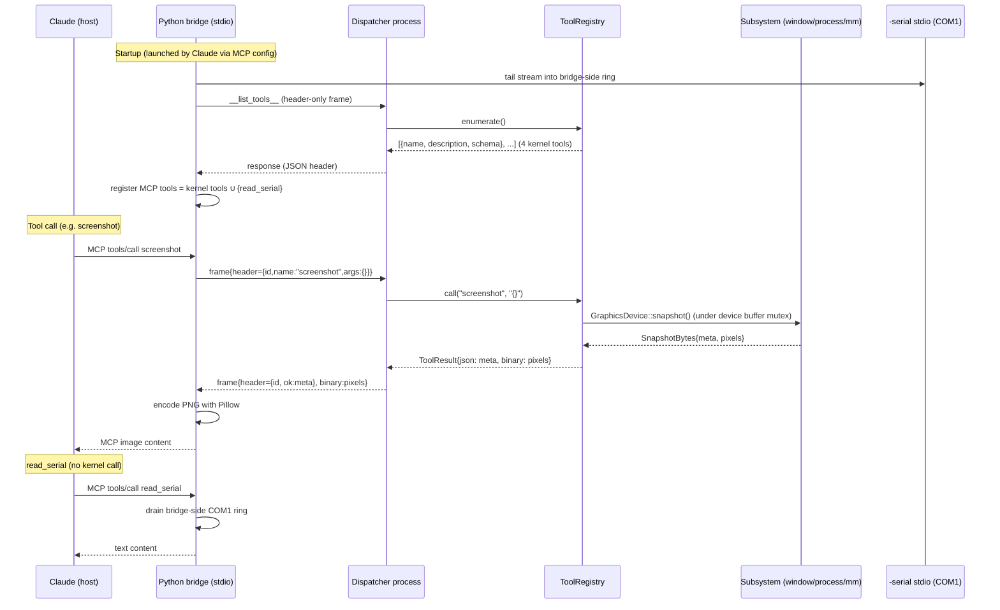

# Kernel-Resident Tool Registry Exposed to Host as MCP

## Summary

Add a transport-agnostic `ToolRegistry` under a new `src/tools/` module, a small COM2 serial driver, a length-prefixed framing dispatcher running as a kernel process, four kernel-resident tools that reuse existing subsystem entry points, plus a Python+FastMCP host bridge that dynamically advertises kernel tools and serves `read_serial` natively from its own COM1 buffer — letting Claude drive the running OS via MCP without `dbg!()` instrumentation or screenshot-paste loops.

---

## Problem Frame

Today's debug loop pollutes the working tree with throwaway `dbg!()` lines, requires the developer to manually screenshot QEMU and paste into chat for visual UX bugs, and depends on the user being in the chair to relay information that the running kernel could surface itself. Origin doc carries the full pain narrative — see Sources & References.

---

## Requirements

This plan implements the requirements defined in the origin document. R-IDs trace to origin verbatim; see `docs/brainstorms/2026-05-08-001-feat-kernel-mcp-debug-bridge-requirements.md` for full text.

**Kernel-side tool registry**
- R1. `Tool` abstraction with name, description, input schema, structured `call`.
- R2. Single in-kernel registry with enumeration.
- R3. v1 tool surface (combined kernel + bridge): `screenshot`, `shell_run`, `read_serial`, `send_input`, `kernel_state`. Of these, four are kernel-resident; `read_serial` is implemented bridge-side and exposed through the same MCP surface (see Key Technical Decisions).
- R4. `shell_run` reuses the existing shell command dispatcher.
- R5. `kernel_state(what)` discriminator-shaped, additive.
- R6. `send_input` synthesizes events indistinguishable from hardware-driven input.
- R7. `screenshot` returns raw framebuffer bytes + metadata; kernel does not encode PNG.

**RPC transport**
- R8. Dedicated chardev distinct from the existing `-serial stdio` log channel.
- R9. Request/response, message-framed; no streaming in v1.
- R10. Structured errors on dispatch failures; never panic.
- R11. Wire protocol is binary-safe.

**Host-side MCP bridge**
- R12. Separate host process implementing MCP, independent of QEMU lifecycle.
- R13. Bridge advertises tools by querying the registry plus its own bridge-native tool list — no hardcoded kernel tool list.
- R14. Transport-level failures surface as structured MCP errors with detail.

**Architecture and future-fitness**
- R15. Transport can later swap to virtio-serial without changing tool implementations.
- R16. Registry reachable from a future in-OS consumer as a second caller (not a parallel registry).
- R17. Built unconditionally; not gated behind `--features test`.

**Origin actors:** A1 (Claude, host-side), A2 (MCP bridge process), A3 (kernel tool registry), A4 (developer).
**Origin flows:** F1 (visual UX bug investigation), F2 (reproduce flaky scenario), F3 (kernel unresponsive — bridge times out cleanly).
**Origin acceptance examples:** AE1 (covers R5), AE2 (covers R8, R10), AE3 (covers R8), AE4 (covers R12, R14), AE5 (covers R6), AE6 (covers R7).

---

## Scope Boundaries

- A virtio-serial driver. v1 uses a second `-serial` chardev; virtio-serial is the planned next transport but not built here.
- An in-OS consumer of the registry (e.g., a `mcp` shell command). R16 keeps the door open architecturally but does not build it.
- A networking stack, virtio-net, or any TCP-based transport.
- Read-write vvfat or any filesystem-as-IPC scheme.
- Streaming, server-push, or long-lived MCP sessions.
- AuthN/authZ, rate limiting, schema versioning. Single user, single machine, host-loopback only.
- Replacing the existing `-serial stdio` log channel. The new RPC chardev is purely additive.
- Persistent recordings of sessions, replay, or scripted scenario runners.
- Test-mode-only behavior. The feature is unconditional.
- Auto-launch of the host bridge from `build.sh` or `.conductor/run.sh` — bridge is launched by the MCP client (Claude) as a stdio subprocess.
- Modifications to `src/lib/debug.rs` or to the existing `qemu_print` path. The kernel's COM1 logging behavior is fully untouched (see Key Technical Decisions for the bridge-side `read_serial` rationale).

### Deferred to Follow-Up Work

- Kernel-side log buffering (a `LOG_RING` in `src/lib/debug.rs`) — only relevant if a future in-OS consumer wants in-kernel access to log history. v1 implements `read_serial` bridge-side, where it costs nothing.
- IRQ-driven COM2 reads — v1 uses non-blocking poll with `sleep_ms(10)` between reads inside the dispatcher process; IRQ wiring is a later optimization once latency becomes the bottleneck.
- Async/timeout path for GUI shell commands — v1 restricts `shell_run` to a text-only command allowlist; widening to GUI commands needs a separate timeout/cancellation story.
- Stale folder-doc fix in `src/process/CLAUDE.md` (currently says scheduler "not wired up" — it is) — separate doc-only PR.
- Conductor integration for per-workspace socket paths — v1 supports a `${AGENTICOS_RPC_SOCK}` env var; `.conductor/run.sh` updates may land later.
- Shared `src/drivers/serial.rs` abstraction covering both COM1 and COM2 — keep `qemu_print` for COM1 untouched per AE3; only COM2 gets the new driver in v1.

---

## Context & Research

### Relevant Code and Patterns

- `src/process/manager.rs` — `register_command(name, factory)`, `execute_command_sync(line)`, `list_commands()`. Synchronous entry point used by `shell_run`.
- `src/process/scheduler.rs` — real preemptive scheduler with `ProcessInfo { pid, name, state, total_runtime, stack_size, cpu_percentage }`. Used by `kernel_state("processes")`.
- `src/process/mod.rs` — `get_process_list()`, `spawn_process()`, `sleep_ms()`. Dispatcher loop runs as a spawned process and uses `sleep_ms` to bound idle CPU.
- `src/window/mod.rs` — `process_event(Event)`, `with_window_manager(|wm| ...)`. Typed-event injection point for `send_input`. Note: `with_window_manager` disables interrupts; never hold across long operations.
- `src/window/event.rs` — `Event::Keyboard(KeyboardEvent { key_code, pressed, modifiers })`, `Event::Mouse(MouseEvent { ... })`.
- `src/window/manager.rs` — `WindowManager.window_registry: BTreeMap<WindowId, Box<dyn Window>>` (already `pub`). Used by `kernel_state("windows")`.
- `src/window/terminal.rs` — `register_terminal`, `set_current_output_terminal`, `take_terminal_output(window_id) -> Vec<String>`, `TERMINAL_BUFFERS`. Used by `shell_run` for stdout capture; the synthetic RPC `WindowId` must be registered explicitly.
- `src/window/adapters/direct_framebuffer.rs`, `src/window/adapters/double_buffered.rs` — graphics-device wrappers. Trait extension for `screenshot` lands in their shared `GraphicsDevice` trait (see U7).
- `src/mm/heap.rs` — `LockedHeap` over `linked_list_allocator::Heap` 0.10. Underlying crate exposes `size()`, `used()`, `free()`, `bottom()`, `top()` on `Heap`. Used by `kernel_state("heap")`.
- `src/drivers/virtio/common.rs` — VirtIO 1.0 PCI driver framework. Future virtio-serial reuse target; not touched in v1.
- `src/lib/arc.rs` — custom `Arc`. **Always** import via `crate::lib::arc::Arc`, never `alloc::sync::Arc` (per `.claude/rules/no-std.md`).
- `src/tests/heap.rs` — pattern for an in-kernel test that exercises a subsystem via its public API.
- `src/tests/mod.rs` — `get_tests()` registration pattern; runs under `--features test`.
- Third-party `qemu_print` crate — drives COM1 (0x3f8) with `uart_16550::SerialPort`. **Untouched in v1.** The bridge tails `-serial stdio` to back `read_serial`.
- `uart_16550` — currently a transitive dep through `qemu_print`. v1 promotes it to a direct dep for the COM2 driver.
- `build.sh:93-100` — sole QEMU invocation; chardev wiring lands here.

### Institutional Learnings

`docs/solutions/` is empty. No prior learnings apply. Strong candidate for capturing learnings via `/ce-compound` after merge — chardev wiring, no_std JSON dependency choice, length-prefix framing, and the bridge-side-vs-kernel-side state-placement decision are all worth documenting.

### External References

- Length-prefixed framing chosen over base64-line-delimited JSON to avoid ~33% inflation on multi-MB framebuffers and to keep the kernel parser ~30 lines.
- `serde_json` with `default-features = false, features = ["alloc"]` is officially supported and stable in 2026.
- Python + FastMCP wins for v1 bridge: dynamic tool registration is the central need (R13), Pillow makes PNG encoding trivial (R7), no toolchain build step.

---

## Key Technical Decisions

- **Wire format: length-prefixed JSON header + optional binary trailer.** Each frame is `[u32 LE header_len][JSON header][u32 LE binary_len][binary]`. Header is always JSON; trailer is empty for text-only responses, framebuffer bytes for `screenshot`. Trivial kernel parser, no base64 inflation, transports identically over future virtio-serial (R15).
- **`Tool` is a trait whose `call` takes a JSON args string and returns `ToolResult { json, binary }`.** The registry is a pure function over JSON — zero transport coupling. The serial dispatcher is one consumer; an in-kernel call from a future shell command (`mcp <name> <args>`) is another (satisfies R15, R16).
- **Dispatcher runs as a kernel process via `spawn_process`, with `sleep_ms(10)` between non-blocking COM2 reads.** Long tool calls (`screenshot` copies multi-MB framebuffers) must not block input. Bare `yield_current()` polling would burn ~50% CPU when idle on the round-robin scheduler; `sleep_ms(10)` bounds idle wakeup latency to 10ms with negligible CPU.
- **`read_serial` is bridge-side, not kernel-side.** The kernel's COM1 logging path goes through `qemu_print` (a third-party crate we don't own the funnel of), and adding a kernel-side ring buffer behind a `Mutex` would risk deadlock from `panic.rs` and interrupt handlers. The bridge already sees `-serial stdio`; it tails that stream into its own ring buffer and serves `read_serial` natively. The kernel registry advertises only the four kernel-resident tools (`screenshot`, `shell_run`, `send_input`, `kernel_state`); the bridge unions kernel-advertised tools with its own bridge-native tools (`read_serial`) when registering MCP tools.
- **`shell_run` allowlist of argv-only commands.** GUI commands (`tasks`, `notepad`, `painting`, `calc`, `guishell`) run their own event loops. Stdin-reading commands (`head`, `tail`, `wc`, `grep`, `time`) can hang on a synthetic terminal that has no stdin. v1 allowlist: `ls`, `cat`, `pwd`, `echo`, `dir`, `touch`, `hexdump`. Anything else returns a "command not allowlisted for `shell_run`" error. This is a stability allowlist, not a security control (see Documentation / Operational Notes).
- **`shell_run` registers a synthetic RPC `WindowId` at boot and acquires a dedicated mutex around `set_current_output_terminal` swaps** to prevent collision with the user's interactive shell. Without registration, `write_to_terminal_id` silently drops output (see `src/window/terminal.rs`).
- **`kernel_state("processes")` returns the full `ProcessInfo` shape, not a stub.** The origin doc's "no real process model" framing was outdated; the scheduler is real.
- **`screenshot` snapshots through the `GraphicsDevice`'s own buffer mutex, not the raw framebuffer pointer.** In double-buffered mode, snapshots the back buffer (DRAM, fast — ~0.6ms for 3MiB). In direct-framebuffer mode, the front buffer is uncached MMIO and the snapshot is materially slower (~30ms for 3MiB with interrupts off); v1 accepts this for direct mode and documents it. The trait extension adds a dedicated `snapshot(&self) -> SnapshotBytes` method on `GraphicsDevice` rather than exposing raw `info()`/`buffer()` accessors.
- **Custom `Arc` used everywhere in the registry.** `crate::lib::arc::Arc`, never `alloc::sync::Arc`, per `.claude/rules/no-std.md`.
- **No new feature flag.** R17 is unconditional. The single existing feature (`test`) keeps its current role.
- **JSON dependency: `serde` + `serde_json` pinned to specific versions, with `default-features = false, features = ["alloc"]`** plus `serde` `derive`. Adds ~100-300 KiB to the kernel binary — noise relative to the IDE driver and FAT filesystem already shipped. Pinning prevents silent breakage from minor-version churn.
- **`uart_16550` promoted to a direct dep in `Cargo.toml`.** Currently transitive through `qemu_print`; not directly importable. The COM2 driver requires direct access.
- **Bridge transport is MCP-over-stdio.** Claude (the MCP client) launches the bridge as a subprocess via its own MCP server config; bridge speaks MCP on stdin/stdout. This is inherently single-caller and avoids any TCP/socket binding question (security consequence: no `0.0.0.0` exposure possible).
- **RPC unix socket permissions: `chmod 0600` immediately after QEMU launch** in `build.sh`. Default umask on macOS produces world-accessible sockets. Path remains `${AGENTICOS_RPC_SOCK:-/tmp/agenticos-rpc.sock}` for v1; per-user paths under `${HOME}/.local/run/agenticos/` are a follow-up.
- **Module layout: `src/tools/` and `src/tools/rpc/` (not a separate `src/rpc/`).** `framing.rs` and `dispatcher.rs` live under `src/tools/rpc/` since their only consumers are the tools module and kernel boot wiring.

---

## Open Questions

### Resolved During Planning

- **Wire format choice** (origin Q affecting R8, R9): length-prefixed JSON header + optional binary trailer.
- **Binary chunking** (origin Q affecting R7, R11): single message frame with binary trailer; not chunked.
- **Shell stdout capture** (origin Q affecting R4): reuses `set_current_output_terminal(rpc_id)` + `execute_command_sync(line)` + `take_terminal_output(rpc_id)` after explicit `register_terminal(rpc_id)` at boot.
- **Input injection** (origin Q affecting R6): call `window::process_event(Event)` directly.
- **Bridge implementation language** (origin Q affecting R12): Python + FastMCP.
- **Bridge transport** (plan-time Q): MCP-over-stdio. The bridge is launched by the MCP client; no TCP/socket bind question.
- **Where `read_serial` lives** (cross-persona Q): bridge-side. Bridge tails `-serial stdio`; kernel does not log into a ring buffer.
- **Tool schemas** (origin Q affecting R3): see per-tool sections under Implementation Units.
- **Heap stats surface** (origin Q affecting R5): new `LockedHeap::stats() -> HeapStats { size, used, free, bottom, top }` exposing the underlying `linked_list_allocator::Heap` accessors. Lands in U6.
- **Dispatcher polling shape** (plan-time Q): `loop { try_read_frame(); sleep_ms(10); }` for v1.
- **Module layout** (plan-time Q): `src/tools/rpc/` (not a separate top-level `src/rpc/`).

### Deferred to Implementation

- Exact field names and types for `ProcessInfo` JSON serialization — straightforward serde_derive, finalized when implementing U6.
- Final allowlist sub-grammar: should `cat` reject piped stdin (e.g., `cat -`)? v1 is text-only argv-based; finalize during U8.

---

## Output Structure

    src/
      tools/                  (new module)
        mod.rs                  Tool trait, ToolRegistry, ToolError, ToolResult
        screenshot.rs           screenshot tool
        shell_run.rs            shell_run tool (allowlist + synthetic terminal)
        send_input.rs           send_input tool
        kernel_state.rs         kernel_state(what) tool (windows | processes | heap)
        rpc/                    (transport submodule, not a top-level crate module)
          mod.rs                  re-exports
          framing.rs              length-prefixed read/write
          dispatcher.rs           main loop: read frame, call registry, write response
      drivers/
        serial.rs               (new) COM2 SerialPort wrapper
      mm/
        heap.rs                 (modified) add LockedHeap::stats() and HeapStats
      window/adapters/
        mod.rs                  (modified) add snapshot() to GraphicsDevice trait
        direct_framebuffer.rs   (modified) implement snapshot() (front buffer)
        double_buffered.rs      (modified) implement snapshot() (back buffer)
      kernel.rs                 (modified) register tools, spawn dispatcher process
      tests/
        tools.rs                (new) in-kernel tests for registry + each tool

    tools/                    (new top-level dir for host-side tooling)
      mcp-bridge/
        bridge.py               FastMCP server (stdio), dynamic tool advertisement
        kernel_client.py        unix-socket client + framing decoder
        serial_tail.py          tails -serial stdio for bridge-side read_serial
        pyproject.toml          deps: fastmcp, pillow
        README.md               usage, MCP client config snippet

    build.sh                  (modified) add -chardev + -serial chardev:rpc + chmod 0600
    Cargo.toml                (modified) add serde, serde_json, uart_16550 (direct)

`src/lib/debug.rs` is **not modified**. The `qemu_print`-based COM1 path is fully preserved (AE3).

---

## High-Level Technical Design

> *This illustrates the intended approach and is directional guidance for review, not implementation specification. The implementing agent should treat it as context, not code to reproduce.*



Wire frame:

    +------------------+----------------+------------------+----------------+
    | u32 LE header_len| JSON header    | u32 LE bin_len   | binary payload |
    +------------------+----------------+------------------+----------------+

JSON header request:  `{"id": <int>, "name": "<tool>", "args": {...}}`
JSON header response: `{"id": <int>, "ok": <result>}` or `{"id": <int>, "error": {"code": "...", "message": "..."}}`

---

## Implementation Units

> Note on numbering: gaps at U1, U5, U9, U13 are intentional. They are units that were merged into others or eliminated during plan revision. Per U-ID stability rules, surviving units keep their original IDs; gaps are preserved.

### U2. COM2 serial driver

**Goal:** Provide a non-blocking byte-stream reader/writer for COM2 (0x2F8) without disturbing the existing COM1 (0x3F8) path used by `qemu_print`.

**Requirements:** R8 (additive channel — preserves AE3).

**Dependencies:** None.

**Files:**
- Create: `src/drivers/serial.rs`.
- Modify: `src/drivers/mod.rs` (export the new module).
- Modify: `Cargo.toml` — add `uart_16550 = "0.x"` as a **direct** dep. It is currently transitive through `qemu_print` and not importable from kernel code.

**Approach:**
- Add `uart_16550` to `[dependencies]` directly (not just transitively).
- Wrap `uart_16550::SerialPort::new(0x2F8)`; init with `port.init()`.
- Expose `pub struct Com2 { port: Mutex<SerialPort> }` with `read_byte() -> Option<u8>` (non-blocking; uses LSR data-ready bit), `write_byte(b: u8)`, `write_all(bytes: &[u8])`.
- Provide `static COM2: Once<Com2>` lazy init.
- Confirm: never write to `0x3F8` from this module — `qemu_print`'s exclusive ownership of COM1 is preserved.

**Patterns to follow:**
- Third-party `qemu_print` driver structure (uses `uart_16550::SerialPort` + spin mutex).
- `src/drivers/CLAUDE.md` driver layout conventions.

**Test scenarios:**
- Happy path: with no peer connected (chardev `wait=off`), `Com2::write_byte(b'A')` does not panic and `Com2::read_byte()` returns `None`.
- Integration: covered end-to-end by manual verification once the dispatcher is wired up (U11).

**Verification:**
- `cargo check` succeeds with the new dep, `cargo build --release` produces a kernel binary that boots, `-serial stdio` output is unchanged from baseline boot.

---

### U3. Tool registry abstraction

**Goal:** Define the transport-agnostic `Tool` trait, registry, and result/error types. The registry is a pure function over JSON strings.

**Requirements:** R1, R2, R10, R15, R16.

**Dependencies:** None (foundational; can land in parallel with U2).

**Files:**
- Create: `src/tools/mod.rs`.
- Modify: `src/lib.rs` (or wherever module mounts live; add `pub mod tools`).
- Modify: `Cargo.toml` (add `serde` and `serde_json` with pinned versions and `default-features = false, features = ["alloc"]` plus `serde` `derive`). Run `cargo check` immediately to verify the no_std + alloc + custom-target combination compiles before continuing.
- Test: `src/tests/tools.rs` (new — see Test scenarios below; this file replaces the previously-planned `tool_registry.rs` and absorbs per-tool kernel-side test scenarios).

**Approach:**
- Define:
  - `pub trait Tool: Send + Sync { fn name(&self) -> &'static str; fn description(&self) -> &'static str; fn schema(&self) -> &'static str; fn call(&self, args_json: &str) -> Result<ToolResult, ToolError>; }`
  - `pub struct ToolResult { json: String, binary: Option<Vec<u8>> }`
  - `pub struct ToolError { code: &'static str, message: String }` (codes: `"unknown_tool"`, `"bad_args"`, `"tool_failed"`, `"unsupported"`).
  - `pub struct ToolRegistry { tools: BTreeMap<&'static str, Arc<dyn Tool>> }` — uses `crate::lib::arc::Arc`.
  - `register(&mut self, tool: Arc<dyn Tool>)`, `enumerate(&self) -> Vec<ToolDescriptor>`, `call(&self, name: &str, args_json: &str) -> Result<ToolResult, ToolError>`.
- Wrap the registry in a global `static TOOL_REGISTRY: Once<Mutex<ToolRegistry>>` so it can be mutated during boot and read-locked during dispatch.

**Execution note:** Test-first encouraged here — write `src/tests/tools.rs` with the registry scaffold (register a fake tool, call by name, unknown-tool error path) before implementing.

**Patterns to follow:**
- `src/process/manager.rs` global-singleton pattern for `PROCESS_MANAGER`.
- `.claude/rules/no-std.md` Arc rule.

**Test scenarios:**
- Happy path: register a fake tool returning `{"hello":"world"}`; call by name; assert returned `ToolResult.json` matches.
- Error path: call an unregistered name; assert `ToolError.code == "unknown_tool"`. (Covers AE2 at the registry level.)
- Edge case: register two tools with the same name — pick "latest wins" or "registration is rejected" and document.
- Edge case: a tool that returns `Err(ToolError)` — registry propagates without panic.
- Enumeration: `enumerate()` returns the registered tool descriptors in stable order.

**Verification:**
- `./test.sh` exits with code 33 (all tests passed); `tools::registry_*` test cases print `[ok]`.

---

### U4. RPC framing transport + dispatcher

**Goal:** Provide length-prefixed framing on top of the COM2 driver and the dispatcher loop that reads frames, calls the registry, and writes responses. (Merged from previously-separate U4 framing and U5 dispatcher.)

**Requirements:** R8, R9, R10, R11, R14.

**Dependencies:** U2, U3.

**Files:**
- Create: `src/tools/rpc/mod.rs`.
- Create: `src/tools/rpc/framing.rs`.
- Create: `src/tools/rpc/dispatcher.rs`.
- Test: `src/tests/tools.rs` adds framing round-trip cases.

**Approach (framing):**
- `pub fn read_frame<R: ReadByte>(r: &R) -> Result<Frame, FrameError>` — reads `u32 LE header_len`, that many header bytes, `u32 LE binary_len`, that many binary bytes.
- `pub fn write_frame<W: WriteBytes>(w: &W, header: &[u8], binary: Option<&[u8]>) -> Result<(), FrameError>`.
- `pub struct Frame { pub header: Vec<u8>, pub binary: Option<Vec<u8>> }`.
- `pub enum FrameError { Truncated, OversizeHeader, OversizeBinary, IoError }`. Define `MAX_HEADER = 64 KiB`, `MAX_BINARY = 16 MiB`; reject larger to bound kernel allocations.

**Approach (dispatcher):**
- `pub fn run_dispatcher() -> !` — process body. Loops:
  1. `read_frame(COM2)` (returns `Truncated` immediately if no full frame yet; in that case `sleep_ms(10)` and retry).
  2. Parse JSON header to `RpcRequest { id, name, args }`.
  3. Special pseudo-tool `__list_tools__` handled inline — returns `[ToolDescriptor]` from `TOOL_REGISTRY.enumerate()` so the bridge can advertise (R13).
  4. Otherwise look up tool via `TOOL_REGISTRY`; call with `args` serialized back to a string.
  5. Build `RpcResponse { id, ok: result.json } ` or `RpcResponse { id, error: ToolError }` and write frame back, attaching `result.binary` as trailer.
  6. On framing or parse error, write a structured error response with the `id` if known, or with `id: null` if not parseable. Never panic.

**Technical design:** *(directional only)*

```text
loop {
    match try_read_frame(&COM2) {
        Ok(f)             => handle_frame(f),
        Err(Truncated)    => sleep_ms(10),  // bound idle CPU
        Err(other)        => log_and_skip(other),
    }
}
```

**Patterns to follow:**
- `src/stdlib/` for existing `Read`/`Write` traits (define narrow byte-level traits over them if needed).
- `src/process/` for spawn-as-process; the dispatcher is registered via `spawn_process` in U11.

**Test scenarios:**
- Happy path: round-trip a known frame against a vec-backed reader/writer — header and binary preserved.
- Edge case: zero-length binary trailer — `binary` is `None` (canonical) or `Some(empty)` (decide and stick).
- Edge case: `header_len > MAX_HEADER` — returns `OversizeHeader` without allocating the body.
- Error path: short read mid-header — returns `Truncated`, no panic.
- Integration (via dispatcher): send a frame with `name: "nonexistent_tool"` → response is `{"error":{"code":"unknown_tool",...}}` (covers AE2).
- Integration: send a frame with invalid JSON → response is `{"error":{"code":"bad_args",...}}` with `id: null`.
- Resilience: a tool that returns `ToolError` does not crash the dispatcher; the next frame is processed normally.
- Idle CPU: with no traffic, dispatcher process consumes <5% CPU (verified manually against `kernel_state("processes")`'s `cpu_percentage`).

**Verification:**
- `./test.sh` framing tests pass. Manual: `socat - UNIX-CONNECT:/tmp/agenticos-rpc.sock` with a hand-crafted frame produces a parseable response.

---

### U6. `kernel_state` tool + heap stats accessor

**Goal:** Implement the `kernel_state(what)` tool with discriminator `windows | processes | heap`, and the `LockedHeap::stats()` accessor that backs `"heap"`. (Merged from previously-separate U1.)

**Requirements:** R3, R5.

**Dependencies:** U3.

**Files:**
- Create: `src/tools/kernel_state.rs`.
- Modify: `src/mm/heap.rs` — add `pub struct HeapStats { size, used, free, bottom, top }` and `impl LockedHeap { pub fn stats(&self) -> Option<HeapStats> }`. Returns `None` if the heap is uninitialized; otherwise reads the underlying `linked_list_allocator::Heap` 0.10 accessors.

**Approach:**
- `KernelStateArgs { what: String }`. Discriminator values: `"windows"`, `"processes"`, `"heap"`. Unknown values return `ToolError { code: "bad_args" }`.
- `"windows"`: walk `WindowManager.window_registry` under `with_window_manager`. For each window: `id, parent, title, bounds: {x,y,w,h}, visible, focused`.
- `"processes"`: call `crate::process::get_process_list()`; serialize each `ProcessInfo` (pid, name, state, total_runtime, stack_size, cpu_percentage). Plus current/ready/sleeping counts.
- `"heap"`: call `LockedHeap::stats()`; serialize `{size, used, free, start_addr}` (omit raw pointer types in the JSON; format `bottom`/`top` as `u64`).

**Patterns to follow:**
- Existing `LockedHeap::init` for the locking pattern.
- `src/commands/tasks/mod.rs` for an existing consumer of `get_process_list()`.

**Test scenarios:**
- Happy path: `kernel_state({"what":"windows"})` returns a JSON array including the desktop and any open windows. (Covers AE1.)
- Happy path: `kernel_state({"what":"heap"})` returns `{size: 104857600, used: ..., free: ...}` with `used > 0` and `used + free <= size`.
- Happy path: `kernel_state({"what":"processes"})` returns the dispatcher process itself among the list.
- Edge case: `LockedHeap::stats()` before heap init returns `None`; `kernel_state("heap")` then returns `ToolError{code:"unsupported"}`. (Cannot occur in normal boot; covered for completeness.)
- Error path: `kernel_state({"what":"banana"})` returns `ToolError{code:"bad_args"}`.
- Edge case: `kernel_state({})` (missing `what`) returns `ToolError{code:"bad_args"}`.

**Verification:**
- `src/tests/tools.rs` exercises each discriminator through the registry, no transport involved.

---

### U7. `screenshot` tool with `GraphicsDevice::snapshot()` trait extension

**Goal:** Capture the current framebuffer as raw bytes plus metadata, via a new `snapshot()` method on `GraphicsDevice`. Kernel does not encode PNG. The change is a real trait extension affecting both adapters.

**Requirements:** R3, R7.

**Dependencies:** U3.

**Files:**
- Create: `src/tools/screenshot.rs`.
- Modify: `src/window/adapters/mod.rs` (or wherever the `GraphicsDevice` trait is defined) — add `fn snapshot(&self) -> Result<SnapshotBytes, SnapshotError>;` to the trait.
- Modify: `src/window/adapters/direct_framebuffer.rs` — implement `snapshot` reading the front buffer (uncached MMIO; document as the slow path).
- Modify: `src/window/adapters/double_buffered.rs` — implement `snapshot` reading the back buffer through the device's own buffer mutex (DRAM, fast, atomic vs. `swap_buffers`).

**Approach:**
- `pub struct SnapshotBytes { width, height, stride, bytes_per_pixel, pixel_format, pixels: Vec<u8> }`.
- `pub enum SnapshotError { NotInitialized, Oversize }`.
- The trait method takes `&self` and returns an owned `Vec<u8>`. Implementers acquire whichever lock guards their backing memory (the `Mutex<DoubleBufferedFrameBuffer>` for double-buffered, or the framebuffer's own mutex for direct), copy into the `Vec`, drop the lock, return.
- `screenshot.rs` calls `with_window_manager(|wm| wm.graphics().snapshot())`. The WM lock is held only for the trait dispatch; the device-level lock is held for the actual copy. Drop both before returning to avoid stalling input.
- `ToolResult { json: serialize(meta), binary: Some(pixels) }`.

**Patterns to follow:**
- `FrameBufferWriter::get_pixel` in `src/drivers/display/frame_buffer.rs` for the read pattern.
- `src/window/CLAUDE.md` discipline note about not holding the WM lock during long operations.

**Test scenarios:**
- Happy path (double-buffered, current default): returns `binary` of length `stride * height` (plus padding rules per `bytes_per_pixel`); `json` carries non-zero width and height. (Covers AE6.)
- Edge case: framebuffer not initialized — returns `ToolError{code:"unsupported"}`.
- Edge case (direct mode): the snapshot completes within bounded time despite uncached MMIO reads (manually verified; documented as ~30ms for 3MiB).
- Concurrency: with the compositor running, repeated `snapshot()` calls do not produce torn images (verified by perceptual check during manual integration).

**Verification:**
- Manual via U12 bridge: with a window on screen, MCP `screenshot` returns a PNG that visibly matches the QEMU window content.

---

### U8. `shell_run` tool with synthetic terminal registration

**Goal:** Run a text-only shell command and return its captured stdout, without colliding with the user's interactive shell.

**Requirements:** R3, R4.

**Dependencies:** U3.

**Files:**
- Create: `src/tools/shell_run.rs`.

**Approach:**
- `ShellRunArgs { command: String }` (the full command line, e.g. `"ls /host"`).
- v1 allowlist (argv-only commands; no stdin readers, no GUI commands): `ls`, `cat`, `pwd`, `echo`, `dir`, `touch`, `hexdump`. Anything else → `ToolError{code:"unsupported", message:"command '<n>' is not in v1 allowlist"}`. (Origin's broader allowlist of `head/tail/wc/grep/time` is dropped from v1 because those commands either need stdin from a buffer the synthetic terminal does not have, or recurse through `execute_command_sync` and complicate the routing.)
- At boot (during U11), `register_terminal(rpc_id)` is called once for a stable synthetic `WindowId` (e.g., `WindowId(usize::MAX)`); `shell_run` uses that pre-registered id.
- A dedicated `static SHELL_RUN_LOCK: Mutex<()>` protects the `set_current_output_terminal` swap. Sequence: lock, save prior output terminal, `set_current_output_terminal(rpc_id)`, `execute_command_sync(line)`, `take_terminal_output(rpc_id)`, restore prior, unlock. The lock prevents collision with another `shell_run` in flight; the user's interactive shell uses its own terminal id and does not touch the rpc id.
- `ToolResult { json: {"stdout": "...", "exit": "ok"|"error", "error": "..."?}, binary: None }`.

**Patterns to follow:**
- `src/process/manager.rs` (`execute_command_sync`).
- `src/window/terminal.rs` (`register_terminal`, `set_current_output_terminal`, `take_terminal_output`).

**Test scenarios:**
- Happy path: `shell_run({"command":"echo hi"})` returns `{"stdout":"hi\n","exit":"ok"}`.
- Happy path: `shell_run({"command":"ls /host"})` returns the `/host` directory listing in stdout.
- Error path: `shell_run({"command":"painting"})` (GUI command) returns `ToolError{code:"unsupported"}` without spawning a window.
- Error path: `shell_run({"command":"head"})` (stdin reader) returns `ToolError{code:"unsupported"}`.
- Error path: `shell_run({"command":"nonexistent"})` returns the underlying dispatcher's error message in `error`, exit `"error"`.
- Edge case: empty command → `ToolError{code:"bad_args"}`.
- Concurrency: two `shell_run` calls back-to-back serialize through `SHELL_RUN_LOCK`; user-shell output to its own terminal is not redirected.

**Verification:**
- Manual: bridge tool call yields the same output as typing the command in the in-OS shell.

---

### U10. `send_input` tool

**Goal:** Synthesize keyboard and mouse events into the typed-event pipeline indistinguishably from hardware-driven input. Validate-then-inject semantics; bounded batch size.

**Requirements:** R3, R6.

**Dependencies:** U3.

**Files:**
- Create: `src/tools/send_input.rs`.

**Approach:**
- `SendInputArgs` with two variants (serde-tagged):
  - `{"keyboard": [{"key_code": "...", "pressed": true, "modifiers": {...}}, ...]}`
  - `{"mouse": [{"event_type": "Move|ButtonDown|ButtonUp", "position": {"x":..,"y":..}, "buttons": {...}}, ...]}`
- **Validate-then-inject**: parse the entire batch into `Vec<Event>` first; if any entry fails validation, return `ToolError{code:"bad_args"}` before calling `process_event` even once. (Origin's "atomic" wording is replaced with this — `process_event` mutates window state immediately and cannot be rolled back.)
- **Max batch size**: 256 events per call. Larger batches return `ToolError{code:"bad_args", message:"batch exceeds 256 events"}`. Bounds dispatcher work per iteration.
- Build `Event::Keyboard(KeyboardEvent)` or `Event::Mouse(MouseEvent)` (see `src/window/event.rs`) and call `window::process_event(event)` for each.

**Patterns to follow:**
- `src/window/event.rs` typed-event shapes.
- `src/window/mod.rs::process_event` already-existing entry point used by the kernel main loop.
- `src/input/CLAUDE.md` rule: do NOT inject at the raw scancode SPSC queue; inject at the typed-event boundary.

**Test scenarios:**
- Happy path: `send_input({"keyboard":[{"key_code":"A","pressed":true,...}]})` results in the focused window receiving an `Event::Keyboard` (covers AE5).
- Edge case: empty event list — no-op, returns OK.
- Error path: malformed event entry mid-batch — returns `ToolError{code:"bad_args"}` and zero events are injected.
- Error path: batch of 257 events — returns `ToolError{code:"bad_args"}` with size-cap message.
- Edge case: mouse position outside screen bounds — pass through to `process_event`, let downstream handle (consistent with hardware input).

**Verification:**
- Manual via bridge: synthesize a sequence of keystrokes into the in-OS shell window, observe the shell receiving them.

---

### U11. Wire-up: register tools, spawn dispatcher, modify build.sh

**Goal:** Connect the pieces — register the four kernel-resident tools, spawn the dispatcher process, register the synthetic RPC `WindowId`, and add the second QEMU `-serial chardev` plus socket permissions to `build.sh`.

**Requirements:** R3, R8, R17, AE3.

**Dependencies:** U2, U3, U4, U6, U7, U8, U10.

**Files:**
- Modify: `src/kernel.rs`.
- Modify: `build.sh`.

**Approach:**
- In `kernel::init` (after heap, scheduler, and window manager are up but before the main event loop):
  - Initialize `COM2` (U2).
  - Construct `TOOL_REGISTRY` and `register` each of the four kernel-resident tools (`screenshot`, `shell_run`, `send_input`, `kernel_state`). `read_serial` is **not** registered kernel-side.
  - `register_terminal(rpc_window_id)` for the `shell_run` synthetic terminal (U8 dependency).
  - `spawn_process` named `"rpc-dispatcher"` running `run_dispatcher` (U4).
- `build.sh` change: insert `-chardev socket,id=rpc,path="${AGENTICOS_RPC_SOCK:-/tmp/agenticos-rpc.sock}",server=on,wait=off` and `-serial chardev:rpc` immediately after the existing `-serial stdio`. After the QEMU process backgrounds (or in a small wrapper), `chmod 0600 "${AGENTICOS_RPC_SOCK:-/tmp/agenticos-rpc.sock}"` to prevent world-accessible socket permissions on macOS.
- Confirm AE3: existing `-serial stdio` line is unchanged in content and ordering; first `-serial` still maps to COM1.
- Confirm: `src/lib/debug.rs` is not touched by U11 either.

**Patterns to follow:**
- `src/kernel.rs` boot ordering and existing `spawn_process` usages.
- `build.sh` minimal-touch principle.

**Test scenarios:**
- Happy path: `./build.sh` boots normally; `-serial stdio` output is unchanged; the unix socket exists at `0600` perms.
- Error path: socket path already in use → QEMU prints a clear error and exits (not a kernel concern).
- Edge case: bridge not connected → kernel boots normally and the dispatcher waits for incoming frames forever (sleeping 10ms between polls). (Covers AE3, AE4 from the bridge side.)

**Verification:**
- Boot the kernel; confirm `-serial stdio` is unchanged. `nc -U /tmp/agenticos-rpc.sock` connects without error (and is now restricted to the developer's user).

---

### U12. Host-side MCP bridge (Python + FastMCP, stdio transport)

**Goal:** A Python bridge launched as a subprocess by the MCP client; speaks MCP over stdio; queries the kernel for `__list_tools__`; advertises the union of kernel tools and bridge-native tools (currently just `read_serial`); tails `-serial stdio` for the `read_serial` implementation.

**Requirements:** R3 (the surface; `read_serial` is bridge-side), R12, R13, R14, AE4.

**Dependencies:** U4 (wire format spec).

**Files:**
- Create: `tools/mcp-bridge/bridge.py` (FastMCP server, stdio transport).
- Create: `tools/mcp-bridge/kernel_client.py` (unix-socket client + length-prefixed framing).
- Create: `tools/mcp-bridge/serial_tail.py` (tails `-serial stdio` into a bridge-side ring; backs `read_serial`).
- Create: `tools/mcp-bridge/pyproject.toml` (deps: `fastmcp`, `pillow`).
- Create: `tools/mcp-bridge/README.md` (run instructions, MCP client config snippet, security notes).

**Approach:**
- Bridge transport is **MCP-over-stdio**. Claude (or any MCP client) launches the bridge as a subprocess via its config. No socket binding question; `0.0.0.0` exposure is impossible by construction.
- `KernelClient`:
  - Connect to `${AGENTICOS_RPC_SOCK:-/tmp/agenticos-rpc.sock}` with bounded retries (R14).
  - `send_request(name, args, timeout) -> (header_dict, binary_or_None)` — frames the request, awaits response, returns parsed result.
  - `list_tools()` calls the kernel's `__list_tools__` at startup.
- `SerialTail`:
  - Tails `-serial stdio` (stdout of the QEMU process, OR a tee'd log file produced by `build.sh`) into a fixed-size ring (e.g., 256 KiB).
  - Tracks a sequence cursor so `read_serial({since_seq})` returns incremental data with `dropped` accounting.
- `bridge.py`:
  - On startup: `KernelClient.connect()`, `list_tools()`, register each as a FastMCP tool whose body calls `KernelClient.send_request`. Then also register a bridge-native `read_serial` tool whose body drains `SerialTail`. Tools advertised to MCP = kernel tools ∪ {bridge-native tools}.
  - For `screenshot`: take the binary trailer and run `PIL.Image.frombytes(...).save(buf, "PNG")`; return as MCP image content.
  - All other kernel tools: return the `header` JSON as the MCP tool result.
  - Transport-level failures map to MCP errors with explicit codes (`kernel_unreachable`, `kernel_timeout`, `frame_parse_error`).
- `README.md` documents:
  - The MCP client config snippet (e.g., for Claude Code: `command: ["uv", "run", "tools/mcp-bridge/bridge.py"]` with the appropriate `cwd`).
  - That `read_serial` is bridge-side and depends on QEMU's stdio being captured into a file the bridge can read (or piped). Document the `build.sh` wiring needed.
  - Security notes (see Documentation / Operational Notes below).

**Patterns to follow:**
- FastMCP dynamic tool registration via runtime-known names.
- Pillow's `Image.frombytes` for PNG encoding.

**Test scenarios:**
- Happy path: bridge connects, registers MCP tools matching `[kernel_state, screenshot, shell_run, send_input] ∪ [read_serial]`.
- Happy path: MCP `tools/call screenshot` returns a PNG image with non-zero dimensions. (Covers AE6.)
- Happy path: MCP `tools/call read_serial` returns recent log output without round-tripping to the kernel.
- Error path: bridge starts before QEMU → bounded retry, then clear `kernel_unreachable` error. (Covers AE4.)
- Error path: kernel halted mid-call → bridge times out, returns `kernel_timeout`.
- Error path: kernel returns `unknown_tool` → bridge surfaces as MCP tool error, not transport error. (Covers AE2.)

**Verification:**
- Manual end-to-end: configure Claude to launch the bridge via stdio; call `screenshot`, see the QEMU framebuffer; call `read_serial`, see recent kernel log output.

---

## System-Wide Impact

- **Interaction graph:** the dispatcher process joins the existing scheduler-managed process set; cooperates via `sleep_ms(10)` between polls. New code paths into `with_window_manager` (screenshot, kernel_state windows), `process_event` (send_input), `execute_command_sync` (shell_run via the synthetic terminal), `LockedHeap::stats` (kernel_state heap), and `GraphicsDevice::snapshot` (screenshot).
- **Error propagation:** all errors travel as structured `ToolError`s through the registry, structured `RpcResponse.error` over the wire, and structured MCP errors at the bridge boundary. The kernel never panics on dispatch errors (R10).
- **State lifecycle risks:** `shell_run` mutates `current_output_terminal`; the new `SHELL_RUN_LOCK` prevents concurrent `shell_run` collisions, and the prior value is restored after dispatch even on tool error. `send_input` injects events that downstream consumers cannot distinguish from real input — this is the goal but it means a buggy bridge could submit pathological event sequences. The 256-event batch cap bounds the per-call work.
- **API surface parity:** the registry is a new public surface. Adding a new kernel tool requires kernel-side changes only (R13 satisfied by the bridge's dynamic advertisement).
- **Integration coverage:** in-kernel registry tests (`src/tests/tools.rs`) cover logic; manual end-to-end via the bridge covers transport + MCP glue.
- **Unchanged invariants:** existing `-serial stdio` log channel content and routing are unchanged (AE3). `src/lib/debug.rs` is unmodified. `qemu_print` for COM1 is untouched. The shell command dispatcher's existing entry points (`execute_command`, `execute_command_sync`) are not modified — `shell_run` is a new caller. The input pipeline's raw SPSC queue is not touched — `send_input` injects at the typed-event boundary, downstream of the queue. The `qemu_print`-based debug logging is functionally untouched.

---

## Risks & Dependencies

| Risk | Mitigation |
|------|------------|
| `screenshot` in direct-framebuffer mode reads uncached MMIO with interrupts disabled (~30ms for 3MiB), dropping keyboard IRQs | Document as the slow path. Default config is double-buffered (DRAM, sub-ms). If direct mode becomes the default, revisit chunked-copy with cooperative yield. |
| `with_window_manager` lock held during `GraphicsDevice::snapshot()` stalls input | Trait method copies into owned `Vec<u8>` then returns; outer code drops lock before serial write. Device-level mutex (not the WM lock) serializes against `swap_buffers` — no tearing. |
| `shell_run` allowlist treated as a security control | Allowlist is documented as a stability control (blocks GUI-spawning commands), NOT a security boundary. `cat /host/<anything>` is the documented happy path; this is intentional given the threat model. |
| Default unix socket permissions are world-accessible on macOS | `chmod 0600` immediately after QEMU launch in `build.sh` (U11). |
| MCP bridge transport could expose `0.0.0.0` if implementer chose socket | Bridge transport is pinned to MCP-over-stdio (Key Decision); no socket binding choice exists. |
| When R16 lands (in-OS apps reach the registry), the trust boundary inverts — any in-OS process can call `send_input`, `screenshot`, `shell_run` | Out of v1 scope, but flagged here for the future PR author: tool-level authorization must be revisited at that point. |
| Two parallel Conductor workspaces collide on `/tmp/agenticos-rpc.sock` | `build.sh` reads `${AGENTICOS_RPC_SOCK}` env var with a default; per-workspace paths are a `.conductor/run.sh` follow-up. |
| `serde_json` no_std + alloc + custom-target combination fails to compile on this nightly | Pin `serde` and `serde_json` to specific versions. Run `cargo check` as soon as deps are added in U3, before further work. Pin `linked_list_allocator = "=0.10.x"` to keep `Heap` accessors stable. |
| `uart_16550` not in `Cargo.toml` directly causes U2 compile failure | Promotion to direct dep is an explicit step in U2; not a "promote if needed" parenthetical. |
| Frame oversize attack from the bridge (oversized `header_len` or `binary_len`) | Framing layer enforces `MAX_HEADER = 64 KiB`, `MAX_BINARY = 16 MiB`; reject without allocating. |
| 256-event batch cap on `send_input` is too low for some scripted UI flows | Documented limit; v1 callers chunk into multiple calls. Larger batches are a future expansion. |

---

## Documentation / Operational Notes

- `tools/mcp-bridge/README.md` is the operational doc:
  - How to launch the bridge from an MCP client (config snippet for Claude Code stdio transport).
  - Note that the bridge does NOT auto-launch QEMU; the developer runs `./build.sh` separately, then the MCP client launches the bridge.
  - **Security note**: the unix socket is `chmod 0600` so only the launching user can connect. Do not relax this on shared machines.
  - **Security note**: `shell_run`'s allowlist is a stability control, not a security boundary. The bridge can read any file at `/host` via `cat`, `hexdump`, etc. Do not mount sensitive directories at `/host`.
  - **Security note**: `send_input` synthesizes keystrokes into the running kernel. Anything reachable through the in-OS shell is reachable via the bridge.
- `CLAUDE.md` subsystem index gets a new entry for `src/tools/` (covering registry, tools, and `src/tools/rpc/`) once units land.
- No monitoring, rollout, or feature-flag concerns — this is a dev-time tool.
- Future learning candidate: capture chardev-wiring conventions, no_std JSON dependency choice, length-prefix framing approach, and the bridge-side-vs-kernel-side state-placement decision via `/ce-compound` after merge.

---

## Sources & References

- **Origin document:** [docs/brainstorms/2026-05-08-001-feat-kernel-mcp-debug-bridge-requirements.md](../brainstorms/2026-05-08-001-feat-kernel-mcp-debug-bridge-requirements.md)
- Related code: `src/process/manager.rs`, `src/window/mod.rs`, `src/window/terminal.rs`, `src/window/adapters/`, `src/mm/heap.rs`, `src/drivers/virtio/common.rs`, `src/lib/arc.rs`.
- Related rules: `.claude/rules/no-std.md`, `.claude/rules/panic-and-attributes.md`, `.claude/rules/testing-flow.md`.
- Subsystem context files: `src/drivers/CLAUDE.md`, `src/commands/CLAUDE.md`, `src/process/CLAUDE.md`, `src/input/CLAUDE.md`, `src/window/CLAUDE.md`, `src/mm/CLAUDE.md`, `src/lib/CLAUDE.md`, `src/tests/CLAUDE.md`.
