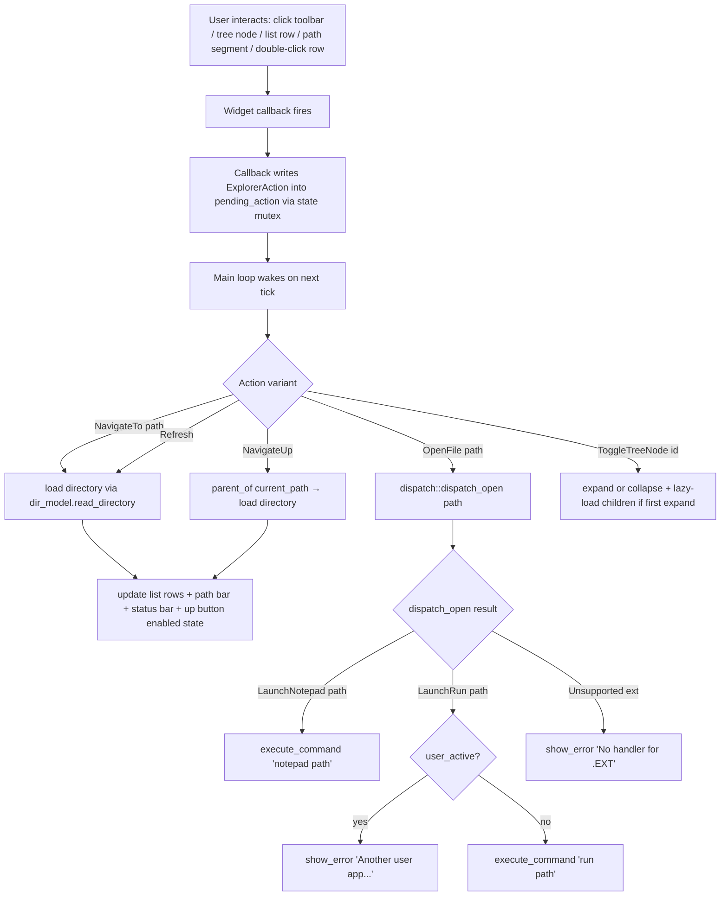

# File Explorer App (Two-Pane Finder)

## Summary

Build a windowed File Explorer / Finder app that browses the read-only FAT filesystem. Layout is a two-pane Splitter: a left `TreeView` sidebar with lazy directory expansion and a right `MultiColumnList` (Name / Size / Type) for the current directory's contents, wrapped in a `FrameWindow` with `Toolbar` (Up / Refresh), `PathBar` (clickable breadcrumbs), and `StatusBar` (item counts). Double-click navigates into directories; double-click a `.TXT` / `.MD` / `.RS` file launches `notepad`; double-click a `.ELF` file launches `run`. All other types pop a "no handler" `MessageBox`. Registered as a shell command `explorer` so it can be launched from the terminal alongside `notepad` / `calc` / `tasks`.

The window-component work landed in PR #14 (`docs/plans/2026-05-08-005-feat-window-component-library-improvements-plan.md`) explicitly to enable this app — every widget required already exists. This plan delivers app composition + filesystem-traversal logic + open-file dispatch only; no new widgets.

---

## Problem Frame

AgenticOS has a working desktop, a windowed terminal, and userland app platform (ring-3 ELF loader, `int 0x80` syscalls), but the only ways to browse the filesystem are the `dir` / `ls` / `cat` shell commands or the `file_open` modal dialog inside Notepad. There is no standalone GUI surface that lets a user see what files exist, navigate the tree, and open them — which is the core "where am I, what's here" workflow every desktop OS provides.

The window-component library shipped TreeView, Splitter, IconView, PathBar, Toolbar, StatusBar, and ProgressBar specifically to enable a File Manager / Finder / Explorer app, with `file_open.rs` standing in as the canonical layout-primitives consumer. The components are sitting unused outside of `file_open` until this app exists.

---

## Requirements

- R1. The app is registered as a shell command `explorer` and launched the same way `notepad` is — `register_command("explorer", create_explorer_process)` in `src/kernel.rs`, factory in `src/commands/explorer/mod.rs`, implementing `RunnableProcess`.
- R2. The app's window is a `FrameWindow` titled "File Explorer" with a `MenuBar`-free chrome (Toolbar serves as the action surface) containing: `Toolbar` (Up, Refresh) → `PathBar` → `Splitter { TreeView, MultiColumnList }` → `StatusBar`, laid out via the layout primitives (`VBox`, `Padding`, `SizeHint::Fill`/`Fixed`) — no hand-computed pixel offsets.
- R3. The `MultiColumnList` shows columns Name, Size, Type with rows for the contents of the current directory. Directories render with a trailing `/` in the Name column and `<DIR>` in the Size column. Files render with a byte count in Size. Type derives from the file extension (uppercase, with leading dot, e.g., `.TXT`, `.ELF`); directories show `Folder`.
- R4. The `TreeView` sidebar renders the filesystem tree starting at root (`/`) with directories only (files do not appear in the tree). Children are loaded lazily on first expansion. Selecting a tree node sets the current directory and refreshes the main list.
- R5. Navigation: double-clicking a directory row in the main list, clicking a `PathBar` segment, clicking a `TreeView` node, or pressing the Up toolbar button changes the current directory. The Up button is disabled when the current directory is `/`.
- R6. Refresh re-reads the current directory's entries and rebuilds the main list. The `TreeView` sidebar is not rebuilt by Refresh — only the lazy-expanded subtree of the current path is invalidated.
- R7. Double-clicking a file row dispatches by uppercase extension:
  - `.TXT`, `.MD`, `.RS` → spawn `notepad <path>` via `execute_command`.
  - `.ELF` → spawn `run <path>` via `execute_command`. If `userland::lifecycle::user_active()` returns `true`, surface "Another user app is running" via `MessageBox` instead of attempting the spawn.
  - Any other extension → `MessageBox` titled "Cannot open" with body "No handler registered for type `.XYZ`".
- R8. The `StatusBar` shows `<N> items` for the current directory (counting both files and directories visible in the list). When the current directory is empty it shows `Empty folder`.
- R9. The `PathBar` shows clickable breadcrumbs from `/` down to the current directory. Clicking any segment sets that path as the current directory.
- R10. The app cleanly handles failure: opening a directory that returns `FileError` or whose VFS lookup fails surfaces a `MessageBox` ("Cannot open `/PATH`: <error>") and leaves the previous current directory in place.
- R11. The app cleanly exits when the user closes the frame (window is no longer in the registry) — same termination pattern as Notepad's main loop.
- R12. The app boots without panicking when launched on a freshly booted kernel with only the bundled BIOS image mounted; it also works when `/host` is mounted (lists `/host` as a top-level directory under root the same as any other subdirectory).

---

## Scope Boundaries

### Outside this app's identity

- **Write operations.** No copy / move / rename / delete / create-folder / create-file. The filesystem is read-only; surfacing destructive actions would be a UX lie. Out for v1; revisit when filesystem write support lands.
- **Drag-and-drop between widgets.** Cross-widget DnD primitives don't exist (component-library plan deferred them); App should not pretend to.
- **Clipboard.** No cross-app clipboard exists; copy-path / cut-file would be vapor.
- **Custom file icons.** Icon-loading API is not in place (component-library plan deferred icons; `IconView` v1 uses placeholder swatches). Tree and list use the system font for type cells / disclosure triangles only.
- **Multiple file-explorer instances.** A single `EXPLORER_STATE` Mutex (Notepad uses a `BTreeMap<usize, NotepadState>` for multi-instance; a `BTreeMap` keyed by an `EXPLORER_ID` AtomicUsize is the same shape and lets the user open multiple Explorer windows). v1 supports the multi-instance shape — the cost is tiny because the pattern already exists in Notepad — so concurrent Explorer windows are *in scope*. The constraint is at the user-app launch (R7's `user_active()` guard), not at the Explorer-instance level.

### Deferred for later

- **`IconView` (grid) view-mode toggle.** Out per scope decision in this thread; revisit once a real icon-loading API exists.
- **Search / filter.** Filtering rows by a substring of the name. Out — needs a new `TextInput` row in the toolbar and a filter pipeline; not core to "browse and open."
- **Sort by column header click.** Rows are sorted directories-first then alphabetical by name at directory-load time. Click-to-sort on Size / Type is deferred until the column-header callback contract is needed by another app too.
- **Hidden-file toggle.** FAT 8.3 doesn't have a "hidden" convention worth representing in v1.
- **Right-click context menu.** Needs the deferred Action / Command abstraction (rejected from the component-library plan).
- **Open-with picker.** Today's extension → handler map is hard-coded; a user-facing picker UI requires both a settings surface and a clipboard / drag target — out for v1.

### Deferred to Follow-Up Work

- **Caching directory reads.** Re-reading on every navigation is fine for current sizes (the FAT cluster-chain follower has no cache either; see `src/fs/CLAUDE.md`). Add a small cache only if profiling shows it.
- **Resync of the open `notepad` instance when the same file is double-clicked.** v1 always spawns a fresh Notepad process; a future "focus existing instance" affordance is a separate plan touching the process registry.

---

## Context & Research

### Relevant Code and Patterns

- `src/commands/notepad/mod.rs` — closest-shape reference app. Window scaffold (frame + menu bar + scroll view + editor), `BTreeMap`-keyed instance state, pending-action loop, `poll_file_dialog` integration, `with_window_manager` window-existence check for exit. Mirror the loop and state-store pattern; replace menu-bar dispatch with toolbar-button + tree-click + list-double-click dispatch.
- `src/window/dialogs/file_open.rs` — canonical layout-primitives composition (Padding → VBox → Label / Spacer / MultiColumnList / HBox-of-buttons). The Explorer's frame content uses the same shape but swaps the inner VBox for `[Toolbar, PathBar, Splitter { TreeView, ScrollView { MultiColumnList } }, StatusBar]`. Note the explicit `wm.with_window_mut(padding_id, |w| w.set_bounds(...))` cascade trigger at the end — the same pattern is required here.
- `src/window/dialogs/file_open.rs::get_file_list` (around line 273) — directly reusable shape for reading a directory into `(name, size, type)` tuples via `crate::fs::Directory::open` and iterating `entry.name_str()` / `entry.file_type`.
- `src/fs/file_handle.rs::Directory` — `Directory::open(path) -> FileResult<Arc<Directory>>`, then `dir.entries() -> Vec<DirectoryEntry>`. `DirectoryEntry` carries `file_type: FileType` (enum with `Directory` variant) and a name accessor. This is the only API the directory-model unit needs.
- `src/fs/filesystem.rs:148` — `read_dir` returns a `DirectoryIterator`; `enumerate_dir` returns `Vec<DirectoryEntry>` directly. Use `Directory::open` for the higher-level `Arc`-handle path; the iterator is overkill here.
- `src/window/windows/tree_view.rs` — `TreeView` model is a flat `Vec<TreeNode>` with `depth` / `expanded` / `has_children` / label. Visible-row cache recomputes on expand / collapse. Selection delegates to `selection::Selection`. `INDENT_PX = 16`. Lazy-loading hook: there is currently no built-in callback for "fetch children when a node is first expanded" — the directory-traversal unit (U4) drives this from the outside by listening for the expand event and inserting children into the model.
- `src/window/windows/path_bar.rs` — clickable breadcrumb widget; segment overflow uses leading "..." with rightmost segments visible (Finder convention).
- `src/window/windows/splitter.rs` — two-pane container; orientation set at construction; minimum-pane-size constraints. `SplitterOrientation::Vertical` divides left/right (sidebar | main).
- `src/window/windows/toolbar.rs` and `src/window/windows/status_bar.rs` — thin compositions over `HBox`. Toolbar holds `Button`s; StatusBar holds `Label`s. Button has `set_enabled` + greyed-out paint state (added in U11 of the component-library plan), needed for the "Up disabled at root" affordance.
- `src/window/windows/multi_column_list.rs` — `on_select(|Selection|)` callback for click; `on_right_click(usize, Point)` already exists but is unused by this plan. Look for a double-click contract; if `on_double_click` doesn't exist on `MultiColumnList` today, the deferred-to-implementation question is whether to add one or detect double-clicks at the app layer via timestamped click pairs (see Open Questions).
- `src/window/windows/scroll_view.rs` — wraps the main `MultiColumnList` per the post-migration convention. Explorer must call `scroll_view.set_content_size(...)` after each list rebuild, the same way Notepad does after `editor.set_text(...)`.
- `src/window/windows/layout/` — `VBox`, `HBox`, `Padding`, `Spacer`, `SizeHint::{Fixed(u32), Fill(u32)}`. Frame content is a `Padding(8) -> VBox` with `Toolbar` Fixed, `PathBar` Fixed, `Splitter` Fill(1), `StatusBar` Fixed.
- `src/window/dialogs/message_box.rs` — `show_error(title, body)` / `show_info(title, body)` already imported by `notepad`; the unsupported-type and "another user app running" cases route through these.
- `src/process/manager.rs:60` — `execute_command(command_line: &str, terminal_id: Option<WindowId>) -> ProcessResult` is the public process-spawn surface. The Explorer passes `None` for terminal_id (the spawned app will create its own window).
- `src/commands/run/mod.rs:74` — `if crate::userland::lifecycle::user_active() { return Err(...) }` is the single-user-app guard. The Explorer must check this *before* spawning `run` so the error surfaces in a `MessageBox` rather than as red text on a terminal the user may not be looking at.
- `src/commands/notepad/mod.rs:115-355` — main loop pattern: pending-dialog poll, pending-action dispatch, ~50000-iter spin loop, `yield_if_needed`, window-existence check. Reuse verbatim with Explorer-shaped action types.
- `src/kernel.rs:435-451` — command registration block; add `register_command("explorer", create_explorer_process)` at the natural location (alphabetical near `notepad`).
- `src/fs/CLAUDE.md` — uppercase 8.3 paths only; FAT-only; no subdirectory traversal in the higher-level API. The note about subdirectory traversal is **stale relative to current `Directory::open(path)`** — `Directory::open` already handles subdirectory paths via the VFS, as proven by the `get_file_list` helper in `file_open.rs`. Verify on first directory descent during U2 implementation.
- `src/fs/file_handle.rs:411` — `enumerate_dir` interaction with VFS read_dir fallback; relevant if any directory-listing edge cases bite.
- `src/lib/CLAUDE.md` — custom `Arc` from `crate::lib::arc::Arc` is required; never `alloc::sync::Arc`.
- `.claude/rules/no-std.md` / `panic-and-attributes.md` / `testing-flow.md` — `no_std` discipline, panic-handler invariants, kernel test exit codes (33 pass / 35 fail).

### Institutional Learnings

- `docs/solutions/` is currently empty.
- `src/window/CLAUDE.md` notes "constant window repainting — `TextWindow` repaints unnecessarily in some paths" as a known issue. Not relevant to the Explorer (no `TextWindow`), but a reminder that `MultiColumnList::set_rows` after directory load should ideally be a single rebuild, not row-by-row append, to avoid per-row paint-invalidation churn. Defer to implementation.
- `src/graphics/CLAUDE.md` notes "Scrolling = `memmove`. Don't redraw all rows when shifting." Already inherited by the `ScrollView` wrapping the list — no Explorer-side action needed.

### External References

None gathered. The local patterns from Notepad + `file_open.rs` are dense and consistent; an external best-practices pass would not improve this plan.

---

## Key Technical Decisions

- **Single registered command `explorer`, launched from the shell.** Mirrors `notepad`, `calc`, `tasks`. No taskbar / desktop icon affordance in v1 — that's a desktop-shell concern, not a File Explorer concern. Once the Explorer is registered as a command, future desktop integrations (e.g., a "Files" taskbar entry) can call `execute_command("explorer", None)` from anywhere.
- **`Directory::open(path)` is the only filesystem API the app uses directly.** Avoid touching `vfs::*` or `enumerate_dir` from the app layer — `Directory::open` already routes through the VFS and returns the `Arc`-handle shape. Keeps the app insulated from the read-only-vs-write FS distinction (which is irrelevant to v1) and from any future VFS refactors.
- **Directory model lives in `src/commands/explorer/dir_model.rs`.** A small typed wrapper around `Directory::open` results that returns `Vec<DirEntry>` where `DirEntry { name: String, size: u64, kind: EntryKind, full_path: String }`. `EntryKind` is `Folder` or `File { ext: String }`. The wrapper:
  - Sorts directories first then alphabetical by name.
  - Pre-formats display strings (size as `"123"` or `"<DIR>"`, type as `"Folder"` or `".TXT"`).
  - Carries `full_path` so the open-file dispatch unit doesn't have to recompute it from `current_dir + name` (avoids one path-construction bug class).
- **Explorer state in a single `BTreeMap<usize, ExplorerState>` keyed by an instance id.** Same shape as `NOTEPAD_STATES` in `src/commands/notepad/mod.rs`. `ExplorerState` carries `frame_id`, `tree_id`, `list_id`, `path_bar_id`, `up_btn_id`, `status_id`, `current_path: String`, `entries: Vec<DirEntry>`, `pending_action: Option<ExplorerAction>`, `running: bool`, plus `pending_message_box: Option<(String, String)>` if message boxes are non-blocking (TBD at U6 — see Open Questions).
- **`ExplorerAction` enum drives the main loop, not raw widget callbacks.** Widget callbacks set a pending action on the global state (because the closures don't own typed access to the explorer state); the main loop in `run()` consumes the action. Variants: `NavigateTo(String)`, `NavigateUp`, `Refresh`, `OpenFile(String)`, `ToggleTreeNode(NodeId)`. This is identical to Notepad's `set_pending_action(notepad_id, item_id)` pattern, just with a typed enum instead of `usize` codes — clearer because Explorer has structured payloads.
- **TreeView lazy expansion is driven by the app, not the widget.** When the user expands a tree node:
  1. The `TreeView` fires its expand event (or the app polls `expanded` state — depends on the existing TreeView callback contract; deferred to U4).
  2. The app reads `Directory::open(node_path).entries()`, filters to subdirectories only, and inserts them as children of that node in the tree's flat-vec model.
  3. The "first-expand" check is a small `BTreeSet<NodeId>` of already-loaded nodes carried in `ExplorerState`. Re-expanding doesn't re-fetch.
  Avoids extending the TreeView's API with a "fetch children" trait — the widget stays a passive renderer of a flat vec, and the app holds the I/O.
- **Open-file dispatch is extension-based and lives in one match arm.** A pure function `dispatch_open(path: &str) -> OpenAction` returns `LaunchNotepad`, `LaunchRun`, or `Unsupported(String)`. The match on uppercase extension is the entire decision. Hard-coded handler list: `.TXT`, `.MD`, `.RS` → notepad; `.ELF` → run. Any future "register an open handler" mechanism is out of scope.
- **`run` ELF spawn is *guarded* before dispatch.** Before `execute_command("run /PATH/APP.ELF", None)`, check `crate::userland::lifecycle::user_active()`. If true, show a `MessageBox` ("Another user app is already running. Wait for it to exit before launching `<name>`."). The guard is in the Explorer because the `run` command's existing error path prints to a terminal that the user may not have visible — surfacing the failure in the GUI is a much better UX.
- **`MessageBox` calls assumed blocking-by-current-API.** `show_error` / `show_info` are already imported and called inline by Notepad (e.g., `show_info("Cut", "Cut is not yet implemented.")` at `src/commands/notepad/mod.rs:379`). If they turn out to be non-blocking like `open_file_dialog`, the Explorer adds a `pending_dialog` field analogous to Notepad's. Deferred to implementation; the difference is local to U6.
- **Up button enabled-state is a function of `current_path != "/"`.** Updated every time `current_path` changes (after navigation). The `Toolbar` button's `set_enabled` flips its grey-out paint state. No timer-based polling.
- **PathBar is the source of truth for display, `current_path` (a `String`) is the source of truth for filesystem ops.** PathBar segments are derived from `current_path` on every change. Avoids drift between what the user sees in the breadcrumb and what `Directory::open` is called against.
- **No `MenuBar`.** Notepad uses a menu bar because text editors have menu-bar-shaped operations (File / Edit / Help). The File Explorer's actions are all toolbar buttons or click-to-navigate — a menu bar would be a fifth chrome strip with nothing useful in it.
- **`ScrollView` wraps the main `MultiColumnList`, not the whole right pane.** The Splitter's right child is the ScrollView; the ScrollView's child is the list. PathBar / Toolbar / StatusBar live outside the Splitter (above and below) and don't scroll. Mirrors Notepad's `Splitter`-less layout (`scroll_view → editor`) and inherits the post-migration scroll behavior (mouse-wheel routing, scrollbar drawing) for free.
- **TreeView is *not* wrapped in a ScrollView in v1.** A small kernel filesystem will have very few directories — at most a few dozen entries on the bundled BIOS image, plus `/host`. If the tree ever overflows the sidebar, wrap it later. Deferred until measured.
- **`ContainerWindow` background hint:** The Splitter's children don't paint corners; the frame's content area's container should have the same `Color::new(240, 240, 240)` background that `file_open.rs` uses, to avoid black pixels behind the divider.

---

## Open Questions

### Resolved During Planning

- **App identity vs. component-library scope.** Resolved: the Explorer is a separate plan; the component-library plan explicitly excluded it ("Building the File Manager itself — this plan delivers the components File Manager will consume").
- **Single-instance vs. multi-instance.** Resolved: multi-instance, same shape as Notepad (`BTreeMap` keyed by `AtomicUsize`).
- **Where does directory-traversal logic live?** Resolved: `src/commands/explorer/dir_model.rs`. It is app-private (Notepad doesn't need it — its only directory listing is via `file_open` which has its own helper). If a third app needs the same shape, promote to `src/fs/`.
- **Open-file extension list for v1.** Resolved: `.TXT`, `.MD`, `.RS` → notepad; `.ELF` → run; everything else → unsupported MessageBox.
- **Should `.ELF` double-click respect the single-user-app invariant?** Resolved: yes, with a GUI message, not a terminal print.
- **MenuBar yes/no.** Resolved: no.
- **TreeView wrapped in ScrollView for v1.** Resolved: no.

### Deferred to Implementation

- **Does `MultiColumnList` already have an `on_double_click` callback?** If yes, wire it directly to `OpenFile` / `NavigateTo` (depending on entry kind). If no, U3 adds one — `on_double_click(usize)` mirroring `on_select` — or detects double-clicks via timestamped click pairs at the app layer. Pick the path of least resistance at U3 implementation; if a callback already exists, use it.
- **Does `TreeView` expose an expand-callback or only the post-state `expanded` flag?** U4 inspects `tree_view.rs` and either uses an existing callback or polls the model in the main loop after click events. Either path produces the same observable behavior; pick the one consistent with the existing widget contract.
- **Are `show_error` / `show_info` blocking?** Notepad's call sites suggest blocking (no pending-dialog plumbing around them in `handle_menu_action`), but verify at U6. If non-blocking, U6 adds an `ExplorerPendingDialog` enum analogous to Notepad's `PendingDialog`.
- **`PathBar` API for setting segments.** Find the actual setter (`set_path`, `set_segments`, etc.) at U5 implementation; the plan uses "set the path" abstractly.
- **Sidebar default expanded state.** Should the root `/` be auto-expanded on app launch? Probably yes (otherwise the sidebar is a single un-expanded "/" line). Confirm at U4.
- **Initial main-pane directory.** The Explorer launches showing `/`. If the command is invoked with a path argument (`explorer /SOMEPATH`), use that instead. Mirrors `notepad <path>`. Decide at U1 whether to support args; lean toward yes — it's near-zero cost.
- **Double-click timing threshold for `MultiColumnList` if a callback doesn't exist.** Pick a value (e.g., 400 ms) at U3.
- **Sub-pixel path-bar overflow behavior under narrow widths.** PathBar already collapses to "...", but verify it doesn't panic when the frame is shrunk to absurd widths. Boot-test at U5.
- **Whether the Explorer's frame appears in the Taskbar.** `tasks` / `notepad` register frames with the taskbar implicitly; the Explorer should match. Verify at U1 boot test.

---

## Output Structure

```
src/commands/
├── explorer/                         (NEW directory)
│   ├── mod.rs                        (NEW — U1: ExplorerProcess + window scaffold + main loop)
│   ├── dir_model.rs                  (NEW — U2: DirEntry + read_directory + sorting + formatting)
│   ├── dispatch.rs                   (NEW — U6: extension → OpenAction + spawn helpers)
│   └── state.rs                      (NEW — U1: ExplorerState struct + EXPLORER_STATES map + action enum)
│       (state.rs may collapse into mod.rs if it stays small — decide at U1)
├── mod.rs                            (modify: U1 — `pub mod explorer;`)
src/kernel.rs                         (modify: U1 — register_command("explorer", ...))
src/tests/
├── explorer_dir_model_tests.rs       (NEW — U2)
├── explorer_dispatch_tests.rs        (NEW — U6)
└── mod.rs                            (modify: register the two new test modules)
```

No changes to `src/window/`, `src/fs/`, or `src/userland/` — this is a pure consumer of existing kernel APIs.

---

## High-Level Technical Design

> *This illustrates the intended approach and is directional guidance for review, not implementation specification. The implementing agent should treat it as context, not code to reproduce.*

### Window tree

```
DesktopWindow
└── FrameWindow ("File Explorer")
    └── ContainerWindow (bg = 240/240/240)
        └── Padding(8)
            └── VBox
                ├── Toolbar              SizeHint::Fixed(32)   -- [Up] [Refresh]
                ├── PathBar              SizeHint::Fixed(24)   -- breadcrumbs of current_path
                ├── Splitter (Vertical)  SizeHint::Fill(1)
                │   ├── TreeView         (left pane, lazy)
                │   └── ScrollView
                │       └── MultiColumnList   columns: Name, Size, Type
                └── StatusBar            SizeHint::Fixed(20)   -- "<N> items"
```

### Action flow



### `dispatch_open` decision

```
fn dispatch_open(path: &str) -> OpenAction {
    let ext = uppercase_extension(path);                  // ".TXT" or "" if none
    match ext.as_str() {
        ".TXT" | ".MD" | ".RS" => OpenAction::LaunchNotepad,
        ".ELF" => OpenAction::LaunchRun,
        _      => OpenAction::Unsupported(ext),
    }
}

enum OpenAction { LaunchNotepad, LaunchRun, Unsupported(String) }
```

### Lazy TreeView expansion

```
on tree-node expand (id):
    if loaded_nodes.contains(&id):  return                 // already populated
    let node_path = path_for(id)
    let entries = dir_model::read_directory(&node_path)?    // soft-fail to MessageBox
    for entry in entries.iter().filter(|e| e.kind == Folder):
        tree.add_child(parent = id, label = entry.name, has_children = true_unknown)
    loaded_nodes.insert(id)
```

`has_children` for a freshly-added child is *unknown* until its own first expansion. v1 always renders a disclosure triangle for directory nodes (cheap) and on first expand, if the directory has zero subdirectories, the model collapses the triangle. Acceptable visual artifact for v1.

---

## System-Wide Impact

- **`src/commands/` adds one new command directory.** Consistent with the existing 18-command convention.
- **`src/kernel.rs` adds one `register_command` line.** No structural change.
- **No subsystem APIs change.** The Explorer is a pure consumer of `src/window/`, `src/fs/`, `src/process/`, and `src/userland/lifecycle`. No new public surfaces are introduced anywhere outside `src/commands/explorer/`.
- **Process registry pressure: minimal.** Each Explorer instance is one PID. Each `notepad` / `run` it launches is also one PID. No new shared-state hotspots.
- **Window registry pressure: ~10-15 widgets per Explorer instance.** Frame, container, padding, vbox, toolbar (+ 2 buttons), path bar, splitter, tree view, scroll view, multi-column list, status bar (+ 1 label). Within the existing window-system budget.

---

## Implementation Units

### U1. Explorer process scaffold and frame layout

**Goal.** A windowed, registered shell command `explorer` that opens a `FrameWindow` with the full chrome layout — toolbar (Up / Refresh), path bar, splitter with empty tree on the left and empty list on the right, status bar at the bottom — and exits cleanly when the frame is closed. No filesystem I/O yet; widgets are populated with placeholder content.

**Requirements.** R1, R2, R11, R12.

**Dependencies.** None.

**Files.**
- `src/commands/explorer/mod.rs` (new)
- `src/commands/explorer/state.rs` (new — or fold into `mod.rs` if it stays small)
- `src/commands/mod.rs` (modify — `pub mod explorer;`)
- `src/kernel.rs` (modify — `register_command("explorer", ...)`)
- `src/tests/mod.rs` (modify — placeholder for U2/U6 tests)

**Approach.**
1. Mirror Notepad's process scaffold: `ExplorerProcess { base, args }` implementing `RunnableProcess` + `HasBaseProcess`.
2. Mirror Notepad's `EXPLORER_STATES: Mutex<BTreeMap<usize, ExplorerState>>` with `NEXT_EXPLORER_ID: AtomicUsize`. State carries window IDs, `current_path` (initially `/` or args[1]), `running`, `pending_action: Option<ExplorerAction>`.
3. Window construction inside `with_window_manager`:
   - Create frame, container, padding, vbox.
   - Create empty toolbar with Up + Refresh buttons (`Button::on_click` → `set_pending_action(NavigateUp / Refresh)`).
   - Create empty path bar (label "/").
   - Create splitter (vertical, default ratio 1:3 sidebar:main).
   - Create empty tree view (no children yet).
   - Create scroll view + empty multi-column list (columns Name / Size / Type).
   - Create status bar with single label ("0 items").
   - Wire all `set_window_impl` and `add_child` calls. Trigger layout cascade with `wm.with_window_mut(padding_id, |w| w.set_bounds(...))` per the `file_open.rs` pattern.
4. Main loop: identical to Notepad's — pending-action poll (no-op for now), 50000-iter spin, `yield_if_needed`, window-existence check.

**Patterns to follow.**
- `src/commands/notepad/mod.rs` (lifecycle, state map, main loop) — verbatim.
- `src/window/dialogs/file_open.rs` (layout-primitive composition, `with_window_mut` cascade trigger) — verbatim shape.

**Test scenarios.**
- Boot test: `./test.sh` includes the kernel-test build; verify the desktop comes up unchanged after the new command is registered (no panic at boot).
- Manual smoke (recorded as a checklist item, not a kernel test): launch `explorer` in the GUI terminal; the frame appears with all chrome strips; closing the frame returns to the terminal cleanly.
- Test expectation: none beyond the boot smoke for U1 — there is no behavior to assert in `no_std` unit tests until directory traversal lands in U2. The widget-composition correctness is covered by the boot-test exit code.

**Verification.** Frame opens; Up and Refresh buttons render; tree and list render empty; status bar shows "0 items"; closing the frame ends the process and the user is back at the terminal. Multiple concurrent explorer instances open without panicking.

---

### U2. Directory model and file-system traversal

**Goal.** A small, app-private module that takes a path and returns a sorted, formatted `Vec<DirEntry>` ready to feed into `MultiColumnList` rows. Pure logic with no window dependencies; trivially unit-testable.

**Requirements.** R3, R10.

**Dependencies.** None (independent of U1).

**Files.**
- `src/commands/explorer/dir_model.rs` (new)
- `src/tests/explorer_dir_model_tests.rs` (new)
- `src/tests/mod.rs` (modify — register the new test module)

**Approach.**
1. Define `DirEntry { name: String, size: u64, kind: EntryKind, full_path: String }` and `EntryKind { Folder, File { ext: String } }`.
2. `read_directory(path: &str) -> Result<Vec<DirEntry>, FileError>` opens the directory via `crate::fs::Directory::open`, iterates entries, maps each to a `DirEntry`, sorts directories first then alphabetical by name, returns the vec.
3. Helpers:
   - `format_size(entry: &DirEntry) -> String` → `"<DIR>"` for folders, `"123"` for files.
   - `format_type(entry: &DirEntry) -> String` → `"Folder"` for folders, `".TXT"` (uppercase, leading dot) for files. `""` extension renders as `"File"`.
   - `parent_path(path: &str) -> Option<String>` → `None` for `/`, otherwise everything before the last `/` (canonicalized to root if empty).
   - `child_path(parent: &str, name: &str) -> String` → joins with a single `/`.
4. Extension parsing: split on `.`, take the rightmost segment, uppercase it. Empty / leading-dot-only names map to `""`.

**Patterns to follow.**
- `src/window/dialogs/file_open.rs::get_file_list` (around line 273) — directly transposable shape.
- `src/fs/file_handle.rs::Directory` — `Directory::open(path)` + `dir.entries()`.

**Test scenarios.** All under `src/tests/explorer_dir_model_tests.rs`; each is a `Testable` returning `()` on success, panicking on failure (kernel test framework convention).
- `format_type` returns `".TXT"` for `HELLO.TXT`.
- `format_type` returns `"Folder"` for a `Folder` entry.
- `format_type` returns `"File"` for an extensionless name (e.g., `MAKEFILE`).
- `format_size` returns `"<DIR>"` for `Folder` and the byte string for files.
- `parent_path("/")` is `None`.
- `parent_path("/HELLO.TXT")` is `Some("/")`.
- `parent_path("/A/B/C.TXT")` is `Some("/A/B")`.
- `child_path("/", "FOO.TXT")` is `"/FOO.TXT"`.
- `child_path("/A", "B")` is `"/A/B"`.
- `read_directory("/")` against the bundled BIOS image returns at least one entry and includes `WALLPAPR.BMP` (which is loaded by the desktop). Sorting puts directories before files. (This is the integration scenario — `Directory::open` actually hits the FAT FS at boot.)
- `read_directory("/NONEXISTENT")` returns `Err(FileError::NotFound)` (or the equivalent VFS error variant) without panicking.
- Sort stability: a directory listing with three entries `[ZED.TXT, ABC, MID.TXT]` returns `[ABC, MID.TXT, ZED.TXT]` (folder first, then files alphabetical).

**Verification.** `./test.sh` exits 33; new test names appear on serial; `explorer` (when wired up in U3) shows a real directory listing instead of empty rows.

---

### U3. Main pane navigation: list population, double-click descent, Up button, Refresh

**Goal.** The main `MultiColumnList` shows the contents of the current directory; double-clicking a directory descends into it; the Up button ascends; Refresh re-reads. The path bar and status bar update on every navigation.

**Requirements.** R3, R5, R6, R8, R9.

**Dependencies.** U1 (window scaffold), U2 (directory model).

**Files.**
- `src/commands/explorer/mod.rs` (modify — replace placeholder list/path/status updates with real wiring)
- `src/commands/explorer/state.rs` (modify — add `current_path: String`, `entries: Vec<DirEntry>`)

**Approach.**
1. After window creation in U1, immediately call `load_current_directory(explorer_id)` which:
   - Calls `dir_model::read_directory(&state.current_path)`.
   - On `Err`, surfaces `MessageBox` and leaves `entries` empty.
   - On `Ok`, sets `state.entries`, calls `multi_column_list.set_rows(...)` with `[name, size, type]` per entry, calls `path_bar.set_path(&current_path)`, calls `status_label.set_text(&format!("{} items", entries.len()))`, calls `up_button.set_enabled(current_path != "/")`.
2. Hook `MultiColumnList::on_double_click` (or simulate via timestamped clicks if the callback doesn't exist — see Open Questions). On double-click of row `i`:
   - If `state.entries[i].kind == Folder`, set `pending_action = NavigateTo(state.entries[i].full_path.clone())`.
   - Else, set `pending_action = OpenFile(state.entries[i].full_path.clone())` (this lands in U6; for U3 just route folders).
3. Up button click → `pending_action = NavigateUp`.
4. Refresh button click → `pending_action = Refresh`.
5. Main loop dispatches:
   - `NavigateTo(path)` → set `current_path = path`, call `load_current_directory`.
   - `NavigateUp` → if `parent_path(&current_path).is_some()`, set `current_path = parent`, call `load_current_directory`.
   - `Refresh` → call `load_current_directory`.
6. The `ScrollView` wrapping the list must be re-told its content size after each `set_rows`: `scroll_view.set_content_size(content_w, content_h)` where `content_h = entries.len() as u32 * row_height`. Mirror Notepad's post-`set_text` `set_content_size` pattern.

**Patterns to follow.**
- `src/commands/notepad/mod.rs::handle_open` and the `pending_dialog` loop — same shape, simpler payload.
- `src/window/dialogs/file_open.rs::get_file_list` and the `file_list.add_row` loop — shape of populating a `MultiColumnList`.
- Notepad's `editor.set_text(...)` + `scroll_view.set_content_size(...)` resync (around `src/commands/notepad/mod.rs:226-233`).

**Test scenarios.** No new kernel tests — this is widget wiring. Coverage:
- Manual smoke checklist: launch `explorer`; root listing appears; double-click a folder row; folder contents render; Up button is grey at root and enabled below root; Refresh re-reads (no visible change unless the FS changes).
- The dir-model tests from U2 transitively cover the underlying traversal behavior.
- Test expectation: none beyond U2's coverage of read_directory — the widget-binding correctness is covered by the boot test's "no panic" exit code plus the manual smoke.

**Verification.** Visual: launching `explorer` shows root; double-click descends; status bar shows correct counts; Up disables at root; path bar shows the current path with clickable segments. Behavioral: navigating deep then clicking Up several times always returns to `/` without panic.

---

### U4. Sidebar TreeView with lazy directory expansion

**Goal.** The left Splitter pane shows a directory-only tree rooted at `/`, expandable by clicking disclosure triangles. Expansion lazy-loads children. Selecting a node navigates the main pane to that directory.

**Requirements.** R4, R5.

**Dependencies.** U1 (tree view exists empty), U2 (read_directory), U3 (NavigateTo dispatch wiring).

**Files.**
- `src/commands/explorer/mod.rs` (modify — populate tree, wire expand and select callbacks)
- `src/commands/explorer/state.rs` (modify — add `loaded_tree_nodes: BTreeSet<NodeId>`, `tree_node_paths: BTreeMap<NodeId, String>`)

**Approach.**
1. On window construction, seed the tree: call `dir_model::read_directory("/")`, filter to `Folder` entries, add each as a child of the tree's root. Also add the synthetic root node "/" if the existing TreeView API requires a root (depends on widget contract — discover at impl time).
2. Maintain `tree_node_paths: BTreeMap<NodeId, String>` mapping each tree node id to its full filesystem path. Necessary because `TreeNode` carries only a label, not the full path.
3. Wire the tree's expand callback (or poll its post-state in the main loop, depending on the TreeView's API):
   - Compute `path = tree_node_paths[node_id]`.
   - If `loaded_tree_nodes.contains(&node_id)` → no-op.
   - Else → call `dir_model::read_directory(&path)`, filter to `Folder` entries, add each as a child of `node_id` in the tree's flat-vec model, record `tree_node_paths` entries for the new children, insert `node_id` into `loaded_tree_nodes`.
4. Wire the tree's selection callback: set `pending_action = NavigateTo(tree_node_paths[selected_node])`. This reuses the U3 dispatch path verbatim.
5. Default: auto-expand the root node on launch so the sidebar isn't a single un-expanded line.

**Patterns to follow.**
- `src/window/windows/tree_view.rs` — flat-vec model + `visible_rows` cache. Reading the existing `tree_view_tests.rs` (added in U9 of the component-library plan) as a reference for the widget's API surface.
- The lazy-load pattern is novel to this app; no prior reference in-repo.

**Test scenarios.**
- Lazy-load: expanding a directory node twice triggers `read_directory` only once. Implementation note: easiest covered as a manual/observation test (count `read_directory` calls via a debug print) rather than a unit test, because the flow runs through the live window manager. Add a focused test only if the simple-debug check turns out flaky. (Acceptable since U2's `read_directory` is already unit-tested.)
- Tree-click navigation: clicking a tree node triggers a `NavigateTo` action that lands in the same dispatch path as a list double-click — no test needed beyond U3.
- Test expectation: none beyond U2's read_directory coverage and the U1/U3 boot test — this unit is widget wiring on top of already-tested traversal.

**Verification.** Tree shows `/` expanded with subdirectories; clicking a disclosure triangle expands or collapses; first expand fetches children, second is silent; clicking a tree row updates the main list; `/host` (when mounted) appears as a top-level subdirectory of `/` and lazy-loads when expanded.

---

### U5. PathBar wiring and Toolbar polish

**Goal.** Path bar segments are clickable and route through the same `NavigateTo` dispatch. Toolbar buttons render in a consistent style and the Up button's enabled state is always synced with the current path.

**Requirements.** R5, R9.

**Dependencies.** U3 (NavigateTo dispatch).

**Files.**
- `src/commands/explorer/mod.rs` (modify — path-bar segment callback, up-button state on every load)

**Approach.**
1. After `set_path` on the path bar (already happening on every navigation in U3), wire the path bar's segment-click callback (its API is set by `src/window/windows/path_bar.rs`; discover at impl).
2. The callback sets `pending_action = NavigateTo(segment_path)`. No new dispatch logic.
3. Verify Up button's `set_enabled(current_path != "/")` is called inside `load_current_directory` on every navigation. (Already added in U3 — this unit's responsibility is to verify it works under all navigation paths: tree-click, breadcrumb-click, double-click, Up-click, Refresh.)
4. Polish: the status bar says `Empty folder` instead of `0 items` when `entries.len() == 0`. (Trivial.)

**Patterns to follow.** N/A — this is callback wiring, no new pattern.

**Test scenarios.**
- Manual smoke: navigate to `/A/B/C` (or whatever depth the bundled image supports), then click each of the segments `/`, `A`, `B` from the path bar; the main list updates each time; the path bar re-renders with the correct number of segments.
- Test expectation: none beyond manual smoke — the navigation logic is entirely U3's, and `path_bar_tests.rs` (added in U12 of the component-library plan) already covers the widget's segment-click callback contract.

**Verification.** Clicking any breadcrumb segment navigates the main pane to that path; `Empty folder` shows for any empty directory; Up button greys out exactly when the current path is `/`.

---

### U6. File-open dispatch (text → notepad, ELF → run, else → MessageBox)

**Goal.** Double-clicking a *file* row in the main list (not a folder — that's U3) launches the appropriate handler based on extension. Surfaces failures in MessageBoxes.

**Requirements.** R7, R10.

**Dependencies.** U3 (double-click wiring producing `OpenFile(path)` actions).

**Files.**
- `src/commands/explorer/dispatch.rs` (new — `dispatch_open` pure function)
- `src/commands/explorer/mod.rs` (modify — handle `OpenFile` action in main-loop dispatch)
- `src/tests/explorer_dispatch_tests.rs` (new)
- `src/tests/mod.rs` (modify — register the new test module)

**Approach.**
1. `dispatch_open(path: &str) -> OpenAction` is a pure match on the uppercase extension, returning `LaunchNotepad`, `LaunchRun`, or `Unsupported(String)`. Lives in `dispatch.rs` so it's trivially unit-testable.
2. Main-loop handler for `OpenFile(path)`:
   - `match dispatch_open(&path)`:
     - `LaunchNotepad` → `crate::process::execute_command(&format!("notepad {}", path), None)`.
     - `LaunchRun` → if `crate::userland::lifecycle::user_active()` → `show_error("Cannot run", "Another user app is already running.")`. Else → `execute_command(&format!("run {}", path), None)`.
     - `Unsupported(ext)` → `show_error("Cannot open", &format!("No handler registered for type `{}`.", if ext.is_empty() { String::from("(no extension)") } else { ext }))`.
3. Path quoting: the bundled BIOS image enforces uppercase 8.3, no spaces — no quoting needed in v1. If the host-folder mount ever permits spaces, this becomes a real concern; defer.

**Patterns to follow.**
- `src/commands/notepad/mod.rs::handle_menu_action` → `show_error("Save Not Implemented", ...)` — same `show_error` call shape.
- `src/process/manager.rs::execute_command` — direct, no terminal binding needed (`None`).

**Test scenarios.** Under `src/tests/explorer_dispatch_tests.rs`:
- `dispatch_open("/HELLO.TXT")` returns `OpenAction::LaunchNotepad`.
- `dispatch_open("/README.MD")` returns `OpenAction::LaunchNotepad`.
- `dispatch_open("/MAIN.RS")` returns `OpenAction::LaunchNotepad`.
- `dispatch_open("/APP.ELF")` returns `OpenAction::LaunchRun`.
- `dispatch_open("/IMAGE.BMP")` returns `OpenAction::Unsupported(".BMP")`.
- `dispatch_open("/MAKEFILE")` returns `OpenAction::Unsupported("")`.
- `dispatch_open("/lower.txt")` returns `OpenAction::LaunchNotepad` (uppercase normalization). Note: FAT paths come back uppercase by convention, but the function should be case-insensitive on the extension regardless to defend against future mixed-case mounts.
- `dispatch_open("/.HIDDEN")` returns `OpenAction::Unsupported(".HIDDEN")` — a leading-dot-only "extension" is treated as the only extension. Acceptable: there's no hidden-file convention, and the user sees a clear `MessageBox`.
- Edge: `dispatch_open("")` does not panic; returns `OpenAction::Unsupported("")`.

**Verification.** Double-click `HELLO.TXT` (assumed to exist on the bundled image; verify, or add to the image at impl) → `notepad` opens with the file loaded. Double-click `WALLPAPR.BMP` → `MessageBox` "No handler registered for type `.BMP`." Double-click an `.ELF` while no user app is running → app launches and Explorer remains usable. Double-click an `.ELF` while a user app is already running → `MessageBox` "Another user app is already running." `./test.sh` exits 33 with the new dispatch tests in serial output.

---

## Risk Analysis & Mitigation

| Risk | Likelihood | Impact | Mitigation |
|---|---|---|---|
| `MultiColumnList::on_double_click` doesn't exist; need to detect double-clicks at app layer | Medium | Low (one extra deferred decision, ~30 lines) | U3 spike: read `multi_column_list.rs` first thing; if no callback, add one as a tiny widget extension or implement timestamped click pairs in the app. |
| `TreeView`'s lazy-expand contract is awkward (no callback, no model-mutation API) | Medium | Medium (could force tree-rebuild-on-every-expand) | U4 spike: read `tree_view.rs`; if the API is purely "rebuild flat vec," accept full-tree rebuilds (cheap at this scale). If genuinely blocked, add a minimal callback in the widget — same shape as `on_select`. |
| `show_error` is non-blocking and the Explorer's main loop ends up spinning during dialog | Low | Low | U6 inspection: if non-blocking, add a `pending_dialog: Option<DialogKind>` to `ExplorerState` exactly like Notepad's `PendingDialog`. The shape is well-trodden. |
| User clicks a tree node for a directory that no longer exists (e.g., `/host` was unmounted) | Low | Low | `dir_model::read_directory` returns `Err`; main-loop handler shows a `MessageBox` and leaves state unchanged. R10 already covers this. |
| Spawning `notepad` for a binary file (e.g., user adds `.MD` extension to a binary) shows garbage | Low | Low | Acceptable — user sees what's there, can close Notepad. v1 makes no claim about content validation. |
| Frame width too small to render full chrome causes layout panic | Low | Medium | Layout primitives are designed to soft-fail when content exceeds bounds (per the component-library R4: truncation policy is per-widget). Boot-test with a small frame at U5. |
| Starting `explorer` from a non-GUI context (text-only kernel boot path) panics | Very Low | Low | Notepad has the same exposure and doesn't guard. Defer; if ever a real concern, the guard is `with_window_manager(...).is_some()` at the top of `run`. |

---

## Phased Delivery

- **Phase 1 — Skeleton (U1).** Empty windowed app boots and exits cleanly. No traversal yet. Net-new: ~1 day. Gates the rest.
- **Phase 2 — Browse (U2 + U3 + U4 + U5).** The four units that turn the skeleton into a real file browser. Order is U2 (pure) → U3 (main pane) → U4 (sidebar) → U5 (path bar polish). Each unit is independently testable against the previous unit's deliverable.
- **Phase 3 — Open (U6).** Wires double-click of a file to handler dispatch. Lands last because U3 and U4 establish the action queue.

No formal staging beyond commit boundaries — all six units are intended to land in the same PR. The phasing is mental-model, not delivery cadence.

---

## Documentation Plan

- Add `src/commands/explorer/CLAUDE.md` after U6 lands, following the convention in `src/commands/CLAUDE.md`. Index of files, ExplorerAction enum overview, dispatch table for extensions, single-user-app guard for `.ELF`. Brief — match the size of the other command-folder docs.
- Update `src/commands/CLAUDE.md`'s "Current commands" line: add `explorer` to the 18-entry list (becomes 19).
- No changes to `CLAUDE.md` at the repo root (the subsystem index already lists `src/commands/` generically).
- No changes to `docs/ARCHITECTURE.md` or `docs/IMPLEMENTATION_PLAN.md` — those track subsystems, not individual apps.

---

## Operational / Rollout Notes

- No flags, no env vars, no migration. The Explorer ships as one of the registered commands; first invocation on next boot exposes it.
- Bundled BIOS image: verify `WALLPAPR.BMP` exists (loaded by desktop) and add `HELLO.TXT` (or equivalent) if the smoke tests need a known-good text file at `/`. Trivial — the image-build tooling already handles file inclusion.
- The `/host` mount, when present, appears as a top-level directory under `/`. No special-casing in the Explorer.

---

## Future Considerations

These are explicitly *not* this plan's concern — listed only so future planning has a paper trail.

- **Write operations.** When the FS gains write support, copy / move / rename / delete / new-folder become natural Toolbar / context-menu additions.
- **Real icons.** When `src/graphics/` gains an icon-loading API, the `MultiColumnList` rows can render a 16x16 icon prefix and the `IconView` (grid mode) becomes a toggle.
- **Search.** A `TextInput` row in the Toolbar with live-filter on entry name. Cheap once the underlying `MultiColumnList` filter pattern is established.
- **Open-with picker.** A small modal lets the user pick a non-default handler. Needs a settings surface and a way to register handlers from outside `dispatch.rs`.
- **Open Folder in Terminal / Open Terminal Here.** A toolbar button that spawns `guishell` in a window pre-`cd`'d to the current path. Trivial once the shell supports a starting-cwd argument.
