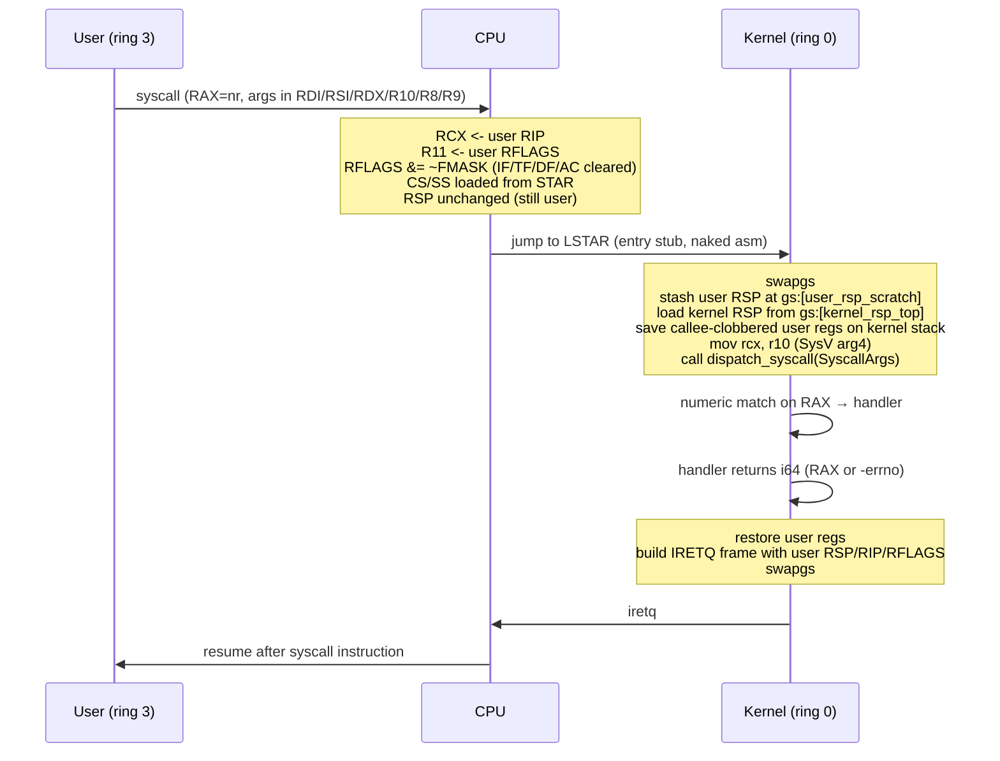

# feat: Userland Linux ABI compat and static C++ hello-world

## Summary

Switch the kernel's userland entry path from `int 0x80` to the SYSCALL fast path with Linux x86-64 numbering, expand the ELF loader for `PT_TLS`, grow the user VA window from ~9 MiB to a multi-MiB region, add the ~12 syscalls a static musl + libstdc++ binary actually needs, and thread a non-Cargo C++ app under `userland/apps/hello-cpp/` through `build.sh` so a `g++ -static -no-pie` C++ iostream binary loads from `/host` and runs end-to-end on AgenticOS. The trampoline page and name-keyed syscall registry are removed in the same series; the existing rust userland sample is migrated to the new ABI as part of this work.

---

## Problem Frame

The userland platform landed in PR #12 speaks a private ABI: `int 0x80` with two name-keyed syscalls (`print`, `exit`), a trampoline-resolved relocation path, and a custom `linker.ld` that the rust runtime crate links against. Nothing on the kernel side speaks an ABI a stock host C/C++ toolchain knows how to emit for, so every userland program is a port. Committing now to Linux x86-64 ABI compatibility — SYSCALL instruction, Linux syscall numbering, Linux initial-stack contract — opens the path to running unmodified static Linux binaries (and eventually a future `rustc`) without a custom toolchain. See origin for the WHAT and full pain framing.

---

## Requirements

- R1. Host probe: `build.sh` / `test.sh` detect a musl-based static C++ cross-compiler and fail with an actionable message when missing.
- R2. C++ source lives in the monorepo as a non-Cargo sibling under `userland/apps/<name-cpp>/`.
- R3. `build.sh` / `test.sh` build the C++ app and stage the ELF into `host_share/` under an uppercase 8.3 filename.
- R4. C++ binary is statically linked with `-static -no-pie` against musl + libstdc++.
- R5. Userland enters the kernel via `syscall`. `MSR_LSTAR` / `MSR_STAR` / `MSR_FMASK` / `swapgs` are programmed; the existing `int 0x80` path is removed (no backwards compatibility for old numbering).
- R6. Syscall ABI follows Linux x86-64: `RAX` = number/return; args in `RDI, RSI, RDX, R10, R8, R9`; errors as `-errno` in `RAX`.
- R7. Kernel constructs a Linux-shaped initial user stack: `argc`, `argv` (≥ 1 entry), `envp`, `auxv` with at minimum `AT_PHDR`, `AT_PHENT`, `AT_PHNUM`, `AT_PAGESZ`, `AT_RANDOM`, `AT_NULL`.
- R8. Loader supports `PT_TLS`: copies tdata, reserves tbss, allocates a per-process TLS block + TCB, ready for `arch_prctl(ARCH_SET_FS)`.
- R9. Loader maps multiple `PT_LOAD` segments with their leaf perms; `.eh_frame` / `.eh_frame_hdr` reachable at the addresses recorded in program headers.
- R10. Loader file-size cap is raised to host a multi-MiB libstdc++ binary; FAT/vvfat continues to host the file.
- R11. Additional relocation types required by libstdc++ static binaries are supported when surfaced; unsupported types continue to fail with a named error rather than silently corrupting the image.
- R12. The kernel implements the syscalls a static C++ iostream "hello world" actually invokes; the surface is what this binary observably needs.
- R13. Stub-but-correct returns are accepted for syscalls whose real behavior is later-milestone work, provided the binary completes.
- R14. Any unimplemented or un-stubbed syscall traps cleanly: log the number, terminate the user process via the existing fault path, return to the shell. No panic, no hang.
- R15. The existing rust `userland/apps/hello` continues to load and run after the ABI switch.
- R16. `userland/README.md` is updated to document the C++ workflow.
- R17. Hand-rolled freestanding test fixtures exercise the SYSCALL transition and Linux initial-stack contract independent of the host C++ toolchain.

**Origin acceptance examples:** AE1, AE2 (R1, R3 toolchain probe); AE3 (R5–R12 end-to-end); AE4 (R14 trap); AE5 (R15 rust regression); AE6 (R17 fixtures gate).

---

## Scope Boundaries

- Writable `/host`, FAT write driver, alternative writable disk.
- Multitasking, fork/exec, threads, real signal delivery.
- Dynamic linking, shared libraries, `ld-linux` interpreter support.
- `rustc`, cargo, on-OS compilation.
- Network syscalls; tty subsystem beyond the iostream-buffering decision.
- Backwards compatibility for `int 0x80` numbering — one-way cutover.
- Custom GCC target spec; non-musl libc; vendoring the toolchain into the repo.
- Frame-allocator reclaim on user-image `Drop` — pre-existing leak documented, not fixed here.
- Generalized per-CPU framework; SMP support.
- A real `mmap` free-list / coalescing arena; a real `brk` shrink path.
- Real `getrandom`, `futex`, `rt_sigaction`. Stubs only.
- Kernel SYSRET return path. IRETQ only for this milestone.

### Deferred to Follow-Up Work

- A real per-process address space (independent page tables per user process). Stays single-active-user with the existing model.
- Frame reclaim on `UserImage` drop (long-standing kernel-wide concern surfaced by larger images).

---

## Context & Research

### Relevant Code and Patterns

- `src/userland/loader.rs` — three-phase ELF loader (validate / map+copy / relocate). PT_TLS rejected today at the type-check; reloc walk in `apply_relocations` extends here.
- `src/userland/abi.rs` — name-keyed registry + `UserVaBounds` + `validate_user_slice`. Keep the slice-validation helpers; replace the registry with numeric dispatch.
- `src/userland/mod.rs::enter_user_mode` and `enter_user_mode_asm` — kernel-continuation setjmp + `iretq` to ring 3. Initial-stack assembly happens here, before the iretq frame is built.
- `src/userland/lifecycle.rs` — `ActiveUser` slot, `KernelContinuation`, `cleanup_user_process`, `restore_continuation`. Extend `ActiveUser` with TLS-block VA, brk anchor, mmap arena head.
- `src/arch/x86_64/syscall.rs` — current `int 0x80` dispatcher. Whole file is replaced by the SYSCALL stub + dispatcher; `SyscallArgs` struct kept as the contract.
- `src/arch/x86_64/gdt.rs` — selectors already ordered user_data-before-user_code (`gdt.rs:7`). `kernel_rsp0_top` and `set_kernel_rsp0` remain for IRETQ-from-fault paths; SYSCALL uses the new percpu struct via `gs:0`.
- `src/arch/x86_64/interrupts.rs:106-113` — IDT vector 0x80 registration. Removed in this plan.
- `src/mm/paging.rs` — `map_user_region` / `unmap_user_region`, `UserPerms`, `USER_VA_RANGE_*`. VA window is the load-bearing change here.
- `src/fs/file_handle.rs::File::read_to_vec` (around line 197) — current file-size cap surfaces here.
- `src/tests/userland_fixtures.rs` — pattern for hand-built ELF fixtures (`runnable_elf_rx`, `happy_path_elf`); extend for SYSCALL/auxv/TLS tests.
- `userland/runtime/src/lib.rs` — current inline-asm `int 0x80` stubs (line 43, 58); rewrite for `syscall` + Linux numbers.
- `build.sh:65-82` and `test.sh:19-32` — userland build + tmpfile-rename staging into `host_share/`. Hook the C++ build at the same stage with toolchain probe gating.
- Conventions: `lazy_static!` + `spin::Mutex` for mutable singletons; `#[unsafe(naked)] #[no_mangle] pub unsafe extern "C" fn` + `core::arch::naked_asm!` + `extern "C"` shim for entry stubs (precedent: `syscall_dispatch_entry`); `Result<T, EnumError>` for fallible kernel paths; `debug_info!` / `debug_warn!` / `debug_error!` for logging.

### Institutional Learnings

- `docs/solutions/` is empty (`.gitkeep` only). No prior learnings apply. After this milestone lands, capture the durable decisions (Linux ABI ratchet, SYSCALL stub layout, auxv & TLS layout, VA window sizing) under `docs/solutions/architecture-patterns/` and `docs/solutions/tooling-decisions/`.

### External References

- Intel SDM Vol 2B `SYSCALL`/`SYSRET`/`SWAPGS` instruction pages; Vol 3A §2.2, §3.4.5, §5.8.8 — authoritative for MSR layout and entry/exit semantics.
- AMD APM Vol 2 §6.1 (SYSCALL/SYSRET) and §4.8.2.
- Linux kernel `arch/x86/entry/entry_64.S::entry_SYSCALL_64` — reference SYSCALL stub.
- Linux `arch/x86/kernel/cpu/common.c::syscall_init` — FMASK convention (clears `IF`, `TF`, `DF`, `IOPL`, `NT`, `AC`).
- musl `src/env/__libc_start_main.c`, `src/env/__init_tls.c`, `src/env/__init_ssp.c`, `src/thread/x86_64/__set_thread_area.s`, `src/ldso/dl_iterate_phdr.c` — auxv consumption, TLS init, AT_RANDOM use, `arch_prctl(ARCH_SET_FS)` syscall, static `dl_iterate_phdr`.
- Redox OS `kernel/src/arch/x86_64/interrupt/syscall.rs` and `start.rs` — Rust `no_std` SYSCALL prior art.
- CVE-2012-0217 (Xen/Linux SYSRET non-canonical RIP) — pitfall driving the IRETQ choice in this plan.
- Android Bionic ELF TLS doc and chao-tic TLS deep dive — x86-64 variant II layout reference.

---

## Key Technical Decisions

- **IRETQ for return, not SYSRET.** Sidesteps non-canonical-RIP class pitfalls (CVE-2012-0217) and reuses the existing IRETQ path used for cooperative exit and faults. SYSRET can be added later if it's ever a measurable hot path.
- **Strict ET_EXEC enforcement.** With `-static -no-pie` producing ET_EXEC, no `R_X86_64_RELATIVE` is required. The relocation walker stays for hardening; new reloc support added only if a real binary surfaces a need.
- **Per-CPU kernel/user RSP scratch is a single static struct in kernel BSS.** Single-CPU only; no generalized per-CPU framework. `IA32_GS_BASE` and `IA32_KERNEL_GS_BASE` both initialized to point at it on boot, so `swapgs` is correct on first SYSCALL.
- **TLS variant II layout.** tdata + tbss live below `FS_BASE`; TCB at `FS_BASE` with self-pointer at offset 0; TCB sized at ~512 bytes (covers musl `struct pthread`). dtv slot zeroed — libstdc++ static binaries use local-exec TLS and don't traverse dtv.
- **AT_RANDOM is 16 fixed bytes from kernel BSS** for this milestone (per origin scope boundary on entropy quality). Real entropy is a later swap.
- **`mmap` is anonymous-only**, `MAP_PRIVATE | MAP_ANONYMOUS`, with a bump arena tracked on `ActiveUser`. File-backed mmap returns `-ENOSYS`.
- **`brk` tracked per-process on `ActiveUser`**: initial brk anchor placed above the loaded image and TLS block; grow on demand; shrink returns the unchanged brk.
- **Numeric syscall dispatch via Rust `match`**, not a function-pointer table. Surface is small (~12) and handlers vary in shape (slice validation, fd routing, MSR write). `SyscallArgs` struct preserved as the dispatcher contract.
- **One-way ABI cutover.** IDT 0x80, name-keyed registry, and trampoline page are all removed in the same series. Existing rust runtime is migrated to inline-asm `syscall` with Linux numbers as part of the cutover.
- **Build sequencing**: C++ build runs serially in `build.sh` after the rust userland build, before the kernel build. Toolchain probe is hard-fail (no `SKIP_CPP=1` escape hatch for this milestone). Mirrors existing tmpfile-rename staging into `host_share/`.

---

## Open Questions

### Resolved During Planning

- **Minimum syscall surface for static musl + libstdc++ hello-world.** Resolved via Phase 1 framework-docs research: `arch_prctl`, `set_tid_address`, `set_robust_list`, `brk`, `mmap`, `ioctl(TCGETS)→-ENOTTY`, `writev`, `exit_group`, plus `read`/`write`/`munmap`/`mprotect` for safety. Roughly half the brainstorm-time worst-case list.
- **Mandatory auxv entries.** `AT_PHDR`, `AT_PHENT`, `AT_PHNUM`, `AT_PAGESZ`, `AT_RANDOM`, `AT_NULL`. Others tolerable as zero or absent.
- **Whether `-static -no-pie` produces ET_EXEC or ET_DYN with musl-cross-make.** ET_EXEC. No R_X86_64_RELATIVE handling needed if we enforce ET_EXEC.
- **Whether libstdc++ static unwinder calls into kernel during startup.** No — eh-frame parsing is lazy. No new kernel work unless the binary throws.
- **GDT layout.** Already correct (user_data before user_code). Only the IA32_STAR programming step is new; no GDT reshuffling.
- **Whether musl uses `arch_prctl(ARCH_SET_FS)` or `set_thread_area`.** `arch_prctl` on x86-64. `set_thread_area` is i386-only.
- **Whether to support `SKIP_CPP=1` escape hatch when the toolchain is missing** (origin's deferred `R3` question). No — hard-fail per Key Technical Decisions. The escape hatch can be reconsidered if a CI machine genuinely cannot host the toolchain.

### Deferred to Implementation

- **User VA window target value.** Direction is "much bigger" (current end is `0x901_000`); pick a concrete bound during U5 once stack/TLS/mmap arena layout is sized. Likely on the order of 64 MiB.
- **Exact file-size cap raise mechanism.** `File::read_to_vec` heap allocation will dominate; verify the heap (100 MiB) is the actual ceiling and decide whether to introduce an explicit cap or rely on heap allocation success.
- **Exact rust-runtime stub style for `userland/runtime/`.** Inline-asm vs a thin Rust shim around an `extern "C"` syscall function. Either works; pick whichever minimizes drift in the hello sample.
- **Whether to keep the relocation walker invoked at all on ET_EXEC binaries.** It's currently a no-op against the new C++ binary; leaving it in is cheap hardening.
- **Sentinel TID returned from `set_tid_address` and `getpid`.** Any positive integer works; pick during U10.

---

## High-Level Technical Design

> *This illustrates the intended approach and is directional guidance for review, not implementation specification. The implementing agent should treat it as context, not code to reproduce.*

### SYSCALL entry/exit flow



### User process initial stack at `_start`

```text
high addr
    [string area: argv strings, AT_RANDOM 16 bytes]
    [auxv: AT_NULL=0,0]
    [auxv: AT_RANDOM, ptr-to-16-bytes]
    [auxv: AT_PAGESZ, 4096]
    [auxv: AT_PHNUM, n]
    [auxv: AT_PHENT, 56]
    [auxv: AT_PHDR, &phdrs]
    [envp: NULL terminator]
    [argv: NULL terminator]
    [argv[0] = "/HOST/HELLOCPP.ELF" (or similar)]
    [argc = 1]                              <- RSP at _start
low addr
```

### TLS layout (x86-64 variant II)

```text
high addr
    [TCB header: dtv (zeroed), pad, ...]
    [TCB.canary @ +0x28 (set from AT_RANDOM)]
    [TCB.self-pointer @ +0]                 <- FS_BASE points here; %fs:0 returns &TCB
    [tbss: zero-init, p_memsz - p_filesz bytes]
    [tdata: copied from PT_TLS p_offset, p_filesz bytes]
low addr
```

### Userland VA layout (post-expansion)

```text
0xf000_0000  user stack top (existing; 8 pages grow-down + guard)
...          mmap arena (bump-allocated by syscall, grows up)
...          brk anchor (grows up)
0x???_????   TLS block + TCB (placed above PT_LOADs by loader)
0x040_0000   USER_LOAD_BASE — PT_LOAD segments
0x000_0000   USER_VA_RANGE_START
```

`USER_VA_RANGE_END` moves from `0x901_000` to substantially higher (target on the order of 64 MiB); trampoline page at `0xf000_1000` is removed.

---

## Implementation Units

The 14 units fall in five rough phases. Phases are presentation only — the units are sequenced by hard dependencies below.

### U1. MSR / segment-base helpers

**Goal:** Reusable `wrmsr` / `rdmsr` wrappers, an `IA32_FS_BASE` writer for `arch_prctl`, and an `EFER.SCE` enable.

**Requirements:** R5

**Dependencies:** none

**Files:**
- Create: `src/arch/x86_64/msr.rs`
- Modify: `src/arch/x86_64/mod.rs` (re-export)
- Test: `src/tests/userland_fixtures.rs` *(no new fixture; covered by SYSCALL fixture in U14)*

**Approach:**
- Thin safe wrappers around the `x86_64` crate's `Msr` type for the MSR numbers this work touches: `IA32_EFER` (0xC0000080), `IA32_STAR` (0xC0000081), `IA32_LSTAR` (0xC0000082), `IA32_FMASK` (0xC0000084), `IA32_FS_BASE` (0xC0000100), `IA32_GS_BASE` (0xC0000101), `IA32_KERNEL_GS_BASE` (0xC0000102).
- Helpers exposed at module level for use by `gdt.rs`, `syscall.rs`, and the `arch_prctl` handler. No global state.

**Patterns to follow:**
- Lightweight `pub fn` wrappers like the existing `gdt.rs::set_kernel_rsp0`. No `lazy_static`, no mutable globals.

**Test scenarios:**
- *Test expectation: none — pure wrapper helpers exercised end-to-end by U14.*

**Verification:**
- Module compiles; wrappers callable from unit-test fixtures and dependent units.

---

### U2. Per-CPU kernel/user RSP scratch + GS_BASE init

**Goal:** Single static struct in kernel BSS holding `{kernel_rsp_top, user_rsp_scratch}`; both `IA32_GS_BASE` and `IA32_KERNEL_GS_BASE` programmed to point at it on boot.

**Requirements:** R5

**Dependencies:** U1

**Files:**
- Create: `src/arch/x86_64/percpu.rs`
- Modify: `src/arch/x86_64/mod.rs` (init hook), `src/kernel.rs` (call init alongside GDT/IDT/syscall init)

**Approach:**
- Define a fixed-layout `repr(C)` struct with two `u64` fields. Allocate as a `static mut PERCPU` (single CPU; documented pattern per `gdt.rs::TSS_STACK`).
- Init function programs both MSRs to `&PERCPU as u64` so `swapgs` is a no-op on first entry and the per-CPU pointer is stable across exits.
- `kernel_rsp_top` is set per-entry by `enter_user_mode` (mirroring `set_kernel_rsp0`). `user_rsp_scratch` is written by the SYSCALL stub itself.

**Patterns to follow:**
- `src/arch/x86_64/gdt.rs` `static mut TSS_STACK` pattern.

**Test scenarios:**
- *Test expectation: none — exercised by U3 SYSCALL stub and U14 fixtures.*

**Verification:**
- Boot with the new init wired in; `rdmsr(IA32_GS_BASE)` and `rdmsr(IA32_KERNEL_GS_BASE)` both equal `&PERCPU`.

---

### U3. SYSCALL entry stub + numeric dispatcher + STAR/LSTAR/FMASK

**Goal:** Naked-asm SYSCALL entry that swaps GS, switches stacks, builds a register frame, and calls a Rust dispatcher. STAR/LSTAR/FMASK programmed during boot. Initial dispatcher handles only `write` (1) and `exit_group` (231) so the rust hello can be migrated in U4.

**Requirements:** R5, R6

**Dependencies:** U1, U2

**Files:**
- Modify: `src/arch/x86_64/syscall.rs` (full rewrite — new SYSCALL stub replacing the int-0x80 handler)
- Modify: `src/userland/abi.rs` (introduce numeric dispatch; preserve `SyscallArgs` and `validate_user_slice`)
- Modify: `src/userland/syscalls.rs` (register `write` (1) and `exit_group` (231); leave the other slots returning `-ENOSYS` for now)
- Modify: `src/kernel.rs` (init order: `MSR::enable_syscall_extensions()` after GDT)

**Approach:**
- Stub structure follows the SysV-AMD64 pattern: `swapgs`; stash user RSP; load kernel RSP from `gs:0`; build the register frame; translate `R10 → RCX` for SysV C ABI; call the Rust dispatcher.
- Return path: pop the register frame, build an IRETQ frame on the kernel stack with `{user RSP, user RIP from saved RCX, user RFLAGS from saved R11, CS=user_code_sel, SS=user_data_sel}`, `swapgs`, `iretq`. **IRETQ chosen over SYSRET** per Key Technical Decisions.
- Dispatcher is a numeric `match` on `args.rax`; handlers return `i64` (negative-errno on failure). `validate_user_slice` from `abi.rs` reused unchanged.
- `STAR` programmed using existing `gdt.rs::selectors()` to lift kernel CS and user CS bases. Constraint: GDT layout must satisfy `user_SS = base + 8` and `user_CS64 = base + 16`. Verified by repo research — already correct.
- `FMASK` clears at minimum `IF`, `DF`, `AC` (Linux uses `0x47700`; document the value chosen).

**Technical design:** *(directional only)*
```text
syscall_entry (naked):
    swapgs
    mov   gs:[USER_RSP_OFF], rsp
    mov   rsp, gs:[KERN_RSP_OFF]
    push  rax  ; rdi ; rsi ; rdx ; r10 ; r8 ; r9 ; rcx ; r11
    mov   rcx, r10                  ; SysV arg4
    call  syscall_dispatch_rust     ; returns i64 in rax
    ; replace saved rax with return value
    mov   [rsp + RAX_SLOT], rax
    pop   r11 ; rcx ; r9 ; r8 ; r10 ; rdx ; rsi ; rdi ; rax
    ; build iretq frame from saved RCX (user RIP) + R11 (user RFLAGS) + user RSP
    ...
    swapgs
    iretq
```

**Patterns to follow:**
- `src/arch/x86_64/syscall.rs::syscall_interrupt_handler` + `syscall_dispatch_entry` shim pattern (naked stub references Rust function via `sym {ident}`).
- `src/userland/abi.rs::syscall_dispatch` reshape (numeric instead of name-keyed).

**Test scenarios:**
- *Direct kernel-side coverage by U14 fixture (binary issues `syscall` with RAX=231, argument 42; kernel records exit code 42).*

**Verification:**
- A hand-built ELF (U14 fixture) issues `syscall` with `RAX=231, RDI=42` and observes the kernel record exit code 42. No fault in IRETQ exit. `int 0x80` from a user binary now triggers `#GP` (vector removed in U4).

---

### U4. Tear down `int 0x80` path; migrate rust runtime crate

**Goal:** Remove IDT vector 0x80 registration, the trampoline page, name-keyed registry remnants, and the loader's trampoline-relocation patching. Rewrite `userland/runtime/src/lib.rs` to issue `syscall` with Linux numbers.

**Requirements:** R5, R15

**Dependencies:** U3

**Files:**
- Modify: `src/arch/x86_64/interrupts.rs` (remove vector 0x80 IDT entry around `interrupts.rs:106-113`)
- Modify: `src/userland/abi.rs` (drop name-keyed registry, retain `SyscallArgs` and `UserVaBounds`)
- Modify: `src/userland/loader.rs` (drop the trampoline-resolution branch in `apply_relocations`)
- Modify: `src/userland/mod.rs` (drop trampoline-page mapping in user-image setup)
- Delete: `src/userland/trampoline.rs`
- Modify: `src/userland/syscalls.rs` (drop `register_first_class_syscalls()`'s name path)
- Modify: `src/mm/paging.rs` (remove `USER_TRAMPOLINE_VA` const if unused after this unit)
- Modify: `userland/runtime/src/lib.rs` (inline-asm `syscall` with `rax=1`/`rax=231`)
- Modify: `userland/apps/hello/src/main.rs` (no behavior change — just confirm `_start` still calls `runtime::print` and `runtime::exit` which now issue Linux numbers)
- Test: `src/tests/userland.rs` (existing happy-path rust hello test continues to pass against the new ABI)

**Approach:**
- Tear-down is straightforward but cross-cutting. Land in one unit so the kernel never has both ABIs live (the brainstorm explicitly chose one-way cutover).
- Runtime stub style: inline-asm following the Linux x86-64 calling convention exactly. Args in `rdi/rsi/rdx`, syscall number in `rax`, `clobber("rcx", "r11", "memory")` per the calling-convention reference.

**Patterns to follow:**
- Existing `userland/runtime/src/lib.rs:43,58` inline-asm pattern (shape preserved; numbers and instruction change).

**Test scenarios:**
- Integration: `userland/apps/hello` runs end-to-end and prints `hello\n`, exits 0. (Covers AE5.)

**Verification:**
- `./test.sh` passes the rust-hello regression. No reference to `int 0x80`, `USER_TRAMPOLINE_VA`, or name-keyed registration remains in the codebase.

---

### U5. Expand the userland VA window

**Goal:** Raise `USER_VA_RANGE_END` to host a multi-MiB libstdc++ image, TLS block, mmap arena, and a larger stack. Pick a concrete value during this unit and document the layout.

**Requirements:** R10 (memory side), R12 implicitly

**Dependencies:** U4 (trampoline-page const removed first)

**Files:**
- Modify: `src/mm/paging.rs` (`USER_VA_RANGE_END`; comments documenting the per-region sub-allocation policy)
- Modify: `src/userland/mod.rs` (`USER_STACK_TOP` if it moves; sub-region constants for TLS/brk/mmap if introduced here)
- Test: `src/tests/userland.rs` (ensure existing tests still load images at the expected base)

**Approach:**
- Pick a window large enough for: code/data up to a few MiB at `USER_LOAD_BASE`, TLS+TCB (~4 KiB to 64 KiB), brk arena (low MiB), mmap arena (several MiB), 32 KiB stack with guard. Target on the order of 64 MiB.
- This unit only widens the bound and documents the layout. Real allocation policy (where TLS lands, where brk anchors, where mmap arena starts) is finalized in U7 / U10.

**Test scenarios:**
- Edge case: hand-built ELF with PT_LOAD just under the new ceiling loads successfully.
- Edge case: hand-built ELF whose PT_LOAD overruns the new ceiling fails with the existing VA-bounds error path.
- Integration: `userland/apps/hello` continues to load (regression).

**Verification:**
- New constants compile-checked against fixtures; rust hello continues to run; no other subsystem breakage.

---

### U6. Raise loader/FS file-size cap

**Goal:** Ensure `File::read_to_vec` and any kernel-side buffer the loader uses can host a multi-MiB ELF without truncation or `ENOMEM`.

**Requirements:** R10

**Dependencies:** U5 (so VA mapping doesn't itself reject the larger image)

**Files:**
- Modify: `src/fs/file_handle.rs` (around line 197 — verify and raise any explicit size cap)
- Modify: `src/commands/run/mod.rs` (verify the read path passes the full file size through to the loader)
- Modify: `src/userland/loader.rs` (verify no internal cap)
- Test: `src/tests/` (loader fixture for a multi-MiB synthetic binary)

**Approach:**
- First pass: read the existing FAT read path and identify the cap (per Phase 1 research, no explicit cap in the loader; cap likely lives in the FAT side or implicit through heap allocation).
- If an explicit cap exists, raise it to a defensible bound (e.g., 16 MiB) with a clear error when exceeded.
- If the cap is implicit (heap pressure), document the kernel heap (100 MiB) as the de facto ceiling.

**Test scenarios:**
- Happy path: a synthetic ~2 MiB ELF fixture (PT_LOAD with a large `.data` body) loads without truncation.
- Error path: a synthetic ELF larger than the new explicit cap fails with a named error, no panic.

**Verification:**
- A real `g++ -static` C++ hello binary (built once locally as a sanity check during this unit; not yet wired into the build) reads through the FS path successfully.

---

### U7. ELF loader: PT_TLS support

**Goal:** Parse `PT_TLS`, copy tdata, reserve tbss, allocate per-process TLS block + TCB at a known VA above `PT_LOAD`s, surface info to user-mode entry so `arch_prctl(ARCH_SET_FS)` can install it.

**Requirements:** R8, R9

**Dependencies:** U5

**Files:**
- Modify: `src/userland/loader.rs` (replace the `TlsUnsupported` rejection at `loader.rs:245` with TLS-handling branch; record TLS block VA, image size, alignment)
- Modify: `src/userland/image.rs` (`UserImage` carries TLS block range so Drop unmaps cleanly)
- Modify: `src/userland/lifecycle.rs` (`ActiveUser` carries TLS block VA + TCB VA for `arch_prctl` to consume)
- Modify: `src/userland/error.rs` (replace `TlsUnsupported` with finer-grained errors if needed; keep `UnsupportedReloc` shape)
- Test: `src/tests/userland_fixtures.rs` (TLS fixture: hand-built ELF with PT_TLS that issues `arch_prctl(ARCH_GET_FS)` and reports back via `exit_group`)
- Test: `src/tests/userland.rs`

**Approach:**
- TLS block sized as `round_up(p_memsz, p_align)` for the image plus a fixed-size TCB (~512 bytes covering musl's `struct pthread`).
- Memory layout per Key Technical Decisions: tdata (initialized) + tbss (zero) below FS_BASE; TCB at FS_BASE with self-pointer at offset 0 and zeroed dtv slot.
- Mapped via `map_user_region(tls_va, page_count, ReadWrite)`; the user binary itself initializes the TCB header via `arch_prctl` + writes (or, simpler for this milestone, the kernel pre-initializes self-pointer and dtv during loader copy).
- The `arch_prctl` syscall handler (in U10) wrmsrs the supplied address into `IA32_FS_BASE`.

**Test scenarios:**
- Happy path: ELF with PT_TLS (small `.tdata` + `.tbss`) loads; binary issues `arch_prctl(ARCH_SET_FS, fs_base)` and `arch_prctl(ARCH_GET_FS)` and reports the round-tripped value.
- Edge case: ELF with PT_TLS that has zero tdata, only tbss — loader handles `p_filesz=0` correctly.
- Error path: PT_TLS whose `p_align` exceeds page size by more than what the loader supports — error path remains a named loader error, no kernel panic.
- Covers AE3 (alongside other units).

**Verification:**
- Test fixture exits with the expected reported FS_BASE; existing rust hello (no PT_TLS) remains unaffected.

---

### U8. Linux initial-stack builder

**Goal:** Construct argc/argv/envp/auxv on the user stack at process start, with mandatory auxv entries populated, before transferring control to ring 3.

**Requirements:** R7

**Dependencies:** U3 (so the binary can issue syscalls), U7 (so AT_PHDR can be sourced from a loaded image with TLS)

**Files:**
- Modify: `src/userland/mod.rs` (`enter_user_mode` builds the stack frame before the iretq push sequence around `mod.rs:230-256`; RSP target is the new argc location)
- Modify: `src/userland/lifecycle.rs` (`ActiveUser` carries the program-header VA captured by the loader for AT_PHDR)
- Modify: `src/userland/loader.rs` (record program-header location at load time so the initial-stack builder has it without re-parsing)
- Test: `src/tests/userland_fixtures.rs` (auxv fixture: binary reads argc, walks auxv to find `AT_RANDOM` and `AT_PAGESZ`, reports back via `exit_group(code)`)
- Test: `src/tests/userland.rs`

**Approach:**
- String area at the top of the user stack: argv strings + 16 bytes of AT_RANDOM data (fixed kernel BSS bytes for this milestone).
- Auxv pairs below: `AT_PHDR`, `AT_PHENT=56`, `AT_PHNUM`, `AT_PAGESZ=4096`, `AT_RANDOM=ptr`, `AT_SECURE=0`, `AT_NULL=0`.
- envp: NULL terminator only.
- argv: at least argv[0] = path under `/HOST/` + NULL terminator.
- argc: 1.
- Adjust RSP to point at argc; iretq pushes `RIP=e_entry, RFLAGS=…, RSP=adjusted, CS/SS=user`.

**Patterns to follow:**
- Existing `enter_user_mode_asm` naked stub (`mod.rs:153`) — do the stack construction in Rust before the naked stub runs, so the iretq frame just inherits the new RSP.

**Test scenarios:**
- Happy path: fixture binary reads argc=1, argv[0] non-empty, argv[1]=NULL, envp[0]=NULL, walks auxv until AT_NULL, finds AT_RANDOM with a non-NULL pointer, exits with success code.
- Edge case: binary reads AT_PHDR, parses program headers in-place, finds the PT_LOAD it was loaded from, exits with success code (covers R9 PHDR-reachable invariant).
- Error path: not applicable at this unit (initial-stack construction is invariant; failures here are kernel bugs, not user input).
- Covers AE3 (alongside other units).

**Verification:**
- Auxv fixture exits with success code; binaries that previously assumed RSP=stack_top-8 (older rust runtime) are migrated by U4 — no regression.

---

### U9. Linux syscall surface (the actual ~12)

**Goal:** Implement the syscalls a static musl + libstdc++ "hello world" actually invokes during execution.

**Requirements:** R12, R13

**Dependencies:** U3, U5, U7, U8

**Files:**
- Modify: `src/userland/syscalls.rs` (new handlers: `read`=0, `write`=1, `mmap`=9, `mprotect`=10, `munmap`=11, `brk`=12, `ioctl`=16, `writev`=20, `arch_prctl`=158, `set_tid_address`=218, `exit_group`=231, `set_robust_list`=273; plus `getuid`/`getgid`/`getpid` if surfaced)
- Modify: `src/userland/abi.rs` (numeric dispatch table extension)
- Modify: `src/userland/lifecycle.rs` (`ActiveUser` carries brk anchor + mmap arena head)
- Modify: `src/mm/paging.rs` (helper to allocate a fresh user range for mmap, anonymous-only)
- Test: `src/tests/userland_fixtures.rs` (per-syscall fixture coverage where useful)
- Test: `src/tests/userland.rs`

**Approach:**
- `write(fd, buf, len)`: validate slice via `validate_user_slice`; route fd 1/2 to the existing serial path; other fds return `-EBADF`. Generalizes the current `print`.
- `writev(fd, iov, n)`: validate the iovec array, then loop calling the same slice-write path; all-or-nothing return semantics ok for milestone.
- `read(fd, buf, len)`: stub returning 0 (EOF) for fds 0/1/2; other fds `-EBADF`.
- `mmap(addr, len, prot, flags, fd, off)`: require `MAP_PRIVATE|MAP_ANONYMOUS`, fd=-1, addr=0 (or honor as a hint with a fixed-bias-OK semantic); allocate from the per-process bump arena via `map_user_region`; reject anything else with `-ENOSYS`/`-EINVAL`. Track allocations on `ActiveUser` so Drop can unmap.
- `munmap(addr, len)`: mark the range as freed (no real reclaim in this milestone — unmap pages but don't return frames; the existing image-Drop leak is unchanged for now). Returns 0 even if range was already unmapped (idempotent).
- `mprotect(addr, len, prot)`: validate range is in user VA bounds; return 0 without changing perms (musl uses this only for guard pages on `pthread_create`, not in single-thread hello).
- `brk(new)`: if `new == 0`, return current brk; otherwise grow the brk region via `map_user_region` to the new value; reject shrink (return current brk).
- `ioctl(fd, TCGETS=0x5401, ...)`: return `-ENOTTY`. All other ioctls: `-ENOSYS`.
- `arch_prctl(code, addr)`: if `code == ARCH_SET_FS (0x1002)`, validate `addr` is canonical and within user VA bounds, wrmsr `IA32_FS_BASE`, return 0. `ARCH_GET_FS (0x1003)` returns the current value via the user buffer. Other codes `-EINVAL`.
- `set_tid_address(ptr)`: validate `ptr`, store on `ActiveUser` (do not write to user memory), return a fixed pseudo-tid (e.g., 1).
- `set_robust_list(head, len)`: return 0; do not track.
- `exit_group(code)`: equivalent to existing exit — record `LAST_EXIT_CODE`, long-jump to kernel continuation.
- `getuid`/`getgid`/`getpid`: return 0/0/1 if invoked.

**Patterns to follow:**
- Existing `print` and `exit` handlers in `src/userland/syscalls.rs` — same shape (slice validation, error return, success return).
- Existing `validate_user_slice` from `src/userland/abi.rs`.

**Test scenarios:**
- Happy path: fixture issues `write(1, "ok\n", 3)` and observes "ok\n" on serial; `exit_group(0)` returns control.
- Happy path: fixture issues `brk(0)`, then `brk(start + 4096)`, then writes a byte at `start`, then `brk(0)` reports the new top.
- Happy path: fixture issues `mmap(0, 4096, RW, PRIVATE|ANON, -1, 0)`, writes to the returned address, reads it back.
- Happy path: fixture issues `arch_prctl(ARCH_SET_FS, addr)` then `arch_prctl(ARCH_GET_FS, &out)` and verifies round-trip.
- Edge case: `write(1, ptr_outside_user_va, 16)` returns `-EFAULT`.
- Edge case: `mmap` with file-backed flags returns `-ENOSYS`.
- Edge case: `mmap` for an arena that exceeds the user VA window returns `-ENOMEM`.
- Error path: `ioctl(1, TCGETS, …)` returns `-ENOTTY`; iostream still works (covered by C++ binary in U13).
- Integration: musl-built C++ hello-world end-to-end — covers AE3 once U13 lands.

**Verification:**
- All per-syscall fixtures pass; rust hello regression passes; C++ hello (after U13) prints output and exits 0.

---

### U10. Unhandled-syscall trap

**Goal:** A binary that issues an unimplemented or un-stubbed syscall logs the offending number and is terminated cleanly via the existing fault-cleanup path. No kernel panic, no hang.

**Requirements:** R14

**Dependencies:** U9

**Files:**
- Modify: `src/userland/abi.rs` (default arm of the dispatch `match`: log + raise a "user fault" the lifecycle path already knows how to handle)
- Modify: `src/userland/lifecycle.rs` (extend `cleanup_user_process` / `cooperative_exit` to accept a reason variant for unimplemented syscalls; or reuse an existing variant if one fits)
- Test: `src/tests/userland_fixtures.rs` (fixture binary issues a known-unused syscall number)
- Test: `src/tests/userland.rs`

**Approach:**
- Default `match` arm: `debug_warn!` with the syscall number and a static description ("unimplemented" or a Linux name table lookup if cheap), then long-jump back to the kernel continuation with an `ExitKind` variant indicating "unimplemented syscall" (analogous to `Abnormal { vector, fault_rip }`).
- Shell prompt returns; QEMU does not exit; no panic. The kernel halt path is not invoked.

**Patterns to follow:**
- `src/userland/lifecycle.rs::cleanup_user_process` and the `ExitKind` enum.

**Test scenarios:**
- Happy path: fixture binary issues `RAX=999` (well outside any implemented number) → kernel logs the number, terminates the binary, returns to the shell.
- Covers AE4.

**Verification:**
- Fixture passes; serial shows the diagnostic line; `LAST_EXIT_CODE` reflects the unhandled-syscall variant; no panic frame on serial.

---

### U11. C++ app skeleton in monorepo

**Goal:** `userland/apps/hello-cpp/` containing the source for a static `g++ -static -no-pie` C++ iostream hello-world and a small build helper (Makefile).

**Requirements:** R2, R4

**Dependencies:** none (host-side only; can land in parallel with kernel work)

**Files:**
- Create: `userland/apps/hello-cpp/src/main.cpp`
- Create: `userland/apps/hello-cpp/Makefile`
- Modify: `userland/Cargo.toml` *(no change — C++ app is NOT a Cargo workspace member)*

**Approach:**
- `main.cpp` is a minimal `#include <iostream>` + `std::cout << "hello from c++" << std::endl` + `return 0`. Use `std::endl` (not `"\n"`) so libstdc++ flushes the buffer before exit — required because `ioctl(TCGETS) → -ENOTTY` makes stdout fully buffered (see Risks table).
- Makefile invokes `x86_64-linux-musl-g++ -static -no-pie -O2` and writes `hello-cpp` (no extension) into the local target dir. The staging step (copy + uppercase 8.3 rename to `HELLOCPP.ELF`) is `build.sh`'s job, not the Makefile's.
- Allow the Makefile to be invoked standalone (`make -C userland/apps/hello-cpp`) for fast iteration during development.

**Patterns to follow:**
- `userland/apps/hello/Cargo.toml` + `build.rs` directory shape (one app per directory under `userland/apps/`).
- `host_share/HELLO.ELF` uppercase-8.3 staging (per `userland/README.md`).

**Test scenarios:**
- *Test expectation: none — exercised end-to-end by the host-side build pipeline (U12) and the kernel run path (U9).*

**Verification:**
- `make -C userland/apps/hello-cpp` produces an ELF; `readelf -h` reports `EXEC`, `EM_X86_64`, no `PT_INTERP`. (Verification is host-side; kernel does not run this binary until U12 + U9 are both landed.)

---

### U12. `build.sh` / `test.sh` integration for the C++ app

**Goal:** Probe for the host C++ toolchain, build the C++ app alongside the rust userland app, stage the resulting ELF into `host_share/HELLOCPP.ELF`, fail fast and clearly when the toolchain is missing.

**Requirements:** R1, R3

**Dependencies:** U11

**Files:**
- Modify: `build.sh` (toolchain probe, C++ build invocation, staging step — between the rust userland build at lines 65-82 and the kernel build)
- Modify: `test.sh` (same pattern as `build.sh` lines 19-32)

**Approach:**
- Probe: `command -v x86_64-linux-musl-g++ >/dev/null` (or whatever the toolchain detection convention should be — `MUSL_GXX=${MUSL_GXX:-x86_64-linux-musl-g++}`). On miss, print a one-line "install hint: …" message and `exit 1`.
- Build: `make -C userland/apps/hello-cpp`. Stage via tmpfile-rename into `host_share/HELLOCPP.ELF` (mirroring the existing rust pattern at `build.sh:65-82`).
- The rust userland build is unaffected — both build steps run; either failing fails the script.

**Patterns to follow:**
- Existing `build.sh:65-82` rust userland build + tmpfile-rename staging.

**Test scenarios:**
- Happy path: `./build.sh` on a machine with the toolchain produces `host_share/HELLO.ELF` and `host_share/HELLOCPP.ELF`. (Covers AE1.)
- Error path: `./build.sh` on a machine without the toolchain exits non-zero before the kernel build, with a message naming the missing tool. (Covers AE2.)
- Edge case: stale `host_share/HELLOCPP.ELF` from a previous run is replaced atomically by the tmpfile-rename — never half-written on disk.

**Verification:**
- Both binaries present in `host_share/` after `./build.sh`; missing-toolchain run reports the issue clearly.

---

### U13. Documentation update

**Goal:** `userland/README.md` documents the C++ app workflow.

**Requirements:** R16

**Dependencies:** U11, U12 (so the documented commands actually work)

**Files:**
- Modify: `userland/README.md`

**Approach:**
- Add a new section "Adding a C++ app" mirroring the existing "Adding a new app" section, calling out:
  - host toolchain prerequisite (`x86_64-linux-musl-g++` install hint)
  - directory layout (`userland/apps/<name>-cpp/`)
  - upper-8.3 staging filename convention
  - the read-only `/host` snapshot caveat (already in the README; reference it)
  - constraints inherited from the loader (ET_EXEC, `-static -no-pie`)

**Patterns to follow:**
- Existing "Adding a new app" section structure.

**Test scenarios:**
- *Test expectation: none — documentation only.*

**Verification:**
- A reader following the steps from a clean clone reaches a running C++ binary.

---

### U14. Test fixtures: SYSCALL transition + Linux initial-stack + PT_TLS

**Goal:** Hand-rolled freestanding ELF fixtures that exercise the SYSCALL transition, the Linux initial-stack contract, and PT_TLS — independent of the host C++ toolchain. They run under `./test.sh` on any developer machine.

**Requirements:** R17

**Dependencies:** U3, U7, U8, U9, U10

**Files:**
- Modify: `src/tests/userland_fixtures.rs` (extend with new builders mirroring `runnable_elf_rx` / `happy_path_elf`)
- Modify: `src/tests/userland.rs` (new test functions registered in `get_tests()`)
- Modify: `src/tests/mod.rs` (verify registration; no structural change expected)

**Approach:**
- Build hand-rolled ELF byte buffers — the existing fixture pattern. Each fixture's payload is hand-written x86-64 machine code; no compiler involved.
- Fixture A: minimal `_start` issues `syscall` with `RAX=231, RDI=42` → kernel records exit code 42. Verifies SYSCALL transition end-to-end.
- Fixture B: `_start` reads `argc` from `RSP`, walks auxv to find `AT_RANDOM` and `AT_PAGESZ`, packs a status into `RDI`, issues `exit_group`. Verifies initial-stack contract.
- Fixture C: ELF with `PT_TLS` (small tdata + tbss). `_start` issues `arch_prctl(ARCH_GET_FS, &out)`, reads the value, compares against expected, issues `exit_group(0|1)`. Verifies loader PT_TLS handling and `arch_prctl` plumbing.
- Fixture D: `_start` issues `syscall` with `RAX=999`. Test expects the unhandled-syscall trap to fire and the binary to terminate without panicking. Verifies U10.

**Patterns to follow:**
- `src/tests/userland_fixtures.rs::runnable_elf_rx` and `happy_path_elf` byte-construction pattern.
- `src/tests/userland.rs` `get_tests()` registration.

**Test scenarios:**
- All four fixtures in this unit constitute the test scenarios. Each named scenario is itself the test — the fixture builder + the registered test function.
- Covers AE6 (test fixtures gate against host-toolchain absence).

**Verification:**
- `./test.sh` on a machine without `x86_64-linux-musl-g++` runs all four fixtures and they pass. Test exit code 33 (success).

---

## System-Wide Impact

- **Interaction graph:** The SYSCALL entry stub becomes the sole user→kernel transition path. The IDT vector 0x80 entry is removed; a stray user `int 0x80` now triggers `#GP` and is handled by the existing exception → `route_user_fault_or_panic` path. Same kernel-continuation long-jump used for cooperative exit, faults, and now unhandled-syscall traps.
- **Error propagation:** Syscall handlers return `i64`; `RAX` is set on return; user code sees `-errno`. Loader errors propagate through `LoaderError`; user-image faults via `ExitKind`. No new error type families.
- **State lifecycle risks:** `ActiveUser` grows with TLS block VA, brk anchor, and mmap arena head. Drop must unmap these regions in addition to existing PT_LOADs (see `UserImage`). The frame-allocator-leak issue is unchanged — pages are unmapped but not reclaimed; documented in Scope Boundaries.
- **API surface parity:** The `userland/runtime/` rust crate moves to the new ABI (U4); both the rust hello and the C++ hello use the same kernel surface. Hand-rolled test fixtures use the same surface directly.
- **Integration coverage:** Cross-layer scenarios (syscall instruction → kernel dispatch → user mode IRETQ → user code resumes) are covered by the fixtures in U14, the rust hello regression (U4), and the C++ hello (U12 + U9).
- **Unchanged invariants:** Kernel boot path, GDT layout (already correct), TSS rsp0 mechanism (kept for IRETQ-from-fault), the bootloader handoff, the FAT mount and `/host` read path semantics, the shell `run` command, the existing `Testable` framework. The single-active-user policy stays in place.

---

## Risks & Dependencies

| Risk | Mitigation |
|------|-----------|
| SYSCALL stub bug — wrong stack switch, missing register save, IRETQ frame mis-built — leaves CPU in a state that double-faults or returns to the wrong place. | U14 Fixture A is the smallest possible end-to-end SYSCALL test; land before any other syscall work. Use IRETQ exclusively (Key Decision) so the SYSRET non-canonical-RIP class of pitfalls is avoided. |
| `int 0x80` removed before the rust hello is migrated → rust hello breaks during the cutover. | U3 and U4 are sized as a single back-to-back pair; rust hello regression test in U4 gates the cutover. |
| User VA window expansion collides with kernel VA usage. | Kernel uses the high half (`0xffff_…`); user VA is the low half. Expansion to ~64 MiB stays well below any kernel boundary. Verify in U5 before raising the constant. |
| `arch_prctl(ARCH_SET_FS)` with a non-canonical address corrupts kernel state. | Validate canonical and in-bounds before `wrmsr` (U9). |
| Static C++ binary larger than expected — file-size cap or VA window too small → load failure with confusing error. | U6 validates with a synthetic large fixture before relying on the real C++ binary. U5 explicit comment documents the layout sub-bounds. |
| `ioctl(TCGETS) → -ENOTTY` causes libstdc++ to pick a buffering mode that drops the trailing line without a final flush. | C++ source includes `std::endl` (or explicit `flush`) for the milestone. Documented as a host-source convention; revisit when adding a real tty layer. |
| Toolchain produces `ET_DYN` despite `-static -no-pie` (some distros default to PIE). | Loader rejects `ET_DYN` with a named error; failure mode is loud. C++ Makefile passes both `-fno-pie -no-pie` to compile and link to be safe. |
| Frame allocator leaks pages each user-image run — exhausts physical memory after many runs. | Documented in Scope Boundaries as known pre-existing behavior. Larger images make it surface faster but don't change the underlying issue. Fix is follow-up work. |
| Stub semantics for `mprotect` / `set_robust_list` / `set_tid_address` mask a real bug in musl that this milestone won't catch. | U10 traps every other syscall the binary reaches for; new musl versions that exercise an un-stubbed call surface as a clean trap, not silent corruption. |

---

## Documentation / Operational Notes

- `userland/README.md` (U13) covers the new app workflow.
- After this milestone lands, capture durable learnings under `docs/solutions/`:
  - `architecture-patterns/userland-linux-abi.md` — Linux ABI ratchet, SYSCALL stub layout, auxv & TLS layout, VA window sizing.
  - `tooling-decisions/host-toolchain-musl-gxx.md` — toolchain choice, install hints, why musl over glibc.
- No production-monitoring impact (this is the only deployment target — QEMU under the dev loop).

---

## Sources & References

- **Origin document:** `docs/brainstorms/2026-05-09-002-feat-userland-cpp-hello-world-requirements.md`
- Related code (entry points): `src/arch/x86_64/syscall.rs`, `src/userland/{loader.rs, abi.rs, lifecycle.rs, mod.rs}`, `src/mm/paging.rs`, `src/tests/userland_fixtures.rs`, `userland/runtime/src/lib.rs`, `build.sh`, `test.sh`.
- Related plans (precedent): `docs/plans/2026-05-08-004-feat-userland-app-platform-plan.md` (the userland platform that landed in PR #12 and is being extended here).
- Project rules: `.claude/rules/no-std.md`, `.claude/rules/panic-and-attributes.md`, `.claude/rules/testing-flow.md`. Subsystem `CLAUDE.md`s under `src/arch/x86_64/`, `src/mm/`, `src/process/`, `src/tests/`.
- Intel SDM Vol 2B (`SYSCALL`, `SYSRET`, `SWAPGS` instruction pages); Vol 3A §2.2, §3.4.5, §5.8.8.
- AMD APM Vol 2 §6.1, §4.8.2.
- Linux kernel: `arch/x86/entry/entry_64.S::entry_SYSCALL_64`, `arch/x86/kernel/cpu/common.c::syscall_init`, `arch/x86/include/asm/segment.h`.
- musl: `src/env/__libc_start_main.c`, `src/env/__init_tls.c`, `src/env/__init_ssp.c`, `src/thread/x86_64/__set_thread_area.s`, `src/ldso/dl_iterate_phdr.c`.
- Redox OS `kernel/src/arch/x86_64/interrupt/syscall.rs` — Rust `no_std` SYSCALL prior art.
- CVE-2012-0217 (SYSRET non-canonical RIP).
- Android Bionic ELF TLS doc; chao-tic TLS deep dive — x86-64 variant II layout reference.
