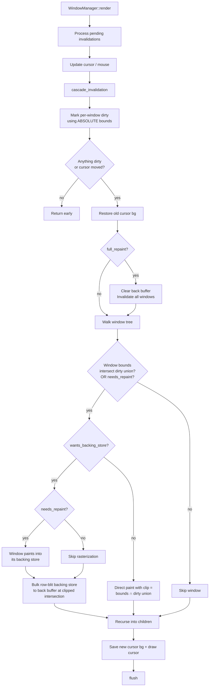

## Summary

Two-phase rendering refactor in one plan. Phase 1 makes the existing dirty-tracking infrastructure load-bearing by overriding the per-pixel image blit path on `DoubleBufferedDevice`, fixing two latent bugs in `DirtyRectManager` and `WindowManager::render`, intersecting clip rects with the dirty union, skipping `paint()` on windows that don't need it, and replacing `mark_full_repaint` on drag/resize with a bounds-union dirty mark. Phase 2 introduces an opt-in `Window` trait surface and extends the existing-but-unused `WindowBuffer` struct as a framebuffer-native backing store; `DesktopWindow` is the first and only initial opt-in, so dragging or moving the cursor over the wallpaper becomes a row `memcpy` from the cached store rather than re-rasterizing the BMP.

---

## Problem Frame

After PR #11 (wallpaper) landed, redraws feel ~5fps to the user — worst on drag/resize, secondarily on cursor-over-wallpaper. The proximate cause is that `GraphicsDevice::draw_image_scaled`'s default implementation walks every destination pixel through `draw_pixel`, and `DoubleBufferedDevice::draw_pixel` re-acquires the back-buffer mutex per pixel — ~786k locks per 1024×768 wallpaper paint. The deeper structural issue is that the dirty-tracking infrastructure already in place is not load-bearing:

- `WindowManager::render_window_tree_with_offset_propagate` (`src/window/manager.rs:715`) calls `paint()` on every visible window every frame, with the clip rect set to *window bounds*, not the intersection with the dirty union. So even a cursor jiggle (which only adds tiny dirty rects to wake the renderer) re-blits the wallpaper end-to-end.
- Drag and resize call `compositor.dirty.mark_full_repaint()` per cursor tick (`manager.rs:824, 861`), forcing the entire screen — wallpaper included — to repaint at drag rate.
- `DirtyRectManager::dirty_regions()` (`src/graphics/compositor.rs:189`) returns `None` immediately when `force_full_repaint` is true. Today it has zero callers, but any code that *would* iterate dirty rects to clip drawing would silently skip work on the full-repaint branch.
- `WindowManager::render` (line 638-644) marks dirty using `window.bounds()` — local coordinates — for every window. For top-level windows local equals global, but for nested windows this is a latent bug that would defeat dirty-clipping.

Once dirty tracking is load-bearing, the wallpaper repaint cost remains because each desktop paint still re-parses the BMP and walks every pixel. The hybrid compositor turns that into a `memcpy` from a pre-rasterized backing store; subsequent drag ticks pay only the cost of moving bits, not re-creating them.

---

## Target Outcomes

- Drag the terminal frame across the wallpaper at typical mouse speed without a visible trail or multi-frame lag.
- Cursor movement over the wallpaper does not perceptibly stutter when no window content is changing.
- The wallpaper PR no longer feels like a regression vs. the pre-wallpaper solid-blue desktop.
- Tested proxy: zero `paint()` calls on windows whose absolute bounds don't intersect any dirty rect and whose `needs_repaint()` is false during a render pass.

---

## Requirements

Carried from origin (see origin: `docs/brainstorms/2026-05-09-rendering-perf-compositor-requirements.md`). Cross-cutting fixes ship first as a discrete change before the compositor variant.

**Cross-cutting tactical fixes (Phase 1)**

- R1. `DoubleBufferedDevice` overrides `draw_image` and `draw_image_scaled` with a bulk row-oriented blit path that takes the back-buffer lock once per call (or once per row, depending on borrow shape).
- R2. The `DoubleBufferedDevice` bulk-primitive lock pattern is verified — no remaining primitive takes the lock per pixel. *(Research finding: `fill_rect` and `draw_line` are already correct; this collapses to a verification + commentary unit, not new code.)*
- R3. The renderer skips `paint()` on a visible window whose absolute bounds do not intersect any dirty rect *and* whose `needs_repaint()` is false. Either condition triggering keeps the paint.
- R4. When the renderer calls `paint()`, the active clip rect is the intersection of the window's absolute bounds and the union of dirty rectangles, not the bounds alone.
- R5. Drag and resize stop calling `mark_full_repaint`. They mark the union of (old window bounds, new window bounds) dirty, plus any newly-exposed area from sibling/desktop background (cascade invalidation handles propagation to overlapping siblings).

**Hybrid opt-in compositor (Phase 2)**

- R6. The `Window` trait gains an opt-in flag (default false) plus a getter for the cached pixels. Existing windows continue direct-to-back-buffer painting unchanged.
- R7. `DesktopWindow` opts in. On invalidation, it pre-rasterizes its scaled wallpaper into the backing store once; subsequent paints are bulk row blits.
- R8. The renderer recognizes the opt-in flag: opted-in windows are blitted from their backing store; non-opted windows go through the R3/R4-improved direct-paint path.
- R9. For an opted-in window, position changes (drag) and z-order changes do **not** invalidate the backing store. Only content invalidation re-renders into it.
- R10. The backing store is allocated/rasterized lazily on first paint after invalidation.
- R11. When an opted-in window resizes, its backing store is replaced/regenerated correctly (no stale pixels at new edges).

**Behavior preservation**

- R12. Cursor save/restore continues against the direct-framebuffer adapter; cursor is not part of the compositor backing-store flow.
- R13. `TextWindow`'s existing dirty-cell tracking continues unchanged. Non-opted in this model.
- R14. Modal dialogs, popup menus, and the menu-bar popup flow continue to work; first-paint and close paths may still force a full repaint where needed, but steady-state benefits from R3/R4.

---

## Key Technical Decisions

- **Backing-store storage format: framebuffer-native raw bytes**, not canonical RGBA. The adapter's `pixel_format` (`Rgb` or `Bgr`, 3 written bytes per 4-byte pixel slot) is queried at backing-store construction time. Rationale: the per-frame blit becomes pure row `memcpy` matching the existing `swap_region` pattern in `DoubleBufferedFrameBuffer`. Conversion happens once during rasterization, not per-frame.

- **Backing-store home: extend the existing unused `WindowBuffer` struct** in `src/window/graphics.rs:147` rather than introduce a new type. The struct already has `pixels`, `width`, `height`, and `dirty_region` fields — the extension swaps `Vec<u32>` for `Vec<u8>` (raw bytes) and adds a pixel-format field plus regen API.

- **Trait shape for opt-in: split into two methods.** `Window::wants_backing_store(&self) -> bool` (default false) is the cheap query the renderer makes per frame; `Window::backing_store(&self) -> Option<&WindowBuffer>` exposes the cached pixels for blitting. The window owns its buffer; the compositor only reads.

- **Resize policy: lazy regenerate on first paint after invalidation.** The brainstorm flagged this as a deferred decision. Origin's option (a) — keep the buffer at max-screen size and clip — wastes ~3 MiB always. Option (b) — re-rasterize on resize — accepts an occasional resize stutter. The desktop is the only initial opt-in, and desktop resizes happen at boot (when the framebuffer is first probed) plus on theoretical future runtime resolution change; the stutter is acceptable. Future opt-ins can override the policy if needed.

- **Acceptance proxy committed: `paint()` call count per render pass.** A test asserts that during a render pass driven only by cursor-position dirty rects, no window's `paint()` is called when its absolute bounds don't intersect any dirty rect and `needs_repaint()` is false. This is the testable handle on R3 and the user-visible "cursor smooth" target. Wall-clock dragging-over-wallpaper smoothness remains the manual verification target.

- **R2 reduces to a verification pass, not a code change.** Research confirmed `DoubleBufferedDevice::fill_rect` already takes one lock per call (`adapters/double_buffered.rs:141`). `draw_line` likewise. The only per-pixel-locked primitives are `draw_image{,_scaled}` (default trait impls), which R1 fixes. R2 stays as a verification unit so the audit is recorded.

- **Two foundational fixes ship inside Phase 1 to enable the rest:** the `DirtyRectManager::dirty_regions()` iterator bug (zero callers today, but required for R3/R4) and `WindowManager::render`'s use of local-instead-of-absolute bounds when marking dirty (latent bug, would silently miscompute child-window dirty rects under R3/R4). Both land before the renderer changes that depend on them.

- **Test posture: characterization-first for renderer behavior.** Research found no existing tests cover `WindowManager::render` directly. Phase 1 introduces a small fake `GraphicsDevice` (modeled on the existing `RecordingDevice` in `src/tests/desktop_window.rs` and `GridDevice` in `src/tests/graphics_device_image.rs`) and writes characterization tests for the current renderer behavior alongside the changes that modify it. Without this, R3/R4/R5 are landing into untested code.

---

## High-Level Technical Design

*This illustrates the intended approach and is directional guidance for review, not implementation specification. The implementing agent should treat it as context, not code to reproduce.*

### Render-pass control flow after Phase 1 + Phase 2



### `WindowBuffer` extension shape

```text
struct WindowBuffer:
  pixels:        Vec<u8>           // framebuffer-native raw bytes, length = h * stride * bpp
  width:         usize
  height:        usize
  pixel_format:  PixelFormat       // sourced from the adapter at construction
  bytes_per_px:  usize
  stride_pixels: usize             // for row-stride calculations during blit

methods:
  resize_for(target_w, target_h, format, bpp, stride)  // U7 — reallocates if dimensions changed
  pixel_row_ptr(y) -> *const u8                        // for ptr::copy_nonoverlapping at blit time
  pixel_row_mut(y) -> *mut u8                          // for rasterization
```

### Two paint paths, one renderer

```text
For each visible window in render-tree order:
  abs_bounds = local_bounds + parent_offset
  needs_paint = window.needs_repaint() OR abs_bounds intersects any dirty rect
  if not needs_paint: continue

  if window.wants_backing_store():
      if window.needs_repaint():
          window.paint_into_backing_store()           // window writes own pixels
      compositor.blit_rows(window.backing_store(),    // pure memcpy per row
                           dst = back_buffer,
                           clip = abs_bounds ∩ dirty_union)
  else:
      device.set_clip_rect(abs_bounds ∩ dirty_union)
      window.paint(device)                            // existing direct-paint path
```

---

## Output Structure

No new directories. Existing files modified:

```
src/
├── drivers/
│   └── display/
│       └── double_buffer.rs        (no change — patterns reused)
├── graphics/
│   ├── compositor.rs               U2: fix dirty_regions iterator
│   └── images/                     (no change)
├── tests/
│   ├── compositor.rs               (NEW) U2 tests
│   ├── window_manager_render.rs    (NEW) U4, U5, U9 tests + fake device
│   ├── window_buffer.rs            (NEW) U7 tests
│   ├── desktop_backing_store.rs    (NEW) U8 tests
│   └── mod.rs                      register new test modules
└── window/
    ├── adapters/
    │   └── double_buffered.rs      U1: bulk image blit overrides
    ├── graphics.rs                 U7: extend WindowBuffer
    ├── manager.rs                  U3, U4, U5, U9
    ├── mod.rs                      U6: trait additions
    └── windows/
        └── desktop.rs              U8: opt-in implementation
```

---

## Implementation Units

### U1. Bulk row-oriented image blit overrides on `DoubleBufferedDevice`

- **Goal**: Override the per-pixel `draw_image` and `draw_image_scaled` defaults on the double-buffered adapter with a single-lock-per-call (or per-row) bulk path.
- **Requirements**: R1, R2 (verification commentary).
- **Dependencies**: none.
- **Files**:
  - `src/window/adapters/double_buffered.rs` (modify)
  - `src/tests/graphics_device_image.rs` (extend — add adapter-level tests alongside existing `GridDevice` defaults tests)
- **Approach**: Add `draw_image` and `draw_image_scaled` impls to the `DoubleBufferedDevice`'s `GraphicsDevice` impl. Each acquires the back-buffer mutex once. Inner loop walks rows, computes source-row pointer in image and destination-row pointer in back buffer, clips per-row against the active `clip_rect` and device bounds via the existing `clip.rs` helpers, then writes pixels using the same row-oriented logic the inner `DoubleBufferedFrameBuffer::draw_image{,_scaled}` already uses. Where source format matches framebuffer format, prefer `core::ptr::copy_nonoverlapping` per row; otherwise per-pixel byte assembly inside the same lock. Existing `DoubleBufferedFrameBuffer::draw_image` (`src/drivers/display/double_buffer.rs:283`) and `swap_region` (line 256) are the templates.
- **Patterns to follow**: `DoubleBufferedFrameBuffer::swap_region` for row memcpy; `src/window/adapters/clip.rs` (`clip_rect`, `pixel_visible`) for clip handling; existing `fill_rect` impl for one-lock-per-call shape.
- **Test scenarios**:
  - `DoubleBufferedDevice::draw_image` with no clip rect produces byte-identical output to the per-pixel default for the same source `BmpImage` (compare against `GridDevice` reference).
  - `DoubleBufferedDevice::draw_image_scaled` upscaled and downscaled cases produce byte-identical output to the per-pixel default.
  - With a clip rect set that intersects the image, only pixels inside the clip rect are written (read back via `read_pixel`).
  - With a clip rect set that does not intersect the image, no pixels are written (back buffer unchanged).
  - Image fully off-screen (negative `x` or `y` past `device.width()`) writes no pixels and does not panic.
  - Zero-dimension image and zero-dimension scale arguments early-return without locking.
- **Verification**: Cargo tests pass. Bulk-blit overrides reduce the back-buffer lock count for a 1024×768 wallpaper paint from ~786k to 1 (or `height`).

### U2. Fix `DirtyRectManager::dirty_regions()` iterator

- **Goal**: Make `dirty_regions()` yield a synthetic full-screen rect when `force_full_repaint` is true, instead of returning `None` and silently dropping work. Required before any caller (U4) can use the iterator.
- **Requirements**: foundational for R3, R4.
- **Dependencies**: none.
- **Files**:
  - `src/graphics/compositor.rs` (modify)
  - `src/tests/compositor.rs` (NEW)
  - `src/tests/mod.rs` (register module)
- **Approach**: In the `DirtyRegionIter::next` impl, on the `force_full_repaint` branch, on first call yield a single rect covering `(0, 0, screen_width, screen_height)`; on subsequent calls return `None`. Remove the `// We'll handle this differently in practice` comment. Verify `bounding_box()` and `dirty_regions()` agree on what's covered.
- **Patterns to follow**: existing iterator state machine (`returned_full` field already exists for this purpose).
- **Test scenarios**:
  - Empty manager: `dirty_regions()` yields nothing.
  - After `mark_dirty(r)` once: yields exactly `r` (clamped to screen).
  - After two non-overlapping `mark_dirty` calls: yields both rects.
  - After `mark_full_repaint()`: yields exactly one rect equal to the screen bounds (the bug fix).
  - After `mark_dirty(r)` then `mark_full_repaint()`: yields one full-screen rect, the per-region list is cleared.
  - After `clear()`: yields nothing again, `force_full_repaint` is false.
- **Verification**: Tests pass. `bounding_box()` agrees with the iterator's covered area in every case.

### U3. Mark dirty using absolute bounds in `WindowManager::render`

- **Goal**: Fix the latent bug at `manager.rs:638-644` where `window.bounds()` (local coordinates) is passed to `compositor.dirty.mark_dirty`. Use absolute bounds via the parent-offset walk.
- **Requirements**: foundational for R3, R4 (dirty-clipping correctness for nested windows).
- **Dependencies**: U2 (so a corrected iterator is available alongside).
- **Files**:
  - `src/window/manager.rs` (modify)
  - `src/tests/window_manager_render.rs` (NEW — start of file; characterization tests + fake device, extended by U4/U5/U9)
  - `src/tests/mod.rs` (register module)
- **Approach**: Reuse the existing `collect_render_order` helper (`manager.rs:414`) which already computes absolute bounds. Iterate `(id, abs_bounds)` pairs and mark dirty only when `window.needs_repaint()` is true, using `abs_bounds`. Add a small in-tree fake `GraphicsDevice` test fixture (`RecordingDevice`-style) that records `paint` calls per window and the clip rects in effect, plus a fixture builder that constructs a parent + child window tree with known offsets.
- **Patterns to follow**: `collect_render_order`/`collect_render_order_recursive` already in `manager.rs`; `RecordingDevice` in `src/tests/desktop_window.rs:18`; `GridDevice` in `src/tests/graphics_device_image.rs:20`.
- **Execution note**: Add the test fixture (fake device + tree builder) and characterization tests for the *pre-fix* behavior in the same change as the fix. The fixture is reused by U4 and U5.
- **Test scenarios**:
  - Top-level window dirty marking is unchanged (its local bounds equal absolute bounds).
  - Child window with `needs_repaint() == true`, parent at `(100, 50)`, child at local `(10, 20)`: dirty rect is registered at absolute `(110, 70)`, not local `(10, 20)`.
  - Two children at non-overlapping local positions both register at distinct absolute positions.
  - A `needs_repaint() == false` window does not register a dirty rect regardless of position.
- **Verification**: Tests pass. Existing kernel test suite still green.

### U4. Renderer dirty-clipping + skip-paint

- **Goal**: In `render_window_tree_with_offset_propagate`, skip `paint()` for windows that don't intersect any dirty rect and don't have `needs_repaint()`. For windows that do paint, set the clip rect to (absolute bounds ∩ dirty union).
- **Requirements**: R3, R4.
- **Dependencies**: U2 (iterator works), U3 (dirty rects are absolute).
- **Files**:
  - `src/window/manager.rs` (modify `render_window_tree_with_offset_propagate`)
  - `src/tests/window_manager_render.rs` (extend with skip-paint and clip-intersection tests)
- **Approach**: Compute the dirty-union rect once before the tree walk (cache on the manager or thread through). For each visible window, after computing absolute bounds, decide `should_paint = window.needs_repaint() || abs_bounds.intersects(dirty_union)`. If true, set `clip_rect = abs_bounds ∩ dirty_union` (when not full-repaint) or `clip_rect = abs_bounds` (when full-repaint). If false, skip the paint call but still recurse into children — they may individually need paint. The `parent_was_repainted` propagation flag stays as a back-stop: when a parent did paint over its background, children must paint regardless of dirty rect. Full-repaint branch keeps current behavior (clip = bounds, all windows paint).
- **Patterns to follow**: existing `parent_was_repainted` pattern; `Rect::intersects` and `Rect::union` already in `src/window/types.rs`.
- **Test scenarios**:
  - **Covers AE2.** Cursor-only render pass: only cursor padding rects marked dirty, no window has `needs_repaint() == true`. Assert `paint()` is called zero times across all windows.
  - Window A at `(0, 0, 200, 200)` has `needs_repaint() == false`, dirty rect at `(300, 300, 50, 50)` (no intersection): A's `paint()` is not called.
  - Window A as above, dirty rect at `(150, 150, 100, 100)` (overlaps A): A's `paint()` is called with clip rect equal to `(150, 150, 50, 50)` — the intersection — not A's bounds.
  - Window A with `needs_repaint() == true`, no dirty rects: A's `paint()` is called with clip rect equal to A's bounds (or full-screen, since full-repaint will be set when nothing else is dirty — verify the actual behavior matches one of these and document).
  - Full-repaint branch: every visible window's `paint()` is called with clip equal to its absolute bounds.
  - Parent paints, child has `needs_repaint() == false` and doesn't intersect dirty: child still paints because `parent_was_repainted` is true (regression guard for PR #7's behavior).
- **Verification**: Tests pass. Manual smoke: cursor over wallpaper visibly smoother than baseline.

### U5. Drag and resize use bounds-union dirty marking

- **Goal**: Replace `mark_full_repaint` calls in `handle_dragging` (`manager.rs:824` and `:861`) with `mark_dirty(old_bounds.union(&new_bounds))`. Cascade invalidation already propagates to overlapping siblings, so newly-exposed sibling/desktop area falls out naturally.
- **Requirements**: R5.
- **Dependencies**: U3, U4 (dirty-clipping must be working so the union actually limits work; without it, marking less dirty has no effect since paint walks every window anyway).
- **Files**:
  - `src/window/manager.rs` (modify `handle_dragging`'s `Dragging` and `Resizing` arms)
  - `src/tests/window_manager_render.rs` (extend with drag/resize tests)
- **Approach**: In the `Dragging` arm, when the position changes, replace `self.compositor.dirty.mark_full_repaint()` with two calls to `mark_dirty` for old and new bounds (or one call with the union). The dirty manager's existing area-threshold heuristic will still escape to full repaint when the union exceeds 50% of screen — that's the correct behavior. Same change in `Resizing`. The dragged window already calls `win.invalidate()` so it will paint; sibling/desktop windows whose bounds intersect the union will paint via U4's intersect logic.
- **Patterns to follow**: existing `cascade_invalidation` (PR #7) handles sibling propagation; `Rect::union` already in types.
- **Test scenarios**:
  - **Covers AE1.** Drag tick moving a 200×200 window from `(100, 100)` to `(120, 100)`: dirty rects after the tick contain (or are contained by) the union `(100, 100, 220, 200)`; no full-repaint flag set.
  - Drag tick that does not change position: `mark_dirty` is not called, dirty manager is unchanged.
  - Resize tick: dirty union covers old and new bounds; cascade invalidation marks an overlapping background sibling dirty so it repaints under the newly-exposed area.
  - Drag of a very large window (covering >50% of screen): dirty manager still escapes to full repaint via the area threshold (regression guard for `FULL_REPAINT_THRESHOLD`).
  - Drag of a frame window whose old bounds and new bounds don't overlap: both bounds are marked dirty, cascade invalidation reaches the desktop background.
- **Verification**: Tests pass. Manual smoke: dragging the terminal frame across the wallpaper feels smooth and leaves no trail.

### U6. Add `Window` trait opt-in surface

- **Goal**: Add `wants_backing_store(&self) -> bool` (default false) and `backing_store(&self) -> Option<&WindowBuffer>` (default None) to the `Window` trait. Optionally add `paint_into_backing_store(&mut self)` if double-dispatch is needed; otherwise keep rasterization private to each opting-in window.
- **Requirements**: R6.
- **Dependencies**: none (the trait additions don't change any existing behavior).
- **Files**:
  - `src/window/mod.rs` (extend `Window` trait)
  - `src/tests/window_manager_render.rs` (extend with default-impl regression tests)
- **Approach**: Add the trait methods with default impls returning `false` and `None`. Verify the trait is still object-safe (`dyn Window` is used throughout). The `paint_into_backing_store(&mut self)` decision: simplest shape is to keep rasterization an internal detail of each opt-in window — `DesktopWindow` rasterizes from its `paint(device)` impl, but only when the device given is a `WindowBuffer`-backed adapter. The cleaner and chosen shape is a dedicated trait method. Decide between these in the unit; lean toward a dedicated method for clarity.
- **Patterns to follow**: existing default-impl pattern in `Window` trait (`set_bounds_no_invalidate`, `window_title`, `poll_pending_popup`, etc.).
- **Test scenarios**:
  - Default `wants_backing_store()` returns `false` for `FrameWindow`, `TextWindow`, `TerminalWindow`, `ContainerWindow`, and one menu/dialog type as a sanity check.
  - Default `backing_store()` returns `None` for the same.
  - Trait remains object-safe: `&dyn Window` calls compile and run.
- **Verification**: Build green; no existing window's behavior changes.

### U7. Extend `WindowBuffer` for backing-store role

- **Goal**: Repurpose the unused `WindowBuffer` struct in `src/window/graphics.rs:147` to hold framebuffer-native raw pixel bytes plus a `pixel_format`, with allocation/regen API for resize.
- **Requirements**: R10, R11 (plumbing).
- **Dependencies**: none.
- **Files**:
  - `src/window/graphics.rs` (modify `WindowBuffer`)
  - `src/tests/window_buffer.rs` (NEW)
  - `src/tests/mod.rs` (register module)
- **Approach**: Replace the current `pixels: Vec<u32>` field with a `Vec<u8>` of raw framebuffer bytes (length = `height * stride_pixels * bytes_per_pixel`). Add `pixel_format: PixelFormat`, `bytes_per_pixel: usize`, `stride_pixels: usize`. Add a constructor that takes target dimensions plus the device's pixel format. Add a `resize_to(width, height)` method that reallocates if dimensions changed and returns whether reallocation happened. Add helpers `row_ptr(y)` / `row_mut(y)` returning byte slices for the row, and a `write_pixel(x, y, Color)` helper that respects `pixel_format` (mirrors how `DoubleBufferedFrameBuffer::draw_pixel` writes the 3 color bytes). Keep `dirty_region` field for future use; leave it unused in this plan.
- **Patterns to follow**: `DoubleBufferedFrameBuffer` field layout (`stride`, `bytes_per_pixel`, `pixel_format`); pixel write logic at `src/drivers/display/double_buffer.rs:89-105` for byte ordering.
- **Test scenarios**:
  - `WindowBuffer::new(w, h, PixelFormat::Rgb, 4)` allocates `h * w * 4` bytes (assuming stride == width when not specified).
  - `write_pixel(x, y, Color::new(r, g, b))` with `PixelFormat::Rgb` writes bytes `[r, g, b, _]` at the correct byte offset.
  - Same with `PixelFormat::Bgr` writes `[b, g, r, _]`.
  - `resize_to(w, h)` with same dimensions does not reallocate (returns false).
  - `resize_to(w, h)` with different dimensions reallocates and zeroes the buffer (returns true).
  - `row_ptr(y)` returns a slice of length `width * bytes_per_pixel`.
- **Verification**: Tests pass. No callers exist yet (U8 wires the first one).

### U8. `DesktopWindow` opts in to a backing store

- **Goal**: `DesktopWindow` returns `true` from `wants_backing_store`. On invalidation, it rasterizes its scaled wallpaper (or solid-blue fallback) into the backing store once. Subsequent paints reuse the cached pixels.
- **Requirements**: R7, R10, R11.
- **Dependencies**: U6 (trait method), U7 (`WindowBuffer` extension).
- **Files**:
  - `src/window/windows/desktop.rs` (modify)
  - `src/tests/desktop_backing_store.rs` (NEW)
  - `src/tests/mod.rs` (register module)
- **Approach**: Add a `backing_store: Option<WindowBuffer>` field to `DesktopWindow`. Implement `wants_backing_store() -> true`. Implement `backing_store(&self)` to return the optional reference. Add a `paint_into_backing_store` (or rasterize-in-paint) method: when called, allocate or resize the backing store to current bounds, parse the BMP once, walk every backing-store pixel writing the nearest-neighbor scaled wallpaper color via `WindowBuffer::write_pixel`. The fallback path (no wallpaper or parse failure) fills the buffer with solid blue. Track which wallpaper bytes were rasterized so resize triggers re-rasterization but no-content-change does not. After rasterization, the per-frame paint is just the compositor blitting from the buffer (handled in U10). The window's existing `paint(device)` path stays callable for the not-opted-in fallback case if needed (e.g., when no compositor backing-store path is available — but with U10 wired, that branch is unreachable).
- **Patterns to follow**: existing `DesktopWindow::paint` BMP parsing logic (`src/window/windows/desktop.rs:68-106`) — the rasterization is essentially that loop, written into the backing store instead of through `device.draw_image_scaled`.
- **Test scenarios**:
  - **Covers AE3.** After construction with wallpaper bytes, `paint_into_backing_store()` is called once: the backing store contains the rasterized scaled wallpaper. A subsequent `paint_into_backing_store()` call without `invalidate()` does nothing (parse counter unchanged).
  - After `invalidate()`, the next `paint_into_backing_store()` re-rasterizes (parse counter increments).
  - **Covers AE5.** After `set_bounds(new_bounds)` with different dimensions, the next `paint_into_backing_store()` reallocates the backing store to the new size and rasterizes correctly (no stale pixels at edges).
  - With no wallpaper provided (constructor without bytes), `paint_into_backing_store()` fills the buffer with solid `Color::new(0, 50, 100)`.
  - With malformed wallpaper bytes (BMP parse fails), `paint_into_backing_store()` falls back to solid blue and does not panic.
  - `wants_backing_store()` returns `true`; `backing_store()` returns `Some(_)` after first rasterization, `None` before.
- **Verification**: Tests pass. Boot under QEMU still shows the correct wallpaper.

### U9. Compositor blit-from-backing-store path

- **Goal**: In `render_window_tree_with_offset_propagate`, branch on `window.wants_backing_store()`. Opted-in windows: invoke rasterize-if-needed, then bulk row-blit the backing store to the back buffer at the dirty intersection. Non-opted: existing U4 path.
- **Requirements**: R8, R9.
- **Dependencies**: U4, U6, U7, U8.
- **Files**:
  - `src/window/manager.rs` (modify renderer)
  - `src/tests/window_manager_render.rs` (extend)
- **Approach**: Inside the renderer, after the should-paint decision, branch on `wants_backing_store()`. For opt-in windows, only call the rasterize hook when `needs_repaint()` is true (so drag/z-order changes don't re-rasterize — R9). Then read the backing store and bulk-blit row-by-row from the store to the back buffer, clipping each row against (window absolute bounds ∩ dirty union ∩ device bounds). Use the existing clip helpers; mirror the inner loop shape from `DoubleBufferedFrameBuffer::swap_region`. The blit goes through a new `GraphicsDevice` method (e.g., `blit_buffer(x, y, &WindowBuffer)`) that the `DoubleBufferedDevice` adapter overrides with `ptr::copy_nonoverlapping` per row, with the trait providing a per-pixel default for completeness. Set `self.dirty = true` on the adapter so `flush()` swaps. For non-opted windows, take the U4 path unchanged.
- **Patterns to follow**: `DoubleBufferedFrameBuffer::swap_region` for the row memcpy; `clip_rect` from `clip.rs` for clip handling; existing `GraphicsDevice` override convention from U1.
- **Test scenarios**:
  - **Covers AE1.** Drag of a 400×300 frame window from `(100, 100)` over the wallpaper-backed desktop: `DesktopWindow::paint_into_backing_store` is called zero times during the drag (count parse calls). The dragged frame is still painted at its new position. Pixels under the old position are restored to wallpaper content via the desktop's blit path.
  - **Covers AE3.** Two consecutive cursor-only render passes after the desktop has rasterized once: zero additional rasterizations. The desktop's blit path runs only when the cursor's dirty rects intersect the desktop's bounds (which they always do, since the desktop is full-screen) — but blit cost is bounded by the dirty union, not the full screen.
  - **Covers AE4.** A `TextWindow` that hasn't opted in continues to be painted via the direct path with the U4 clip-intersect applied. The blit-from-backing-store path is not taken for TextWindow.
  - The desktop's first paint (after construction or `invalidate`) rasterizes, then blits. Subsequent paints in the same render pass do not re-rasterize.
  - With clip rect set to a 50×50 area inside the desktop, only those 50×50 bytes are blitted from the backing store (verify via `read_pixel` on the rest of the back buffer that they're unchanged from prior state).
- **Verification**: Tests pass. Boot under QEMU: desktop wallpaper renders correctly, dragging the terminal does not leave a trail and feels smooth, cursor over wallpaper does not stutter.

---

## Acceptance Examples (carried from origin)

- AE1. **Covers R1, R3, R4, R5; tests in U1, U4, U5, U9.** Given the kernel is booted with the wallpaper visible and a terminal frame at `(100, 50)`. When the user drags the title bar 200 pixels to the right over 200ms, no individual frame's paint pass re-blits the entire wallpaper; only the strip between old and new bounds plus the new frame area is repainted.
- AE2. **Covers R3, R4, R12; tests in U4.** Given the kernel is at idle desktop with the cursor visible. When the user moves the mouse with no buttons pressed and no window content changing, no window's `paint()` method is called for the duration of the move; only cursor save/restore runs.
- AE3. **Covers R7, R9; tests in U8, U9.** Given the desktop has finished pre-rasterizing the wallpaper into its backing store. When the wallpaper-display state has not changed, every subsequent desktop paint reads only from the cached backing store; the BMP parse / scale path runs zero additional times.
- AE4. **Covers R6, R8, R13; tests in U6, U9.** Given a `TextWindow` that has not opted in to a backing store. When `needs_repaint()` is true, the window is painted directly to the back buffer via the existing path with the U4 dirty-rect clip applied.
- AE5. **Covers R11; tests in U8.** Given an opted-in window with a 400×300 backing store. When the window is resized to 600×400, the window paints correctly (no stale pixels, no garbage at the new edges) on the next frame.

---

## Scope Boundaries

### In scope
- Phase 1 + Phase 2 implementation as specified above.
- Test file additions: `compositor.rs`, `window_manager_render.rs`, `window_buffer.rs`, `desktop_backing_store.rs` under `src/tests/`.
- Extending the `Window` trait with two default-implemented methods.
- Repurposing the existing unused `WindowBuffer` struct.

### Deferred to Follow-Up Work
- Adapter-specific override of `draw_text` for bulk glyph blending (per-pixel via `read_pixel`/`draw_pixel` today; not currently a measured bottleneck).
- Additional windows opting into backing stores (only `DesktopWindow` in this plan).
- Broader `WindowManager` test coverage beyond what these units strictly need.
- Removing the legacy `core_gfx::Graphics::draw_image` and `DoubleBufferedFrameBuffer::draw_image` paths used by the shell BMP hack.
- A wall-clock per-frame instrumentation harness (e.g., timestamped frame log under `cfg(feature = "test")`).
- Always-max-screen-sized backing store as an alternative to the lazy-resize policy, if a future profiling pass shows resize stutter is real.

### Out of scope
- Variant 2: per-window backing stores for *all* windows.
- Translucency, drop shadows, anti-aliased text spilling outside window bounds.
- GPU acceleration / VirtIO-GPU / hardware blit.
- Animations, transitions, fade effects.
- Per-window snapshot or screenshot APIs.
- Sub-pixel or fractional wallpaper scaling.
- Multi-screen support, runtime resolution changes.
- `TextWindow` opting in (would duplicate dirty-cell tracking).
- PNG decompression.

---

## Risks & Mitigations

- **Risk**: Switching `WindowManager::render` to use absolute bounds for dirty marking (U3) regresses some currently-working flow that relied on the local-bounds behavior. **Mitigation**: characterization tests landed in U3 capture the existing renderer behavior with both top-level and nested windows; the bounds shift is verified to produce identical results for top-level (where local == absolute) and corrected results for nested windows.
- **Risk**: U4's skip-paint logic misses an invalidation case and a window doesn't repaint when it should, leaving stale pixels. **Mitigation**: the OR with `needs_repaint()` is preserved as an escape hatch — any code path that calls `invalidate()` still triggers a paint regardless of dirty rect intersection. The `parent_was_repainted` propagation flag from PR #7 also stays.
- **Risk**: Backing-store byte format mismatch with the framebuffer's actual pixel format produces garbage pixels on the screen. **Mitigation**: U7's constructor takes the `pixel_format` from the adapter (not hard-coded). U8's rasterization writes through `WindowBuffer::write_pixel`, which respects the format. The blit path in U9 is a same-format `memcpy` — by construction, the backing store and back buffer are in identical formats.
- **Risk**: Heap pressure from a 3 MiB backing store at desktop init. **Mitigation**: heap is 100 MiB and live by the time `init_guishell` runs; existing `DesktopWindow` already heap-allocates the BMP bytes plus the parse working set. Net delta is one buffer.
- **Risk**: Resize regenerating the backing store on every drag tick during a window resize causes visible stutter. **Mitigation**: only the *desktop* opts in here, and desktop resizes are not user-driven (no resize handle on the desktop). Future opt-ins that do support runtime resize can override the regen policy.
- **Risk**: U2 (iterator fix) changes behavior in a code path that has zero callers today, but `bounding_box()` and the iterator might disagree in corner cases. **Mitigation**: tests in U2 pin both APIs to the same coverage in every state combination.

---

## Dependencies / Assumptions

- The double-buffered adapter's `pixel_format` is fixed at boot and does not change at runtime. (Verified via the bootloader info; confirmed by current code.)
- The heap is up before `init_guishell` runs and any heap allocation in U7/U8 happens. (Verified — `kernel.rs:43` initializes heap before `kernel.rs:116` `init_guishell`.)
- `cascade_invalidation` (PR #7) correctly propagates dirty state to overlapping siblings when given absolute bounds. (Existing behavior; U5 relies on it.)
- Existing tests under `src/tests/` register via `get_tests()` static slices; new test modules follow the same pattern (no `Vec` in the registration path, since some tests run before heap init).
- The `Rect::intersects`, `Rect::union`, `Rect::overlaps`, `Rect::contains_point` methods on `src/window/types.rs` are sufficient for clip-intersection arithmetic. To be confirmed during U4 — if a needed primitive is missing, add it as part of U4.

---

## Outstanding Questions

### Resolve Before Planning

(none)

### Deferred to Implementation

- *[Affects U6][Technical]* Whether `paint_into_backing_store` lives as a dedicated `Window` trait method or as an internal detail of each opting-in window. Lean toward a dedicated method for clarity, but final shape can be decided when wiring U8 + U9 together — whichever shape produces the least friction at the call site.
- *[Affects U7][Technical]* Stride policy for the backing store: tightly packed (`stride = width`) vs. matching the framebuffer's stride (which may be larger for alignment). Lean toward tightly packed since the blit path uses per-row copy with explicit byte counts; but if the framebuffer's stride differs and reading/writing per row gets awkward, mirror the framebuffer stride.
- *[Affects U9][Technical]* Whether the new `blit_buffer` device method belongs on `GraphicsDevice` itself or on a narrower compositor-internal trait. Adding it to `GraphicsDevice` is consistent with the existing `draw_image` shape; a narrower trait would avoid forcing direct-framebuffer-only adapters to implement it. Decide when implementing U9 — most likely on `GraphicsDevice` with a per-pixel default.
- *[Affects success criteria][Needs research]* If perceived smoothness still falls short after Phase 2 lands, consider adding a simple `cfg(feature = "test")` instrumentation (a per-frame timestamp counter visible to a manual `bench` test) to get wall-clock numbers without polluting release builds.
