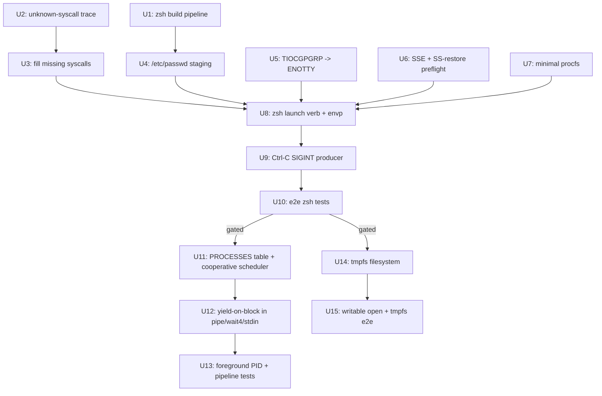

# feat: Run static-musl zsh interactively on AgenticOS

## Summary

Compile zsh statically against musl in a new `userland/apps/zsh/` (mirroring `userland/apps/hello-cpp/`), discover and fill the missing syscall surface via a once-per-number unknown-syscall trace, stage a minimal `/etc/passwd` over the existing FAT host mount, and ship `ZSH.ELF` as a runnable shell that reaches an interactive prompt and executes single commands. Pipelines and persistent history are scoped in as gated phases that depend on a cooperative concurrent-fork primitive and a tmpfs respectively, but the merge bar for the foundational work is "interactive REPL with `zsh -f -i +m` runs `echo`/`ls`/`cd`/`pwd`/`exit` end-to-end."

---

## Problem Frame

PR #21 landed fork/execve/wait4, signals, pipes, and TTY termios — most of the kernel surface a real shell needs. The remaining work is a packaging-and-glue exercise (build pipeline, missing-syscall fill, `/etc/passwd`, envp, Ctrl-C delivery) gated by two architectural items that the PR #21 commit message explicitly flagged as follow-ups: synchronous-fork prevents pipelines, and the read-only FAT prevents `~/.zsh_history`. A real shell is the next demonstrable milestone for the userland — it converts the platform from "runs hello world" into "runs the program a developer actually wants to use."

The user-visible payoff matters: every shell command in AgenticOS today is a Rust module compiled into the kernel binary. Reaching a real zsh prompt makes the OS extensible in userland for the first time.

---

## Requirements

- R1. A new `userland/apps/zsh/` builds zsh statically against musl using the existing `MUSL_CC` cross-toolchain probe-and-warn pattern; absent toolchain produces a one-line warning, not a build failure.
- R2. `build.sh` and `test.sh` stage the resulting binary as `host_share/ZSH.ELF` (uppercase 8.3) and verify ET_EXEC via `readelf` before staging.
- R3. The kernel exposes a "trace mode" for unknown syscalls: log the first occurrence of each syscall number at info with arg dump, demote subsequent occurrences to trace, and return `-ENOSYS` instead of terminating the process.
- R4. The kernel implements (or stubs-correctly) the syscalls a static-musl zsh interactive startup observably needs: `poll`/`ppoll`, `pselect6`, `readlink`/`readlinkat`, `setitimer`, `prlimit64`, `getrlimit`, `nanosleep`. Pre-research confirms `rseq`, `set_robust_list` (main thread), `sigaltstack`, and `futex` are not exercised by `zsh -f -i` on musl x86_64.
- R5. `ioctl(TIOCGPGRP)` returns `-ENOTTY`, which causes zsh's `acquire_pgrp` to clear `MONITOR` automatically without requiring `+m` on the command line or build-time `--without-tcsetpgrp`.
- R6. `/etc/passwd` and `/etc/group` exist at canonical paths and parse cleanly via musl's `getpwuid_r`. Single-user `root:x:0:0::/root:/bin/zsh\n` plus `root:x:0:\n` is sufficient.
- R7. The shell launches zsh via a new `zsh` shell verb (or `run /HOST/ZSH.ELF -f -i`) with envp pre-seeded: `HOME=/root USER=root LOGNAME=root SHELL=/bin/zsh PATH=/HOST TERM=dumb`.
- R8. Ctrl-C in the foreground process raises SIGINT through the existing `signal_state` machinery, sourced from the terminal handler when `c_cc[VINTR]` matches and `ISIG` is set.
- R9. `enable_sse()` is verified to run before any ring-3 transition (regression protection — without it musl's `__init_tls` `#UD`s on the first SSE2 instruction).
- R10. The latent SS-restore bug in `restore_continuation` (called out as an open follow-up in the multi-MiB-load learning) is fixed before any signal-delivery or concurrent-fork work that could route through it.
- R11. End-to-end test loads `/host/ZSH.ELF` and asserts `zsh -c 'exit 0'` exits cooperatively; a second test asserts `zsh -c 'echo hi'` produces `hi\n` on stdout. Tests use the `crate::fs::exists("/host/ZSH.ELF")` skip-if-missing gate established by `test_fat_metadata_subdirectory_tolerated`.
- R12. (Gated, Phase D) A cooperative concurrent-fork primitive enables `cmd1 | cmd2` pipelines without changing the existing per-process address-space or kernel-stack model; yields occur only at well-defined syscall-boundary block points (empty pipe read, wait4 with no zombie, blocking stdin), never inside IDE PIO transactions.
- R13. (Gated, Phase E) A tmpfs mounted at `/tmp` and `/root` accepts the eight syscall ops zsh exercises against `~/.zsh_history` (open with O_CREAT|O_APPEND, read, write, lseek, close, fstat, unlink, rename), and the writable open path becomes FS-aware so FAT mounts continue to refuse writes.

---

## Scope Boundaries

- Real preemptive multitasking, SMP, or a proper scheduler. Phase D's cooperative concurrent fork is a scoped subset; full preemption stays a separate plan.
- Writable FAT driver. FAT remains read-only; tmpfs is the persistence answer.
- Dynamic linking, `ld-linux` interpreter, shared libraries. zsh stays statically linked.
- Real users/groups. UID/GID stays 0; `/etc/passwd` is a single-line static stub.
- Job control beyond `NO_MONITOR`-equivalent. No Ctrl-Z / fg / bg until job-control syscalls become real.
- Networking syscalls (sockets, getaddrinfo, etc.). Any zsh path that calls them returns `-ENOSYS`.
- Porting other shells (bash, dash, busybox) or vendoring a package manager.
- Real entropy. `AT_RANDOM` and `getrandom` remain deterministic; zsh's stack canary will be constant. Acceptable.
- Vendoring a terminfo database. `TERM=dumb` is the supported environment for Phase C; richer terminfo support is follow-up work.
- A SIGINT-from-keyboard kill-running-command experience that requires distinguishing "shell is reading a line" from "child is running" — the producer in U7 raises SIGINT on whichever process has the foreground tty handle, which is sufficient for the single-process and Phase-D pipeline cases but does not amount to full session/pgrp semantics.

### Deferred to Follow-Up Work

- Sharing the `host_share` staging block between `build.sh` and `test.sh` (today they're duplicated and have already drifted on whether ET_EXEC failure is hard or soft). Worth doing as a third app gets added but not required for this plan.
- FAT cluster-walk caching in `fat_table.rs`. Zsh + scripts will make this matter sooner than the C++ hello binary did, but it's an optimization, not a correctness requirement.
- A richer `/proc` (e.g., `/proc/self/maps`, `/proc/self/status`). Phase C's procfs is the bare minimum to satisfy `ttyname()`.
- Real entropy for `AT_RANDOM` / `getrandom`. Lives outside this plan's scope; pre-existing follow-up.
- Moving IDE off PIO to DMA or virtio-blk. Pre-existing follow-up; only becomes blocking if the cooperative scheduler's "don't yield mid-PIO" invariant becomes painful.
- Real session/process-group semantics, terminal foreground process group, true SIGTTIN/SIGTTOU enforcement.

---

## Context & Research

### Relevant Code and Patterns

- `userland/apps/hello-cpp/Makefile` — pattern for invoking the musl cross-toolchain from a non-Cargo app. 35 lines; `MUSL_GXX ?= x86_64-linux-musl-g++`, `LDFLAGS = -static -no-pie`, output to `build/hello-cpp`. zsh's Makefile mirrors this with `MUSL_CC` and a configure+make wrapper.
- `build.sh` lines 89–126 / `test.sh` lines 87–127 — toolchain probe (`command -v "$MUSL_GXX"`), build invocation, `readelf` ET_EXEC verification, tmp-file + `mv -f` staging into `host_share/`. zsh adds a parallel block.
- `src/userland/abi.rs:276–285` — `unhandled_syscall(nr)` is the dispatcher's default arm. Today it terminates the process via `unimplemented_syscall_exit` when a continuation is active. The trace-mode in U2 wraps this with a once-per-number bookkeeping table and a global flag.
- `src/userland/syscalls.rs` — handler pattern. `set_tid_address_handler` (line 570) is the absolute-minimum stub template; `getrandom_handler` (line 2100) is the "validate user buffer + write into it" template; `clock_gettime_handler` (line 2047) is the "small struct copy-out" template.
- `src/userland/syscalls.rs:500–562` — `ioctl_handler` dispatches TCGETS/TCSETS/TIOCGWINSZ. U5 adds TIOCGPGRP/TIOCSPGRP arms returning `-ENOTTY`/`0`.
- `src/userland/syscalls.rs:225–243` and `:270–287` — pipe `read_handler` empty arm (currently `EAGAIN`) and `read_stdin_blocking` (currently `sti; hlt; cli`). U11 turns both into yield points.
- `src/userland/syscalls.rs:710–917` — `fork_handler`, the 14-step synchronous fork. U11 modifies step 10 to insert child into PROCESSES table and return the child PID instead of running the child immediately.
- `src/userland/lifecycle.rs:189, 286, 398–407` — `CURRENT_PROCESS` + `PARENT_STASH` single-slot model; `install_continuation` writes to current. U11 generalizes to `BTreeMap<u32, Process>` keyed by PID + `CURRENT_PID: AtomicU32`.
- `src/userland/lifecycle.rs:521–554` — `restore_continuation`, the longjmp side. The SS-restore latent bug from the multi-MiB-load learning lives here; U6 fixes it.
- `src/userland/mod.rs:600–690` — `enter_user_mode_with_regs_asm`, the setjmp+iretq primitive. Already the right shape for a yield-resume primitive; U11 reuses it.
- `src/userland/kernel_stack.rs` and `src/userland/address_space.rs` — per-process kernel stack (16 KiB) and per-process L4 page table already exist. Going from N=2 to N=many is "alloc N stacks," not new design.
- `src/window/windows/terminal.rs:174–181, 277–305, 375–411` — raw-mode keystroke encoding (arrow keys → ANSI VT100, Ctrl-letter → 0x01..0x1A, Backspace → 0x7F). U9 adds a producer that consults `c_cc[VINTR]` + `ISIG` and raises SIGINT instead of pushing the raw byte when matched.
- `src/userland/tty.rs` and `src/userland/stdin.rs` — single global Termios + 64 KiB stdin queue. Sufficient for Phase C; U11 generalizes to per-PID for multi-process pipelines.
- `src/fs/fat/filesystem.rs:124–194` — `find_file()` walks subdirectories and matches case-insensitively. So `/host/etc/passwd` resolves to `host_share/ETC/PASSWD` automatically; U4 just stages the file.
- `src/fs/vfs.rs:10` — `MAX_FAT_MOUNTS = 4`, currently using 2 (root + `/host`). Two free slots for `/etc` and procfs (or for tmpfs in Phase E).
- `src/userland/mod.rs:241–347` — `build_initial_stack` builds Linux argc/argv/envp/auxv. Auxv pairs already include `AT_PHDR/AT_PHENT/AT_PHNUM/AT_PAGESZ/AT_RANDOM/AT_NULL` — sufficient for musl. U8 adds the envp seeds.
- `src/tests/userland.rs:725` (`test_run_happy_path_hello`) and `:2132` (`test_fat_metadata_subdirectory_tolerated`) — end-to-end test pattern + skip-if-missing gate. The combination is what U9 reuses for `test_run_zsh_*`.
- `src/userland/mod.rs:600–690` and `src/userland/lifecycle.rs:541` — the `enter_user_mode_with_regs_asm` + `restore_continuation` pair already form a yield/resume primitive in the small. The multi-process leap is bookkeeping, not new mechanics.

### Institutional Learnings

- `docs/solutions/learnings/2026-05-09-multi-mib-user-binary-load.md` — the seven-issue chain that turned the hello-cpp load into an apparent hang. Every axis of this plan touches one of those issues:
  - **SSE enable**: zsh's musl will `#UD` inside `__init_tls` if `enable_sse()` isn't called early in `kernel::init()`. U6 verifies + adds a regression test.
  - **BinaryLoadGuard**: pause GUIShell+compositor during loads. Zsh fork-spawned children should also use it; U10 must preserve refcount semantics if multiple loads stack.
  - **IDE PIO atomicity**: `InterruptGuard::disable()` around `read_sectors`. U11's cooperative scheduler must yield only at syscall boundaries — never inside a PIO transaction.
  - **`read_to_vec` uninit-Vec pattern**: tmpfs `read` (U14) follows this contract — no allocate-then-zero-then-overwrite.
  - **Hot-path log discipline**: zsh issues thousands of syscalls per second during startup; U3's unknown-syscall trace logs first-occurrence at info, subsequent at trace, gated by an atomic-set bookkeeping table to avoid recreating the issue-#2 vmexit storm.
  - **SS-restore latent bug**: `restore_continuation` doesn't restore SS after a ring-3 fault. U6 fixes it before U8's SIGINT delivery exposes it.
- Regression canaries to keep green: `test_heap_burst_throughput`, `test_live_frame_allocator_throughput`, `test_fat_read_throughput_*`, `test_read_to_vec_vs_pre_zero_baseline`. The last is especially relevant since multi-MiB binary loads are the dominant load-time cost.

### External References

- [romkatv/zsh-bin build script](https://github.com/romkatv/zsh-bin/blob/master/build) — the canonical static-musl zsh recipe (Alpine-based). Configure flags: `--disable-dynamic --disable-etcdir --disable-zshenv --disable-zshrc --disable-zlogin --disable-zprofile --disable-zlogout --disable-site-fndir --disable-site-scriptdir --enable-cap --enable-unicode9 --with-tcsetpgrp` + a `sed` over `config.modules` flipping `link=no` → `link=static` for chosen modules. U1's Makefile mirrors this with additions: `--disable-cap --disable-pcre --without-tcsetpgrp --disable-restricted-r`.
- [musl `src/env/__libc_start_main.c`](https://git.musl-libc.org/cgit/musl/tree/src/env/__libc_start_main.c), [`src/env/__init_tls.c`](https://git.musl-libc.org/cgit/musl/tree/src/env/__init_tls.c) — startup syscall sequence. Confirms `arch_prctl(ARCH_SET_FS)`, `set_tid_address`, `brk`, `poll` (on fds 0/1/2). Confirms musl x86_64 does **not** call `rseq` or `set_robust_list` on the main thread.
- [zsh `Src/init.c` (`init_io`/`acquire_pgrp`)](https://github.com/zsh-users/zsh/blob/master/Src/init.c) and the [2009 `attachtty` patch](https://www.zsh.org/mla/workers/2009/msg00895.html) — confirms that returning `-ENOTTY` from `ioctl(TIOCGPGRP)` causes `acquire_pgrp` to clear `MONITOR` automatically. Cleaner than `+m` on the command line or build-time `--without-tcsetpgrp`.
- [musl `src/passwd/getpw_r.c`](https://git.musl-libc.org/cgit/musl/tree/src/passwd/getpw_r.c) — confirms the seven-field colon-separated format and that `pw_passwd = "x"` is acceptable. Empty `gecos` is valid; the colons must still be present.
- [Plan 9 `rfork(2)`](https://9p.io/magic/man2html/2/fork) — flags-based fork decomposition. Useful framing for U10 even though we don't adopt the API.
- [Redox relibc fork-in-userspace](https://github.com/redox-os/relibc) — reference for "userspace orchestrates fork from kernel primitives." Not adopted (we keep fork in the kernel) but instructive for the boundary.

---

## Key Technical Decisions

- **Build zsh from source statically against musl, not a Linux distro binary.** The loader rejects `PT_INTERP`; every distro zsh ships dynamic. Static-musl is also what `userland/apps/hello-cpp/` already proved viable.
- **Use the `ioctl(TIOCGPGRP) → -ENOTTY` trick to disable MONITOR**, not `+m` on the command line and not build-time `--without-tcsetpgrp`. Zsh's `acquire_pgrp` clears `MONITOR` on `TIOCGPGRP` failure, which is the lowest-friction path: it requires one new ioctl arm in the kernel and zero changes to the zsh build or the launch verb's argv. Build-time `--without-tcsetpgrp` is also applied as belt-and-suspenders so the autoconf step doesn't need a real controlling tty.
- **Implement `poll`/`ppoll` rather than `pselect6`** as the first ZLE primitive. Both work; `poll` is simpler and is also what `__libc_start_main` calls on fds 0/1/2 during startup, so one syscall covers two needs. Add `pselect6` only if zsh observably calls it (some ZLE configurations use one or the other depending on build flags).
- **Stub `setitimer`, `prlimit64`, `getrlimit`, `nanosleep` to success**, not real implementations. Zsh's interactive REPL doesn't observably need real semantics for any of them in the no-MONITOR / no-history configuration; revisit per-syscall if the trace logs surface unexpected behavior.
- **Stage `/etc/passwd` and `/etc/group` over the existing FAT host mount**, not via a new auto-mount or path-rewriter. The FAT subdir walker already does case-insensitive matching, so `host_share/ETC/PASSWD` resolves at `/host/etc/passwd`. The launch verb either chroots zsh to `/host` (no chroot syscall yet — out of scope) or explicitly passes `HOME=/host/root` and stages a wrapper that resolves `/etc/passwd` via path translation. Simpler: add a small VFS path-rewrite that maps `/etc/...` and `/root/...` → `/host/etc/...` and `/host/root/...` for the duration of zsh execution. This keeps FAT as the single backing store for Phase A–C and defers tmpfs to Phase E.
- **Once-per-number unknown-syscall trace, atomic-flag gated, returning `-ENOSYS` instead of terminating.** Replaces the current "terminate on first unknown" behavior in `unhandled_syscall`. The flag is off by default in production builds; tests / debugging boots flip it on. Bookkeeping is a `[AtomicBool; 512]` (or BTreeMap if we want >511 — Linux has ~330 numbers) so first-occurrence-info / subsequent-trace logging is lock-free on the hot path.
- **Pre-flight invariants (U6) before Phase B work, not after.** SSE-enable verification and SS-restore fix are gates on Phase C onwards because both bugs hide under "looks like a hang" or "intermittent test failure" symptoms. Catching them up front saves a debugging journey nobody wants to repeat.
- **Cooperative concurrent fork (Phase D) keeps the cooperative invariant: yield only at syscall boundaries.** No timer-driven preemption of ring 3 (the existing CPL=3 short-circuit in `timer_handler_inner` stays). This preserves IDE PIO atomicity by construction and keeps the change small. The only blocking-syscall yield sites are: empty pipe `read`, `wait4` with no zombie, blocking stdin `read`. Nothing else.
- **Tmpfs (Phase E) is FS-aware in the writable-open path**, not a global FAT-write workaround. The existing `O_WRITE_BITS` rejection in `open_common` becomes per-FS: tmpfs accepts; FAT continues to refuse with `-EROFS`.
- **Foreground-PID for tty input is a single global cell**, not per-process subscriptions. The shell sets the foreground PID after each fork+exec; the terminal handler pushes bytes to that PID's stdin queue. Sufficient for one pipeline at a time; full session/pgrp semantics are out of scope.

---

## Open Questions

### Resolved During Planning

- **Distro binary vs. compile from source?** Compile from source. Loader rejects `PT_INTERP`; distro zsh is dynamic.
- **Which trick disables MONITOR?** `ioctl(TIOCGPGRP) → -ENOTTY`. (Resolved by external research — the `acquire_pgrp` clear-on-failure path is documented in the 2009 zsh-workers patch.)
- **Does musl call rseq or set_robust_list at startup?** No on x86_64 musl 1.2.x for a single-threaded main (verified in source). Removes two suspected gaps from the syscall-fill list.
- **Can FAT host `/etc/passwd`?** Yes — `find_file()` walks subdirectories case-insensitively. Stage as `host_share/ETC/PASSWD` and either path-rewrite `/etc` → `/host/etc` or mount `/host/etc` as `/etc`.
- **Does Ctrl-C raise SIGINT today?** No. There's no producer site anywhere; even in canonical mode the `0x03` byte goes straight into the line buffer. U8 adds the producer.
- **Can pipelines work without concurrent fork?** Partially. Pipes already work for the sequential pattern (writer writes ≤ 4 KiB → exits → reader drains; pipe ring buffer is 4 KiB). True concurrency is only needed when the writer's output exceeds 4 KiB or producers and consumers must interleave. Phase D is gated on the user wanting `cat /largefile | grep ...`-style pipelines, not on basic interactive use.
- **Plan filename / numbering.** `docs/plans/2026-05-09-003-feat-zsh-on-agenticos-plan.md` (003 because today's plans already include 001 and 002 sequence variants from parallel workspaces).

### Deferred to Implementation

- **The actual missing-syscall surface beyond the U3 hypothesis list.** Research narrows to ~7 high-confidence syscalls but the ground-truth list comes from running zsh once with U3's trace mode on. Iterate per discovery rather than guess up front.
- **Whether `/etc/passwd` path resolution should be a per-mount or a global rewriter.** Decide at U4 time after measuring how many distinct `/etc/...` and `/root/...` paths zsh actually opens. If only a handful, a small allowlist rewriter is simpler than a `MAX_FAT_MOUNTS+=2` slot expansion.
- **`brk` cap value bump** — current is 8 MiB. Zsh's working set is small (musl mallocng plus a few hundred KiB of zsh state), but startup may transiently spike. Watch the trace and pick a number; 32 MiB is a safe default.
- **The exact `Process` table API after U10.** `with_current_process` and `with_active_user` keep their signatures; whether `look up by PID` becomes a public iteration API or stays internal depends on what U11's yield primitive needs at the call site.
- **Pipeline test fixture format.** `cat /HOST/SOMEFILE | grep ...` requires a known fixture in `host_share/`. Pick at U14 time based on what scripts make readable test output.
- **Whether to ship a single terminfo entry (`xterm-256color`) at Phase C end or stay on `TERM=dumb`.** Defer; if `TERM=dumb` makes the prompt usable, leave it. If not, stage a `/host/usr/share/terminfo/x/xterm-256color` entry (one file, ~3 KiB).

---

## Output Structure

The plan adds one new userland app, one new kernel subsystem (procfs minimal), one new kernel filesystem driver (Phase E only), and a small handful of host_share staged files. The kernel-side userland subsystem grows new handler functions in existing files rather than new files.

```
luxembourg/
├── userland/
│   └── apps/
│       └── zsh/                          # NEW (U1)
│           ├── Makefile                  # invokes ./configure + make against musl
│           ├── src/                      # vendored or fetched zsh source
│           └── build/zsh                 # output, staged to host_share/ZSH.ELF
├── host_share/
│   ├── ZSH.ELF                           # NEW staged binary (U1)
│   └── ETC/                              # NEW (U4)
│       ├── PASSWD                        # single-line root entry
│       └── GROUP                         # single-line root entry
├── src/
│   ├── userland/
│   │   ├── abi.rs                        # MOD: nr constants for new syscalls (U3); unhandled_syscall trace mode (U2)
│   │   ├── syscalls.rs                   # MOD: new handlers; ioctl arms (U3, U5); fork_handler restructure (U11); pipe read / wait4 / stdin yield (U12)
│   │   ├── lifecycle.rs                  # MOD: PROCESSES table + CURRENT_PID (U11); SS-restore fix (U6)
│   │   ├── tty.rs                        # MOD: per-PID Termios bookkeeping (U11, optional)
│   │   ├── stdin.rs                      # MOD: foreground-PID routing (U11)
│   │   └── procfs.rs                     # NEW (U7): /proc/self/fd/<N> + /proc/self/exe synthesis
│   ├── window/windows/
│   │   └── terminal.rs                   # MOD: Ctrl-C → SIGINT producer (U9)
│   ├── fs/
│   │   ├── tmpfs/                        # NEW (U15, Phase E)
│   │   │   ├── mod.rs
│   │   │   └── inode.rs
│   │   └── vfs.rs                        # MOD: writable-open per-FS dispatch (U15, Phase E)
│   ├── commands/
│   │   ├── zsh/                          # NEW (U8): launch verb (or extend run/)
│   │   │   └── mod.rs
│   │   └── mod.rs                        # MOD: register zsh command
│   └── tests/
│       └── userland.rs                   # MOD: test_run_zsh_*, test_zsh_pipeline_*, test_zsh_history_*
└── docs/plans/
    └── 2026-05-09-003-feat-zsh-on-agenticos-plan.md   # this plan
```

---

## High-Level Technical Design

> *This illustrates the intended approach and is directional guidance for review, not implementation specification. The implementing agent should treat it as context, not code to reproduce.*

### Phase boundaries and dependencies



Phase A = U1. Phase B = U2, U3, U4, U5. Phase C = U6, U7, U8, U9, U10. Phase D (gated) = U11, U12, U13. Phase E (gated) = U14, U15.

### Trace-mode flow for unknown syscalls (U2 + U3 discovery loop)

```
syscall_dispatch(args):
  match args.rax:
    known => handler(args)
    unknown(nr) =>
      if TRACE_MODE.load():
        if !SEEN_NRS[nr].swap(true):
          info!("[strace] first unknown nr={} args=({:#x},{:#x},{:#x},{:#x},{:#x},{:#x})",
                nr, args.rdi, args.rsi, args.rdx, args.r10, args.r8, args.r9)
        else:
          trace!("[strace] nr={}", nr)
        return ENOSYS
      else:
        unimplemented_syscall_exit(nr)   // existing behavior
```

The `SEEN_NRS` table is `[AtomicBool; 512]` — Linux numbers fit, lock-free, one byte each. `TRACE_MODE` flips on via a kernel CLI flag or a `set_trace_mode` test helper. The `SEEN_NRS` reset between zsh launches is a one-line for-loop in the run command's pre-launch.

### Cooperative concurrent fork (U11–U13)

State today (post-PR-#21):
- `static CURRENT_PROCESS: Mutex<Process>` + `static PARENT_STASH: Mutex<Option<Process>>` — exactly one parent slot.
- `fork_handler` runs the child synchronously inside the parent's Rust call stack via `enter_user_mode_with_regs_asm`; parent's kernel frame is suspended on its own kernel stack until the child long-jumps back via `restore_continuation`.

State after U11–U13:
- `static PROCESSES: Mutex<BTreeMap<u32, Process>>` + `static CURRENT_PID: AtomicU32`.
- `fork_handler` allocates child PCB + page table, inserts into `PROCESSES`, sets child's saved `UserState.rax = 0`, returns child PID to parent, **does not** run the child immediately.
- Blocking syscalls (`read` on empty pipe, `wait4` on no zombie, `read` on empty stdin) call a new `yield_to_runnable()` primitive: save the current PID's continuation via `enter_user_mode_with_regs_asm`'s setjmp half, walk PROCESSES for a runnable process, restore that process's continuation via `restore_continuation`.
- Re-entry on the original PID happens when the unblocking event (writer side of pipe, child exit) fires and another yield happens or the unblock site explicitly schedules the formerly-blocked PID.
- Foreground PID is a single global cell. Terminal handler pushes input bytes to `PROCESSES[FOREGROUND_PID].stdin` instead of a global queue.

The infrastructure for N concurrent ring-3 contexts is already 80% present (per-process kernel stack, per-process page table, per-process continuation slot, setjmp+iretq primitive). The U11 diff is mostly bookkeeping — replace one-slot data structures with PID-keyed ones — plus the `yield_to_runnable` function.

---

## Implementation Units

### U1. zsh static-musl build pipeline + host staging

**Goal:** Build zsh statically against musl and stage it as `host_share/ZSH.ELF`. Boot path is unchanged; this unit only adds the build artifact.

**Requirements:** R1, R2

**Dependencies:** none

**Files:**
- Create: `userland/apps/zsh/Makefile`
- Create: `userland/apps/zsh/README.md` (one-paragraph: how to fetch/vendor zsh source, how to invoke the Makefile, what flags are passed)
- Create: `userland/apps/zsh/src/.gitignore` (ignore vendored source tree)
- Modify: `build.sh` (lines 89–126 — add a parallel block after the C++ stage; reuse `MUSL_CC` env-var / probe pattern)
- Modify: `test.sh` (lines 87–127 — same parallel block; soft-fail readelf check matches existing pattern)
- Modify: `userland/README.md` (add "Adding zsh-style C apps" recipe)
- Test: no kernel test added in this unit; existing tests should continue to pass

**Approach:**
- Mirror `userland/apps/hello-cpp/Makefile` shape. Probe `MUSL_CC ?= x86_64-linux-musl-gcc`; soft-skip with one-line warning when absent.
- Configure flags: `--disable-dynamic --disable-cap --disable-pcre --disable-restricted-r --disable-etcdir --disable-zshenv --disable-zshrc --disable-zlogin --disable-zprofile --disable-zlogout --disable-site-fndir --disable-site-scriptdir --without-tcsetpgrp --enable-multibyte --enable-unicode9 --host=x86_64-linux-musl`.
- Post-configure `sed -i 's/link=no/link=static/' Src/zsh.mdd Src/*/*.mdd config.modules` to force chosen modules in (`zsh/main`, `zsh/zle`, `zsh/complete`, `zsh/computil`, `zsh/parameter`, `zsh/zutil`).
- `LDFLAGS = "-static -no-pie -s"`; `CFLAGS = "-O2 -fno-pie"`.
- Verify ET_EXEC via `readelf -h $(BIN) | awk '/Type:/ { print $$2 }'` (mirror the hello-cpp toolchain check).
- Stage to `host_share/ZSH.ELF` via tmp-file + `mv -f`.

**Patterns to follow:**
- `userland/apps/hello-cpp/Makefile` (toolchain invocation shape)
- `build.sh:89–126` (probe + build + readelf + stage)
- `test.sh:87–127` (parallel block, soft-fail readelf)

**Test scenarios:**
- Happy path: `MUSL_CC` present → `./build.sh` produces `host_share/ZSH.ELF` of `Type: EXEC`, sized ≤ 16 MiB (loader's hard cap).
- Edge case: `MUSL_CC` absent → `./build.sh` warns once and continues; kernel build still succeeds; no `ZSH.ELF` staged.
- Edge case: stale `ZSH.ELF` present from a prior build → tmp-file + `mv -f` replaces atomically; no half-written file ever surfaces in `host_share/`.
- Edge case: `MUSL_CC` produces a PIE binary (some toolchains default to PIE even with `-no-pie` at link) → readelf check fails the build with a one-line message naming the binary type.

**Verification:**
- `./build.sh` from a clean state stages `host_share/ZSH.ELF`. `readelf -h host_share/ZSH.ELF` shows `Type: EXEC`. Existing `./build.sh` and `./test.sh --skip-userland` paths still succeed.

---

### U2. Once-per-number unknown-syscall trace mode

**Goal:** Replace the current "terminate on first unknown syscall" behavior in `unhandled_syscall` with a trace-mode that logs first-occurrence at info, subsequent occurrences at trace, and returns `-ENOSYS`. Lets a binary continue past unhandled syscalls so we can see the full surface it touches.

**Requirements:** R3

**Dependencies:** none

**Files:**
- Modify: `src/userland/abi.rs` (lines 276–285 — `unhandled_syscall`)
- Modify: `src/userland/abi.rs` (top of file — add `TRACE_MODE: AtomicBool`, `SEEN_NRS: [AtomicBool; 512]`)
- Modify: `src/commands/run/mod.rs` (pre-launch — reset `SEEN_NRS` and optionally set `TRACE_MODE` based on a `--trace` arg or env var)
- Test: `src/tests/userland.rs` (add `test_unknown_syscall_trace_mode_returns_enosys`, `test_unknown_syscall_trace_mode_logs_once`)

**Approach:**
- `TRACE_MODE: AtomicBool` (default false in production). When false, behavior is identical to today (terminate via `unimplemented_syscall_exit`).
- When true: lock-free check on `SEEN_NRS[nr as usize]` via `swap(true, Ordering::Relaxed)`. If was-false, info-log with arg dump. Always return `ENOSYS`.
- `SEEN_NRS` size: `[AtomicBool; 512]`. Linux has ~330 numbers; 512 is a safe ceiling that keeps array indexing branchless.
- Reset `SEEN_NRS` at launch via a public `reset_unknown_syscall_trace()` helper, called by the run command's pre-launch alongside the existing `reset_active_user`.
- The trace-mode flip surface is intentionally narrow for now: a `set_trace_mode(bool)` public function. CLI/argv plumbing is U8's launch verb territory.

**Patterns to follow:**
- `src/userland/abi.rs:62–85` (`USER_VA_BOUNDS` pattern — `static Mutex<Option<...>>`; trace-mode is simpler since it's lock-free).
- `src/userland/syscalls.rs:25–30` ("syscall handlers run with IF cleared — don't panic, return Result" — applies to the trace path's logging too; `info!` and `trace!` macros are panic-free in this codebase, verify).

**Test scenarios:**
- Happy path: trace mode on, dispatcher receives an unknown nr → returns `ENOSYS` to the caller. Verify by calling `syscall_dispatch` directly with a synthetic `SyscallArgs { rax: 999, ... }` and asserting return value.
- Edge case: same unknown nr twice → first call logs at info (verify by capturing log output if the test harness supports it; otherwise verify `SEEN_NRS[999]` flipped from false to true after first call and stays true after second).
- Edge case: trace mode off → behavior is unchanged; the unknown-syscall test path that today asserts `ExitKind::UnimplementedSyscall { nr }` still produces that exit.
- Integration: launch a fixture binary that issues a syscall in the unknown range (e.g., 999) → with trace mode on, fixture continues past the syscall and reaches its own `exit_group`; `ExitKind::Cooperative` instead of `UnimplementedSyscall`.

**Verification:**
- `./test.sh userland::test_unknown_syscall_trace_mode_*` passes. Existing `test_unknown_syscall_*` (if any) still passes with trace mode off (default).

---

### U3. Fill missing musl-init / zsh-startup syscalls

**Goal:** Implement the syscalls a static-musl `zsh -f -i` observably needs at startup beyond the existing surface. Ground truth comes from a U3-aided first run; the hypothesis list below is the starting point.

**Requirements:** R4

**Dependencies:** U2 (so the trace can confirm the actual surface)

**Files:**
- Modify: `src/userland/abi.rs` (`mod nr` — add constants for new syscall numbers; dispatcher arms)
- Modify: `src/userland/syscalls.rs` (handler implementations)
- Test: `src/tests/userland.rs` (per-handler dispatch tests)

**Approach:**
- Hypothesis list to wire (in priority order):
  1. `poll` (7) — real-shaped: validate user pollfd array, mark fds 0/1/2 as `POLLIN|POLLOUT` ready, others as `POLLNVAL`. Returns count of ready fds. Required by `__init_libc` AND ZLE.
  2. `ppoll` (271) — alias to `poll` ignoring the timespec for now.
  3. `pselect6` (270) — wire only if the trace shows zsh calling it; otherwise `-ENOSYS` is fine because `poll` covers ZLE's needs in most builds.
  4. `readlink` (89) and `readlinkat` (267) — real-shaped: handle `/proc/self/exe` (return `/HOST/ZSH.ELF`) and `/proc/self/fd/N` (return synthesized name from the fd table; see U7 for the procfs minimum). Other paths return `-ENOENT` or `-EINVAL`.
  5. `prlimit64` (302) and `getrlimit` (97) — stub: return `RLIM_INFINITY` for `RLIMIT_STACK`, `RLIMIT_NOFILE`, `RLIMIT_DATA`, `RLIMIT_AS`. Setrlimit returns 0.
  6. `setitimer` (38) — stub: return 0, no actual timer wired. Zsh installs SIGALRM handlers for KEYTIMEOUT but `--no-rcs` users don't observably trigger them.
  7. `nanosleep` (35) — stub: return 0 immediately. Only matters if zsh calls `sleep` builtin or `zselect`.
- Bump `BRK_MAX_BYTES` (`syscalls.rs:56`) from 8 MiB to 32 MiB. Watch the trace for `brk` failures and tune up if needed.
- All handlers follow the existing `validate_user_slice` discipline for pointer args (`abi.rs:93–106`).
- Each handler ships with a one-line comment naming what zsh observably needs and what's stubbed for later.

**Patterns to follow:**
- `src/userland/syscalls.rs:570–572` (`set_tid_address_handler` — minimum stub template)
- `src/userland/syscalls.rs:2100–2127` (`getrandom_handler` — validate user buffer + write-into pattern)
- `src/userland/syscalls.rs:2047–2070` (`clock_gettime_handler` — small struct copy-out pattern)
- `src/userland/syscalls.rs:25–30` (handlers MUST NOT panic — Result/`-errno` returns only)

**Test scenarios:**
- Per-handler dispatch tests, one per new nr, mirroring the existing `test_dispatch_*` tests in `src/tests/userland.rs`. Each asserts: known-good args → expected return; bad pointer → `-EFAULT`; out-of-range arg → `-EINVAL` where applicable.
- Happy path (`poll`): pollfd array of three fds (0/1/2) → returns 3, all marked `POLLIN|POLLOUT` ready.
- Edge case (`poll`): pollfd containing fd=999 → returns 1 with `POLLNVAL` set on that entry; ready fds still counted.
- Error path (`poll`): unmapped user pointer → `-EFAULT`; nfds > reasonable cap (1024) → `-EINVAL`.
- Happy path (`readlink /proc/self/exe`): returns `/HOST/ZSH.ELF`-shaped string and length.
- Error path (`readlink /nonexistent`): returns `-ENOENT`.
- Stub assertion (`prlimit64 RLIMIT_NOFILE`): returns 0; user buffer contains `RLIM_INFINITY` shape.
- Integration (after U2 + U8 land): trace mode on, zsh launches → trace log shows zero unhandled-syscall events for any number in this hypothesis list. Any number outside the list that surfaces is a finding for follow-up.

**Verification:**
- `./test.sh userland::test_dispatch_poll`, `test_dispatch_readlink`, `test_dispatch_prlimit64`, etc. pass.
- After U8 lands, launching zsh with U2's trace mode on shows no unhandled syscall at info level. (Verification depends on U8; this unit's verification is the per-handler dispatch tests.)

---

### U4. Stage `/etc/passwd` and resolve via FAT subdir

**Goal:** Make `getpwuid_r(0)` succeed inside zsh by staging a single-line `/etc/passwd` (and matching `/etc/group`) on the FAT host mount, with kernel-side path resolution that maps `/etc/...` to the staged location.

**Requirements:** R6

**Dependencies:** U1 (so there's a binary to test against; otherwise no way to validate)

**Files:**
- Create: `host_share/ETC/PASSWD` — one line: `root:x:0:0::/root:/bin/zsh\n`
- Create: `host_share/ETC/GROUP` — one line: `root:x:0:\n`
- Modify: `src/userland/path.rs` (`normalize_path` or a new `resolve_user_path` — add a small allowlist that rewrites `/etc/passwd`, `/etc/group`, `/proc/self/exe`, `/proc/self/fd/...` to their backing locations)
- Modify: `build.sh` and `test.sh` (ensure `host_share/ETC/` is created if missing — one-line `mkdir -p` near the staging block)
- Test: `src/tests/userland.rs` (add `test_open_etc_passwd_resolves_to_host_etc_passwd`, `test_etc_passwd_parses_via_synthesized_read`)

**Approach:**
- Path rewriter is the simpler of the two options the Key Decisions lists. Allowlist of canonical paths → host-mount paths. Lives in `path.rs` so every syscall that takes a path (open/openat/access/stat/readlink) goes through it.
- The FAT subdir walker (`fs/fat/filesystem.rs:124–194`) already does case-insensitive matching, so `/host/etc/passwd` resolves to `host_share/ETC/PASSWD` without additional FAT changes.
- Verify the seven-field format parses by reading the file via `crate::fs::read_entire_file("/host/etc/passwd")` in a test and asserting byte-exact match to the staged content.

**Patterns to follow:**
- `src/userland/path.rs:30–80` (existing path-utility patterns for cstring + array copy + normalization).
- `src/fs/fat/filesystem.rs:124–194` (case-insensitive subdir walker — no changes needed, just reused).

**Test scenarios:**
- Happy path: `open("/etc/passwd", O_RDONLY)` returns a non-negative fd; reading it produces `root:x:0:0::/root:/bin/zsh\n`.
- Happy path: `open("/etc/group", O_RDONLY)` returns a non-negative fd; reading produces `root:x:0:\n`.
- Edge case: `open("/etc/shadow", O_RDONLY)` returns `-ENOENT` (not in the allowlist; not staged).
- Edge case: `stat("/etc/passwd")` returns success with size matching the staged file.
- Integration: zsh launches → trace shows `open("/etc/passwd")` resolves successfully; `getpwuid_r(0)` returns the root entry; `$HOME` resolves to `/root` in the prompt.

**Verification:**
- `./test.sh userland::test_open_etc_passwd_*` passes. After U8 lands, zsh's `print -- $HOME` outputs `/root`.

---

### U5. `ioctl(TIOCGPGRP)` returns `-ENOTTY` to auto-disable MONITOR

**Goal:** Add the TIOCGPGRP and TIOCSPGRP ioctl arms so zsh's `acquire_pgrp` clears `MONITOR` automatically without needing a launch-time `+m` argument or a build-time `--without-tcsetpgrp`.

**Requirements:** R5

**Dependencies:** none

**Files:**
- Modify: `src/userland/syscalls.rs:500–562` (`ioctl_handler` — add `TIOCGPGRP` (0x540F) and `TIOCSPGRP` (0x5410) arms)
- Test: `src/tests/userland.rs` (add `test_dispatch_ioctl_tiocgpgrp_returns_enotty`)

**Approach:**
- `TIOCGPGRP` returns `-ENOTTY`. Zsh's `acquire_pgrp` (`Src/init.c`, `Src/utils.c`) treats this as "no controlling tty" and clears `opts[MONITOR]`. This is the key trick from external research.
- `TIOCSPGRP` returns `0` (silent success). Zsh shouldn't reach this path with MONITOR cleared, but a defensive stub avoids surprises if a configuration somehow does.
- Belt-and-suspenders: U1's configure flags also pass `--without-tcsetpgrp`. Either the build flag or the kernel ioctl trick alone should be sufficient; combining both removes a foot-gun.

**Patterns to follow:**
- `src/userland/syscalls.rs:500–562` (existing TCGETS/TCSETS arms).

**Test scenarios:**
- Happy path: `ioctl(fd_for_terminal, TIOCGPGRP, &ptr)` → returns `-ENOTTY`.
- Edge case: same on a non-tty fd → still `-ENOTTY` (consistent with TCGETS behavior on non-tty).
- Integration (after U8): zsh launches with no `+m` and no `setopt NO_MONITOR` in argv; trace log shows zsh did NOT call `setpgid`/`setsid`/`tcsetpgrp` after the TIOCGPGRP failure.

**Verification:**
- `./test.sh userland::test_dispatch_ioctl_tiocgpgrp_returns_enotty` passes. After U8, zsh launches without job-control syscall errors in the trace.

---

### U6. Pre-flight invariants: SSE enable + SS-restore fix

**Goal:** Ensure `enable_sse()` runs before any ring-3 transition (regression protection — without it musl `__init_tls` traps), and fix the latent SS-restore bug in `restore_continuation` flagged by the multi-MiB-load learning.

**Requirements:** R9, R10

**Dependencies:** none (and ideally lands before U8 so zsh launches don't surface as "intermittent #UD" or "tests fail downstream of a fault")

**Files:**
- Modify: `src/kernel.rs` (verify `enable_sse()` is called at the top of `kernel::init()`; add a `debug_assert!(crate::arch::x86_64::fpu::sse_enabled())` near the first ring-3 reachability point if a check helper exists, else add one)
- Modify: `src/userland/lifecycle.rs:521–554` (`restore_continuation` — restore the kernel SS selector after the longjmp's iretq path, so a subsequent kernel read of SS sees the right value)
- Test: `src/tests/userland.rs` (extend `test_gdt_kernel_selectors` or add `test_kernel_ss_after_user_fault` that triggers a ring-3 fault and asserts SS is the kernel selector after the long-jump)
- Test: add a `test_sse_enabled_before_ring3` that asserts CR0/CR4 SSE bits are set before `enter_user_mode`.

**Approach:**
- SSE check: search `kernel.rs` for the existing `enable_sse()` call (noted in the multi-MiB learning). Wrap the ring-3 entry path in a `debug_assert!` that the SSE bits are set, OR add a one-time runtime check that panics with a clear message if not.
- SS-restore fix: after `restore_continuation`'s iretq path, the kernel SS selector is whatever the user had (likely the user data selector). Add a `mov %kernel_ds, %ss` after the iretq target (the kernel-side resume RIP) before any code that reads SS. The exact landing site lives in `lifecycle.rs:521–554` and the corresponding asm in `mod.rs:534–575`.

**Execution note:** Characterization-first. Add a regression test that fails before the fix (triggering a ring-3 fault and asserting kernel SS afterwards), then apply the fix. The bug is silent today and the test is what makes it visible.

**Patterns to follow:**
- `src/tests/...` test_gdt_kernel_selectors (the existing test the learning names as the catch-vehicle). Extend its scope to run after a fault.
- `.claude/rules/no-std.md` (no panic in interrupt context — the SSE check should be a debug_assert at the boot path, not inside any interrupt handler).

**Test scenarios:**
- Happy path: ring-3 binary that takes a `#UD` (or any abnormal exit) → after the long-jump back to kernel mode, kernel SS is the kernel data selector. Test asserts `read_ss() == GDT_KERNEL_DS`.
- Happy path: ring-3 binary that exits cooperatively via syscall → SS is correct (this works today via STAR; test confirms no regression).
- Regression: with `enable_sse()` removed (test-only), `enter_user_mode` for any binary using musl panics with a clear "SSE not enabled" message instead of producing a silent #UD inside `__init_tls`.

**Verification:**
- `./test.sh userland::test_kernel_ss_after_user_fault` passes. `./test.sh tests::test_gdt_kernel_selectors` continues to pass under both cooperative and abnormal exit flows. Adversarial removal of `enable_sse()` produces a clear panic, not a silent fault.

---

### U7. Minimal procfs for `readlink`

**Goal:** Synthesize `/proc/self/exe` and `/proc/self/fd/<N>` so `ttyname()` and `$ZSH_ARGZERO` work. No full procfs — just the two paths zsh observably needs.

**Requirements:** R4 (procfs is the path that makes `readlink` useful)

**Dependencies:** U3 (`readlink` handler exists)

**Files:**
- Create: `src/userland/procfs.rs` — `resolve_proc_self_exe() -> &str`, `resolve_proc_self_fd(n: i32) -> Option<String>`
- Modify: `src/userland/path.rs` — extend the path rewriter from U4 to dispatch `/proc/self/exe` and `/proc/self/fd/<N>` to procfs lookups instead of FAT
- Modify: `src/userland/syscalls.rs` (`readlink_handler` from U3 — call into procfs when the path matches)
- Test: `src/tests/userland.rs` (`test_readlink_proc_self_exe`, `test_readlink_proc_self_fd_for_open_file`)

**Approach:**
- `/proc/self/exe` returns the path of the binary that `enter_user_mode` loaded. Today that's tracked in the `Process` struct already (the launcher knows; thread it through if not).
- `/proc/self/fd/<N>` looks up FdSlot N and returns a synthetic name: open files return their backing path, pipe ends return `pipe:[<inum>]`-style names, stdin/stdout/stderr return `/dev/tty` (the TTY device doesn't really exist as a file but the synthetic name satisfies `ttyname()`'s pattern matching).
- The procfs lives in code, not in the VFS — no new mount. The path rewriter routes specific `/proc/...` queries to procfs at the syscall layer.

**Patterns to follow:**
- U4's path-rewriter shape (`src/userland/path.rs`).

**Test scenarios:**
- Happy path: `readlink("/proc/self/exe")` for the active user process → returns the launcher's path (e.g., `/HOST/ZSH.ELF`).
- Happy path: `readlink("/proc/self/fd/0")` for a process with stdin attached to TTY → returns `/dev/tty`.
- Happy path: `readlink("/proc/self/fd/3")` for a fd opened via `open("/host/etc/passwd")` → returns `/host/etc/passwd`.
- Edge case: `readlink("/proc/self/fd/99")` where fd 99 is closed → returns `-EBADF` (or `-ENOENT`, match Linux behavior).
- Integration (after U8): `ttyname(0)` inside zsh returns `/dev/tty` (or whatever your synthesized name is); zsh accepts it as a valid tty name.

**Verification:**
- `./test.sh userland::test_readlink_proc_self_*` passes. After U8, zsh's prompt includes a tty designation if configured.

---

### U8. `zsh` shell verb + envp seeding

**Goal:** Add a `zsh` shell command that loads `/HOST/ZSH.ELF` with the right argv (`zsh -f -i +m`) and envp (`HOME=/root USER=root LOGNAME=root SHELL=/bin/zsh PATH=/HOST TERM=dumb`). Returns to the shell prompt cleanly on zsh exit.

**Requirements:** R7

**Dependencies:** U1 (binary exists), U3 (syscalls present), U4 (`/etc/passwd` resolves), U5 (TIOCGPGRP returns ENOTTY), U6 (pre-flight invariants), U7 (procfs ready for `ttyname`)

**Files:**
- Create: `src/commands/zsh/mod.rs` — `pub struct ZshCommand;` implementing the existing command trait. `fn run(&self, args: &[&str], ...)` calls the equivalent of `RunProcess::run_path("/HOST/ZSH.ELF", argv, envp)`.
- Modify: `src/commands/mod.rs` (or wherever commands are registered) — add `ZshCommand` to the registry.
- Modify: `src/userland/mod.rs` (if `enter_user_mode_with_aspace` doesn't already accept envp; verify against the U8 envp shape and extend the API minimally if not).
- Test: `src/tests/userland.rs` — `test_run_zsh_minimal_exit` (loads ZSH.ELF, runs `-c 'exit 0'`, asserts cooperative exit), `test_run_zsh_echo_command` (runs `-c 'echo hi'`, asserts `hi\n` lands on the test stdout sink).

**Approach:**
- Argv: `["/HOST/ZSH.ELF", "-f", "-i", "+m"]` (—f = no rc files; -i = interactive; +m = unsetopt MONITOR — belt-and-suspenders with U5's TIOCGPGRP ENOTTY trick and U1's `--without-tcsetpgrp` build flag).
- For `-c '...'` invocations from the test path: `["/HOST/ZSH.ELF", "-f", "+m", "-c", "exit 0"]`.
- Envp: as listed in R7. `PATH=/HOST` so zsh can `exec` other userland binaries staged in `host_share/`.
- Reuse `BinaryLoadGuard` (per the multi-MiB learning) so GUIShell pauses during load.
- Tests use the established skip-if-missing pattern from `test_fat_metadata_subdirectory_tolerated` (line 2132): early-return if `crate::fs::exists("/host/ZSH.ELF")` is false.

**Patterns to follow:**
- `src/commands/run/mod.rs` (existing run verb — argv/envp marshaling, lifecycle integration, post-exit shell-prompt restore).
- `src/tests/userland.rs:725` (`test_run_happy_path_hello`) — end-to-end test pattern.
- `src/tests/userland.rs:2132` (`test_fat_metadata_subdirectory_tolerated`) — skip-if-missing gate.

**Test scenarios:**
- Happy path: `test_run_zsh_minimal_exit` — `/HOST/ZSH.ELF -f +m -c 'exit 0'` loads and exits cooperatively with code 0.
- Happy path: `test_run_zsh_echo_command` — `/HOST/ZSH.ELF -f +m -c 'echo hi'` produces `hi\n` on captured stdout.
- Happy path: `test_run_zsh_pwd` — `/HOST/ZSH.ELF -f +m -c 'pwd'` produces `/HOST\n` (or whatever the launch CWD is).
- Edge case: `/host/ZSH.ELF` missing → tests skip-without-fail per the established pattern.
- Edge case: `test_run_zsh_unhandled_syscall_with_trace` — trace mode off, zsh hits a still-unimplemented syscall → process terminates cleanly via `unimplemented_syscall_exit`; shell prompt returns; no kernel panic.
- Edge case: `test_run_zsh_unhandled_syscall_trace_mode_on` — trace mode on, same scenario → zsh continues past the unknown syscall (libc returns the appropriate -errno error to the caller); test asserts trace log shows the expected number.
- Integration: launch from interactive shell (manual smoke, not automated): `zsh` command produces a `%` prompt; `echo hi` echoes; `cd /HOST` works; `pwd` shows `/HOST`; `exit` returns to the in-kernel shell.

**Verification:**
- `./test.sh userland::test_run_zsh_*` passes. Manual interactive smoke test produces a usable zsh prompt for at least the basic commands listed above.

---

### U9. Ctrl-C → SIGINT producer in terminal handler

**Goal:** When the user types Ctrl-C and the foreground process has `c_cc[VINTR] == 0x03` and `ISIG` set in its termios, raise SIGINT on that process via the existing `signal_state` machinery. Without this, Ctrl-C is just a 0x03 byte in the line buffer.

**Requirements:** R8

**Dependencies:** U8 (so there's a foreground process to signal)

**Files:**
- Modify: `src/window/windows/terminal.rs:174–181, 277–305` — add a producer site that, on each keystroke, checks (a) is there an active user process, (b) does the byte match `c_cc[VINTR]`, (c) is `ISIG` set; if all three, call `signal_state.raise(SIGINT)` on the foreground process instead of pushing the byte to stdin.
- Test: `src/tests/userland.rs` (`test_ctrl_c_raises_sigint_in_canonical_mode`, `test_ctrl_c_raises_sigint_in_raw_mode_when_isig_set`, `test_ctrl_c_passes_as_byte_when_isig_clear`)

**Approach:**
- Lookup `c_cc[VINTR]` and `ISIG` flag via the existing `tty.rs` accessors (extend if needed).
- "Foreground process" today = the active user process (single-app-synchronous, D5). Trivial lookup via `with_current_process`. Phase D's U11 generalizes this to a foreground-PID cell.
- Ordering matters: check ISIG → check VINTR match → raise SIGINT and consume the byte (don't push to stdin); otherwise push byte to stdin as before.
- The signal frame delivery itself is fully wired (PR #21 added it); this unit just adds the producer.

**Patterns to follow:**
- `src/userland/signal.rs` (existing `SignalState::raise` pattern from `kill_handler`).
- `src/window/windows/terminal.rs:375–411` (raw-mode encoding — the ISIG check sits before this encoder runs).

**Test scenarios:**
- Happy path: terminal in canonical mode + ISIG set + user types Ctrl-C → active process's `signal_state` shows SIGINT raised; the 0x03 byte is NOT in the stdin queue.
- Happy path: terminal in raw mode + ISIG set + user types Ctrl-C → SIGINT raised; 0x03 not in stdin queue.
- Edge case: terminal in raw mode + ISIG cleared (`stty -isig`) + user types Ctrl-C → 0x03 IS in stdin queue; signal NOT raised. Validates that VTIME-style raw mode that wants the byte gets it.
- Edge case: c_cc[VINTR] reassigned to 0x18 (Ctrl-X) + ISIG set + user types Ctrl-C → byte goes to stdin; user types Ctrl-X → SIGINT raised. Validates configurability.
- Integration (after U8): zsh interactive prompt → run a long-ish builtin (`while true; do; done` will hard-loop; pick something safer like `read -t 60`) → Ctrl-C aborts and returns to the prompt.

**Verification:**
- `./test.sh userland::test_ctrl_c_*` passes. Manual smoke test: zsh `read -t 60` aborts cleanly on Ctrl-C.

---

### U10. End-to-end zsh tests

**Goal:** Lock in the Phase A–C bar with end-to-end tests that load the real `/host/ZSH.ELF` and exercise the prompt loop.

**Requirements:** R11

**Dependencies:** U8, U9

**Files:**
- Modify: `src/tests/userland.rs` — add the test_run_zsh_* tests listed in U8's test scenarios, plus a `test_run_zsh_signal_round_trip` that uses U9's Ctrl-C delivery.

**Approach:**
- All tests gated by `crate::fs::exists("/host/ZSH.ELF")` — skip-without-fail when the build skipped staging zsh (e.g., `MUSL_CC` absent on the host).
- The "captured stdout" mechanism: the existing test fixtures route stdout through a sink the test can read (verify this in `tests/userland_fixtures.rs`); if not, add one.
- Don't add test_run_zsh_pipeline here — that's gated to Phase D (U13).

**Test scenarios:**
- See U8 and U9 for the specific scenarios. This unit's job is to write the tests as a single locked-in suite, not to invent new ones.

**Verification:**
- `./test.sh userland::test_run_zsh_*` passes when `MUSL_CC` is available; skips silently when not.

---

### U11. Cooperative scheduler primitive (gated, Phase D)

**Goal:** Replace `CURRENT_PROCESS` + `PARENT_STASH` with a PID-keyed `PROCESSES` table; restructure `fork_handler` to insert the child without running it; add a `yield_to_runnable()` primitive that uses the existing setjmp+iretq pair to context-switch between processes at syscall boundaries.

**Requirements:** R12 (gated phase)

**Dependencies:** U6 (SS-restore fix), U10 (Phase C demonstrably works first)

**Files:**
- Modify: `src/userland/lifecycle.rs:189, 286, 398–407` — `static CURRENT_PROCESS` and `static PARENT_STASH` → `static PROCESSES: Mutex<BTreeMap<u32, Process>>` + `static CURRENT_PID: AtomicU32`. Update `with_current_process`/`with_active_user`/`install_continuation` to look up by PID.
- Modify: `src/userland/syscalls.rs:710–917` (`fork_handler`) — after step 9 (CR3 + kernel-stack swap), insert child into PROCESSES, set child's saved RAX to 0, return child PID to parent. **Do not** call `enter_user_mode_with_regs_asm` to run the child synchronously.
- Add: `src/userland/lifecycle.rs` — `yield_to_runnable()`. Saves current PID's continuation via `enter_user_mode_with_regs_asm`'s setjmp half; walks PROCESSES for a runnable process; activates its address space; restores its continuation via `restore_continuation`.
- Modify: `src/userland/lifecycle.rs:330–357` (`record_zombie`/`reap_zombie`) — already work by PID; remove the parent-stash dance.
- Test: `src/tests/userland.rs` — `test_processes_table_round_trip`, `test_yield_to_runnable_swaps_cr3`, `test_fork_returns_child_pid_without_running_child`.

**Approach:**
- Use `alloc::collections::BTreeMap` per the no-std rules (no HashMap).
- PID allocation already exists in `lifecycle.rs` (`alloc_pid`). Reuse.
- `yield_to_runnable` is the only new primitive; it's a wrapper around the existing `enter_user_mode_with_regs_asm` (setjmp half) + `restore_continuation` (longjmp half) — both already exist.
- IDE PIO atomicity invariant: `yield_to_runnable` must NEVER be called from inside a PIO transaction. The yield call sites (U12) are all in syscall-boundary locations that don't hold IDE locks; document this invariant on `yield_to_runnable`'s docstring.
- `BinaryLoadGuard` refcount: today the guard is single-active. Verify multiple concurrent `execve`s don't drop the guard prematurely; if they can, add a refcount.

**Execution note:** Test-first. Write `test_processes_table_round_trip` before touching `lifecycle.rs`'s globals so the API change is grounded in observable behavior.

**Patterns to follow:**
- `src/userland/lifecycle.rs:189–230` (existing global Process pattern — preserve the `with_*` accessor shape).
- `src/userland/mod.rs:600–690` (`enter_user_mode_with_regs_asm` — already the right primitive shape).

**Test scenarios:**
- Happy path: `fork()` from a parent process → child PID is returned to parent immediately; PROCESSES contains both PIDs; child's saved UserState has `rax=0`; child has not yet executed.
- Happy path: `yield_to_runnable()` from process A when process B is runnable → CR3 switches to B's L4; B's saved UserState is restored; B runs from its saved RIP.
- Happy path: B yields back via another blocking syscall; A resumes from its save point with the original return value.
- Edge case: `yield_to_runnable()` with no other runnable process → returns immediately (caller decides what to do; usually it's the read_handler returning EAGAIN as a fallback).
- Edge case: process count > 16 (pick a number) — verify PROCESSES.lock() doesn't pathologically slow at scale; KernelStack allocations are heap-bounded.
- Integration: fork-then-yield-then-fork-then-wait4 — three concurrent processes, demonstrates the primitive end-to-end.

**Verification:**
- `./test.sh userland::test_processes_table_*`, `test_yield_*` passes. Existing fork tests (`test_fork_*`, `test_run_hellocpp_end_to_end`-style if they exist) continue to pass; the change is a strict generalization.

---

### U12. Yield-on-block in pipe `read`, `wait4`, blocking stdin (gated, Phase D)

**Goal:** Wire U11's `yield_to_runnable()` into the three blocking-syscall sites so pipelines and concurrent fork+wait4 work without busy-waiting or returning EAGAIN spuriously.

**Requirements:** R12

**Dependencies:** U11

**Files:**
- Modify: `src/userland/syscalls.rs:225–243` (pipe `read_handler` empty arm) — replace `EAGAIN` with `yield_to_runnable()`; on resume, retry the read (loop).
- Modify: `src/userland/syscalls.rs:1375–1396` (`wait4_handler`) — when no zombie present but a child exists, replace `ECHILD` with `yield_to_runnable()`; on resume, retry the reap.
- Modify: `src/userland/syscalls.rs:270–287` (`read_stdin_blocking`) — replace the `sti; hlt; cli` loop with `yield_to_runnable()`; when stdin queue is non-empty for the foreground PID, return.
- Test: `src/tests/userland.rs` — `test_pipe_read_yields_when_empty`, `test_wait4_yields_when_no_zombie`, `test_read_stdin_yields_when_empty`.

**Approach:**
- All three sites yield on block, retry on wake. The `yield_to_runnable()` primitive picks the next runnable process; when the original process is rescheduled, it returns from `yield_to_runnable()` and the syscall handler retries its check.
- Wake events happen implicitly — when a writer finishes pushing to a pipe, the reader is just "runnable" again at its next yield slot (the reader's continuation includes the retry-loop entry point).
- Edge: if `yield_to_runnable()` finds no other runnable process (the original is the only one), it returns immediately and the syscall returns its old error path (EAGAIN / ECHILD). This avoids deadlock.

**Patterns to follow:**
- `src/userland/syscalls.rs:25–30` (handlers run with IF cleared — `yield_to_runnable()` must preserve this; document the contract).

**Test scenarios:**
- Happy path: parent forks two children; child A writes to a pipe in 8 KiB chunks (exceeds the 4 KiB ring buffer); child B reads the full output → child B's reads succeed in interleaved fashion; total bytes match what child A wrote.
- Happy path: parent calls `wait4(-1, ...)` while children are still running → parent yields; resumes when first child exits; gets that child's PID and exit code.
- Happy path: zsh forked subshell waits for stdin → on Ctrl-D (EOF) the subshell sees EOF and exits.
- Edge case: only one process in PROCESSES + that process blocks on empty pipe → returns EAGAIN (no yield possible). Confirms no deadlock when pipeline degenerates.
- Edge case: yield while inside a signal handler frame — should still work (signal frame is on the user stack; kernel state for yield is the kernel stack which is per-process).

**Verification:**
- `./test.sh userland::test_pipe_read_yields_*`, `test_wait4_yields_*`, `test_read_stdin_yields_*` passes. Existing single-process tests still pass.

---

### U13. Foreground-PID + tty input routing + pipeline tests (gated, Phase D)

**Goal:** Route terminal input bytes to the current foreground process's stdin queue (instead of a single global queue), and lock in pipeline behavior with end-to-end tests.

**Requirements:** R12

**Dependencies:** U11, U12

**Files:**
- Modify: `src/userland/stdin.rs` — `static GLOBAL_QUEUE` → per-PID queue lookup; new `static FOREGROUND_PID: AtomicU32`.
- Modify: `src/window/windows/terminal.rs` (handler that pushes bytes) — push to `PROCESSES[FOREGROUND_PID].stdin_queue` instead of the global.
- Modify: `src/userland/tty.rs` — Termios bookkeeping becomes per-PID. (Optional; could stay global if zsh and its children don't change termios independently in the pipeline path.)
- Modify: `src/commands/run/mod.rs` and `src/commands/zsh/mod.rs` — set `FOREGROUND_PID` after fork+exec to the new shell child.
- Test: `src/tests/userland.rs` — `test_foreground_pid_routes_input`, `test_run_zsh_pipeline_cat_grep`.

**Approach:**
- `FOREGROUND_PID` is a single global; the shell sets it. Sufficient for "one pipeline at a time" semantics.
- For Ctrl-C signal delivery (U9), the producer also reads `FOREGROUND_PID` to pick the SIGINT target.
- The pipeline test fixture: a small file in `host_share/` (e.g., `host_share/PIPETEST.TXT` with known content) that `cat /HOST/PIPETEST.TXT | grep needle` reads through the pipeline and produces a known-good output.

**Patterns to follow:**
- `src/userland/lifecycle.rs:189-203` (atomic-cell + accessor pattern).

**Test scenarios:**
- Happy path: shell forks A and B for a pipeline; sets B as FOREGROUND_PID; user types into terminal → bytes land in B's stdin queue.
- Edge case: FOREGROUND_PID points to a dead process → terminal handler discards bytes (or queues to the shell as fallback). Test asserts no panic, no leak.
- Integration: `cat /HOST/PIPETEST.TXT | grep needle` from zsh produces the expected filtered output. Output is visible on the terminal sink.
- Integration: pipeline + Ctrl-C — `cat /HOST/LARGE.TXT | grep nothing-matches` (long-running) → user sends Ctrl-C → SIGINT goes to the foreground (grep), pipeline aborts cleanly, prompt returns.

**Verification:**
- `./test.sh userland::test_run_zsh_pipeline_*` passes. Manual smoke: `ls /HOST | grep ZSH` works in the interactive zsh.

---

### U14. Tmpfs filesystem (gated, Phase E)

**Goal:** Implement an in-memory filesystem supporting the eight ops zsh exercises against `~/.zsh_history`, mounted at `/tmp` and `/root`.

**Requirements:** R13

**Dependencies:** U10 (Phase C demonstrably works; tmpfs is an enhancement, not a foundation)

**Files:**
- Create: `src/fs/tmpfs/mod.rs`, `src/fs/tmpfs/inode.rs`
- Modify: `src/fs/vfs.rs` — register tmpfs mounts at boot; add tmpfs slots independent of `MAX_FAT_MOUNTS`.
- Modify: `src/fs/CLAUDE.md` — document tmpfs, mount points, and the per-FS writable-open dispatch.
- Test: `src/tests/filesystem.rs` — `test_tmpfs_open_create_write_read`, `test_tmpfs_lseek_end`, `test_tmpfs_unlink`, `test_tmpfs_rename_atomicity`.

**Approach:**
- Inode model: `enum TmpfsKind { File(Vec<u8>), Dir(BTreeMap<String, Arc<Mutex<TmpfsInode>>>), Symlink(String) }`. Metadata: `{ mode, uid, gid, mtime, atime, ctime, nlink, size }`.
- Read path uses uninit-Vec pattern from `src/fs/file_handle.rs::read_to_vec` (per the multi-MiB learning's reusable patterns). No allocate-then-zero-then-overwrite.
- Write path: append-friendly Vec; for `O_APPEND` always seek-to-end before write.
- Mount points: `/tmp` and `/root` (so `~/.zsh_history` resolves to `/root/.zsh_history`).
- Heap allocation only — explicitly post-heap-init per `.claude/rules/no-std.md`.
- No SMP / multi-core safety needed today; single Mutex per inode is fine.

**Patterns to follow:**
- `src/fs/fat/filesystem.rs:124–194` (subdir walker shape — tmpfs implements the same `Filesystem` trait surface).
- `src/fs/file_handle.rs::read_to_vec` (uninit-Vec read pattern).
- `src/lib/arc.rs` (custom Arc; use `crate::lib::arc::Arc`, NOT `alloc::sync::Arc`).

**Test scenarios:**
- Happy path: `open("/tmp/foo", O_RDWR|O_CREAT, 0644)` returns an fd; `write(fd, "hello", 5)` returns 5; `lseek(fd, 0, SEEK_SET)` + `read(fd, buf, 5)` returns "hello".
- Happy path: `open(..., O_APPEND)` + write + close + reopen + read appends instead of overwrites.
- Edge case: `lseek(fd, 100, SEEK_SET)` past EOF + read → returns 0 (EOF). Write past EOF extends with zeros.
- Edge case: `unlink("/tmp/foo")` while fd open → reads/writes still work via the open fd; on close the inode is freed.
- Error path: `open("/tmp/foo", O_RDONLY)` for non-existent → `-ENOENT`.
- Error path: `open("/tmp/", O_WRONLY)` (directory) → `-EISDIR`.
- Integration: `getdents64` on `/tmp` returns the expected dir entries after a series of opens and unlinks.

**Verification:**
- `./test.sh filesystem::test_tmpfs_*` passes.

---

### U15. Writable-open per-FS dispatch + tmpfs e2e (gated, Phase E)

**Goal:** Make the `O_WRITE_BITS` rejection in `open_common` FS-aware: tmpfs accepts; FAT continues to refuse with `-EROFS`. Lock in tmpfs end-to-end with a zsh-history test.

**Requirements:** R13

**Dependencies:** U14

**Files:**
- Modify: `src/userland/syscalls.rs:1626–1631` (`open_common` — replace blanket `O_WRITE_BITS` rejection with a per-FS check via the VFS).
- Modify: `src/userland/syscalls.rs:96` (`write_handler` — same per-FS dispatch).
- Test: `src/tests/userland.rs` — `test_open_o_creat_on_tmpfs_succeeds`, `test_open_o_creat_on_fat_returns_erofs`, `test_run_zsh_history_persists_across_launches`.

**Approach:**
- `Filesystem` trait gains `is_writable() -> bool` (or similar). Tmpfs returns true; FAT returns false.
- `open_common` consults the trait via the VFS path lookup before rejecting writes.
- The history test launches zsh twice: first run executes a command (zsh appends to `.zsh_history` automatically — verify zsh's default with `--no-rcs` is "still write history"; if not, set `HISTFILE=/root/.zsh_history` in U8's envp). Second run reads the history file and asserts content present.

**Patterns to follow:**
- `src/userland/syscalls.rs:1608–1700` (existing `open_handler`/`open_common` shape).
- `src/userland/syscalls.rs:225–243` (per-FS dispatch existing pattern in pipe vs. file fd handling).

**Test scenarios:**
- Happy path: `open("/tmp/foo", O_WRONLY|O_CREAT, 0644)` succeeds; subsequent write+read round-trips.
- Happy path: `open("/host/FOO", O_WRONLY)` returns `-EROFS` (FAT remains read-only).
- Edge case: `open("/root/.zsh_history", O_RDWR|O_CREAT|O_APPEND)` succeeds; appending and re-reading works.
- Integration: `test_run_zsh_history_persists_across_launches` — first launch runs `echo hello`, exits; second launch checks `print -- "$(< /root/.zsh_history)"` contains `hello`.

**Verification:**
- `./test.sh userland::test_open_*tmpfs*`, `test_run_zsh_history_*` passes.

---

## System-Wide Impact

- **Interaction graph:** terminal input handler now consults termios (already does for echo and canonical mode) and signal state; PR #21's signal frame delivery dispatcher is exercised end-to-end for the first time on a real binary; the unknown-syscall trace flag becomes a debugging surface tests can assert against.
- **Error propagation:** unknown syscalls in trace mode return `-ENOSYS` to user, replacing the current `unimplemented_syscall_exit` early termination — user processes can now choose how to react to missing kernel surface (mostly: musl/zsh degrades gracefully). Outside trace mode, behavior is unchanged.
- **State lifecycle risks:** Phase D (U11) is the highest-risk surface. The PROCESSES table generalizes a known-working single-slot model. Test coverage focuses on: PID collisions, stale PIDs in `FOREGROUND_PID`, `BinaryLoadGuard` refcount under simultaneous loads, IDE PIO atomicity (NEVER yield mid-PIO).
- **API surface parity:** `with_current_process` and `with_active_user` keep signatures; callers don't need to change. `install_continuation` still writes to "the current PID's slot" — semantics preserved.
- **Integration coverage:** the U8–U10 test suite exercises load → init → ZLE → command exec → cooperative exit. The U13 pipeline tests exercise concurrent ring-3 + foreground-PID routing. The U15 history tests exercise read+write across FS boundaries.
- **Unchanged invariants:** ring 3 is NOT preemptively descheduled (the existing CPL=3 short-circuit in `timer_handler_inner` stays). Per-process page tables and per-process kernel stacks are unchanged in design — Phase D extends them to N from 2. Loader, ELF parsing, mmap/brk/mprotect handlers, signal frame delivery: unchanged. FAT remains read-only; tmpfs adds a new writable surface but does not modify FAT.

---

## Risks & Dependencies

| Risk | Likelihood | Impact | Mitigation |
|------|------------|--------|------------|
| Static-musl zsh build hits an unanticipated configure issue (e.g., a compile-test that needs a real tty) | Medium | Medium | Build with `--without-tcsetpgrp` belt-and-suspenders; if a configure-time test fails, override with `ac_cv_*=yes/no` env vars (zsh's autoconf accepts these); fall back to romkatv/zsh-bin's known-working flag set verbatim. |
| Trace mode reveals a syscall outside the U3 hypothesis list that's hard to stub (e.g., `futex`) | Low–Medium | Medium | musl's main thread doesn't use futex. If zsh internally uses pthread (it shouldn't with the configure flags), the build flags need adjustment. Ground truth comes from U2's first run; U3 iterates. |
| SS-restore fix in U6 breaks something downstream | Low | High | Test-first: write the regression test before applying the fix. The bug is silent today, so the test should fail before the fix. Run the full test suite before merging. |
| Concurrent fork (U11) introduces a CR3-switch bug or kernel-stack corruption | Medium | High | The infrastructure is 80% there (per-process kernel stack, per-process L4, setjmp+iretq pair) — the change is bookkeeping. Land U11's PROCESSES table as a no-behavior-change refactor first; add `yield_to_runnable` separately; add yield call sites (U12) one at a time. Each step has its own test. |
| IDE PIO atomicity violated by a yield mid-PIO | Low–Medium | High | Document the invariant on `yield_to_runnable`'s docstring AND on every PIO call site. Yield call sites in U12 are all syscall-boundary blocks that don't hold IDE locks; verify by reading each. |
| Pipeline test fixture is hard to write because stdout capture isn't wired through the test harness | Medium | Low | Verify the existing test fixture stdout-capture mechanism before U8. If it doesn't capture stdout, add a sink that writes to a `Vec<u8>` and is observable from tests. |
| Tmpfs (U14) hits the same "allocate-then-zero-then-overwrite" pitfall as the FAT read path | Low | Medium | Plan explicitly cites the uninit-Vec pattern; keep `test_read_to_vec_vs_pre_zero_baseline` green. |
| `BRK_MAX_BYTES` is undersized for zsh's transient malloc spikes | Medium | Low | Bump to 32 MiB up front. If trace shows brk failures, bump higher. The existing brk code is already capped; the limit value is a one-line change. |
| `MUSL_CC` unavailable on developer machines (CI, fresh checkouts) | High | Low | The build pipeline mirrors hello-cpp's "warn and skip" pattern. Tests use the skip-if-missing gate. Kernel build never depends on zsh staging. |
| Zsh's interactive line editor (zle) misbehaves in raw mode because of an edge case in `terminal.rs::encode_keystroke_for_raw_mode` | Medium | Medium | Run the U8 manual smoke test against the editor explicitly (arrow-key history navigation, Ctrl-A/Ctrl-E, backspace at start of line). Each finding is a minor terminal.rs patch with a regression test. |
| `/etc/passwd` path rewriter conflicts with a future real `/etc` mount | Low | Low | Rewriter is a small allowlist; remove when a real `/etc` mount lands. Document in code that this is interim. |

---

## Phased Delivery

### Phase A — Build pipeline (U1)

Lands the build artifact. No kernel changes; reversible. Useful checkpoint because the resulting `host_share/ZSH.ELF` enables manual experimentation independently from any kernel work.

### Phase B — Syscall surface fill (U2, U3, U4, U5)

The smallest change that lets zsh make it past `__libc_start_main` and into `main`. Manual milestone: `run /HOST/ZSH.ELF -f -i +m` reaches the prompt (even if the prompt doesn't echo correctly yet — that's Phase C).

### Phase C — Interactive REPL (U6, U7, U8, U9, U10)

The main deliverable. After this, `zsh` is a usable interactive shell for sequential commands. The merge bar for Phase A–C is "interactive zsh runs the basic smoke test."

### Phase D — Pipelines (U11, U12, U13) — gated

Adds cooperative concurrent fork. Strictly a generalization; does not change behavior for single-process workloads. Lands as a separate plan series if the Phase C work surfaces unexpected complexity, or as the same plan if A–C went smoothly.

### Phase E — Persistent history via tmpfs (U14, U15) — gated

Adds the first writable filesystem. Independent of Phase D; could land before or after. The history test is the user-visible payoff.

---

## Documentation / Operational Notes

- Update `userland/README.md` with a "Building zsh" section pointing at `userland/apps/zsh/README.md`.
- Update `src/fs/CLAUDE.md` (Phase E) to document tmpfs and the per-FS writable-open dispatch.
- Add a new `src/userland/CLAUDE.md` (currently absent — the planning research surfaced the gap) capturing: the syscall handler pattern, the unknown-syscall trace mechanism, the synchronous-fork → concurrent-fork transition, and the trace-mode debugging workflow.
- After Phase C lands, capture a `docs/solutions/learnings/2026-05-XX-zsh-on-agenticos.md` post-mortem covering: the actual missing-syscall surface vs. hypothesis, any musl-specific surprises, the path-rewriter approach for `/etc/passwd`, and the Ctrl-C delivery wiring. The next person who tries vim or busybox needs this trail.
- Trace-mode flag is intended as a debug surface, not a production behavior. Document on the launch verb that production builds should leave it off (it changes user-observable behavior — `-ENOSYS` instead of process termination).

---

## Sources & References

- **Prior plans (related):**
  - `docs/plans/2026-05-08-004-feat-userland-app-platform-plan.md` — original ring-3 ELF loader work.
  - `docs/plans/2026-05-09-001-feat-userland-linux-abi-cpp-hello-plan.md` — Linux ABI cutover and the C++ pipeline this plan mirrors.
- **Institutional learning:**
  - `docs/solutions/learnings/2026-05-09-multi-mib-user-binary-load.md` — seven-issue chain and reusable patterns.
- **Repo touchpoints:** `src/userland/abi.rs`, `src/userland/syscalls.rs`, `src/userland/lifecycle.rs`, `src/userland/loader.rs`, `src/userland/mod.rs`, `src/userland/path.rs`, `src/userland/tty.rs`, `src/userland/stdin.rs`, `src/window/windows/terminal.rs`, `src/fs/fat/filesystem.rs`, `src/fs/vfs.rs`, `src/tests/userland.rs`, `src/commands/run/mod.rs`, `userland/apps/hello-cpp/Makefile`, `build.sh`, `test.sh`.
- **External:**
  - [romkatv/zsh-bin build script](https://github.com/romkatv/zsh-bin/blob/master/build) — canonical static-musl zsh recipe.
  - [zsh `Src/init.c`](https://github.com/zsh-users/zsh/blob/master/Src/init.c) and [2009 `attachtty` patch](https://www.zsh.org/mla/workers/2009/msg00895.html) — `acquire_pgrp` clears MONITOR on TIOCGPGRP failure.
  - [musl `__libc_start_main.c`](https://git.musl-libc.org/cgit/musl/tree/src/env/__libc_start_main.c), [`__init_tls.c`](https://git.musl-libc.org/cgit/musl/tree/src/env/__init_tls.c), [`getpw_r.c`](https://git.musl-libc.org/cgit/musl/tree/src/passwd/getpw_r.c) — startup syscall sequence and `/etc/passwd` parser format.
  - [Plan 9 `rfork(2)`](https://9p.io/magic/man2html/2/fork) — flags-based fork decomposition (framing, not adopted).
  - [Redox relibc](https://github.com/redox-os/relibc) — userspace fork orchestration (framing, not adopted).
  - [Linux tmpfs documentation](https://www.kernel.org/doc/html/latest/filesystems/tmpfs.html) — data model reference.
