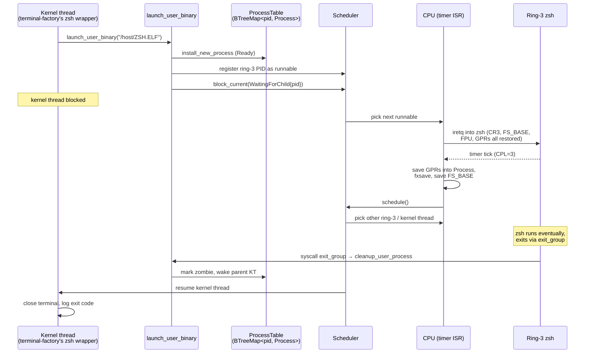
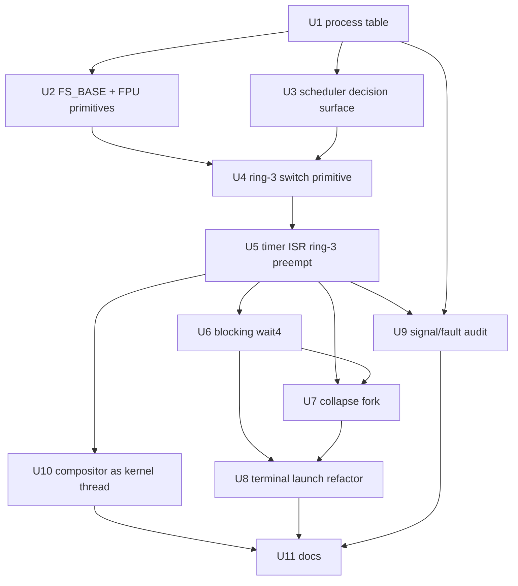

# feat: Multi-ring-3 process scheduling

## Summary

Lift the "one ring-3 process at a time" constraint so multiple ring-3 user processes (e.g., zsh in two terminal windows, parent + forked child both runnable, a backgrounded `&` job alongside an interactive shell) execute concurrently under preemptive scheduling. The kernel-thread scheduler in `src/process/` is already preemptive; ring-3 just doesn't participate yet. The plan extends the existing scheduler to schedule ring-3 user processes alongside kernel threads, adds the small set of CPU-state save/restore primitives that single-process operation lets us elide today (FS_BASE on syscall path, FPU/SSE state on switch), collapses fork's "parent-stash + child-runs-synchronously" hack into the regular process table, and makes blocking syscalls (`wait4`) actually block.

The consumer feature is **multiple terminals each running their own zsh** — today, opening a second terminal spawns a second kernel thread that calls `launch_user_binary` and then deadlock-rejects against the `user_active()` guard, so the second window has no shell.

---

## Problem Frame

The seed framing (`one CURRENT_PROCESS slot`, `timer ISR short-circuits`, `fork is parent-stash`) is correct in spirit, but the current state is further along on the *kernel* side than the seed suggests and worse on the *CPU-state-save* side:

**What already works (don't re-build):**

- `src/process/scheduler.rs` is a live preemptive round-robin scheduler with ready queue, sleep queue, signal-waiter list, watchdog, and idle PCB. The PIT fires at 100 Hz and `src/arch/x86_64/preemption.rs::timer_handler_inner` calls into it.
- Kernel threads context-switch correctly through the existing path (`CpuContext`, `process_entry_trampoline`, `switch_context`). Each terminal window spawns its own kernel thread via `src/window/terminal_factory.rs::spawn_zsh_for_terminal`.
- Each ring-3 `Process` already owns its own L4 page table (`AddressSpace::activate` writes CR3) and its own kernel stack (`KernelStack` + TSS.rsp0 + GSBASE-stored SYSCALL rsp top, swapped at install time and across fork).
- `CpuContext` already carries explicit `cs`/`ss` fields, so context-switch asm can `iretq` into either ring 0 or ring 3 without conditional logic.
- FS_BASE is set per-process via `arch_prctl(ARCH_SET_FS)` and saved/restored across the synchronous fork dance.

**What enforces single-ring-3-at-a-time today, in four places:**

1. **Timer ISR short-circuit** (`src/arch/x86_64/preemption.rs:249-270`): when `(frame.cs & 3) == 3`, the handler refreshes the active PCB's watchdog tick, EOIs the PIC, and returns — no scheduling decision. Ring-3 runs uninterrupted until syscall, fault, or cooperative exit. This is the D10 "single-app-synchronous" policy and is intentional today.
2. **`CURRENT_PROCESS: Mutex<Process>` singleton** (`src/userland/lifecycle.rs:220`): one slot. `with_current_process` is called from page-fault handler, signal delivery, every syscall handler. There is no notion of "this process" vs "the one whose registers are loaded right now."
3. **`user_active()` guard** (`src/userland/lifecycle.rs:258`): `enter_user_mode_with_aspace` rejects a second call while the slot is occupied. The terminal-launch path therefore can only have one shell live across the whole kernel.
4. **PARENT_STASH** (`src/userland/lifecycle.rs:590`): fork removes the parent from `CURRENT_PROCESS`, stashes it in a one-deep slot, installs the child as current, `iretq`s into the child, and waits for the child's long-jump back. Nested fork is rejected. The pattern only works because there are no concurrent ring-3 processes — once there are, the parent needs to live in the regular table as a runnable entity.

**What is missing CPU-state-wise:**

- **FPU/SSE state is not saved per-process.** `src/arch/x86_64/fpu.rs` enables OSFXSR/OSXMMEXCPT once at boot and never touches the XMM file. The kernel never uses SSE, so user state survives the SYSCALL fast path "for free." The moment we time-slice between two ring-3 processes, A's XMM register file leaks into B. The file's own comment names this as load-bearing only under multi-process.
- **FS_BASE is not saved/restored on the SYSCALL fast path or on timer-preempt return.** Fork manually saves it (otherwise musl `__init_tls` in the child clobbers the parent's), but a timer ISR preempting between two ring-3 processes would corrupt TLS on both.
- **`wait4` does not block** (`src/userland/syscalls.rs:1584-1616`): returns ECHILD immediately when no zombie matches. Today this is fine because the only caller is a parent waiting on a child that already ran synchronously to completion before `wait4` is even reached. Under real concurrency, `wait4` MUST block the caller and let the child make progress.

**Why the kernel-thread scheduler can't already absorb ring-3 processes:**

A kernel thread's `CpuContext` is restored by `switch_context` returning into a kernel-mode RIP at CPL=0. A ring-3 process needs an `iretq` frame with CPL=3, the user CS/SS, user RFLAGS (IF set, IOPL=0), CR3 swapped to its `AddressSpace`, FS_BASE loaded, kernel stack pointer (TSS.rsp0/GSBASE) pointed at *its* `KernelStack`, and FPU state restored. The existing context-switch asm doesn't do any of this conditionally on kind. So either the existing path grows a "kind == Ring3" branch, or ring-3 processes are a parallel schedulable entity that piggybacks on the scheduler's queueing but uses its own switch primitive. Either is acceptable; this plan picks the second (parallel entity wrapped in a unified scheduling decision) because it lets PR-A through PR-C land without changing kernel-thread behavior at all.

---

## Goals

- The kernel can have N ≥ 2 ring-3 processes simultaneously alive, runnable, and time-sliced under the existing 100 Hz timer.
- Two terminal windows can each run their own zsh. Typing into one does not stall the other. Backgrounding (`sleep 60 &` in one terminal) does not freeze the desktop or the other terminal.
- `fork()` returns to the parent immediately (PID > 0) without iretq'ing into the child synchronously. Both parent and child are runnable; the scheduler picks. PARENT_STASH disappears.
- `wait4(WNOHANG=0)` blocks the calling process until a matching child becomes a zombie. SIGCHLD wakes blocked parents.
- Per-process CPU state — GPRs, RIP, RSP, RFLAGS, CR3, FS_BASE, FPU/SSE — is saved on switch-out and restored on switch-in. No bleed-through between processes.
- The GUI render loop continues to make progress regardless of how many ring-3 processes are runnable, with a fairness story documented (not necessarily perfect — the bar is "the desktop is responsive enough to be usable").
- The demand-grown stack (`docs/plans/2026-05-16-003-...`), signal delivery (`maybe_deliver_signal`), and page-fault handler all operate on "the process whose registers are currently loaded," not on a singleton slot — so the same code keeps working when there are multiple ring-3 processes.

## Non-Goals

- **SMP / multi-core.** Single CPU. The plan is structured to not preclude SMP later (per-CPU "current" instead of global), but the work is single-core.
- **Real `RLIMIT_NPROC`, full POSIX `wait4` options (`WCONTINUED`, `WSTOPPED`)**, process groups, sessions, or job control beyond what zsh already drives.
- **execve concurrency hardening beyond what falls out of the refactor.** `execve` already exists; the plan must not regress it but won't add new exec features.
- **Killing the `BinaryLoadGuard` "pause GUI while binary loads"** mechanism — that's about IDE PIO atomicity during the *load* phase, not about runtime concurrency, and is orthogonal.
- **A new IPC mechanism, shared memory between processes, or futexes.** Inheritance of the existing zombies/SIGCHLD machinery is enough for zsh.
- **Rewriting the kernel-thread scheduler.** Extend it; don't redesign it.
- **Reaping the `src/process/CLAUDE.md` claim "no real concurrency."** That stays true at the *kernel-thread* level; ring-3 gets concurrency through this plan.

---

## Key Technical Decisions

### Ring-3 processes are a parallel schedulable kind, not a new PCB

The existing `ProcessControlBlock` in `src/process/pcb.rs` stays exactly as is for kernel threads. Ring-3 processes continue to live as `Process` in `src/userland/lifecycle.rs`. The scheduler grows a unified `enum Scheduled { KernelThread(ProcessId), RingThree(u32) }` view of its ready queue (or a single `BTreeMap` keyed by a tagged ID), and the timer ISR / `yield_current` decision logic picks the next-runnable thing of either kind.

**Why:** Touching `ProcessControlBlock` to absorb ring-3 fields (FPU, FS_BASE, AddressSpace, KernelStack, signal_state, fd_table, cwd, brk, mmap_next, etc.) makes every kernel-thread allocation pay for ring-3 storage and makes the existing PCB harder to reason about. The two kinds genuinely differ. The unifying surface is the scheduler decision, not the data type.

**Alternative considered:** Fold ring-3 fields into `ProcessControlBlock` and make all spawn paths go through it. Rejected: the existing PCB is small (~200 bytes), grows fast under that change, and kernel threads would all carry meaningless `address_space: None` etc.

### Ring-3 context save uses the trap frame; switch goes through a new asm primitive

When a timer ISR preempts ring 3 today, the naked outer wrapper has already pushed a CPU trap frame (rip, cs, rflags, rsp, ss) plus saved/restored caller-saved registers around `timer_handler_inner`. To preempt ring 3, we need: (a) the full GPR set at the moment of interrupt, (b) FS_BASE (read MSR), (c) FPU state (fxsave). The trap frame already has rip/rflags/rsp/cs/ss; we add the GPR save into the Process's `saved_user_state` field and an FPU save into its FPU buffer. On switch-in to a different ring-3 process, restore FPU, restore FS_BASE, swap CR3 via `AddressSpace::activate`, swap TSS.rsp0/GSBASE to its `KernelStack.top()`, then build an `iretq` frame from its saved state and jump.

**Why:** The existing kernel-thread `switch_context` operates on `CpuContext` which is shaped for ring-0 switches and doesn't move CR3 or FS_BASE. Adding ring-3 semantics inside that primitive risks regressing kernel-thread switch latency and complicates a path that works today. A dedicated `enter_or_resume_ring3_asm` is small (≤80 lines naked asm) and isolated.

### Kernel threads that launch a ring-3 process block on the process's exit, not on a longjmp continuation

Today, `enter_user_mode_with_aspace` saves a setjmp-style continuation; the launching kernel thread "returns" from this call only when the ring-3 process exits and longjmps back. With concurrent ring-3, the launching kernel thread shouldn't block the CPU — it should mark itself blocked-on-`Process(child_pid)` and let the scheduler run anything else (including the freshly-registered ring-3 process). When the ring-3 process exits, the wake path moves the kernel thread back to Ready.

**Why:** The setjmp/longjmp pattern conflates "I am the process's kernel-side wrapper" with "I am the only thing that should run." Decoupling them is the whole point of this plan. The kernel thread *still* gets to run synchronous code after the ring-3 process exits (close the terminal, log the exit code) — it's just blocked while the process runs.

**Alternative considered:** Keep the longjmp continuation and have the kernel thread genuinely sleep on its own kernel stack between switches. Rejected: requires the timer ISR to know about kernel-stack handoff between kernel-thread context and ring-3 context, which is exactly the complexity we're trying to avoid.

### Fork collapses into "register child as runnable, return to parent"

The new fork builds the child `Process` (clones AddressSpace, kernel_stack, fd_table, cwd, signal_state, sets up the child's `saved_user_state` so it'll resume at the syscall return site with `rax = 0`), inserts it into the process table marked Ready, returns `child_pid` to the parent immediately, and lets the scheduler pick. PARENT_STASH and the synchronous longjmp path are deleted.

**Why:** PARENT_STASH was a workaround for "we can only iretq into one thing." Once ring-3 switching exists, the workaround becomes a liability — nested fork (zsh inside zsh) currently returns EINVAL, command-substitution patterns like `$(grep x file)` are constrained, and the fork code is the most fragile thing in `syscalls.rs`. Removing it shrinks code and fixes the nested-fork limitation as a side effect.

### `wait4` blocks via the scheduler's existing `block_current` / `wake` primitives

The kernel-thread scheduler already has `BlockReason` and a `wake` path used by sleep/signal-waiters. Add `BlockReason::WaitingForChild { target: i32 }` (or reuse signal_waiters semantics scoped to SIGCHLD). When a child enters the zombie table, the kernel exit path scans for any process blocked-on-wait that matches this child and wakes the first one. The wake path then re-runs the reap_zombie check on resumption.

**Why:** It's the smallest mechanism that gives correct semantics. The waker is bounded (the zombie table is small), and the wake path is the same shape as existing signal-waiter wakes.

### FS_BASE and FPU state save/restore happen on ring-3 switch, not on every syscall

Saving FS_BASE on every syscall entry and restoring it on return would cost two MSR ops per syscall regardless of whether a switch occurred. Instead: save on switch-out, restore on switch-in. The SYSCALL fast path leaves them alone. Same for FPU — `fxsave` is ~100 ns and only happens when the scheduler decides to switch ring-3 processes.

**Why:** The vast majority of syscalls don't trigger a process switch. Paying MSR/fxsave on every syscall would be a measurable regression for the common case.

**Risk:** If a syscall handler ever calls a kernel path that touches XMM (a future SIMD-using kernel routine), we need to either fxsave-on-syscall-entry or forbid SIMD in kernel. Mark as "kernel never uses SSE" invariant explicitly in `src/arch/x86_64/fpu.rs`.

### Rendering competes as a regular kernel thread

Today `window::render_frame()` is called from the kernel main loop only when no user binary is active. Under concurrency, the main loop will starve relative to busy ring-3 processes unless rendering becomes a scheduled entity. Spawn a `kernel-thread "compositor"` (already-existing pattern) that wakes on input events / dirty-window events and yields when idle.

**Why:** Otherwise rendering only happens when ALL ring-3 processes are simultaneously blocked, which is "never" once a busy-loop user process exists.

**Deferred:** A real priority / fair-share scheme. For this plan, round-robin between kernel threads (including compositor) and ring-3 processes is enough — the compositor yields quickly when there's nothing to draw, so it doesn't dominate.

---

## High-Level Technical Design

*This illustrates the intended approach and is directional guidance for review, not implementation specification. The implementing agent should treat it as context, not code to reproduce.*

### Lifecycle of a ring-3 process under the new model



### Process-table shape

```text
ProcessTable {
    by_pid: BTreeMap<u32, Process>,           // U1
    current_user_pid: Option<u32>,            // None when no ring-3 process loaded right now
}

// Scheduler view, picked under one decision:
enum Runnable {
    KernelThread(ProcessId),                  // existing
    RingThree(u32),                           // new — pid in ProcessTable
}
```

### What each switch-out / switch-in does (ring-3 → ring-3)

```text
switch_out(prev):
    fxsave  → prev.fpu_state           (new field)
    rdmsr FSBASE → prev.fs_base        (new field)
    GPRs (from trap frame) → prev.saved_user_state
    prev.state = Ready

switch_in(next):
    activate(next.address_space)        // CR3 write — already exists
    set_kernel_rsp0(next.kernel_stack.top())   // TSS — already exists
    set_percpu_kernel_rsp_top(...)             // GSBASE — already exists
    wrmsr FSBASE = next.fs_base                // new
    fxrstor next.fpu_state                     // new
    build iretq frame from next.saved_user_state
    iretq
```

---

## Output Structure

No new directories. Changes land across `src/userland/`, `src/process/`, `src/arch/x86_64/`, `src/window/`, and `src/tests/`.

---

## Scope Boundaries

- Changes the scheduler's *decision* surface and adds ring-3 switching primitives. Does not rewrite the kernel-thread switch path.
- Changes the four single-process enforcement points (`CURRENT_PROCESS` singleton, `user_active()` guard, PARENT_STASH/longjmp fork, ring-3 timer short-circuit).
- Touches signal delivery and page-fault handler only enough to make them "current ring-3 process"-scoped.
- Touches `wait4` to add the blocking path.
- Touches terminal launch path to use the new "register and yield" pattern.

### Deferred to Follow-Up Work

- **Full per-process resource limits** (RLIMIT_NPROC, RLIMIT_STACK as a real syscall, OOM accounting). The existing per-process growth budget for the stack continues to apply unchanged.
- **`rt_sigsuspend` POSIX-correctness** (CLAUDE.md known issue #2 from zsh-interactive bring-up). Orthogonal; this plan doesn't touch the signal-mask save path.
- **WIFSIGNALED vs WIFEXITED encoding in `wait4`** (CLAUDE.md known issue #3). Orthogonal — touch this only if the new wait4 blocking path makes it convenient.
- **Per-process FPU state lazy save (CR0.TS / #NM)** as a perf optimization. Eager save on every ring-3 switch is fine for the bar this plan sets.
- **SMP support.** Single CPU only.
- **execve correctness review under concurrency.** Existing execve continues to work; full audit deferred.
- **Reaping `BinaryLoadGuard`'s "pause GUI while loading"** mechanism. Orthogonal — IDE PIO atomicity isn't about runtime concurrency.
- **Process groups, sessions, controlling terminals.** Multi-terminal works without them at the level zsh expects.

---

## Implementation Units

### U1. Process table: replace `CURRENT_PROCESS` singleton with `BTreeMap<u32, Process> + current_user_pid`

**Goal:** Make ring-3 process storage addressable by PID. Behaviorally equivalent — still one ring-3 process active at a time after this unit lands.

**Dependencies:** None.

**Files:**
- `src/userland/lifecycle.rs` — replace `CURRENT_PROCESS` static; rewrite `with_current_process`, `current_pid`, `swap_current_process`, `install_new_process_opt`, `user_active`, `take_stashed_parent`, etc. to go through a `ProcessTable` struct. Keep `PARENT_STASH` and `ZOMBIES` for now.
- `src/userland/lifecycle.rs` — add `current_user_pid: Option<u32>` (formerly implicit in the singleton).
- All callers of `with_current_process` across `src/userland/` (~80 callsites; grep first). Most should keep working unchanged if `with_current_process` retains its signature and internally looks up `current_user_pid`.
- `src/tests/userland_*` — verify nothing in tests directly reaches into `CURRENT_PROCESS`.

**Approach:** Wrap the BTreeMap in `Mutex<ProcessTable>`. `ProcessTable::with_current(|p| ...)` is the new shape; the old `with_current_process` becomes a thin shim that calls `with_current`. The kernel-sentinel PID-0 process disappears — instead, "no current ring-3 process" is `current_user_pid == None`, and `with_current_process` returns early with a default (or unwraps when callers are known to be on a ring-3 path).

**Patterns to follow:** Existing `ZOMBIES: Mutex<BTreeMap<...>>` shape (lifecycle.rs:664). Same `try_lock` discipline as `try_grow_user_stack` to avoid interrupt-context deadlock.

**Test scenarios:**
- Round-trip: install_new_process → with_current_process returns its fields → user_active is true → cleanup → user_active is false.
- Two installs in sequence (one finishes cleanup before the next starts): each gets a distinct PID, second install sees the table empty post-cleanup.
- `try_grow_user_stack` operates on the correct process when `current_user_pid` points at it.
- Boot all existing userland tests under the new table — zero regressions.

**Verification:** Existing test suite green; `./build.sh` runs zsh interactively as before; no observable behavioral change.

---

### U2. CPU state save/restore: FS_BASE and FPU per ring-3 process

**Goal:** Add the fields and routines to save/restore FS_BASE and FPU/SSE state on ring-3 switches. No switches happen yet — this just builds the primitives.

**Dependencies:** U1 (Process fields land cleanly in the new table).

**Files:**
- `src/userland/lifecycle.rs` — add `fs_base: u64` and `fpu_state: FpuState` fields to `Process`. `FpuState` is a 512-byte 16-aligned buffer (FXSAVE area).
- `src/arch/x86_64/fpu.rs` — add `save_fpu(buf: &mut FpuState)` and `restore_fpu(buf: &FpuState)` wrapping `fxsave`/`fxrstor`. Update the file's "load-bearing once >1 ring-3 process" comment to point at this plan.
- `src/arch/x86_64/msr.rs` — already has `read_fs_base` / `set_fs_base`; no change.
- New: `src/userland/cpu_state.rs` (or fold into lifecycle.rs) — `pub fn save_user_cpu_state(p: &mut Process)` and `pub fn restore_user_cpu_state(p: &Process)` that orchestrate FS_BASE + FPU.
- `src/userland/mod.rs` — call `restore_user_cpu_state` once at process install time so a fresh process starts with zeroed/canonical FPU state and FS_BASE = 0 (musl sets it via arch_prctl early).

**Approach:** Eager save/restore — no CR0.TS / #NM lazy scheme. Initial FPU state is the architectural reset state (use `fninit` + zero-XMM, or initialize the buffer to the well-known FXSAVE reset bytes). FS_BASE defaults to 0; arch_prctl(ARCH_SET_FS) updates it via `with_current_process` (it already does — confirm and keep).

**Test scenarios:**
- `FpuState` is 16-byte aligned (compile-time assertion or `assert!(addr & 0xF == 0)`).
- `save_fpu`/`restore_fpu` round-trip: write known values into XMM0..XMM3 from kernel, save, scribble, restore, verify reload.
- `arch_prctl(ARCH_SET_FS, addr)` followed by `read_fs_base()` from kernel returns `addr`. Already tested today; ensure no regression.
- Process install zeros FPU state to a known good baseline (`fxsave` after install matches the architectural reset pattern).

**Verification:** All existing userland tests still pass; specifically the C++ hello world (which uses some libstdc++ code paths that touch SSE) still runs.

---

### U3. Scheduler decision surface: unify ring-3 with kernel-thread runnables

**Goal:** Teach the scheduler that there's a second kind of runnable thing. Add the queueing/state for ring-3, but don't switch into ring 3 from the timer ISR yet.

**Dependencies:** U1, U2.

**Files:**
- `src/process/scheduler.rs` — add `enum Runnable { KernelThread(ProcessId), RingThree(u32) }` (or thread a tagged ID type through). Extend `ready_queue` from `VecDeque<ProcessId>` to `VecDeque<Runnable>`. Extend `current` similarly. Extend `block_current`, `wake`, `schedule` to know both kinds.
- `src/process/scheduler.rs` — add `add_ring3_runnable(pid)`, `mark_ring3_blocked(pid, reason)`, `wake_ring3(pid)`.
- `src/process/pcb.rs` — leave `ProcessControlBlock` alone. The state of ring-3 processes lives in `Process` (in `lifecycle.rs`); the scheduler asks `lifecycle::ring3_state(pid)` for it when it needs to know.
- `src/userland/lifecycle.rs` — `ring3_state(pid)`, `mark_ring3_ready(pid)`, `mark_ring3_blocked(pid, reason)` accessor surface for the scheduler.

**Approach:** Don't move ring-3 state into the scheduler's PCBs. The scheduler's job is queueing and the "pick next" decision. It calls into `lifecycle::` when it needs to know about a ring-3 process. Keeps the two subsystems decoupled.

**Test scenarios:**
- Spawn two kernel threads + register two ring-3 PIDs as runnable. Round-robin order respects insertion (assert by inspecting `ready_queue` state).
- Block a ring-3 PID; subsequent `schedule()` calls don't pick it. Wake it; it goes to the back of the queue.
- Idle PCB is still picked when nothing else is runnable.
- `Scheduler::current()` reports the right tagged ID after explicit `schedule()` calls.

**Verification:** Unit tests pass; no behavior change at runtime because the timer ISR still short-circuits on ring 3 and `enter_user_mode_with_aspace` is still the only entry to ring 3.

---

### U4. Ring-3 switch primitive: `resume_ring3(pid)` and `switch_out_ring3`

**Goal:** Implement the two asm primitives (or one parameterized one) that save the current ring-3 process's full state and resume another. Still not called from the timer ISR yet — exercised by a dedicated kernel test.

**Dependencies:** U2 (FPU/FS_BASE primitives), U3 (scheduler can tell us which PID is "next").

**Files:**
- `src/userland/switch.rs` (new) — `pub unsafe fn resume_ring3(pid: u32) -> !`. Looks up the Process, restores CR3 (`AddressSpace::activate`), updates TSS.rsp0 + GSBASE-stored SYSCALL rsp top, `restore_user_cpu_state`, builds an iretq frame from `saved_user_state`, jumps.
- `src/userland/switch.rs` — `pub unsafe fn save_ring3_into(pid: u32, trap_frame: *const TrapFrame, gprs: &SavedGprs)`: writes the user GPRs (passed via the trap-frame save layout) plus FS_BASE + FPU into the Process's saved-state field.
- `src/userland/lifecycle.rs` — add `saved_user_state: UserCpuState` field to `Process` (GPRs + rip + rflags + rsp + cs + ss). At install time, populated to "first-run" state (entry point, user stack top, RFLAGS with IF set).
- `src/arch/x86_64/preemption.rs` — extend the naked outer wrapper of the timer ISR to push *all* GPRs (not just caller-saved) onto the kernel stack and pass the full save area to `timer_handler_inner` as a `&SavedGprs`. Do not yet call `resume_ring3` from here.

**Approach:** The trap frame layout becomes load-bearing — document it in a single place (`src/arch/x86_64/trap_frame.rs` or comments in `preemption.rs`). The save layout used by the timer ISR must be the same one the syscall fast path uses, so a process can be switched out at either point and resumed cleanly.

**Test scenarios:** **Execution note: characterization-first.** Add a kernel test that builds two minimal `Process` slots with hardcoded `saved_user_state` (different entry points, different FS_BASE values) and verifies that `resume_ring3(A)` jumps to A's entry with A's FS_BASE; that a fake "syscall return" path can call `save_ring3_into` and then `resume_ring3(B)`; and that resuming A later restores the saved state byte-for-byte.

- Resume into a process whose first instruction is `int3` (kernel test catches the #BP and verifies the resumed RIP / CS=user / RFLAGS / RSP).
- Save out from a synthetic trap frame, mutate the trap frame, resume: the resumed CPU state matches the saved snapshot, not the mutated frame.
- FPU state survives a switch-out / unrelated FPU work / switch-in round-trip (write XMM0=0xAA…, switch out, kernel scribbles XMM0=0, switch in, observe XMM0=0xAA…).
- FS_BASE survives a switch-out / switch-in (set via arch_prctl in synthetic process, switch out, set FS_BASE to garbage from kernel, switch in, observe restored value).

**Verification:** New `cargo test --features test` module passes; existing tests unaffected.

---

### U5. Wire ring-3 preemption into the timer ISR

**Goal:** When the timer fires from CPL=3, save the current ring-3 process, ask the scheduler for next, and either resume another ring-3 process or return to the kernel idle path.

**Dependencies:** U4.

**Files:**
- `src/arch/x86_64/preemption.rs` — replace the lines 249-270 short-circuit. New flow: save GPRs + trap-frame snapshot into the *current* ring-3 process, call `Scheduler::schedule_timer_preempt()`. Result drives the return path: `Runnable::RingThree(next)` → call `resume_ring3(next)` (does not return); `Runnable::KernelThread(_)` → context-switch through the existing kernel-context path (returns into kernel-side scheduling).
- `src/userland/lifecycle.rs` — update `current_user_pid` on switch.
- `src/window/terminal_factory.rs` — no change yet (will follow in U7).

**Approach:** PIC EOI moves to *before* the schedule call so that a future ring-3 process running for the next tick correctly gets an EOI'd PIC. Confirm there's no double-EOI on the kernel-thread path.

**Test scenarios:**
- Two synthetic ring-3 processes, each in a tight loop of `pause` instructions. Boot, register both, observe via kernel debug counters that each receives roughly equal CPU over 1000 ticks (within 10%).
- A ring-3 process in a tight loop coexists with a kernel thread that increments a counter every 10 ms. The kernel thread's counter advances roughly as expected (not starved).
- A ring-3 process that calls a syscall (e.g., `getpid` in a loop) doesn't break after preemption — i.e., preemption between two syscalls leaves a coherent state.
- Timer ISR preempting in the middle of `try_grow_user_stack`'s drop-and-re-acquire window does not corrupt the process table (the `try_lock` discipline already handles this; assert via stress test).
- A fault in one ring-3 process (`int3`, `ud2`) terminates only that process; the other keeps running.

**Verification:** Two synthetic ring-3 processes can coexist; existing single-process workloads (zsh, BusyBox applets, hello-world) regress to baseline behavior.

---

### U6. Blocking `wait4`

**Goal:** `wait4` blocks the calling ring-3 process when no matching zombie exists; SIGCHLD wakes it.

**Dependencies:** U5.

**Files:**
- `src/userland/syscalls.rs` — rewrite `wait4_handler` (currently 1584-1616). New logic: try `reap_zombie`; if found, return as today; if not and ECHILD-vs-block condition says block, call `scheduler::mark_ring3_blocked(me, BlockReason::WaitingForChild { target })` and yield. On resumption, retry. Use the WNOHANG bit in `options` to short-circuit to ECHILD without blocking.
- `src/process/pcb.rs` — add `BlockReason::WaitingForChild { target: i32 }`. (Or thread it through a ring-3-specific block reason; keep with kernel-thread BlockReason for uniformity.)
- `src/userland/lifecycle.rs` — `record_zombie` and `record_zombie_signaled` already exist; extend the call sites in `notify_parent_of_exit` / `notify_parent_of_signaled_exit` to also call `scheduler::wake_ring3_waiting_for(pid, parent_pid)`.

**Approach:** "Has any child" pre-check before blocking — if the process has no children at all, return ECHILD without blocking, per POSIX.

**Test scenarios:**
- Parent forks, child sleeps then exits. Parent's `wait4(-1, ...)` blocks; when child exits, parent wakes and reaps. Status word matches.
- Parent forks, child exits before parent reaches wait4. Parent's wait4 finds the existing zombie without blocking.
- Parent `wait4(-1, WNOHANG)` with no zombie returns 0 immediately (POSIX WNOHANG semantics).
- Parent with no children: `wait4(-1, ...)` returns ECHILD without blocking.
- Two children exit while parent is blocked in wait4(-1): parent wakes, reaps one, comes back into wait4 and reaps the other.
- SIGCHLD is delivered to a blocked-in-wait4 parent: the handler runs after the wake, before wait4 returns. (POSIX-flexible — interruption semantics; document the chosen behavior.)

**Verification:** New tests pass; zsh's job-control wait paths (already exercised by `nosuchcommand` etc.) keep working.

---

### U7. Collapse `fork` to "register child as Ready, return to parent"

**Goal:** Delete PARENT_STASH and the synchronous longjmp dance. Fork builds a child, marks it Ready, returns child PID to parent.

**Dependencies:** U5, U6.

**Files:**
- `src/userland/syscalls.rs` — rewrite `fork_handler` (currently 781-1030, ~250 lines, the most fragile block in the file). New flow: clone parent's `Process` into a fresh PID, mark Ready, return child PID immediately to parent. Child's `saved_user_state` is the parent's user state at the moment of the fork syscall, but with `rax = 0` so the child resumes from `return 0`.
- `src/userland/lifecycle.rs` — delete `PARENT_STASH`, `stash_parent`, `take_stashed_parent`, `parent_stashed`, `raise_signal_on_stashed_parent`. Update `notify_parent_of_exit` / `notify_parent_of_signaled_exit` to look the parent up in the regular process table (it's there, not in a stash).
- `src/userland/syscalls.rs` — `fork_handler` no longer touches `set_kernel_rsp0` / `set_percpu_kernel_rsp_top` or FS_BASE save/restore directly — those move to the switch primitive (U4).

**Approach:** **Execution note: characterization-first.** Before deleting PARENT_STASH, write a test that reproduces zsh's `nosuchcommand` flow end-to-end (fork → child execve fails → child exits with 127 → parent wait4 reaps → zsh prints error). After the refactor lands, the same test must still pass.

**Test scenarios:**
- Parent fork, child runs to exit, parent waits — same observable behavior as today.
- Nested fork (zsh inside zsh, or test program that forks from a forked child) — succeeds. Today this returns EINVAL; the new code allows it.
- Both parent and child are runnable immediately after fork; the scheduler picks one. Inspect via debug-only "next runnable" probe.
- Parent that doesn't call wait4 still gets SIGCHLD and the zombie sits in the table; subsequent wait4 reaps.
- Parent that exits before the child: child becomes an orphan; document whether it gets re-parented to PID 1 or terminates (probably terminates given the lack of init in this kernel — pick one and document).

**Verification:** All existing zsh interactive flows work; nested fork now works; the test reproducing `nosuchcommand` passes byte-for-byte.

---

### U8. Terminal launch path: "register and yield" pattern

**Goal:** Each terminal window can spawn its own zsh. The kernel thread inside `spawn_zsh_for_terminal` registers the ring-3 process, blocks on its exit, runs cleanup on wake. Multiple terminals coexist.

**Dependencies:** U5, U6, U7.

**Files:**
- `src/userland/mod.rs` — `enter_user_mode_with_aspace` becomes "install Process into table, mark Ready, register in scheduler, call `scheduler::block_current(BlockReason::WaitingForChild { target: child_pid })`, yield." On resume (when the child exits), return to the caller as today.
- `src/userland/launcher.rs` — `launch_user_binary` returns the same `(ExitKind, code)` as today; the blocking is now scheduler-driven, not longjmp-driven.
- `src/userland/lifecycle.rs` — delete `KernelContinuation`, `restore_continuation`, `enter_user_mode_with_regs_asm`'s setjmp/longjmp scaffolding. (Or keep them as a fallback used only by in-kernel synthetic tests if removing them is invasive; prefer full removal.)
- `src/window/terminal_factory.rs` — remove `user_active()` gating. Multiple `spawn_zsh_for_terminal` calls now coexist.

**Approach:** This is where the seed's "kernel thread parent" idea is realized. The kernel thread holds the connection to its terminal window; the ring-3 process is what produces output. The kernel thread's only job during the ring-3 lifetime is to be blocked.

**Test scenarios:**
- Boot, open terminal 1, type `pwd` and read output. Open terminal 2, type `pwd`. Both succeed.
- In terminal 1: `sleep 10 &`. In terminal 2 simultaneously: `ls /host`. Both terminals stay responsive.
- Close terminal 1 (window close) while its zsh is in a blocking read. The kernel thread cleans up the zsh process (sends a fatal signal or marks it for cleanup); terminal 2 unaffected.
- Open 4 terminals, each running an interactive zsh. Type into each; no cross-contamination. (Stretch goal — defer if 4 stretches resources.)
- Existing single-terminal flow still works exactly as before (regression).

**Verification:** Hand-test in QEMU with `./build.sh`. Document the new flow in `docs/window_system_design.md` and the terminal-factory CLAUDE.md note.

---

### U9. Signal delivery and page-fault handler scoped to current ring-3

**Goal:** `maybe_deliver_signal`, `deliver_signal`, `try_grow_user_stack`, and the ring-3 fault routing path all read state for "the ring-3 process whose registers are currently loaded" — they continue to call `with_current_process`, which now consults `current_user_pid`. Verify nothing reaches into a stale singleton.

**Dependencies:** U1, U5.

**Files:**
- `src/userland/syscalls.rs` — `maybe_deliver_signal` / `deliver_signal`: confirm they're called only from the syscall-return path, where `current_user_pid` is the resumed process. Add an assertion (debug-build only) that `current_user_pid == Some(...)` at call entry.
- `src/arch/x86_64/interrupts.rs` — ring-3 fault router: confirm `current_user_pid` is set to the faulting process (the timer-ISR switch should have updated it before a fault can happen in a different ring-3 process).
- `src/userland/lifecycle.rs` — `try_grow_user_stack` already takes `CURRENT_PROCESS.try_lock()` and reads stack window; ensure it reads from the *currently-loaded* ring-3 process. Already correct under U1 if `current_user_pid` is updated atomically with CR3 swap.
- `src/userland/syscalls.rs` — every other handler that touches `with_current_process` (~80 callsites): confirm they assume "the process making this syscall" and not "the singleton." Audit.

**Approach:** This is mostly an audit + small assertion additions. The shape of `with_current_process` doesn't change; the meaning narrows from "the one process" to "the currently-loaded process," and the caller assumptions hold.

**Test scenarios:**
- Signal raised on process A is not delivered while process B is running ring 3. (Set up two processes; raise SIGUSR1 on A while B is in a busy loop; verify A's handler runs on A's next schedule, not B's.)
- Page fault in process A correctly looks up A's stack window even if A was preempted out and back in.
- Existing signal tests for SIGSEGV, SIGCHLD, SIGUSR1 keep passing.
- Stack growth in process A while A is the *non-current* process is impossible (faults are taken in the current process by construction); assert this is impossible to trigger.

**Verification:** No regressions in existing signal/fault tests; new cross-process signal test passes.

---

### U10. Compositor as a scheduled kernel thread

**Goal:** Rendering yields fairness; busy ring-3 processes don't freeze the desktop.

**Dependencies:** U5.

**Files:**
- `src/window/mod.rs` or new `src/window/compositor.rs` — spawn a kernel thread (`spawn_process`) named `"compositor"` whose loop is: wait on dirty-window or input-event condition, call `render_frame`, yield.
- `src/kernel.rs` — remove `window::render_frame()` and `window::process_terminal_output()` from the main idle loop. Main loop becomes a pure idle loop (hlt + preemption check).
- `src/window/` — define the "dirty window" / "input pending" wake source. Simplest: a `AtomicBool` flag set by window-tree mutations and by input ISRs; the compositor checks it in its scheduling slot and skips rendering if clear.

**Approach:** Keep the `BinaryLoadGuard` pause mechanism intact for the binary-load phase — that's about IDE PIO, not runtime. Just the *runtime* render path moves to its own scheduled entity.

**Test scenarios:**
- Tight-loop ring-3 process (BusyBox `yes`) coexists with a moving mouse cursor — the cursor still updates (within a tick or two).
- Compositor yields when there's nothing to draw — observe via debug counter that it doesn't run more often than ~10 Hz when idle.
- No regression in input latency (open Paint, draw a line, line appears; lossy benchmark only).
- Existing rendering tests pass.

**Verification:** Hand-test in QEMU. Mouse remains responsive while a `yes`-equivalent runs in a terminal.

---

### U11. Documentation and CLAUDE.md updates

**Goal:** Refresh subsystem docs so future work doesn't re-derive what changed. Capture the multi-process model as a learning.

**Dependencies:** U10.

**Files:**
- `src/process/CLAUDE.md` — replace "ring-3 awareness: short-circuits on CPL=3" / "No real concurrency" with the new model. Document the `Runnable` enum, the two switch primitives, the `Process` vs `ProcessControlBlock` split.
- `src/userland/CLAUDE.md` — create (currently absent per the seed). Document the process table, the launch flow, the fork model, FS_BASE / FPU save discipline.
- `src/arch/x86_64/CLAUDE.md` — update the timer-ISR section to reflect ring-3 preemption.
- `CLAUDE.md` (root) — remove "No Multitasking" from Current Limitations (or narrow it to "no SMP"). Update the project overview's "current state" paragraph.
- `docs/solutions/learnings/2026-05-XX-multi-ring3-scheduling.md` (new) — capture FS_BASE/FPU pitfalls, fork-stash removal, terminal-launch refactor as a multi-page post-mortem-style learning.

**Test scenarios:** N/A — documentation.

**Verification:** Subsystem CLAUDE.md files reflect reality; rg for "single-app-synchronous" and "D5" returns no stale claims.

---

## Sequencing and Dependency Graph



U1 → U2 → U3 → U4 → U5 is the critical path and the riskiest stretch. U6, U7, U8, U9, U10 can land in any order after U5 if you accept that U7 and U8 each individually depend on U6 for blocking semantics; sensible order is U6 then U7 then U8 then U9 then U10. U11 closes out.

Each unit is intended to be a single PR; the chain is long but reviewable.

---

## Risk Analysis & Mitigation

| Risk | Likelihood | Impact | Mitigation |
|---|---|---|---|
| Ring-3 switch asm has a subtle bug (wrong stack, missed register, FPU misalignment) that corrupts user state intermittently | High | Severe — undebuggable user crashes | U4 lands as a characterization test before being wired into the timer ISR. Boot-time self-test runs two synthetic ring-3 processes and asserts byte-for-byte state preservation. |
| Timer ISR preempting in the middle of a partially-acquired kernel lock causes deadlock | Medium | Severe — kernel hang | Audit every `try_lock` site to ensure it falls back gracefully. The existing `try_grow_user_stack` discipline is the template. Add a debug-build assertion that no `lock()` (blocking) call happens from interrupt context. |
| FS_BASE corruption: musl in process A's `__init_tls` writes FS_BASE, then B is scheduled, then A resumes with B's FS_BASE | Medium | Severe — TLS reads garbage, segfault deep in libc | U2 saves FS_BASE eagerly on switch-out. Test: two processes each set distinct FS_BASE via arch_prctl, busy loop reading `%fs:0`, assert no cross-contamination over 10s. |
| FPU state corruption between two processes that both use SSE | Medium | Severe — silent floating-point corruption | U2 + U4 do eager fxsave/fxrstor on every ring-3 switch. Test: two processes each load distinct XMM patterns, busy loop verifying. |
| `wait4` blocking creates a missed-wake race (child exits between `reap_zombie` returning None and `block_current`) | Medium | High — parent hangs forever | Hold scheduler lock across the "no zombie + block" transition, or recheck zombie table immediately after blocking with the lock held. Document the ordering. |
| Removing PARENT_STASH breaks a flow that depended on the parent literally being frozen | Low | Medium | Run the full zsh interactive test suite (`./test.sh`) plus hand-test nosuchcommand, `&` backgrounding, `wait`, `kill -9 $!`. |
| Compositor as a kernel thread starves under busy ring-3 processes | Medium | Medium — UI feels janky | Compositor wakes on event flag; scheduler is round-robin so it gets ~1 in N+1 slices. If that's not enough, mitigation: bump compositor's effective time-slice or run it at higher priority (priority work is then a follow-up). |
| Terminal close while child is in ring 3 leaks the process | Medium | Medium | U8 must define cleanup semantics: terminal close sends fatal signal to child; kernel thread joins on child exit before destroying the terminal-output routing. |
| Multi-process exposes a latent bug in execve, address-space-clone, or signal-frame layout | High | Variable | The audit in U9 catches the common cases. Reserve buffer for follow-up fixes after U8 lands. |
| GUI render is locked out for too long during heavy multi-process work, making the system feel hung | Low | Medium | U10's per-frame budget. If still bad, follow-up: priority for compositor. |

---

## Open Questions Deferred to Implementation

- **Whether to keep `KernelContinuation` for in-kernel synthetic ring-3 tests** or rewrite those tests to go through the new scheduler-mediated path. Decide in U8.
- **How to handle a fault on a process that is currently *not* the loaded ring-3 process.** By construction this can't happen (faults are taken in the current process), but if it does (e.g., a kernel bug writes to user VA from kernel context), what's the cleanup story? Probably "kernel panic — invariant violation." Decide in U9.
- **Whether `current_user_pid == None` while a kernel thread runs ring 0** is a documented state, or whether ring-3 preemption always switches to *some* ring-3 process before yielding to the kernel-idle path. Lean toward the former (simpler).
- **Exact wake-up semantics for blocked-in-wait4 when SIGCHLD is delivered.** POSIX gives some latitude. Pick deliverable-then-retry-wait, document it, write a test.
- **Whether orphaned children get re-parented to PID 1 or just terminate.** This kernel has no init; "terminate immediately" is fine and simpler. Decide in U7.

---

## Success Metrics

- Two terminal windows each run their own zsh; typing into one doesn't stall the other.
- A ring-3 tight loop in one terminal doesn't freeze the mouse cursor or the other terminal.
- `./test.sh` passes with no new flakes after each unit lands.
- The "Current Limitations" entry "No Multitasking" is removed from root `CLAUDE.md`.
- A new learning doc captures the FS_BASE / FPU / fork-stash lessons so the next refactor doesn't relearn them.
