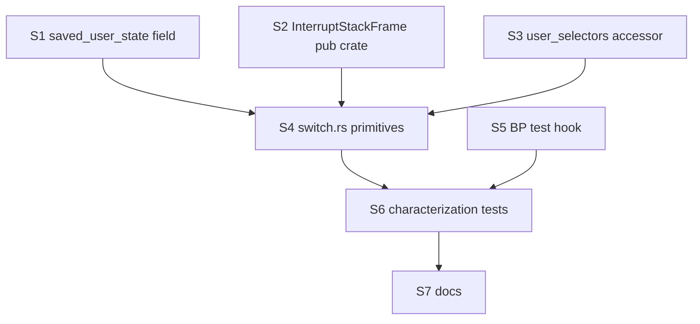

# feat: U4 — Ring-3 switch primitive

## Summary

Build the asm + Rust primitive that switches the CPU between two ring-3
processes: `save_ring3(prev_pid, trap_frame)` snapshots the currently-loaded
ring-3 process's full state into its `Process` slot, and `resume_ring3(pid)`
restores another process's state and `iretq`s into ring 3. **Nothing in the
existing timer ISR or syscall path is wired to it yet** — that's U5. This
unit lands the primitive and proves it works via dedicated kernel tests that
construct two synthetic ring-3 processes and round-trip between them.

The work has two pieces:

1. **Per-process register snapshot** — add `saved_user_state: UserState` to
   `Process` so a preempted process can be resumed at the exact instruction
   it was interrupted at, with all 14 user GPRs + RIP + RFLAGS + RSP intact.
   Today's `UserState` already exists for `fork()` (see
   `src/userland/user_state.rs`); we extend its role from "fork child entry
   state" to "live per-process snapshot."
2. **The switch primitive** — a naked-asm function that:
   - reads `Process` fields,
   - swaps CR3 via `AddressSpace::activate`,
   - swaps TSS.rsp0 + GSBASE syscall-rsp via `set_kernel_rsp0` / `set_percpu_kernel_rsp_top`,
   - calls `restore_user_cpu_state` (FS_BASE MSR + fxrstor — already exist),
   - builds an iretq frame from `saved_user_state` + user CS/SS,
   - `iretq`s.

The matching save direction is *not* a single naked function — it's a Rust
helper that takes a `&mut Process` and an `InterruptStackFrame *` (or
syscall trap-frame pointer) and writes the GPRs out. Save is called from
the Rust-side timer handler (U5) before any kernel code clobbers FS_BASE
or XMM; restore is the diverging asm primitive.

---

## Problem Frame

After U1-U3, the machinery for multiple ring-3 processes exists but is
inert: `ProcessTable` can hold N processes, the `ring3_ready` queue tracks
which are runnable, `FpuState` + `save_user_cpu_state` exist, and the
scheduler has a `Runnable` decision surface. What's missing is the only
thing that actually *swaps the CPU* between two ring-3 contexts.

Today's ring-3 entry is `enter_user_mode_asm` (kernel-launched binaries)
and `enter_user_mode_with_regs_asm` (fork child) — both follow a
setjmp/iretq pattern: save kernel callee-saved state into a
`KernelContinuation`, then `iretq` into ring 3. There's only ever one such
continuation live at a time (the `Process.continuation` field), and the
return path goes through `restore_continuation` which `mov`s the kernel
state back and `ret`s. This is fine for "kernel thread launches one ring-3
process, blocks until it exits" — that's literally all the kernel does
today.

Multi-process scheduling needs a *different* kind of transition: ring-3 →
kernel-(scheduler decision)-→ ring-3 of a *different* process. The kernel
side doesn't unwind back to the launcher; it ends up `iretq`ing into the
next ring-3 process from the timer ISR's context. So we need a primitive
shaped like:

```
unsafe fn resume_ring3(pid: u32) -> !   // diverges — iretqs into pid
```

and a save side that runs from Rust code (the timer ISR's
`timer_handler_inner` or U7's fork path) and writes the trap-frame GPRs
plus FS_BASE/FPU into the previous process.

The seed plan (U4) names a `src/userland/switch.rs` and two functions; this
plan refines that into a concrete file/function shape, locks in the
`saved_user_state` field shape, defines the test-only "construct synthetic
ring-3 process, resume into known RIP, observe RIP via #BP" mechanism, and
documents the load-bearing offsets the asm depends on so future refactors
notice when they break.

### What U4 explicitly does NOT do

- **Does not modify `timer_handler_inner`.** The timer ISR still
  short-circuits on CPL=3 (`preemption.rs:258-270`). U5 swaps the
  short-circuit for "save + schedule + resume next." If the timer ISR
  changed in U4, the change couldn't be tested in isolation — every boot
  would either work or hang.
- **Does not delete `enter_user_mode_with_regs_asm` or
  `restore_continuation`.** U7 and U8 collapse those when fork and the
  terminal-launch path migrate to the new pattern. U4 only adds.
- **Does not change syscall entry/exit.** The SYSCALL fast path still
  doesn't save FS_BASE/FPU — that's the load-bearing performance choice
  from U2. U4's save runs from interrupt-context Rust, not from the
  syscall path.
- **Does not implement the kernel-thread ↔ ring-3 transition.** Just
  ring-3 ↔ ring-3 for the primitive itself. U5 will use this primitive on
  one side and the existing kernel-context machinery on the other.

---

## Goals

- `Process` carries a `saved_user_state: UserState` field that fully
  describes a paused ring-3 thread (14 GPRs + RIP + RFLAGS + RSP).
- A new `src/userland/switch.rs` module exposes:
  - `pub unsafe fn resume_ring3(pid: u32) -> !` — diverges.
  - `pub unsafe fn save_ring3(p: &mut Process, frame: &InterruptStackFrame)`
    — non-diverging Rust helper.
- A characterization test under `src/tests/userland.rs` (or a new
  `userland_switch.rs` if the file is getting unwieldy) proves:
  - Resuming into process A with RIP pointing at `int3` lands the kernel
    in `breakpoint_handler` with the saved CS=user, RFLAGS, and RSP.
  - Saving from a synthetic trap-frame and then resuming a different
    process leaves the first process's `saved_user_state` byte-for-byte
    matching the trap frame at save time.
  - FPU state survives a round-trip switch (write known XMM pattern, save
    into A, scribble XMM from kernel, restore A, observe pattern intact).
    Builds on the existing `test_fpu_save_restore_preserves_xmm0` shape.
  - FS_BASE survives a round-trip switch (set A's `fs_base` to known
    value, save out, scribble MSR, restore A, observe value).
- Existing zsh/BusyBox/hello-world flows are entirely unaffected
  (`./build.sh` boots and behaves identically; `./test.sh` regression-clean
  modulo the one known pre-existing flake).

## Non-Goals

- **Round-trip A→B→A from a real timer ISR.** That's U5.
- **Replacing `enter_user_mode_asm` with `resume_ring3` on first launch.**
  First-launch can be a follow-up; for U4 we keep the existing entry
  path. Decision: U5 *can* call `resume_ring3` from the timer ISR on a
  process that was originally launched via `enter_user_mode_asm`, because
  by that point its `saved_user_state` will have been populated by U4's
  save path on the first preempt. The first iretq still goes through the
  old asm.
- **Lazy FPU save (CR0.TS / #NM).** Eager save in `restore_user_cpu_state`
  is fine.
- **Saving FS_BASE / FPU on every syscall.** U2 already locked that in.
- **Cross-process signal delivery.** U9.

---

## Key Technical Decisions

### `saved_user_state` reuses the existing `UserState` type, not a new one

`src/userland/user_state.rs::UserState` already carries the 14 user GPRs +
RIP + RFLAGS + RSP in a layout that's referenced by load-bearing offsets
inside `enter_user_mode_with_regs_asm` and `iretq_to_user_with_regs`. The
U4 switch primitive uses the *same* layout, which means:

- Field offsets stay frozen across both code paths (fewer places to
  drift).
- Tests can construct a `UserState` value, install it as a
  `Process.saved_user_state`, and resume into it directly — no marshalling.
- Once U7 collapses fork into the new model, fork's child setup is
  literally `child.saved_user_state = parent_state_with_rax_zero;
  mark_ring3_ready(child);` — the same field that U4 introduces.

**Alternative considered:** introduce a new `RingThreeContext` struct
with a tagged layout. Rejected — duplicates work, doubles the surface area
for "offsets must match" bugs, and `UserState` is already the right shape.

### `resume_ring3` is a naked-asm function that diverges

It can't be a regular Rust function: it must end in `iretq`, and the path
between "reload kernel state" and `iretq` must touch no Rust-compiler-
emitted instructions that might spill registers or read FS_BASE/XMM.

The function signature is:

```rust
#[unsafe(naked)]
#[no_mangle]
pub unsafe extern "sysv64" fn resume_ring3_asm(state: *const UserState) -> !;
```

It takes a pointer to the process's saved `UserState`; the *caller*
(a small Rust wrapper) is responsible for:

1. Looking up the `Process` for `pid` in `ProcessTable`,
2. Calling `AddressSpace::activate` on `p.address_space` (CR3 swap),
3. Calling `set_kernel_rsp0(p.kernel_stack.top())` + `set_percpu_kernel_rsp_top(...)`,
4. Calling `restore_user_cpu_state(p)` (FS_BASE + fxrstor),
5. Calling `set_current_user_pid(Some(pid))`,
6. Passing `&p.saved_user_state` into the asm.

The Rust wrapper is `pub unsafe fn resume_ring3(pid: u32) -> !`. The
wrapper holds the `ProcessTable` lock long enough to copy
`saved_user_state` to a stack-local (and read the address-space and
kernel-stack info), then drops the lock before calling
`AddressSpace::activate` / `restore_user_cpu_state` / the asm — the asm
must run with the lock released so the resumed process can re-acquire it
on its next syscall.

**Why the wrapper copies `saved_user_state` to a stack-local:** the asm
needs a stable pointer that doesn't depend on the Mutex's guard. After we
release the lock, another path could (in principle) mutate the entry —
the copy isolates the snapshot we're resuming from. The cost is 16×8 = 128
bytes of stack copy, paid once per ring-3 switch — negligible.

### Save is a regular Rust function, not naked asm

The save side runs from Rust code that already holds the trap-frame
pointer (the timer ISR's `timer_handler_inner` receives
`*mut InterruptStackFrame`). The save just copies fields out:

```rust
pub fn save_ring3(p: &mut Process, frame: &InterruptStackFrame) {
    p.saved_user_state.rax = frame.rax;
    // ... 14 GPRs ...
    p.saved_user_state.rip = frame.rip;
    p.saved_user_state.rflags = frame.rflags;
    p.saved_user_state.rsp = frame.rsp;
    save_user_cpu_state(p);   // FS_BASE MSR + fxsave (already exists)
}
```

No asm needed: the trap frame is already a `#[repr(C)] struct` with named
fields, and `save_user_cpu_state` already does the MSR + fxsave dance from
inline asm at the right granularity.

**Ordering invariant:** `save_user_cpu_state` must be called from CPL=0
while no kernel code between the trap and now has clobbered FS_BASE or
touched XMM. The kernel target is `+soft-float`, so XMM is safe by
construction. FS_BASE: the timer ISR's prologue (the naked asm in
`timer_interrupt_handler_preemptive`) doesn't touch FS_BASE; the Rust
`timer_handler_inner` doesn't touch it either before we'd call
`save_ring3`. Document the invariant in a comment on `save_ring3`.

### `InterruptStackFrame` becomes pub(crate) in `preemption.rs`

Today it's `struct InterruptStackFrame` (private). U4 needs to reference
it from `src/userland/switch.rs`. Make it `pub` (or `pub(crate)`) and add
a load-bearing-layout comment matching the asm push order. Don't change
the layout itself.

### CS/SS selectors come from `gdt::selectors()`, not hard-coded

The seed plan hints at this: `enter_user_mode_with_regs_asm` takes
`user_cs` / `user_ss` as arguments. The U4 wrapper should do the same —
fetch the user selectors from `crate::arch::x86_64::gdt::selectors()` and
pass them into the asm. Hard-coding `0x23` / `0x1B` works today but
breaks the moment the GDT layout shifts. (See
`src/arch/x86_64/CLAUDE.md` — "Adding new descriptors should append after
the TSS, not insert before it" already calls this out as a foot-gun.)

### Lock acquisition order: `ProcessTable` only

The wrapper takes `PROCESS_TABLE.lock()` to look up the entry. It does NOT
take the scheduler lock — that's U5's job. It does NOT take the memory
mapper's lock — `AddressSpace::activate` is just a `Cr3::write`, no map
walk. So lock-acquisition order is:

```
PROCESS_TABLE (acquire) → read process fields → PROCESS_TABLE (release)
                                                 → activate(L4)
                                                 → set_kernel_rsp0
                                                 → set_percpu_kernel_rsp_top
                                                 → restore_user_cpu_state
                                                 → set_current_user_pid (re-acquires PROCESS_TABLE briefly)
                                                 → asm (iretq)
```

The brief re-acquire of `PROCESS_TABLE` inside `set_current_user_pid` is
fine — interrupt-safe because the table never blocks. Document the
ordering in `switch.rs`'s module doc.

### Testing strategy: synthetic processes + `int3` for verification

The cleanest way to verify "we landed in ring 3 with the right state" is
to construct a synthetic ring-3 process whose first instruction is `int3`
(0xCC). The `#BP` handler in `interrupts.rs:208` is a perfect harness:
it's a regular interrupt that captures `InterruptStackFrame`, so the test
can record the observed CS, RIP, RFLAGS, RSP and assert against the
saved state.

The mechanism: a small test-only helper allocates a user page, writes
`0xCC` (int3) at offset 0, sets `Process.saved_user_state.rip` to the
page's user-VA, marks it ready, then calls `resume_ring3(pid)`. The
existing `breakpoint_handler` is augmented under `#[cfg(feature = "test")]`
to record observed values into an `AtomicU64` cell that the test then
reads.

**This is the "characterization-first" execution note from the seed
(U4-spec line ~323).** The test must land before the wiring into U5,
because without it U4 is a primitive nobody can prove correct without
running U5.

A simpler alternative — `ud2` instead of `int3` — also works and avoids
relying on `breakpoint_handler` mutation. Both are viable; the plan picks
`int3` because `#BP` is non-fatal (the trap returns) and a single test
process can be re-entered, whereas `ud2` triggers `#UD` which would route
through the user-fault cleanup path and tear down the process. Decide in
implementation if either choice grows awkward.

---

## High-Level Technical Design

*Directional guidance for the implementing agent, not a copy-and-paste
target.*

### File layout

```text
src/userland/switch.rs (new ~150 lines)
  - module doc: lock ordering, ABI contract with UserState offsets
  - pub unsafe fn resume_ring3(pid: u32) -> !
  - pub fn save_ring3(p: &mut Process, frame: &InterruptStackFrame)
  - resume_ring3_asm (naked, internal)
  - test-only hooks (cfg(feature = "test")) for the round-trip tests

src/userland/lifecycle.rs
  - Process gains:
      pub saved_user_state: UserState,
  - install_new_process_opt populates it to UserState::default() (zeroed).
    The first entry into ring 3 still goes through enter_user_mode_asm,
    which doesn't read saved_user_state — only the timer-ISR-driven
    resume path (U5+) reads it, and by then U4's save has populated it.

src/userland/user_state.rs
  - No changes. UserState layout is stable.

src/arch/x86_64/preemption.rs
  - InterruptStackFrame becomes pub(crate), with a load-bearing comment
    on the field order. No layout change.

src/userland/mod.rs
  - pub use crate::userland::switch::{resume_ring3, save_ring3};
    (so call sites in U5 / U7 / U8 read clean)

src/tests/userland_switch.rs (new)
  - test_save_ring3_copies_frame_into_process
  - test_resume_ring3_lands_at_int3_with_expected_state
  - test_round_trip_preserves_fpu_state
  - test_round_trip_preserves_fs_base
  - test_round_trip_preserves_all_gprs
  Each test cleans up the synthetic process(es) it installs.

src/arch/x86_64/interrupts.rs
  - breakpoint_handler under cfg(test) writes observed
    {cs, rip, rflags, rsp} into a test-visible AtomicCell so the
    resume test can assert against it. Production behavior unchanged.
```

### `resume_ring3` wrapper sketch

```rust
pub unsafe fn resume_ring3(pid: u32) -> ! {
    // 1. Snapshot what we need under the lock.
    let (state_copy, l4_frame_opt, kstack_top_opt) = {
        let mut g = PROCESS_TABLE.lock();
        let p = g.by_pid.get_mut(&pid)
            .expect("resume_ring3: unknown pid");
        let state = p.saved_user_state;
        let l4 = p.address_space.as_ref().map(|a| /* clone L4 frame ref */);
        let kt = p.kernel_stack.as_ref().map(|k| k.top());
        // FS_BASE + FPU are read inside restore_user_cpu_state which
        // takes a &Process — so we'll re-borrow under the lock for those.
        (state, l4, kt)
    };
    // 2. Apply the CPU-state side effects.
    if let Some(addr_space_ref) = l4_frame_opt {
        addr_space_ref.activate();   // CR3
    }
    if let Some(top) = kstack_top_opt {
        crate::arch::x86_64::gdt::set_kernel_rsp0(top);
        crate::arch::x86_64::syscall::set_percpu_kernel_rsp_top(top.as_u64());
    }
    // FS_BASE + FPU restore: re-borrow under the lock (cheap, doesn't
    // race because no scheduler activity happens here — we're between
    // a preempt save and an iretq in interrupt-disabled or
    // interrupt-controlled context).
    with_process(pid, |p| restore_user_cpu_state(p));
    set_current_user_pid(Some(pid));
    // 3. Diverge into ring 3.
    let (user_cs, user_ss) = crate::arch::x86_64::gdt::user_selectors();
    resume_ring3_asm(&state_copy as *const UserState, user_cs, user_ss);
}
```

### `resume_ring3_asm` sketch (naked)

```rust
#[unsafe(naked)]
#[no_mangle]
pub unsafe extern "sysv64" fn resume_ring3_asm(
    _state: *const UserState,   // RDI
    _user_cs: u64,              // RSI
    _user_ss: u64,              // RDX
) -> ! {
    naked_asm!(
        // Build iretq frame (low→high after pushes: RIP, CS, RFLAGS, RSP, SS).
        // UserState offsets (must match user_state.rs):
        //   rax=0, rdi=8, rsi=16, rdx=24, r10=32, r8=40, r9=48,
        //   rbx=56, rbp=64, rsp=72, r12=80, r13=88, r14=96, r15=104,
        //   rip=112, rflags=120.
        "push rdx",                  // SS
        "mov rax, [rdi + 72]",
        "push rax",                  // user RSP
        "mov rax, [rdi + 120]",
        "push rax",                  // RFLAGS
        "push rsi",                  // CS
        "mov rax, [rdi + 112]",
        "push rax",                  // RIP

        // Load user GPRs from UserState. RDI is the state ptr — load
        // it last so the other loads can still index off it.
        "mov r11, rdi",              // r11 = state ptr alias
        "mov rax, [r11 + 0]",
        "mov rbx, [r11 + 56]",
        "mov rbp, [r11 + 64]",
        "mov r12, [r11 + 80]",
        "mov r13, [r11 + 88]",
        "mov r14, [r11 + 96]",
        "mov r15, [r11 + 104]",
        "mov r10, [r11 + 32]",
        "mov r8,  [r11 + 40]",
        "mov r9,  [r11 + 48]",
        "mov rdx, [r11 + 24]",
        "mov rsi, [r11 + 16]",
        "mov rdi, [r11 + 8]",        // RDI last
        // rcx/r11 are clobbered by the SYSCALL ABI anyway — zero for
        // determinism (matches enter_user_mode_with_regs_asm).
        "xor rcx, rcx",
        "xor r11, r11",

        "iretq",
    );
}
```

This is structurally identical to the back half of
`enter_user_mode_with_regs_asm` and `iretq_to_user_with_regs` — the only
difference is that `resume_ring3_asm` does NOT save kernel state into a
`KernelContinuation` first. (There's nothing to return to: the caller is
on the timer-ISR's interrupt stack and won't unwind.) That's the whole
point — `resume_ring3` diverges; `enter_user_mode_*` was setjmp-style.

### `save_ring3` sketch

```rust
/// Snapshot the trap-frame GPRs into `p.saved_user_state` and capture
/// FS_BASE/FPU into the process's per-process buffers.
///
/// Must run on the live CPU before any kernel code clobbers FS_BASE
/// or XMM. The kernel target is `+soft-float` so XMM is safe by
/// construction; FS_BASE is safe as long as no `arch_prctl(ARCH_SET_FS)`
/// or wrmsr fires between the trap and this call.
pub fn save_ring3(p: &mut Process, frame: &InterruptStackFrame) {
    p.saved_user_state = UserState {
        rax: frame.rax, rdi: frame.rdi, rsi: frame.rsi, rdx: frame.rdx,
        r10: frame.r10, r8: frame.r8, r9: frame.r9,
        rbx: frame.rbx, rbp: frame.rbp, rsp: frame.rsp,
        r12: frame.r12, r13: frame.r13, r14: frame.r14, r15: frame.r15,
        rip: frame.rip, rflags: frame.rflags,
    };
    save_user_cpu_state(p);
}
```

---

## Output Structure

No new directories. New files:

- `src/userland/switch.rs` — primitives.
- `src/tests/userland_switch.rs` (or fold into existing `userland.rs`) —
  characterization tests.

Modified:

- `src/userland/lifecycle.rs` — `saved_user_state` field + initialization.
- `src/arch/x86_64/preemption.rs` — `InterruptStackFrame` visibility.
- `src/arch/x86_64/interrupts.rs` — test-only `breakpoint_handler` hook.
- `src/userland/mod.rs` — re-export.
- `src/arch/x86_64/gdt.rs` — small accessor `user_selectors() -> (u64, u64)`
  if not already present (today the user selectors are reached via
  `selectors()` returning a struct; add a thin accessor if it cleans up
  the call sites).

---

## Scope Boundaries

In scope:

- New per-process snapshot field + the two switch primitives + tests.
- Minimal visibility changes to support the new module.

Out of scope (explicitly deferred to later units):

- **Wiring the primitive into the timer ISR.** U5.
- **Wiring the primitive into fork.** U7.
- **Wiring the primitive into terminal launch.** U8.
- **Removing `KernelContinuation` / `enter_user_mode_with_regs_asm`.** U8.
- **Cross-process signal delivery audit.** U9.
- **Compositor as a scheduled kernel thread.** U10.

---

## Implementation Steps

Each step compiles and passes tests; commits are small and ordered.

### S1. Land `saved_user_state` field with default initialization

**Goal:** every `Process` carries a zeroed `UserState` field; sentinel,
install, fork, and any other construction site initializes it.

**Files:**
- `src/userland/lifecycle.rs` — add `pub saved_user_state: UserState` to
  `Process`. Update `Process::sentinel()`, `install_new_process_opt`,
  and the fork path (`syscalls.rs::fork_handler` builds a `Process`)
  to initialize the field.
- `src/userland/user_state.rs` — already implements `Default`; reuse.

**Verification:** `cargo check`. Existing userland tests pass. No
behavior change.

### S2. Make `InterruptStackFrame` visible to `src/userland/`

**Files:**
- `src/arch/x86_64/preemption.rs` — change `struct InterruptStackFrame`
  to `pub(crate)`. Add a doc comment locking in the field order ("matches
  the naked-asm push order in `timer_interrupt_handler_preemptive`; do
  not reorder").

**Verification:** `cargo check`.

### S3. Add `user_selectors()` accessor (if not present)

**Files:**
- `src/arch/x86_64/gdt.rs` — confirm or add a `pub fn user_selectors()
  -> (u64, u64)` returning `(0x23, 0x1B)` derived from the GDT layout.
  Use existing `selectors()` shape if convenient.

**Verification:** `cargo check`.

### S4. Implement `save_ring3` and `resume_ring3` in `src/userland/switch.rs`

**Files:**
- `src/userland/switch.rs` (new) — the two functions + the naked asm
  primitive `resume_ring3_asm`. Heavy comments on lock ordering and
  on the `UserState`-offset contract with the asm.
- `src/userland/mod.rs` — `pub mod switch;` and re-exports.

**Verification:** `cargo check`. The functions are unused at this
point — `#[allow(dead_code)]` if needed (preferred: gate behind
`#[cfg(any(test, feature = "test"))]` only if cargo objects; otherwise
let the U5 PR consume the dead-code warning).

### S5. Test-only `breakpoint_handler` hook

**Files:**
- `src/arch/x86_64/interrupts.rs` — under `#[cfg(feature = "test")]`,
  augment `breakpoint_handler` to capture the InterruptStackFrame fields
  into a `Mutex<Option<ObservedBp>>` (or atomics) the test can read.
  Production handler unchanged.

**Verification:** `cargo build --features test` clean.

### S6. Characterization tests

**Files:**
- `src/tests/userland_switch.rs` (new) or extend `src/tests/userland.rs`.
- Tests:
  - `test_save_ring3_copies_frame_into_process` — construct a
    `Process` with a known saved_user_state, build a synthetic
    `InterruptStackFrame`, call `save_ring3`, assert
    `saved_user_state` matches the frame and FS_BASE/FPU were
    captured (round-trip via a sentinel pattern).
  - `test_resume_ring3_lands_at_int3_with_expected_state` — install
    a synthetic process with an int3-only user page, `resume_ring3`,
    observe via the BP hook. Resume RIP / RFLAGS / RSP match what
    was put into `saved_user_state`. (Asserting CS via the BP hook
    requires the breakpoint to fire from CPL=3; the saved
    `InterruptStackFrame::cs & 3 == 3` is the assertion.)
  - `test_round_trip_preserves_fpu_state` — using the int3 trick
    twice: process A loads XMM0=pattern, faults to int3; kernel
    scribbles XMM0 via the existing FPU helpers, resumes A, A
    observes its XMM0 unchanged (we read XMM0 inside ring 3 by
    setting up a user page with movdqu+int3).
  - `test_round_trip_preserves_fs_base` — same shape but for FS_BASE.
  - `test_round_trip_preserves_all_gprs` — pattern-fill every GPR in
    `saved_user_state`, resume to int3, observe every value via the
    BP hook.

**Verification:** `./test.sh userland_switch` (or whatever module name
is chosen) all pass. Full `./test.sh` clean modulo the known
pre-existing flake at line 3402 of `userland.rs`.

### S7. Documentation

**Files:**
- `src/userland/CLAUDE.md` — create (still absent per the parent plan,
  line 487). Document the switch primitive, lock ordering, ABI
  contract.
- Parent plan (`2026-05-16-005-...`) — append a "U4 status:
  delivered" line, or update the status table.

**Verification:** `rg` for stale claims about ring-3 short-circuit
returns no surprises (none should change here — U5 owns the timer ISR).

---

## Sequencing and Dependency Graph



S1, S2, S3 can land in any order or one PR. S4 depends on all three. S5
is independent of S4 but must land before S6. S6 is the verification
that gates merge. Whole unit is one PR; estimate ~250-400 LOC + ~300 LOC
of tests.

---

## Risk Analysis & Mitigation

| Risk | Likelihood | Impact | Mitigation |
|---|---|---|---|
| `resume_ring3_asm` uses wrong UserState offsets and jumps to garbage RIP | Medium | Severe — triple fault during test | S4 documents the offsets in a comment block; the test (S6) `test_resume_ring3_lands_at_int3` would fail loudly the first time a wrong offset slips in. Run `./test.sh userland_switch` in isolation before integrating. |
| `set_kernel_rsp0` / `set_percpu_kernel_rsp_top` called from wrong context corrupts the active syscall path | Low | Severe — next syscall lands on wrong stack | Both functions already exist and are called from `enter_user_mode_with_aspace`; we use them identically. Test by running an existing zsh interactive flow after U5 lands (not gated by U4). |
| FPU restore happens before FS_BASE restore (or vice versa) in a way that triggers a fault | Low | Medium | `restore_user_cpu_state` already serializes the two in a known order (FS_BASE first, then fxrstor). Don't reorder. |
| Test-only BP hook breaks the production breakpoint_handler when run without `--features test` | Low | Low | The hook is fully gated by `#[cfg(feature = "test")]`. Verify with `cargo build` (no test feature) that the production handler is byte-for-byte unchanged. |
| Dropping the PROCESS_TABLE lock between snapshot and asm allows a race | Low | Medium | Document the invariant ("no other path mutates a Ring3-Ready process's saved_user_state between snapshot and resume"). True today because no other code calls `resume_ring3` yet; becomes load-bearing in U5 and is U5's job to audit. |
| `address_space.activate()` while holding interrupts disabled on the wrong stack | Low | High | CR3 write is atomic; the kernel half of the L4 is identical across address spaces. The test passes because the kernel mapping is preserved. |
| `InterruptStackFrame` field-order drift between `preemption.rs` and consumers | Medium | Severe — wrong GPRs saved | Add a `const _: () = ...` static-assertion of `offset_of!(InterruptStackFrame, rax) == 14*8` etc. in `preemption.rs`. |

---

## Open Questions Deferred to Implementation

- **`int3` vs `ud2`** for the verification test page (see Key Decisions).
  Pick during S6.
- **Whether `resume_ring3` is `pub` or `pub(crate)`.** Lean `pub(crate)` —
  it's a kernel-internal primitive; no MCP / module-external caller
  should reach it. Re-export via `mod.rs` only inside the crate.
- **Whether to fold `userland_switch.rs` tests into `userland.rs`.**
  `userland.rs` is already large; new file is cleaner. Decide if the
  file is closer to 5 tests (split) or 2 (fold).
- **Whether `set_current_user_pid(Some(pid))` belongs inside
  `resume_ring3` or should be called by U5's wrapper.** Lean: inside
  `resume_ring3` (atomicity with the actual CR3 swap is the whole
  point). U5 just calls `resume_ring3(next)`.

---

## Success Metrics

- New module `src/userland/switch.rs` exports `save_ring3` and
  `resume_ring3`. Both are unused in production paths after U4 lands —
  consumed in U5/U7/U8.
- All five characterization tests pass: GPR round-trip, RIP/CS/RFLAGS/RSP
  round-trip via #BP, FPU round-trip, FS_BASE round-trip, save-copies-frame.
- `./build.sh` boots zsh interactively with identical behavior to
  pre-U4 baseline.
- `./test.sh` is clean modulo the known pre-existing flake.
- `src/userland/CLAUDE.md` exists and documents the primitive (the
  parent plan's U11 also touches it; U4's contribution is the switch
  section).
