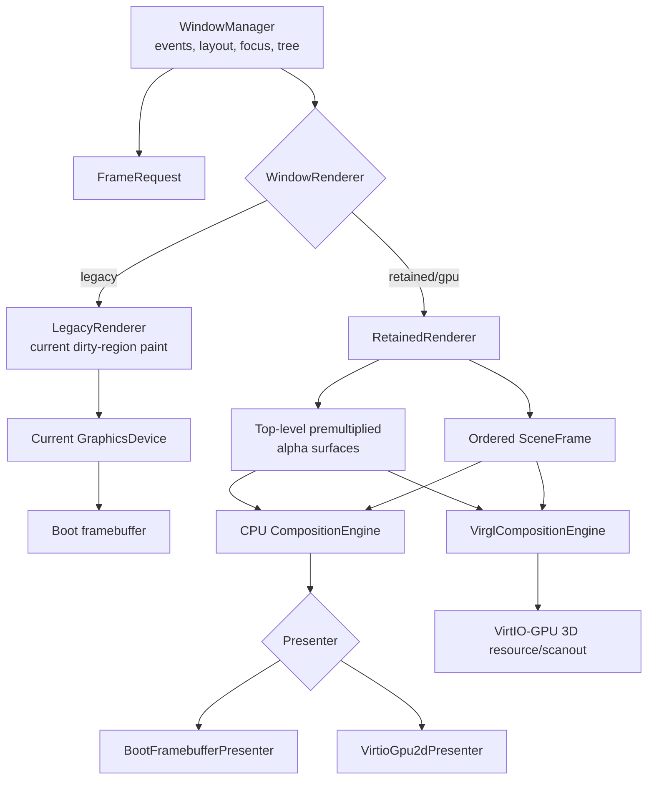

# feat: Add an optional retained GPU-capable compositor

## Implementation result

Implemented on 2026-07-17 with `legacy` still the default. The retained CPU
renderer, canonical premultiplied surfaces, backend-neutral scenes, opacity,
composition-only movement/property damage, CPU oracle, framebuffer presenter,
VirtIO-GPU 2D control/scanout foundation, cursor queue protocol, boot policy,
fallback diagnostics, statistics, host capability probing, and pure booted
tests are present.

The VirtIO-GPU 2D path was boot-proven on the selected stock Homebrew QEMU
11.0.1 with `virtio-vga`: the guest created a 1280x720 resource using
page-bounded DMA descriptor chains and selected `presenter=virtio-gpu-2d`
without falling back.

The accelerated VirGL engine is intentionally unavailable: the selected stock
macOS QEMU does not advertise a GL VirtIO-GPU device, so the plan's stop/go gate
stops before exposing accelerated mode. `gpu` therefore falls back to retained
CPU, and strict GPU mode fails. No stub is logged or presented as acceleration.
The pinned startergo/Linux render-readback proof remains required before that
gate can be opened.

## Summary

Add a second compositor implementation alongside the current immediate,
dirty-rectangle framebuffer compositor. The new compositor is retained: it
rasterizes each top-level window subtree into a premultiplied-alpha surface,
builds a scene of positioned layers, and delegates composition to a replaceable
engine. This creates the architectural boundary needed for opacity, rounded
corners, transforms, shadows, backdrop blur, and a later glass material without
regressing the existing desktop.

The implementation deliberately separates three concepts that are currently
combined behind `GraphicsDevice`:

1. **Window rasterization** — widgets paint their content into local surfaces.
2. **Composition** — surfaces are blended, transformed, clipped, and affected.
3. **Scanout/presentation** — the final image is made visible by the boot
   framebuffer or VirtIO-GPU.

The first retained engine is a CPU reference implementation. It is not called
GPU-accelerated: VirtIO-GPU 2D only transfers guest-rendered pixels to a host
resource. A later VirGL engine performs actual host-GPU composition when QEMU
advertises `VIRTIO_GPU_F_VIRGL`. The legacy compositor stays available and is
the fallback whenever retained/GPU initialization fails.

## Feasibility correction: macOS, QEMU, and “3D acceleration”

The motivating conversation conflates CPU virtualization and graphics
virtualization. QEMU's HVF accelerator speeds compatible guest CPU execution;
it does not expose Apple's `Virtualization.framework` graphics device or Metal
to this x86-64 kernel. AgenticOS must implement a guest graphics driver for a
device QEMU actually emulates.

The portable device contract is VirtIO-GPU:

- Its baseline 2D mode provides scanouts, guest-backed resources, damage
  transfer/flush, and an ARGB cursor queue. It does **not** perform alpha
  composition, blur, or 3D drawing for the guest.
- Its VirGL mode adds an opaque 3D command stream and offloads rendering to the
  host GPU. This requires a QEMU build with the VirGL backend and a usable host
  OpenGL stack.
- Rutabaga/gfxstream, Venus, and native-context paths are not the first target.
  They have larger guest stacks and QEMU currently documents their supported
  host paths primarily around Linux.

Local capability probing on 2026-07-17 found QEMU 11.0.1 at
`/opt/homebrew/bin/qemu-system-x86_64`. That binary exposes only TCG for x86-64,
the Cocoa display backend without a GL option, and `virtio-gpu-pci` /
`virtio-vga`; it does not contain `virtio-gpu-gl-pci`. Therefore this workspace
can develop and verify the retained CPU compositor and VirtIO-GPU 2D scanout,
but it cannot validate host-GPU composition with the currently installed stock
Homebrew QEMU.

The third-party
[`startergo/homebrew-qemu-virgl-kosmickrisp`](https://github.com/startergo/homebrew-qemu-virgl-kosmickrisp)
tap materially changes the macOS validation outlook. Its QEMU build enables
virglrenderer and OpenGL, patches Cocoa to consume borrowed VirGL scanout
textures, offers `gl=core` and `gl=es` (ANGLE/Metal) display modes, and publishes
an Apple Silicon bottle. Inspection of the v1.0.27 bottle found links to
OpenGL/libepoxy/virglrenderer and embedded `virtio-gpu-gl-pci` and
`virtio-vga-gl` devices. This makes it a credible optional macOS VirGL host for
AgenticOS's compositor-specific command stream.

It remains an experimental dependency until an AgenticOS end-to-end smoke test
passes. The tap's formula test only runs QEMU and qemu-img `--version`; its
virglrenderer dependency disables upstream tests; the current bottle targets
ARM64 macOS Sequoia; and source builds download moving QEMU master before
applying out-of-tree patches. The plan therefore starts from an exact reviewed
candidate, probes its actual capabilities, and promotes it to “known working”
only after the smoke test passes. Linux+virglrenderer remains an independent
validation host rather than treating the tap README as proof.

Reviewed candidate metadata:

- Tap release: `v1.0.27` (published 2026-01-14).
- Bottle: `qemu-1.0.27.arm64_sequoia.bottle.tar.gz`.
- Bottle SHA-256:
  `a2eaeed6f7b52661436052b413f596785c5e14e2e1b65cd5509713fcfc164566`.
- Reported upstream QEMU commit:
  `cf3e71d8fc8ba681266759bb6cb2e45a45983e3e`.
- Status: reviewed host candidate, **not** AgenticOS-validated.

CPU acceleration is a separate constraint. On this Apple Silicon Mac,
`qemu-system-x86_64 -accel help` exposes TCG only while
`qemu-system-aarch64` exposes HVF. AgenticOS remains an x86-64 TCG guest even
when its graphics commands are rendered by the host GPU; the tap's x86-64 HVF
example must not be copied into AgenticOS launch scripts.

## Goals

- Preserve the current compositor as a selectable, tested compatibility path.
- Add a retained compositor as a true alternative, not a conditional branch
  inside every legacy paint operation.
- Keep the existing `Window` hierarchy, event routing, layout, focus, and
  widget paint implementations usable by both compositors.
- Give the retained path premultiplied alpha from its first surface format.
- Group each top-level window subtree into one retained surface so moving,
  reordering, or changing opacity does not repaint its widgets.
- Separate composition from scanout so the retained CPU engine can present to
  either the boot framebuffer or VirtIO-GPU 2D.
- Add a VirtIO-GPU 2D driver with damage-aware scanout and hardware cursor
  support.
- Add an accelerated VirGL composition engine only after a capability-gated
  proof renders and reads back known alpha-blended output.
- Support a pinned, optional startergo QEMU binary as the first macOS VirGL
  validation host without replacing the stock QEMU used by normal workflows.
- Fall back deterministically from GPU -> retained CPU -> legacy, with a strict
  mode for integration tests and developers who want failures surfaced.
- Expose enough render statistics to compare repaint, upload, composition, and
  presentation cost instead of judging only by feel.
- Leave a direct extension point for a later glass material and backdrop-blur
  pass without implementing the final visual design in this change.

## Non-goals

- Removing or rewriting the current compositor.
- Making retained or GPU mode the default in the first release.
- Implementing the final glass theme, blur tuning, shadows, animations, or a
  new visual language. This plan establishes and proves the required mechanics.
- Exposing OpenGL, Vulkan, Metal, VirGL, or a general 3D API to ring-3 apps.
- Porting Mesa, DRM, Wayland, or a Linux graphics stack into AgenticOS.
- GPU passthrough, VFIO, or direct access to Apple GPU hardware.
- A macOS-only QEMU fork or a bespoke Metal bridge.
- Making the startergo tap, KosmicKrisp/Venus, or any third-party QEMU build a
  required repository/Conductor setup dependency.
- Multi-monitor support beyond parsing and representing the first enabled
  VirtIO-GPU scanout.
- Runtime switching after GUIShell has started. Selection happens at boot; a
  later change may make compositor replacement live.
- GPU-native widget rasterization. Existing widgets remain CPU-rasterized into
  surfaces; the GPU initially accelerates composition and effects.

## Requirements

### Compatibility and selection

- R1. `legacy`, `retained`, `gpu`, and `auto` compositor requests are accepted
  through QEMU `fw_cfg`; no request keeps `legacy` as the initial default.
- R2. Legacy mode preserves the current render, cursor save/restore, screenshot,
  and dirty-region behavior without routing through retained surfaces.
- R3. `auto` falls back GPU -> retained CPU -> legacy and records one concise
  reason per failed level. `gpu` does the same unless strict mode is enabled.
- R4. Strict GPU mode exits initialization with a diagnostic/test failure when
  the device, feature, capset, or smoke test is unavailable.
- R5. A compositor failure never leaves a partially initialized window manager
  or a black screen when the boot framebuffer is available.

### Retained surfaces and scene

- R6. Each visible top-level window subtree is represented by one retained
  surface; child widgets paint into their top-level ancestor's local coordinate
  space using the existing render-tree order and clipping rules.
- R7. Surfaces use premultiplied ARGB8888 (or byte-equivalent BGRA on little
  endian) with a transparent clear value. Pixel-format conversion occurs only
  at upload/presentation boundaries.
- R8. Content invalidation repaints only the affected local surface region.
  Position, z-order, opacity, and transform changes damage composition but do
  not repaint surface content.
- R9. Scene layers carry stable surface identity, absolute bounds, source clip,
  z-order, opacity, transform, visibility, and effect metadata.
- R10. The first production effect is layer opacity with source-over blending.
  A test-only alpha mask proves per-pixel transparency. Backdrop blur remains a
  later effect implementation behind the same scene contract.
- R11. The retained cursor is a topmost layer or a VirtIO hardware cursor; it
  never uses framebuffer background save/restore.
- R12. Surface allocation is budgeted, overflow-safe, and observable. The
  compositor may evict/re-rasterize hidden surfaces but must not silently fall
  back to corrupt or partially allocated storage.

### Scanout and VirtIO-GPU 2D

- R13. Presentation is abstracted from drawing. The boot-framebuffer presenter
  and VirtIO-GPU presenter consume the retained CPU engine's composed output.
- R14. The VirtIO-GPU driver negotiates only understood features, initializes
  controlq and cursorq, obtains display information, and selects one enabled
  scanout.
- R15. The 2D path implements resource creation, guest backing attachment,
  `SET_SCANOUT`, `TRANSFER_TO_HOST_2D`, and `RESOURCE_FLUSH`, with exact damage
  rectangles and checked response types.
- R16. Mode changes and display events either rebuild scanout resources safely
  or fall back; they never reuse dimensions/strides from stale resources.
- R17. The hardware cursor path uses the dedicated cursor queue and ARGB cursor
  resource, with retained-layer cursor as the fallback.
- R18. Device reset, queue timeout, malformed response, and unsupported format
  are recoverable initialization errors, not panics.

### Accelerated composition

- R19. GPU mode is exposed only when `VIRTIO_GPU_F_VIRGL` is negotiated and the
  required VirGL capset passes a version/capability allowlist.
- R20. The initial accelerated backend supports surface texture upload,
  premultiplied source-over quad composition, scissoring/damage, one offscreen
  render target, synchronization, scanout, and readback.
- R21. The VirGL command encoder is isolated from the window system and records
  the exact upstream protocol/version provenance of every vendored definition.
- R22. The accelerated backend and CPU reference backend render a deterministic
  scene fixture within a defined pixel tolerance.
- R23. A device loss, rejected command, fence timeout, or failed smoke test
  tears down GPU resources and replays the current scene through retained CPU
  or legacy mode.
- R24. The compositor is not described as GPU-accelerated in logs/docs unless
  frames are actually submitted through the accelerated engine.

### Observability and tests

- R25. Per-frame counters include windows rasterized, surface pixels updated,
  layers composed, texture bytes uploaded, output pixels damaged, presents,
  and selected engine/presenter.
- R26. Pure scene, alpha, damage, memory-budget, and protocol-layout tests run
  under the existing booted `./test.sh` suite without requiring a GL-capable
  host.
- R27. Device integration tests are filterable and explicit: 2D tests require
  VirtIO-GPU; VirGL tests require the accelerated device and strict mode. A
  pinned startergo macOS host and Linux+virglrenderer are separate validation
  targets, not substitutes for one another.
- R28. The opaque retained reference scene matches legacy screenshots at fixed
  coordinates before any production window opts into transparency.

## Key technical decisions

### Keep a real legacy path

Do not turn the current compositor into a retained compositor hidden behind
feature flags. Extract it behind a `WindowRenderer` boundary with behavior
preserved, then add `RetainedRenderer` as a sibling. This keeps bisectability,
provides a rescue path on real hardware, and prevents GPU abstractions from
infecting boot/panic rendering.

The window manager continues to own input, focus, layout, interaction state,
screen selection, and the window registry. A renderer receives the active
window tree plus a prepared `FrameRequest`; it does not handle events.

### Retain top-level subtrees, not every widget

Creating a texture for every button, label, and text cell would multiply
allocation and submission overhead under the current 128 MiB guest. Instead:

- The desktop is one opaque surface.
- Each top-level frame plus its child widgets is one surface.
- Popups, menus, modal overlays, and the cursor are independent layers when
  their z-order/lifetime requires it.
- The subtree is rasterized with the same child traversal and clip logic used
  today, translated into surface-local coordinates. Traversal stops at nested
  layer roots, so the desktop surface does not also paint its frame/popup
  children and duplicate their pixels.

This is sufficient for window-level opacity, transforms, shadows, and glass.
Widget-level retained layers can be added later only where animation or
independent effects justify the cost.

### Canonical surface format is premultiplied alpha

`WindowBuffer` is framebuffer-native and effectively opaque. Reusing it as the
new canonical surface would bake the legacy scanout format into scene content
and make blending error-prone. Introduce a distinct `Surface` using canonical
premultiplied ARGB8888. Keep `WindowBuffer` for the legacy wallpaper cache.

Premultiplied alpha is the compositor contract because source-over blending,
linear filtering at transparent edges, and blur passes behave predictably.
Existing `Color` and opaque `GraphicsDevice` methods remain. A new
`SurfaceCanvas` implements those methods as opaque writes and adds internal
RGBA/mask operations for retained-aware windows and tests.

### Scene is backend-neutral

The renderer produces a flat, ordered `SceneFrame` from the window hierarchy.
Composition engines see surface handles and layer properties, never `dyn
Window`. This avoids putting QEMU/VirGL concepts into widgets and makes the CPU
engine the executable specification for the GPU engine.

Directional shape:

```text
FrameRequest
  repaint_damage: [Rect]
  composition_damage: [Rect]
  cursor: CursorState

SceneFrame
  output_size
  layers[]:
    surface_id
    source_rect
    destination_rect
    clip_rect
    opacity
    transform_2d
    effect
    z_index

CompositionEngine
  create_surface(desc) -> SurfaceId
  update_surface(id, damage, premul_pixels)
  destroy_surface(id)
  compose(scene, damage, presenter) -> RenderStats
  readback() -> Snapshot
```

### Separate engine from presenter

`CpuCompositionEngine` blends into guest RAM, then calls a `Presenter`:

- `BootFramebufferPresenter` converts/copies damaged rows into the existing
  boot framebuffer.
- `VirtioGpu2dPresenter` transfers damaged rows into a guest-backed resource
  and flushes the scanout.

`VirglCompositionEngine` owns GPU textures and a GPU render target. It submits
the scene through the VirtIO-GPU 3D context and presents that resource. It does
not pretend to be a `GraphicsDevice` and it does not route quad draws through
per-pixel trait calls.

### CPU retained mode is a product path, not throwaway scaffolding

The CPU engine enables transparency on macOS with stock QEMU, serves as the
pixel-correct oracle for accelerated output, supports real hardware that has
only a framebuffer, and is the runtime fallback after GPU loss. It therefore
receives the same damage tracking, memory budgeting, snapshot, and quality
standards as the GPU path.

### VirGL begins with a stop/go spike

VirtIO standardizes the transport and 3D command submission, but the submitted
VirGL stream is an external Gallium-oriented protocol. Implementing a general
driver is well beyond this feature. Before exposing GPU mode, build the
smallest compositor-specific proof:

1. Negotiate `VIRTIO_GPU_F_VIRGL` and query the chosen capset.
2. Create a context, scanout/render-target resource, and texture resource.
3. Upload a 2x2 premultiplied texture.
4. Render overlapping opaque and half-alpha quads through fixed compositor
   shaders/state.
5. Fence, present, read back, and compare known pixels.
6. Repeat resource creation/destruction enough times to catch lifetime errors.

If this cannot be made reliable without importing a substantial Mesa stack,
the spike stops. Retained CPU + VirtIO-GPU 2D still ships, `gpu` remains
unavailable, and a follow-up evaluates a different virtual GPU protocol. No
stub GPU mode is accepted.

The first macOS proof uses the startergo tap's VirGL/ANGLE path, not its Venus
path. Venus/KosmicKrisp is a Vulkan transport whose documented guest flow
assumes Linux Mesa; it does not remove AgenticOS's need for a guest command
encoder and is a larger first target. Prefer Cocoa `gl=es` to exercise
ANGLE/Metal, with `gl=core` retained as a diagnostic comparison against Apple's
desktop OpenGL implementation.

### Configuration is runtime policy delivered by `fw_cfg`

`build.sh` translates host environment into QEMU configuration:

```sh
AGENTICOS_COMPOSITOR=legacy   ./build.sh   # current path
AGENTICOS_COMPOSITOR=retained ./build.sh   # retained scene, CPU engine
AGENTICOS_COMPOSITOR=auto     ./build.sh   # best available, fallback allowed
AGENTICOS_COMPOSITOR=gpu AGENTICOS_GPU_STRICT=1 ./build.sh

# Optional explicit candidate/custom host binary; preflight verifies metadata.
AGENTICOS_QEMU_BIN="$(brew --prefix startergo/qemu-virgl-kosmickrisp/qemu)/bin/qemu-system-x86_64" \
AGENTICOS_QEMU_GL=es \
AGENTICOS_COMPOSITOR=gpu \
AGENTICOS_GPU_STRICT=1 \
./build.sh
```

The request is passed as `opt/agenticos/compositor`; strictness is passed as a
second boolean key. `.conductor/run.sh` already delegates to `build.sh`, so the
same environment variables work per workspace without changing shared
Conductor settings. `AGENTICOS_QEMU_BIN` defaults to the first
`qemu-system-x86_64` on `PATH`; it is never inferred by installing, unlinking,
or replacing a Homebrew formula. The selected binary path and version are
printed before launch.

For a VirtIO scanout, the QEMU launch helper explicitly selects the appropriate
`virtio-vga` / `virtio-vga-gl` device and avoids an accidental second default
VGA device. Exact device spelling is probed from `-device help`; unsupported
explicit GPU requests fail before QEMU launch, while `auto` warns and falls
back. The bootloader-visible `virtio-vga` variant is preferred during bring-up
so early boot and panic output retain a VGA-compatible framebuffer before the
VirtIO driver takes over.

On the startergo host path, the expected accelerated combination is
`-display cocoa,gl=es -device virtio-vga-gl`. `gl=core` is a fallback diagnostic
mode. The non-GL `virtio-gpu-pci` example in the tap README is insufficient for
AgenticOS GPU mode: the guest must negotiate `VIRTIO_GPU_F_VIRGL`, and strict
mode rejects a device that does not advertise it. Never add `-accel hvf` to the
x86-64 launch on Apple Silicon; use TCG explicitly or leave QEMU's supported
default in place.

## High-level design



### Retained frame lifecycle

1. Window manager drains deferred invalidations, processes interaction state,
   runs `prepare_for_render`, and computes absolute render order as today.
2. It produces separate repaint damage (surface contents changed) and
   composition damage (surface moved, opacity/effect/z-order/cursor changed).
3. Retained renderer maps invalidated descendants to their top-level surface
   and repaints only the local damaged portions using `SurfaceCanvas`.
4. It uploads only changed surface regions to the active composition engine.
5. It builds the ordered scene from top-level roots, popup/modal layers, and
   cursor state.
6. The engine recomposes composition-damaged output regions. Effects may widen
   damage by their sampling radius; opacity alone does not.
7. The presenter makes the damaged output visible.
8. Frame statistics and completion/fence state are committed; only then is
   damage cleared.

## Host/backend support matrix

| Environment | Legacy | Retained CPU | VirtIO-GPU 2D scanout | VirGL composition |
|---|---:|---:|---:|---:|
| Current stock Homebrew QEMU 11.0.1 on Apple Silicon | Yes (TCG) | Yes (TCG) | Yes; boot-proven with `virtio-vga` | No (`virtio-gpu-gl` absent) |
| Pinned startergo v1.0.27 tap on compatible Apple Silicon macOS | Yes (TCG) | Yes (TCG) | Candidate | Candidate via Cocoa `gl=es`; strict smoke test required |
| Other future/custom compatible macOS QEMU | Yes | Yes | Capability-gated | Capability-gated, not assumed |
| Linux QEMU + virglrenderer | Yes | Yes | Yes | Independent accelerated reference host |
| Bare metal framebuffer only | Yes | Yes | No | No |

## Output structure

The exact split may adjust for Rust borrow ergonomics, but module ownership
must preserve these boundaries:

```text
src/
  drivers/
    virtio/
      common.rs                     queue/chained-descriptor extensions
      gpu/
        mod.rs                      discovery, feature negotiation, lifecycle
        protocol.rs                 spec-layout request/response structs
        control.rs                  synchronous controlq commands + validation
        scanout.rs                  2D resources, display events, presenter
        cursor.rs                   cursorq resource/update/move
        virgl.rs                    context/capset/submit transport only
  graphics/
    surface.rs                      premultiplied Surface, damage, budget types
    scene.rs                        SceneFrame, Layer, transform/effect metadata
    composition/
      mod.rs                        CompositionEngine and capability contracts
      cpu.rs                        reference source-over compositor
      virgl/
        mod.rs                      accelerated engine and resource cache
        commands.rs                 provenance-pinned command encoder
        shaders.rs                  fixed compositor shaders/state
    present/
      mod.rs                        Presenter contract
      boot_framebuffer.rs           damaged-row conversion/copy
      virtio_gpu.rs                 adapter over drivers::virtio::gpu::scanout
  window/
    renderer/
      mod.rs                        WindowRenderer selection and FrameRequest
      legacy.rs                     behavior-preserving extracted path
      retained.rs                   surface cache, subtree raster, scene build
    graphics.rs                     keep GraphicsDevice/WindowBuffer legacy API
    manager.rs                      frame preparation; delegates rendering
    types.rs                        compositor request/properties as needed
  tests/
    retained_scene.rs
    surface_alpha.rs
    composition_cpu.rs
    compositor_selection.rs
    virtio_gpu_protocol.rs
    virtio_gpu_integration.rs

build.sh                             compositor env -> fw_cfg/device args
test.sh                              optional device args for integration filter
docs/window_system_design.md         dual-compositor architecture
src/{graphics,drivers,window}/CLAUDE.md
```

## Implementation sequence

Each phase ends green and leaves `legacy` bootable. Do not land the entire
design as one unreviewable compositor rewrite.

### Phase 0 — baselines, contracts, and capability probes

#### U0. Record visual/performance baselines

- Capture deterministic legacy screenshots for the default desktop, overlapping
  frames, popup/menu, terminal text, partial off-screen window, and cursor.
- Add counters around current repaint and present paths without changing their
  behavior.
- Record guest memory use and frame cost for idle, terminal scroll, drag, and
  popup open/close at the default resolution.
- Preserve the fixtures as retained/accelerated comparison inputs.

Verification: unfiltered `./test.sh` stays green and baseline hashes/selected
pixel probes are documented. Cursor animation is compared separately because
its position is dynamic.

#### U1. Add QEMU capability probing and boot policy parsing

- Extend the existing `fw_cfg` support from test-only filtering to small
  read-only boot policy keys available in normal builds.
- Parse `CompositorRequest::{Legacy, Retained, Gpu, Auto}` and strictness before
  display/window-manager initialization.
- Add a shell helper that probes QEMU device names/options instead of assuming
  every build contains VirGL.
- Add `AGENTICOS_QEMU_BIN` and `AGENTICOS_QEMU_GL` launch policy. Resolve the
  explicit binary once, require it to be executable, and use that exact path
  for version/help probes and launch so stock and startergo QEMU installations
  cannot be mixed accidentally.
- For GPU mode on macOS, require the chosen binary to advertise Cocoa's selected
  GL mode and `virtio-vga-gl` (or a separately justified GL device). Reject the
  plain `virtio-gpu-pci` device as proof of acceleration.
- Record a pinned startergo release/tag, bottle checksum, QEMU upstream commit,
  and host architecture/version in the integration log. Do not install or
  replace Homebrew packages from `build.sh` or Conductor setup.
- Log requested mode, selected renderer, composition engine, presenter, and
  fallback reason as separate fields.

Tests: valid/invalid/missing `fw_cfg` values, strict vs fallback policy, and
QEMU-argument construction as a shell-level testable function. Add fake help
outputs for stock QEMU, the pinned startergo device set, missing Cocoa GL, and a
binary-path mismatch.

### Phase 1 — extract the renderer boundary with no pixel changes

#### U2. Split frame preparation from legacy rendering

- Move input-independent frame preparation into a `FrameRequest` builder:
  pending invalidations, popup changes, `prepare_for_render`, cascade, absolute
  bounds, repaint damage, cursor state, and presentation damage.
- Move the existing render/present body into `LegacyRenderer` with its current
  `Compositor`, `CursorRenderer`, and `GraphicsDevice` behavior preserved.
- Keep `WindowManager` as the sole owner of window/event state; renderers receive
  only the active tree/registry view and prepared request they need.
- Resolve borrow pressure by introducing a small `WindowTreeView`/split state,
  not by adding global mutable renderer state.

Tests: the U0 fixtures match; existing window-manager dirty/cascade tests pass
unchanged; legacy cursor save/restore and partial flush regions are identical.

#### U3. Add renderer selection and atomic initialization

- Add a concrete selection/factory layer for legacy and retained renderers.
- Build a candidate renderer completely before installing it in the global
  window manager.
- Implement fallback without discarding window state: initialization fallback
  happens before the desktop is built; runtime GPU fallback retains CPU surface
  copies and scene metadata.
- Keep legacy as default until the final rollout unit.

Tests: forced initializer failure at every stage selects the expected fallback
and leaves one valid renderer installed.

### Phase 2 — retained CPU compositor

#### U4. Introduce canonical alpha surfaces and budgeting

- Add overflow-checked `SurfaceDesc`, `SurfaceId`, `Surface`, local damage, and
  `SurfaceBudget` types.
- Store premultiplied 8-bit channels with explicit conversion/blend helpers.
- Implement transparent clear, opaque pixel writes, RGBA writes, row access,
  resize, and damaged-region iteration.
- Track bytes by visible, hidden, and output surfaces. Begin with a configurable
  cap sized from available heap; emit diagnostics before eviction/failure.

Tests: allocation overflow, zero sizes, premultiplication round trips, alpha 0/
255, half-alpha source-over, stride, clipping, resize, damage merge, budget
rejection, and hidden-surface eviction ordering.

#### U5. Rasterize top-level window subtrees into surfaces

- Implement `SurfaceCanvas` as the retained raster target for existing opaque
  `GraphicsDevice` primitives.
- Identify layer roots (desktop, top-level frames, popups/modals, cursor) from
  the current hierarchy; do not assign a surface to every child. When painting
  one root, stop recursion at child roots that own their own surface.
- Translate child bounds and clips into the layer-root coordinate space.
- Map descendant invalidation/hints to surface-local damage and repaint only
  those portions in existing z-order.
- Preserve `TextWindow` dirty-cell behavior and the desktop wallpaper cache
  semantics; avoid copying the legacy framebuffer-native `WindowBuffer` into
  the canonical API.

Tests: nested coordinates, off-screen roots, overlapping children, partial text
damage, popup z-order, hidden roots, resize, and no repaint on position-only or
opacity-only changes.

#### U6. Build backend-neutral scenes

- Add stable layer/surface identity and scene properties with opaque defaults.
- Separate repaint damage from composition damage.
- Widen composition damage for transforms/effect sampling bounds, with opacity
  and translation as the only enabled production properties initially.
- Express cursor as the final scene layer in retained boot-framebuffer mode.

Tests: deterministic scene order matches hit-test/render order, movement damages
old+new bounds, z-order damages affected overlap, opacity damages bounds without
surface repaint, and child invalidation maps to its root surface.

#### U7. Implement the CPU reference engine and framebuffer presenter

- Composite premultiplied surfaces source-over in scene order into a canonical
  output buffer, clipped to composition damage.
- Add an opaque fast path and row-copy path for the desktop/fully opaque layers.
- Convert only damaged output rows to the boot framebuffer's `PixelFormat`.
- Implement retained snapshots from the composed output.
- Add a synthetic translucent overlay fixture that proves the architecture;
  do not change production window styling yet.

Acceptance:

- Fixed opaque scenes match legacy pixel probes/screenshots.
- A 50% red layer over blue produces the CPU oracle value within integer
  rounding tolerance.
- Moving an unchanged frame updates composition but records zero widget/surface
  repaint.
- Retained cursor movement does not repaint windows or restore saved background.

### Phase 3 — VirtIO-GPU 2D scanout (modern presentation, not acceleration)

#### U8. Harden shared VirtIO/PCI primitives needed by GPU

- Add VirtIO GPU PCI ID discovery (device type 16 / modern PCI ID), cached PCI
  enumeration, chained descriptors, separate readable/writable request chains,
  used-length validation, and bounded synchronous completion.
- Fix any BAR sizing/capability assumptions uncovered by a multi-queue device.
- Preserve the existing tablet driver and add regression coverage for its
  queue behavior.

Tests: protocol-agnostic virtqueue chain construction/recycling, response
lengths, wraparound, timeout, and mock MMIO feature negotiation.

#### U9. Implement VirtIO-GPU controlq and 2D resources

- Define little-endian protocol structs/constants directly from VirtIO 1.3,
  with compile-time size/alignment assertions.
- Implement `GET_DISPLAY_INFO`, optional `GET_EDID`, `RESOURCE_CREATE_2D`,
  `RESOURCE_ATTACH_BACKING`, `SET_SCANOUT`, `TRANSFER_TO_HOST_2D`,
  `RESOURCE_FLUSH`, detach/unref, and display-event acknowledgement.
- Use guest-owned, physically described backing pages; do not assume heap
  virtual addresses are one contiguous physical DMA range.
- Validate response type, fence/context fields where relevant, rectangle bounds,
  format, and resource lifetime on every command.

Tests: serialized request bytes, mocked response validation/error mapping,
scatter-gather backing entries, cleanup after each partial-init failure, and a
strict QEMU boot test that paints a known checkerboard.

#### U10. Add VirtIO presenter and hardware cursor

- Present CPU-composed damage by copying/converting into the 2D resource,
  issuing `TRANSFER_TO_HOST_2D`, then `RESOURCE_FLUSH` for the same rectangles.
- Implement cursorq update/move with the current 12x12 cursor as an ARGB
  resource; switch atomically from retained cursor layer after successful setup.
- Handle resolution/display changes by allocating a replacement resource before
  detaching the old scanout.
- Keep the boot framebuffer presenter alive until the first successful
  VirtIO-presented frame.

Acceptance: retained desktop, drag, terminal scroll, popup, and cursor render
correctly through `virtio-vga`; damage counters show partial transfers; forced
queue errors return to the boot framebuffer presenter.

### Phase 4 — accelerated VirGL composition, behind a hard gate

#### U11. VirGL transport and alpha-quad spike

- Extend the GPU driver with feature/capset discovery, context create/destroy,
  3D resource lifecycle, attach/detach, command submit, fence/completion, and
  readback primitives.
- Source the narrow command-stream definitions from an upstream, license-
  compatible VirGL version and record commit/version plus local deviations.
- Encode only the state needed by the stop/go proof: render target, texture,
  sampler, viewport/scissor, premultiplied blend, vertex data, fixed shaders,
  clear, and draw.
- Run the first macOS proof with the pinned startergo bottle, Cocoa `gl=es`,
  `virtio-vga-gl`, x86-64 TCG, and strict mode. Confirm inside AgenticOS that
  `VIRTIO_GPU_F_VIRGL` and the expected capset are actually advertised before
  submitting commands; host device-name presence alone is not acceptance.
- Repeat the same guest fixture on Linux QEMU+virglrenderer as an independent
  protocol/reference result. Use Cocoa `gl=core` only to diagnose whether a
  failure is specific to ANGLE/Metal.
- Keep Venus/KosmicKrisp disabled for this spike. Reconsider it only in a
  separate plan if the narrow VirGL encoder fails its stop/go gate.
- Run the proof described under “VirGL begins with a stop/go spike.”

Stop/go acceptance: known output passes repeatedly on the supported integration
hosts with clean resource teardown and no host renderer errors. A passing Mac
result makes the startergo release a supported optional developer toolchain for
that pinned host matrix; it does not make it a mandatory dependency. If the
proof fails or requires a general Mesa port, end this phase and keep GPU mode
unavailable.

#### U12. Implement `VirglCompositionEngine`

- Cache one host texture per retained surface and upload only surface damage.
- Maintain one output render target plus one reusable offscreen target for later
  effects.
- Draw scene quads in order with scissoring and premultiplied blending.
- Implement synchronization without a global busy-spin; bound waits and surface
  errors through the fallback controller.
- Read back deterministic integration frames and compare them with the CPU
  oracle. Use exact comparison for opaque nearest-neighbor scenes and a small
  documented tolerance for filtered/alpha output.
- Keep CPU surface copies while GPU mode is active so runtime fallback can
  recompose immediately.

Acceptance: default desktop and alpha fixture match CPU reference; moving a
window submits composition work without widget repaint or full texture upload;
injected context/device failure falls back and preserves visible state.

### Phase 5 — transparency-ready window policy and rollout

#### U13. Expose safe layer properties without applying the glass theme

- Add compositor properties to the appropriate top-level window/base type with
  opaque/identity defaults and invalidation semantics.
- Allow opacity and a test/demo translucent panel. Reserve effect capability
  negotiation (`BackdropSample`, offscreen pass, sampling radius) without
  claiming blur support until implemented.
- Ensure hit-testing remains based on geometry by default; alpha-aware click-
  through is a separate policy, not inferred from transparent pixels.
- Document how a future glass frame will request backdrop content, blur it,
  tint it, mask rounded corners, and composite foreground content.

Tests: property changes cause composition-only damage; legacy ignores unsupported
properties with an explicit capability result rather than rendering corruptly.

#### U14. Operational docs, performance gates, and default policy

- Update subsystem guidance and `docs/window_system_design.md` with the dual
  compositor, canonical surface format, ownership, fallback, and host matrix.
- Add serial diagnostics and an in-kernel renderer-state snapshot suitable for
  future MCP exposure.
- Document QEMU packages/builds known to provide 2D and VirGL modes.
- Compare U0 baselines. Retained mode must not regress idle CPU, terminal input,
  or drag latency beyond agreed thresholds before wider rollout.
- Keep `legacy` as default for the first merge. A later, data-backed change may
  set `auto` or `retained` as default; that is not hidden in this plan.

## Validation commands

During implementation, use the smallest applicable check first, then the full
booted suite:

```sh
cargo fmt -- --check
cargo check
./test.sh retained_scene surface_alpha composition_cpu compositor_selection
./test.sh virtio_gpu_protocol
./test.sh

# Explicit integration paths once their phases exist:
AGENTICOS_COMPOSITOR=retained ./build.sh
AGENTICOS_COMPOSITOR=auto ./build.sh
AGENTICOS_COMPOSITOR=gpu AGENTICOS_GPU_STRICT=1 ./build.sh

# Optional startergo macOS VirGL proof (path is explicit; preflight checks pin):
AGENTICOS_QEMU_BIN="$(brew --prefix startergo/qemu-virgl-kosmickrisp/qemu)/bin/qemu-system-x86_64" \
AGENTICOS_QEMU_GL=es \
AGENTICOS_COMPOSITOR=gpu \
AGENTICOS_GPU_STRICT=1 \
./build.sh
```

`test.sh` normally uses `-display none`, so pure protocol/scene tests must not
depend on a host window. Device integration tests use serial assertions and
`isa-debug-exit`; visual Cocoa output is a manual supplement, not the oracle.

## Memory and performance budget

At 1280x720, one ARGB8888 full-screen surface is about 3.52 MiB; an 800x600
frame surface is about 1.83 MiB. Retaining a desktop, several frames, CPU output,
and a VirtIO staging buffer can consume tens of MiB in a 128 MiB guest.

The implementation must therefore:

- Retain top-level subtrees only.
- Avoid allocating the legacy 8 MiB double buffer when the retained presenter
  does not use it.
- Reuse output/staging storage where ownership and DMA allow.
- Use checked size calculations and a visible surface budget.
- Evict hidden/reconstructible surfaces before failing visible allocations.
- Track peak guest surface bytes and host texture bytes separately.
- Never increase QEMU `-m` merely to conceal an unbounded surface cache. A later
  deliberate memory-default change may be justified by measured workloads.

Initial performance gates should be expressed relative to the U0 baseline on
the same host because TCG and framebuffer performance vary significantly:

- Idle retained compositor exits without composing/presenting.
- Moving an unchanged window rasterizes zero widget pixels.
- Cursor-only movement rasterizes zero window pixels.
- VirtIO 2D transfers only merged presentation damage outside full repaint.
- GPU mode uploads no unchanged surface bytes during movement/z-order changes.

## Failure and fallback model

| Failure | Required behavior |
|---|---|
| Invalid compositor request | Warn once; select legacy unless strict policy says fail |
| Retained surface allocation fails at boot | Tear down candidate; initialize legacy |
| VirtIO-GPU absent/unsupported | Use boot framebuffer presenter |
| GPU response malformed or times out during init | Reset/tear down device; do not install candidate |
| VirGL feature/capset absent | Use retained CPU; never log “GPU accelerated” |
| VirGL smoke test/readback differs | Strict mode fails; auto mode uses retained CPU |
| GPU context/device fails at runtime | Preserve CPU surfaces, recompose with CPU, present via available presenter |
| VirtIO display mode changes | Build replacement resources atomically or fall back |
| Screenshot/readback unavailable | Return structured error; do not expose stale legacy framebuffer bytes |

Panic rendering remains on the boot framebuffer where available. The panic path
must not acquire compositor, VirtIO, heap-heavy scene, or GPU synchronization
locks.

## Risks and mitigations

| Risk | Impact | Mitigation |
|---|---|---|
| Calling VirtIO-GPU 2D “acceleration” hides that composition is still on CPU | Wrong expectations and design decisions | Separate engine/presenter names and R24 logging rule |
| Renderer extraction changes legacy pixels | Removes trusted fallback | U0 fixtures; land extraction before retained code |
| Per-widget textures exhaust 128 MiB guest | OOM/fragmentation | Top-level subtree surfaces and explicit budget |
| Premultiplied/straight-alpha mismatch creates dark halos | Visible corruption around glass edges | Canonical premultiplied format and focused blend/filter tests |
| Dirty damage misses effect sampling outside bounds | Trails/stale blur | Effect metadata reports damage expansion radius |
| `WindowManager` borrow pressure produces unsafe global aliases | Memory unsafety/deadlocks | Split tree/frame state; no `static mut` renderer escape hatch |
| Existing VirtIO queue only supports one-buffer requests | GPU commands corrupt DMA chains | U8 chained readable/writable descriptors before GPU driver |
| Heap pages are not physically contiguous | Host reads wrong backing pixels | Explicit scatter-gather backing entries from translated pages |
| Stock macOS QEMU lacks VirGL | Accelerated path unavailable in normal local setup | CPU product path; optional explicit startergo binary; capability gate |
| Startergo bottle is not functionally GPU-tested by its formula/CI | Device may exist but fail at real rendering | AgenticOS alpha-quad/readback smoke test in strict mode |
| Startergo bottle targets ARM64 Sequoia while developer OS versions move | Bottle may not pour/run or may hit dependency ABI issues | Pin/checksum working release, log host version, keep stock QEMU and Linux reference |
| Startergo source build downloads QEMU master and applies out-of-tree patches | Non-reproducible build or patch breakage | Prefer pinned bottle; never auto-build in setup; record upstream commit |
| README x86-64 HVF example is copied on Apple Silicon | QEMU launch fails because cross-architecture HVF is unavailable | Probe accelerators; keep x86-64 AgenticOS on TCG |
| Narrow VirGL encoder grows into a Mesa reimplementation | Unbounded scope/maintenance | U11 stop/go gate and fixed compositor-only feature set |
| GPU runtime loss leaves black scanout | User loses desktop | Keep CPU surface copies and boot/2D presenter fallback |
| Retained CPU is slower than legacy for opaque workloads | New mode feels like regression | Opaque row-copy fast paths, damage-only composition, measured rollout |

## Future glass phase enabled by this plan

Once the retained compositor is stable, a glass window does not ask each widget
to blend against whatever pixels happen to be in a framebuffer. It becomes an
ordered compositor operation:

1. Compose layers behind the glass window into an offscreen/backdrop texture.
2. Expand damage by the blur radius and blur the sampled backdrop (typically
   separable horizontal/vertical passes).
3. Apply tint, saturation/noise, opacity, and a rounded-corner mask.
4. Composite the frame's retained foreground/content surface above it.
5. Add shadow/border passes with their own damage expansion.

The CPU engine can implement a low-quality/reference box or separable blur for
correctness and fallback. The VirGL engine can implement the same effect with
shader passes. Glass itself should be a follow-up plan with visual requirements,
quality/performance budgets, and theme decisions; it should not be smuggled into
the GPU bring-up.

## External references

- QEMU VirtIO-GPU documentation:
  https://www.qemu.org/docs/master/system/devices/virtio/virtio-gpu.html
- VirtIO 1.3 GPU device specification, section 5.7:
  https://docs.oasis-open.org/virtio/virtio/v1.3/virtio-v1.3.html#x1-3700007
- QEMU display/backend invocation documentation:
  https://www.qemu.org/docs/master/system/invocation.html#display-options
- startergo macOS QEMU/VirGL tap:
  https://github.com/startergo/homebrew-qemu-virgl-kosmickrisp
- startergo QEMU formula (build flags, active patches, bottle metadata):
  https://github.com/startergo/homebrew-qemu-virgl-kosmickrisp/blob/master/Formula/qemu.rb
- startergo active texture-borrowing/Cocoa GL patch:
  https://github.com/startergo/homebrew-qemu-virgl-kosmickrisp/blob/master/patches/qemu-texture-borrowing.patch
- pinned v1.0.27 release reviewed by this plan:
  https://github.com/startergo/homebrew-qemu-virgl-kosmickrisp/releases/tag/v1.0.27
- startergo virglrenderer formula:
  https://github.com/startergo/homebrew-virglrenderer/blob/master/Formula/virglrenderer.rb
