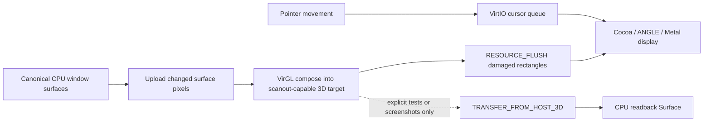

# perf: Remove synchronous VirGL readback with direct scanout

## Outcome

Stop transferring the completed 1280x720 VirGL render target back into guest
RAM on every interactive frame. The production VirGL path should render into a
scanout-capable 3D resource, flush that resource directly to the QEMU display,
and retain synchronous readback only as an explicit operation for tests and
future screenshots.

This is a latency and ownership change, not a new rendering feature. Classic
VirGL composition remains the first supported scene. GPU Aero blur and direct
ring-3 GL remain out of scope.

## Problem statement

The current VirGL compositor performs five expensive steps on every frame:

1. create and upload textures for every visible retained surface;
2. render a complete output texture;
3. wait for a fenced 3D submission;
4. issue `VIRTIO_GPU_CMD_TRANSFER_FROM_HOST_3D` for the entire output and copy
   3,686,400 BGRA bytes into the canonical CPU `Surface`;
5. convert/copy damaged pixels once more through `BootFramebufferPresenter`.

`VirglCompositionEngine::compose` currently ignores its `damage` argument, so
even cursor-only movement pays the full render/readback path. On Apple Silicon,
the x86-64 guest also executes under TCG, magnifying every guest-side copy and
per-pixel conversion.

The framebuffer presenter contributes to the cost, but removing only that
presenter would still leave the synchronous host-GPU readback. The target is
therefore GPU-native scanout, not a faster copy of the readback result.

## Protocol basis and host constraint

VirtIO 1.3 defines `VIRTIO_GPU_CMD_SET_SCANOUT` to associate a resource with a
display and `VIRTIO_GPU_CMD_RESOURCE_FLUSH` to publish a resource's changed
rectangle. QEMU's VirGL backend offloads 3D rendering to virglrenderer. The
pinned virglrenderer protocol defines `VIRGL_BIND_SCANOUT = 1 << 18`; the
output resource must combine it with `VIRGL_BIND_RENDER_TARGET`.

The exact custom macOS QEMU remains a special constraint. Its Cocoa frontend
has already shown a black window for the plain 2D scanout path. A successful
command response is therefore not sufficient evidence that direct 3D scanout
works. The first milestone must prove host-visible pixels on this exact
QEMU/ANGLE/Metal stack before renderer interfaces are changed.

Primary references:

- VirtIO 1.3 GPU device, scanout, flush, fencing, and cursor commands:
  https://docs.oasis-open.org/virtio/virtio/v1.3/virtio-v1.3.html#x1-3700007
- QEMU VirtIO-GPU VirGL backend:
  https://www.qemu.org/docs/master/system/devices/virtio/virtio-gpu.html
- Pinned virglrenderer protocol source:
  `src/virgl_hw.h` at commit
  `960bd6674a25a438da2aac8a0af8c6d6e2b3a77e`.

## Goals

- Prove a 3D render target can be scanned out through the pinned Cocoa
  `gl=es` frontend without a host-to-guest transfer.
- Keep one `VirtioGpu` owner for composition, scanout, cursor, and teardown.
- Split composition, presentation, and optional readback contracts so a GPU
  engine no longer needs a continuously updated CPU output `Surface`.
- Switch the scanout only after the first complete GPU frame succeeds.
- Preserve strict failure behavior and atomic retained-CPU fallback.
- Move the VirGL cursor to the VirtIO cursor queue so cursor-only movement does
  not submit a 3D frame.
- Make readback explicit, bounded, and absent from ordinary interactive frames.
- Add telemetry that proves zero production readback bytes and quantifies the
  remaining upload, fence, scanout-flush, and presentation costs.

## Non-goals

- GPU Aero backdrop blur.
- Persistent per-surface texture caching and damage-only uploads, except for
  minimal changes required to separate them from presentation.
- Removing all fence waits or implementing a general asynchronous VirtIO
  scheduler in the first rollout.
- Blob resources, Venus, rutabaga, DRM, or host-visible shared-memory mapping.
- Replacing the custom QEMU or enabling HVF for the x86-64 guest.
- Making GPU mode the repository-wide default.

## Target architecture



The production flow must not traverse the dotted readback edge.

## Work sequence

### M0 — Record a choppiness baseline

Extend `RenderStats` before changing behavior:

- `readback_bytes`;
- `readback_cycles`;
- `scanout_flush_cycles`;
- `gpu_submissions`;
- `cursor_queue_updates`.

Keep `fence_wait_cycles` and `presentation_cycles` separate. The current VirGL
implementation incorrectly includes readback work inside broad composition
timing, which makes before/after attribution difficult.

Capture at least 120 active frames for:

- cursor-only movement;
- unchanged-window drag;
- terminal scrolling;
- focus/z-order change.

Use the pinned QEMU, `gl=es`, Classic, 1280x720, strict GPU mode, and the same
wallpaper for all comparisons. Record median and p95 cycles plus upload and
readback bytes.

### M1 — Prove direct 3D scanout without renderer refactoring

Add a dedicated destructive hardware fixture to the existing VirGL integration
runner:

1. discover the enabled scanout and validate the requested rectangle;
2. create a 3D texture with
   `VIRGL_BIND_RENDER_TARGET | VIRGL_BIND_SCANOUT`;
3. render asymmetric color bars or a quadrant pattern;
4. fence the first frame;
5. issue `SET_SCANOUT` for the 3D resource;
6. issue `RESOURCE_FLUSH` for the full rectangle;
7. do **not** issue `TRANSFER_FROM_HOST_3D` before observing the display;
8. disable scanout with resource ID zero before teardown.

The host-side runner must verify displayed pixels, not merely successful guest
responses. Prefer a private QMP socket and QEMU `screendump` of the active
display, then compare several asymmetric pixels against the known fixture.
Keep serial plus `isa-debug-exit` as the guest completion oracle.

Stop/go gate 1:

- GO only if the Cocoa window and QMP capture both show the exact 3D pattern
  without any host-to-guest transfer.
- STOP if the resource stays black, vertically inverted, stale after flush, or
  requires a transfer-from-host to become visible. Repair or repin the custom
  QEMU frontend before changing production renderer contracts.

Run `gl=core` only as a diagnostic comparison if `gl=es` fails.

### M2 — Add scanout lifecycle operations to the sole GPU owner

In `src/drivers/virtio/gpu/`:

- name the protocol-derived `VIRGL_BIND_SCANOUT` constant and add byte/layout
  tests for `SetScanout`, `ResourceFlush`, `UpdateCursor`, and cursor movement;
- add bounded operations to discover a scanout, install a 3D resource, flush a
  clipped rectangle, and disable the scanout;
- track whether scanout was activated so teardown is idempotent;
- require the resource dimensions to cover the scanout rectangle;
- reject empty/out-of-bounds flushes before submission;
- preserve the boot framebuffer until the first fenced frame and flush pass;
- disable native scanout before context/resource destruction and device reset.

Do not construct a second `VirtioGpu` presenter. These operations belong to the
same device instance already owned by `VirglCompositionEngine`.

### M3 — Separate compose, present, and optional readback contracts

Replace the assumption that every `CompositionEngine` owns a live CPU output
surface. Prefer a concrete retained backend enum over expanding a trait with
GPU-specific optional methods:

```text
RetainedBackend
  Cpu {
    engine: CpuCompositionEngine,
    presenter: BootFramebuffer | VirtioGpu2d,
  }
  Virgl {
    engine: VirglCompositionEngine,   // owns GPU + scanout + cursor
  }
```

Required operations:

- `compose(scene, surfaces, damage) -> FrameResult`;
- `present(frame, damage) -> PresentResult`;
- `readback(rect) -> Surface` only when explicitly requested;
- CPU-only canonical output access for tests that force the CPU backend;
- backend-independent capability and telemetry queries.

`WindowManager::render_retained` must call the backend's presentation method.
It must not call `output_mut`, `present_virtio`, or
`BootFramebufferPresenter` for a successful VirGL frame.

The CPU backend and stock-QEMU behavior remain unchanged.

### M4 — Convert VirGL output to direct scanout

At engine initialization:

- create the persistent output with render-target and scanout bind flags;
- retain guest backing only for explicit diagnostic readback, not per-frame
  presentation;
- render the first full frame while the boot framebuffer remains visible;
- fence it, install scanout, and flush it;
- mark the engine active only after every step succeeds.

For subsequent frames:

- render only when the compositor reports actual scene damage;
- submit the scene;
- keep the initial bounded fence policy for correctness;
- flush the union of clipped damage rectangles;
- never transfer the output from host during ordinary presentation;
- never clone the output resource backing into a CPU `Surface`.

The first version may retain a full-frame clear/draw internally. Removing the
readback boundary is the isolated performance variable. Damage-scissored draws
and persistent input textures should follow in their own measured change.

### M5 — Move the pointer to the VirtIO cursor queue

Direct scanout removes the CPU surface on which the retained cursor is
currently painted. Implement the existing VirtIO cursor protocol instead of
adding the pointer as a normal scene layer:

- create one 64x64 BGRA 2D cursor resource;
- rasterize the existing white/black arrow into it once;
- attach backing and transfer it to the host;
- use `UPDATE_CURSOR` once to install shape/hotspot;
- use `MOVE_CURSOR` on the cursor queue for later pointer movement;
- clamp or hide the cursor coherently at scanout boundaries;
- destroy the cursor resource during engine teardown.

Cursor-only motion must not rerasterize windows, upload layer textures, submit
3D commands, wait on a 3D fence, or flush the main scanout resource.

### M6 — Make readback explicit and test-only in normal operation

Keep deterministic readback for hardware tests and future screenshots:

- accept a validated rectangle, defaulting to full output only for the current
  oracle fixture;
- wait for the relevant submitted frame before transfer;
- issue `TRANSFER_FROM_HOST_3D` only inside this method;
- convert the returned BGRA bytes into a newly allocated `Surface`;
- report transfer errors without disabling a healthy scanout unless the error
  indicates device/context loss;
- expose readback counters so integration tests can assert when it occurred.

The production render loop must have no call site for this method. A compile-
time test configuration or a narrowly scoped screenshot API is preferable to
a boolean `readback_every_frame` switch.

### M7 — Preserve atomic fallback and recovery

Strict mode:

- initialization failure occurs before scanout activation;
- runtime submit/flush/device failure panics visibly;
- no silent CPU frame is reported as GPU output.

Non-strict mode:

1. disable the VirGL scanout if possible;
2. reset/release the sole VirtIO-GPU owner so VGA/boot display can resume;
3. construct retained CPU from the still-canonical window surfaces;
4. force a full CPU recomposition;
5. present the complete CPU frame before resuming incremental damage.

Inject failures before scanout install, after install but before flush, during
cursor movement, and during a later frame. No failure may leave a permanent
black window or two live owners of the PCI function.

### M8 — Validate performance and decide the next bottleneck

Repeat M0 and require:

- `readback_bytes=0` and `readback_cycles=0` on every ordinary VirGL frame;
- no boot-framebuffer or VirtIO-GPU 2D present after scanout activation;
- cursor-only motion reports zero 3D submissions and zero scanout flushes;
- the displayed output matches the current CPU/VirGL pixel oracle through an
  explicit readback request;
- strict mode reports `engine=virgl presenter=virgl-scanout`;
- all stock-QEMU tests and retained CPU behavior remain green;
- p95 cursor and drag frame latency improves materially over M0. Use a target
  of at least 2x for the combined readback+presentation cycle buckets; report
  absolute numbers rather than weakening the gate if another bottleneck wins.

If uploads become dominant after readback removal, proceed to persistent
per-surface textures and damage-only uploads. Do not mix that optimization into
the direct-scanout correctness change unless measurement proves it is required
to make the scanout fixture function.

## Expected file changes

```text
docs/plans/2026-07-18-001-perf-virgl-direct-scanout-plan.md
docs/macos-virgl-qualification.md
scripts/test-virgl-integration.sh
test.sh

src/drivers/virtio/gpu/control.rs
src/drivers/virtio/gpu/mod.rs
src/drivers/virtio/gpu/protocol.rs
src/drivers/virtio/gpu/virgl.rs
src/graphics/composition/mod.rs
src/graphics/composition/virgl.rs
src/graphics/present/mod.rs
src/window/cursor.rs
src/window/manager.rs
src/window/renderer/retained.rs
src/tests/virgl_integration.rs
src/tests/virtio_gpu_protocol.rs
src/tests/window_manager_render.rs
```

## Validation commands

```sh
cargo fmt -- --check
cargo check --features test
./test.sh --skip-userland virtio_gpu_protocol compositor_selection window_manager_render

AGENTICOS_QEMU_BIN=/opt/homebrew/Cellar/qemu/1.0.27/bin/qemu-system-x86_64 \
AGENTICOS_QEMU_GL=es \
./scripts/test-virgl-integration.sh

AGENTICOS_QEMU_BIN=/opt/homebrew/Cellar/qemu/1.0.27/bin/qemu-system-x86_64 \
AGENTICOS_QEMU_GL=es \
AGENTICOS_COMPOSITOR=gpu \
AGENTICOS_GPU_STRICT=1 \
AGENTICOS_THEME=classic \
AGENTICOS_NETWORK=off \
AGENTICOS_RENDER_STATS=1 \
./build.sh

./test.sh --skip-userland
```

## Risks and decisions

| Risk | Decision |
|---|---|
| Cocoa accepts `SET_SCANOUT` but displays black | Require host-observed QMP pixels before production refactoring |
| Flush races unfinished 3D rendering | Keep the existing bounded first-frame/per-frame fence initially; pipeline fences only after direct scanout is correct |
| Direct scanout removes the CPU cursor target | Implement the VirtIO cursor queue before enabling production scanout |
| Screenshot/tests depend on a CPU output surface | Replace implicit live output with explicit bounded readback |
| GPU failure leaves native scanout active | Disable scanout, reset the sole owner, fully recompose CPU output before fallback resumes |
| Scanout optimization is hidden by full surface uploads | Measure separately, then implement persistent damage-only textures as the next isolated optimization |
| Blob resources appear attractive | Keep them out of this change; classic VirGL scanout is supported by the existing negotiated feature set |

## Completion criteria

This plan is complete when clicking Conductor Run reaches a strict VirGL
desktop whose ordinary frames contain no transfer-from-host command, no CPU
output clone, and no boot-framebuffer present; cursor movement uses only the
cursor queue; explicit oracle readback still passes; fallback never leaves a
black display; and before/after telemetry documents the latency improvement.

## Implementation result (2026-07-18)

The production VirGL path now keeps the completed render target on the host
GPU. `compose` submits the 3D frame, `present_direct` installs and flushes the
scanout-capable resource, and `readback_output` is called only by the explicit
hardware oracle. Ordinary frame statistics therefore report
`gpu_readback_bytes=0` and `gpu_readback_cycles=0`.

The pointer uses one 64x64 BGRA resource on the VirtIO cursor queue. Its first
frame uses `UPDATE_CURSOR`; later cursor-only frames use only `MOVE_CURSOR` and
skip surface rasterization, texture upload, 3D submission, fence wait, and
main-scanout flush.

One qualification assumption changed during implementation. QMP
`screendump` captures QEMU's legacy CPU display surface and returned black
after a valid GL texture scanout. The pinned Cocoa presenter trace is the
correct host-side oracle: the runner requires `scanout=1`, a nonzero borrowed
VirGL texture ID, a complete texture blit, and `err=0x0`. Guest-side pixel
correctness remains covered by the explicit CPU/VirGL readback comparison.

Validated with the 766-test host-independent suite, the hardware-backed
clear/alpha/lifecycle/composition/readback/direct-scanout/cursor sequence, and
a strict production boot reporting `engine=virgl presenter=virgl-direct`.
Interactive p50/p95 capture remains useful for choosing the next optimization;
persistent input textures and damage-only uploads remain intentionally outside
this change.
