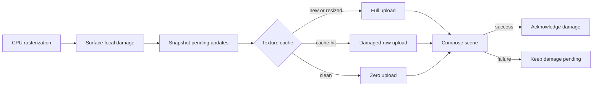

# perf: Cache VirGL surface textures and upload only damage

## Outcome

Keep one VirGL input texture for each live retained `SurfaceId`, copy only that
surface's changed rows into its guest backing, and issue
`TRANSFER_TO_HOST_3D` only for the corresponding local damage rectangles.
Moving, focusing, reordering, or changing the opacity of an unchanged window
must reuse its existing host texture and upload zero pixel bytes.

This is the next isolated GPU compositor optimization after direct scanout.
It removes repeated guest allocation, premultiplication/opacity work, full
surface copies, VirtIO resource lifecycle commands, and full texture transfers.
It intentionally does not yet pipeline fences or restrict output drawing to
composition damage; the post-change counters will select between those
follow-ups.

## Why this is the next bottleneck

Direct scanout removed the synchronous 1280x720 GPU-to-guest readback and the
boot-framebuffer copy. The production input side is still rebuilt on every
damaged frame in `VirglCompositionEngine::compose`:

1. Every visible layer gets a new `VirglResource`.
2. Every pixel of every source surface is copied into that resource's backing.
3. Layer opacity is applied per pixel during that copy.
4. Every full resource is transferred to the host.
5. All layer textures are detached and destroyed after the fenced draw.
6. The vertex resource and fixed VirGL draw objects are also rebuilt.

The function ignores surface-local damage even though retained rasterization
already records it in `Surface::damage()`. `Surface::clear_damage()` has no
production caller, so that damage currently cannot serve as a transactional
upload journal. `texture_bytes_uploaded` therefore equals the sum of every
visible surface's full byte length for terminal updates, window moves, focus
changes, and opacity-only changes alike.

The previous direct-scanout plan explicitly left persistent input textures and
damage-only uploads as the next measured change. There is not yet a committed
post-scanout interactive p50/p95 capture, so this plan begins by recording one
rather than inventing absolute timing claims. The code path and byte counters
are already sufficient to identify the duplicated work.

## Decision

The cache stores canonical premultiplied ARGB surface content, represented in
the existing VirGL `B8G8R8A8_UNORM` resource. Layer opacity moves out of upload
staging and into the quad shader as a per-layer value. This keeps texture
identity tied only to `SurfaceId` and dimensions: geometry, z-order, clip,
transform, effect metadata, and opacity remain composition properties and do
not invalidate pixels.

Damage has transactional ownership:

- rasterization marks surface-local rectangles;
- the retained renderer snapshots visible surface damage for the frame;
- a successful composition consumes that snapshot and clears it;
- any upload or composition error leaves the snapshot dirty for a safe retry;
- a new or resized texture always receives one full-surface upload before use.

The guest backing stays attached and stable for the texture's lifetime. Partial
staging copies each damaged row to its canonical full-surface offset, then uses
the existing checked `transfer_layout` path to submit the same rectangle with
the resource's full stride.



## Goals

- Reuse one input `VirglResource` per live, visible retained `SurfaceId`.
- Upload the full texture only on creation and dimension change.
- Upload exact merged surface-local damage on later content changes.
- Upload zero bytes for movement, z-order, clip, focus, and opacity-only frames.
- Preserve canonical premultiplied pixels and CPU/VirGL oracle parity.
- Bound cache memory, damage rectangle count, resource IDs, and teardown work.
- Preserve strict failure behavior and retained-CPU fallback.
- Add counters that distinguish cache behavior, guest staging, transfer, draw
  encoding, and synchronous fence wait.
- Produce repeatable before/after p50 and p95 results on the pinned macOS VirGL
  host.

## Non-goals

- Damage-scissored output clears/draws. The engine may still redraw the full
  render target in this change.
- Persistent shaders, blend/rasterizer objects, sampler views, or vertex
  buffers, except for changes strictly needed to pass per-layer opacity.
- Multiple in-flight frames, double-buffered output, asynchronous fences, or a
  general nonblocking VirtIO scheduler.
- GPU backdrop blur or other new Aero effects.
- Evicting live visible textures under memory pressure. Exceeding the explicit
  budget is a composition failure and follows the existing fallback policy.
- Removing canonical CPU surfaces; they remain the runtime fallback source.
- Changing the default compositor or QEMU memory size.

## Required invariants

1. `SurfaceId` plus `SurfaceDesc` identifies cached pixel storage. A dimension
   change is a replacement, never an in-place reinterpretation.
2. Cached texture pixels never include layer opacity or other scene properties.
3. A cache entry is drawable only after its initial full upload succeeds.
4. Surface damage is acknowledged only after all requested uploads and the
   scene submission succeed.
5. Failed partial uploads may leave a host texture partly updated, but retained
   damage remains sufficient to overwrite every attempted region on retry.
6. A replacement texture is created and fully uploaded before the old entry is
   destroyed. Failure leaves the old entry valid until engine fallback/teardown.
7. Cache pruning is derived from canonical surface liveness, not merely current
   visibility in one scene, so transient clipping cannot destroy a live entry.
8. Every resource is destroyed exactly once before its VirGL context, including
   partial initialization and runtime-fallback paths.
9. Cache backing vectors are never resized after `RESOURCE_ATTACH_BACKING`.
10. Per-frame upload command count is bounded; excessive disjoint damage
    collapses to one full-surface update.

## Work sequence

### M0 — Record the post-scanout baseline and fix attribution

Capture at least 120 active frames for each existing workload on the pinned
QEMU, `gl=es`, strict GPU mode, Classic, 1280x720, and a fixed wallpaper:

- unchanged-window drag;
- terminal typing and terminal scrolling;
- focus/z-order change;
- popup open/close;
- opacity-only change through the integration fixture;
- cursor-only movement as a zero-3D-work control.

Extend `RenderStats` and serial output with:

- texture cache hits, misses, replacements, and evictions;
- texture resources created and destroyed;
- upload rectangles and actual pixel bytes staged/transferred;
- current and peak guest texture-cache bytes;
- command-stream dwords and 3D submissions.

Correct the current timing overlap. `fence_wait_cycles` presently begins before
command encoding and `composition_cycles` covers the same interval, so the two
buckets cannot identify the remaining bottleneck. Measure at least:

- guest pixel staging;
- VirtIO transfer/control completion;
- command encoding;
- fenced submit/completion wait;
- direct presentation/flush.

Keep the old field names if compatibility matters, but document whether totals
are exclusive. Store the baseline log or a short summary under `.context/` for
local comparison; do not commit machine-specific cycle counts as universal
budgets.

Stop/go gate:

- GO when unchanged drag and focus frames demonstrate repeated full texture
  bytes or texture resource churn.
- If texture work is already negligible and fenced draw time dominates, stop
  and plan damage-scissored output composition instead.

### M1 — Make surface damage a bounded transactional journal

In `Surface`:

- keep damage in local surface coordinates;
- cap disjoint regions (use the compositor's existing small-region policy as a
  precedent) and collapse to full-surface damage beyond the cap;
- add a snapshot/acknowledgement API, or equivalent retained-renderer logic,
  that cannot clear damage before a successful consumer result;
- preserve the initial full damage from `Surface::new` and `resize`;
- keep clipping and overflow checks for every rectangle.

Update the composition contract so successful composition means every supplied
visible surface update was consumed. `RetainedRenderer::compose` should gather
unique scene `SurfaceId`s, snapshot their damage, call the engine, and clear
only those snapshots after success. CPU composition may ignore upload metadata
but should follow the same acknowledgement lifecycle so backend behavior stays
predictable.

Tests:

- initial and resized surfaces expose full damage;
- disjoint damage collapses at the configured cap;
- a successful consumer clears exactly the snapshot it consumed;
- an injected failure retains all pending damage;
- damage added after a snapshot is not accidentally acknowledged with the
  older snapshot.

If generation-safe acknowledgement is simpler than rectangle subtraction, add
a monotonically increasing surface content generation. The snapshot records
the generation and clears only when it still matches; wrapping must be defined
and tested.

### M2 — Separate canonical texture content from layer opacity

Stop calling `PremulArgb::with_opacity` during upload. Copy canonical pixel
words directly to the BGRA byte backing. Extend the narrow vertex/shader path
with one per-layer opacity factor and multiply all four sampled premultiplied
channels by that factor before source-over blending.

Use a vertex attribute rather than a per-layer resource update if it fits the
existing encoder cleanly. The factor must be constant across all six vertices
of a quad. Preserve `opacity=255` as an exact no-op and `opacity=0` as the
existing skipped layer.

Tests and hardware oracle:

- opaque output remains exact;
- the existing alpha fixture remains within its one-channel tolerance;
- changing only opacity changes output after explicit readback while reporting
  zero texture bytes uploaded;
- a surface referenced by two layers with different opacity values renders
  correctly from one cached texture.

### M3 — Add the bounded per-surface texture cache

Add a `BTreeMap<SurfaceId, CachedTexture>` owned by
`VirglCompositionEngine`. Each entry contains at least the exact `SurfaceDesc`,
live `VirglResource`, initialization state, and accounted guest backing bytes.

On compose:

1. Validate the scene and canonical surface map before mutating the cache.
2. Reuse an entry when ID and dimensions match.
3. On a miss, create the resource, stage/upload the full surface, then publish
   the entry.
4. On resize, create and initialize a replacement before swapping it into the
   map and destroying the old resource.
5. Remove entries only when their `SurfaceId` is absent from the retained
   renderer's canonical surface set.

Account cached guest backing separately from the existing CPU `SurfaceBudget`.
Set an explicit checked limit derived from the maximum retained visible-surface
budget plus fixed output/cursor resources. Log current and peak bytes. Do not
raise QEMU memory or silently retain deleted surfaces to hide a lifecycle bug.

Teardown should drain cached textures before the output resource and context.
Exercise cache miss, hit, replacement, deletion, failure during replacement,
and engine drop after a partially built cache.

### M4 — Stage and transfer only local damage

For an initialized cache hit:

- clip every pending local rectangle to the surface;
- merge touching/overlapping rectangles and apply the M1 command-count cap;
- copy only each rectangle's row spans into the already attached backing;
- issue one `TRANSFER_TO_HOST_3D` per resulting rectangle with the existing
  checked offset, full-resource stride, and layer stride;
- count `rect.area() * 4` bytes, not the allocation size;
- issue no transfer command when the surface is clean.

New and resized entries ignore narrow damage for their first use and perform a
single full upload. A transfer failure returns `GpuFailure`, leaves CPU damage
pending, and triggers the established strict panic or non-strict retained-CPU
fallback. Queue publication's existing release fence remains the coherency
boundary after guest backing writes.

Tests:

- row-copy offsets preserve untouched backing bytes around the rectangle;
- one-cell, edge-clipped, multiple merged, and full-surface updates use the
  expected `GpuBox`, offset, stride, and byte counters;
- clean movement and z-order changes issue zero texture transfers;
- a failed second rectangle does not acknowledge either rectangle;
- a later full retry repairs a deliberately partially updated host texture.

### M5 — Add a deterministic multi-frame VirGL performance fixture

Extend the hardware integration test with one engine and a repeatable frame
sequence instead of reconstructing the engine between assertions:

1. Initial desktop/background plus translucent foreground: all cache misses and
   full uploads.
2. Translation-only frame: all cache hits and zero upload bytes.
3. Opacity-only frame: all cache hits and zero upload bytes, with changed
   readback pixels.
4. Small foreground content update: one damaged texture and exact partial
   upload bytes.
5. Resize: one replacement and one full upload.
6. Remove a surface: one eviction and the expected cache-byte decrement.
7. Repeat enough frames to expose resource-count leaks and ID exhaustion.

Compare selected explicit readbacks with `CpuCompositionEngine`; ordinary
production frames must continue to report zero GPU readback bytes. Keep the
direct-scanout and hardware-cursor qualification in the same supported host
matrix.

### M6 — Measure, gate, and choose the following optimization

Repeat M0 on the same host and require these deterministic gates:

- initial frame uploads exactly one full image per visible canonical surface;
- unchanged drag, focus/z-order, and opacity-only frames report zero texture
  bytes, zero texture resource creation/destruction, and zero surface
  rasterization when content is unchanged;
- small terminal updates upload no more than the merged local damage area times
  four, except when the bounded coalescing policy deliberately chooses full;
- cache bytes return to baseline after window close and after 100 create/resize/
  close cycles;
- CPU/VirGL output remains within the existing tolerance;
- strict and non-strict failure paths remain correct;
- p95 upload-stage cycles for unchanged drag fall by at least 80%;
- p95 total frame cycles for unchanged drag improve materially (target at least
  30%) without more than a 5% regression in first-frame time or terminal
  content rasterization.

Report absolute p50/p95 values alongside percentages. If the upload-stage gate
passes but total-frame improvement misses the target, the optimization is
still correct; use the exclusive counters to choose exactly one next plan:

| Dominant remaining bucket | Next isolated optimization |
|---|---|
| Full-target draw/fenced completion | Scissor clear and layer draws to output damage |
| VirGL object/command encoding | Persist fixed pipeline state, sampler views, and a growable vertex buffer |
| Synchronous fence wait with low GPU work | Double-buffer output and pipeline bounded in-flight frames |
| Surface rasterization | Optimize the specific widget/window raster hot path |
| Many tiny upload rectangles | Tune bounded coalescing using measured transfer overhead |

Do not implement the selected follow-up in this change.

## Expected file changes

```text
docs/plans/2026-07-18-003-perf-virgl-persistent-surface-textures-plan.md
docs/macos-virgl-qualification.md

src/drivers/virtio/gpu/virgl.rs
src/drivers/virtio/gpu/virgl/commands.rs
src/graphics/composition/mod.rs
src/graphics/composition/virgl.rs
src/graphics/surface.rs
src/window/manager.rs
src/window/renderer/retained.rs
src/tests/surface_alpha.rs
src/tests/virgl_integration.rs
src/tests/virtio_gpu_protocol.rs
src/tests/window_manager_render.rs
```

The driver transport should need no new VirtIO command type. Changes there are
limited to a safe partial-backing staging helper or test seam if keeping that
logic out of the composition engine improves ownership.

## Validation commands

Use the narrow host-independent checks first:

```sh
cargo fmt -- --check
cargo check --features test
./test.sh --skip-userland surface_alpha retained_scene composition_cpu \
  virtio_gpu_protocol window_manager_render compositor_selection
```

Then run the hardware-backed oracle and lifecycle fixture:

```sh
AGENTICOS_QEMU_BIN=/opt/homebrew/Cellar/qemu/1.0.27/bin/qemu-system-x86_64 \
AGENTICOS_QEMU_GL=es \
./scripts/test-virgl-integration.sh
```

Capture the strict interactive before/after workload with telemetry:

```sh
AGENTICOS_QEMU_BIN=/opt/homebrew/Cellar/qemu/1.0.27/bin/qemu-system-x86_64 \
AGENTICOS_QEMU_GL=es \
AGENTICOS_COMPOSITOR=gpu \
AGENTICOS_GPU_STRICT=1 \
AGENTICOS_THEME=classic \
AGENTICOS_NETWORK=off \
AGENTICOS_RENDER_STATS=1 \
./build.sh
```

Finish with the full host-independent suite:

```sh
./test.sh --skip-userland
```

## Risks and decisions

| Risk | Decision |
|---|---|
| Opacity baked into cached pixels makes property changes stale | Cache canonical pixels and apply opacity in the shader |
| Damage is cleared before a failed upload completes | Snapshot and acknowledge only after successful composition |
| Surface changes after snapshot are lost | Use generation-safe acknowledgement or exact snapshot subtraction |
| Resize destroys the only valid texture before replacement succeeds | Initialize replacement first, then swap and destroy old |
| Partial DMA backing writes are not visible to the host | Keep backing attached/stable and rely on the queue release boundary before transfer |
| Disjoint damage produces unbounded control commands | Cap local rectangles and collapse to a full-surface transfer |
| Cache duplicates the CPU surface memory | Enforce and report a separate checked guest texture-cache budget |
| Deleted windows leak host resources | Reconcile cache liveness every successful frame and test repeated close cycles |
| Persistent texture change hides full-target rendering cost | Keep output scissoring out of scope and use exclusive post-change counters |
| First frame regresses due to cache bookkeeping | Gate first-frame time and keep the miss path a single full upload |

## Completion criteria

This plan is complete when a strict VirGL desktop keeps stable textures across
frames; unchanged movement, focus, and opacity changes upload zero pixels;
small content updates transfer only bounded local damage; resize and removal
have leak-free atomic lifecycles; explicit readback still matches the CPU
oracle; runtime fallback remains safe; and before/after p50/p95 telemetry shows
whether output scissoring, persistent draw state, or fence pipelining is the
next bottleneck.

## Implementation result (2026-07-18)

`VirglCompositionEngine` now owns a checked 48 MiB cache keyed by `SurfaceId`
and exact `SurfaceDesc`. Cache misses and resizes perform one full canonical
BGRA upload; cache hits copy and transfer only the surface's bounded local
damage rectangles. Staging uses checked row ranges and one bulk byte copy per
row. Deleted retained surfaces are evicted, resize replacement is initialized
before the old resource is destroyed, and engine teardown drains the cache
before destroying the output resource and context.

Layer opacity moved from per-pixel upload conversion into the fragment shader,
carried in the existing quad texture-coordinate payload. Translation, z-order,
focus, and opacity-only frames therefore reuse canonical textures. The retained
renderer snapshots damage before composition and acknowledges only an
unchanged snapshot after success; failure leaves all damage pending.

Telemetry now reports cache hits/misses/replacements/evictions, texture
resource lifecycle, actual upload rectangles/bytes, cache current/peak bytes,
command-stream size, and submissions. Command encoding and synchronous fenced
submission are timed independently instead of double-counting one interval.

Validation covered 50 focused host-independent tests, the full 791-test suite,
and the pinned macOS VirGL
clear/alpha/lifecycle/composition/readback/direct-scanout/cursor runner.
The hardware fixture reused one engine through miss, clean translation,
opacity-only draw, four-byte partial upload, resize replacement, and eviction;
the CPU/VirGL pixel oracle and Cocoa texture blit remained clean. A strict
production boot selected `engine=virgl presenter=virgl-direct`; its first-frame
telemetry reported two expected cache misses, two full upload regions,
3,850,240 uploaded/cache bytes, one GPU submission, and zero readback bytes.
Interactive p50/p95 workload capture remains useful for choosing between
output-damage scissoring, persistent draw state, and fence pipelining, but is
not required for the deterministic zero-upload correctness gate.

## Follow-up implementation (2026-07-18)

The next measured object/command-encoding optimization is now implemented.
Ten fixed VirGL pipeline objects, including the output surface, the transparent
clear shader, and its overwrite blend state, are created in the first frame and
retained until engine teardown. Each cached texture owns a stable sampler view;
replacement and eviction destroy that view in the fenced draw stream before
releasing its resource. The vertex resource starts at a bounded 4 KiB
allocation, grows geometrically when necessary, and is reused without
per-frame control-queue create/destroy operations. Render telemetry reports
pipeline/view/vertex lifecycle and current vertex capacity, while the hardware
multi-frame fixture requires clean movement to create or destroy none of those
objects and to encode fewer dwords than the first frame.

The subsequent output-composition optimization is also implemented. Requested
damage is clipped to the output, a persistent zero-output fragment shader and
overwrite blend clear only each damaged scissor, and textured draws are emitted
only for layer/damage intersections. This avoids VirGL's deliberately
full-target Gallium clear path and does not depend on the optional host
`CLEAR_TEXTURE` capability. Telemetry reports clipped output region and pixel
counts. The pinned hardware fixture compares a narrow movement update against
the CPU oracle, verifies an outside layer is skipped without lifecycle churn,
and proves pixels outside the damage remain unchanged.
