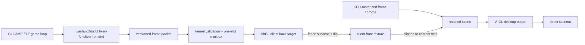

# feat: standalone ring-3 OpenGL game in a composited window

## Outcome

Ship `GLGAME.ELF`, a standalone no_std ring-3 application that plays as a
small real-time 3D game inside an ordinary AgenticOS frame. The client area is
rendered with a documented OpenGL 1.1-style subset backed by VirGL. The final
GPU texture is inserted into the retained scene at the `RemoteSurface` content
rectangle, rather than scanned out over the desktop or copied back through
`gui_win_present`.

The window manager remains authoritative for the title bar, borders, focus,
input routing, dragging, z-order, occlusion, clipping, resize, and close. The
game owns only the pixels inside its content well.

Implementation note: the qualified macOS ANGLE capset advertises no usable
depth-attachment format. The shipped frontend detects that capability through
`gui_gl_get_info` and performs a bounded back-to-front triangle sort for
depth-enabled opaque geometry on that host; backends that advertise a depth
format retain hardware depth testing. The client viewport is explicitly
converted from OpenGL's bottom-left convention to the desktop's top-left
content-well convention.

This plan deliberately does not expose raw VirGL packets to ring 3 and does
not attempt to port Mesa. The kernel owns the one VirtIO-GPU device and the one
qualified VirGL context. A small userland `gl` library implements a bounded
fixed-function OpenGL frontend and submits validated, backend-neutral frame
packets to that existing GPU owner.

## Concrete product scope: `GL Arena`

The first application is intentionally specific enough to prove the platform,
not merely a spinning-cube fixture:

- an 800x600 resizable window titled `GL Arena`;
- a perspective/isometric camera over a 3D floor grid;
- a player cube controlled with WASD or the arrow keys;
- fixed-position spinning crystal pickups, collision detection, score, and
  `R` to reset;
- opaque colored geometry, depth testing, back-face culling, and a small
  orthographic seven-segment score overlay made from triangles/quads;
- a monotonic-clock simulation loop with a clamped delta and approximately
  60 Hz pacing through `nanosleep`;
- simulation paused while the window is unfocused;
- resize updates the projection and viewport; close destroys the GL context
  and exits normally.

No external game assets are required in v1. Fixed geometry and colors keep the
first hardware oracle deterministic and avoid coupling the platform bring-up
to image decoding, texture sampling, audio, random level generation, or a
filesystem asset format.

When launched without the qualified strict VirGL renderer, the ELF still
opens its normal GUI window and paints a short CPU-canvas explanation of the
required launch mode. It must not crash the process or switch the desktop's
renderer behind the user's back.

## Current state and missing boundary

AgenticOS already has most of the outer stack:

- ring-3 GUI syscalls 5001-5004 create a server-decorated `RemoteSurface`,
  copy an XRGB8888 buffer, block for events, and destroy the window;
- the event ABI includes key press/release, content-local mouse coordinates,
  resize, close, and focus changes;
- the retained renderer rasterizes each top-level window subtree into a CPU
  `Surface`, then composes those surfaces with either the CPU engine or the
  production `VirglCompositionEngine`;
- the VirGL engine owns the sole `VirtioGpu`, persistent input textures, an
  output render target, direct scanout, and the hardware cursor;
- `VirglCommandEncoder` can create/bind a small 2D composition pipeline, but
  it does not yet encode a depth attachment or general colored 3D vertices;
- animated ring-3 apps already use `try_next_event` plus a real blocking
  `nanosleep`, and the build manifest stages native Rust ELFs every run.

What is missing is a GPU client-surface contract. A second VirtIO-GPU owner is
not viable, `gui_win_present` would force a full GPU readback and CPU re-upload,
and direct scanout of a game's target would cover the desktop. The new boundary
must let a ring-3 app submit bounded drawing work while leaving resource IDs,
VirGL object handles, synchronization, and scene placement under kernel
control.

## Architecture decisions

### AD1 — require the existing strict VirGL compositor for playable mode

`gui_gl_context_create` succeeds only when the selected renderer is the
qualified VirGL backend and strict GPU mode is active. This gives the client
texture one unambiguous owner and avoids promising a CPU implementation of the
new GL subset in the first change.

Ordinary desktop and non-GL apps continue to work with legacy and retained
CPU renderers. Only `GLGAME.ELF`'s playable path has the VirGL requirement.

### AD2 — implement an OpenGL-shaped fixed-function subset, not raw passthrough

Add `userland/libs/gl`, a no_std library with familiar fixed-function calls.
Its v1 supported surface is intentionally small:

- context: create/attach, destroy, query limits, `glGetError`;
- frame: `glViewport`, `glClearColor`, color/depth clear, swap;
- state: depth-test enable/disable and back-face culling enable/disable;
- matrices: model-view/projection selection, identity, multiply, translate,
  rotate, scale, perspective/frustum, and orthographic projection;
- immediate geometry: `GL_TRIANGLES` and `GL_QUADS`, `glColor4f`,
  `glVertex3f`, and `glBegin`/`glEnd`.

The library evaluates the fixed-function matrix stack in userland, triangulates
quads, and emits interleaved clip-space position plus RGBA vertices. Hardware
still performs clipping, rasterization, culling, interpolation, and depth
testing. Unsupported enums or call order set an OpenGL error; they never turn
into unchecked kernel or VirGL values.

This is a documented AgenticOS subset inspired by OpenGL 1.1, not a claim of
full OpenGL conformance. Shader compilation, GLSL, texture objects, display
lists, lighting, blending, read-pixels, and arbitrary buffer objects are
follow-ups.

### AD3 — submit one validated, self-contained frame packet

The userland library batches calls into one versioned frame packet per swap.
The packet contains:

- a fixed header with magic, ABI version, byte length, viewport, clear values,
  draw count, vertex count, and feature flags;
- fixed-size draw descriptors containing first vertex, vertex count,
  triangle primitive, and bounded raster/depth flags;
- tightly packed `GlVertex { clip_position: [f32; 4], color: [f32; 4] }`
  records.

Every packet is a complete redraw of the back buffer. It does not reference a
VirGL resource ID, object handle, host pointer, prior packet, or unbounded
shader string. The kernel copies and validates the whole packet before making
it visible to the compositor. Initial limits are 192 KiB per packet, 1,024 draw
descriptors, and 4,096 vertices; the queried capability structure reports the
same values to userland.

The per-context pending queue is a one-slot mailbox. A newer complete packet
may replace an older packet that the compositor has not consumed yet. This
bounds kernel memory and favors current game state over stale frames without
blocking a ring-3 process inside the window-manager lock.

Submission returns a monotonically increasing frame serial, meaning "accepted
into the mailbox," not "visible on scanout." `gui_gl_get_info` reports the last
completed serial and any asynchronous client error. This keeps swap
non-blocking while making coalescing and failures observable in tests and
telemetry.

### AD4 — keep one physical VirGL context and create logical client contexts

`VirglCompositionEngine` remains the only physical GPU/device/context owner.
Each `gui_gl_context_create` allocates a logical `ClientGlContext` inside that
engine. The logical context owns:

- two color render targets with render-target and sampler-view binding;
- one reusable depth/stencil target when the host capset advertises a supported
  depth format;
- sampler views for both color targets;
- one persistent, geometrically growing vertex resource;
- dimensions, front/back selection, pending frame, last error, owner PID, and
  owning GUI window handle.

Client and compositor objects share the physical VirGL handle namespace, so
replace the existing fixed/dynamic split with one checked context-wide object
handle allocator. Ring 3 never chooses or observes those handles.

The engine creates one shared colored-vertex pipeline for all GL clients. A
client frame binds its own back color/depth targets and vertex buffer, draws,
waits for the existing bounded fence completion, and flips front/back only on
success. The old front texture stays valid if validation or rendering fails.

### AD5 — insert the front texture as an external retained-scene layer

Generalize a scene layer's source from only `SurfaceId` to:

```text
LayerSource
  Canonical(SurfaceId)       // current CPU-rasterized window/chrome surface
  VirglClient(ClientGlId)    // current front color target of one GL client
```

`RemoteSurface` gains an optional external-client ID and exposes it through a
narrow `Window` query. During retained scene construction, each top-level root
continues to contribute its canonical chrome/content surface. If a descendant
has an attached GL client, the manager inserts that external layer immediately
after its root layer with:

- destination equal to the absolute content-well rectangle;
- source equal to the current client target dimensions;
- clip equal to the intersection of the content well, root bounds, and screen;
- z-order before the next top-level root.

The `RemoteSurface::paint` path fills the well black as a stable placeholder
but stops copying client pixels. Because the external layer is clipped to the
well, it cannot overwrite the frame border/title bar even if the app submits a
bad viewport. Later top-level roots still occlude it normally.

The CPU compositor rejects `VirglClient` sources. Context creation prevents
such a layer from existing under a CPU renderer, so that rejection is an
invariant check rather than a normal fallback path.

### AD6 — queue from the syscall, execute at the compositor boundary

The syscall validates/copies the packet and marks only the absolute content
well as composition damage. It does not submit GPU commands while holding the
global window-manager lock with interrupts disabled.

On the next retained compose pass, `VirglCompositionEngine` consumes at most
one pending packet per visible client, renders each back buffer, flips
successful clients, and then samples those new fronts while composing the
desktop. A client render is therefore ordered before the desktop draw without
introducing a second device owner or a cross-context resource-sharing scheme.

Client-frame damage is full-well in v1. Moving or uncovering a window with an
unchanged client front requires desktop recomposition but no new game draw and
no texture upload/readback.

### AD7 — make ownership and teardown process-scoped

The GUI process state maps each GL context to exactly one owned GUI window.
Creating a second context for the same window returns `-EBUSY`; attaching to
another PID's handle returns `-ENOENT` without revealing it. While GL is
attached, `gui_win_present` returns `-EBUSY` so the pixel source is not
ambiguous.

Destroy order is:

1. stop accepting/submitting packets;
2. remove the external layer from `RemoteSurface` and damage the old well;
3. destroy client views/pipeline-local objects and resources through the sole
   VirGL owner;
4. remove the process/window context record;
5. destroy the GUI frame if window or process teardown requested it.

Explicit `gui_gl_context_destroy`, `gui_win_destroy`, normal process exit,
fault cleanup, and partial-create rollback all converge on the same idempotent
kernel helper. Resources are destroyed before the physical compositor context.

## Target data flow



There is no production GPU-to-guest readback edge.

## Private ABI v1

Keep the current GUI ABI version and pixel ABI unchanged. Add a separately
versioned GL ABI in the AgenticOS-private syscall range:

| Number | Call | Contract |
|---|---|---|
| 5005 | `gui_gl_context_create(window, flags)` | Attach one logical GL context to a caller-owned `RemoteSurface`; flags must be zero in v1. |
| 5006 | `gui_gl_submit_frame(context, packet, byte_len, flags)` | Copy and validate one complete frame; publish it to the bounded mailbox and return its serial. |
| 5007 | `gui_gl_get_info(context, info, info_len)` | Return ABI version, dimensions, limits, supported state bits, last completed serial, and prior asynchronous context error. |
| 5008 | `gui_gl_context_destroy(context)` | Detach and release all resources; repeated use of a stale handle returns `-ENOENT`. |

Resize is server-owned and does not need a syscall. When `RemoteSurface` bounds
change, the client record stores the new target size. Before consuming the
next packet, the engine allocates a complete new color pair and depth target,
clears them, and only then replaces the old set. The app still handles the
resize event to update `glViewport` and its projection matrix.

Validation must reject:

- wrong magic/version/size, integer overflow, overlapping or out-of-range
  arrays, unknown flags/opcodes, non-triangle primitives, and non-multiple-of-3
  draw counts;
- draw ranges outside the vertex array or outside the declared packet limits;
- zero/oversized viewport dimensions or a viewport outside the current client
  target;
- NaN/infinite position or color values and colors outside the documented
  clamped range;
- packets that omit a full color/depth clear in v1;
- use after context/window/process destruction.

Validation failure affects only the submitting app and leaves the previous
front texture displayed. A VirtIO transport/context failure follows strict GPU
policy because it may invalidate the shared physical context.

## Work sequence

### M0 — hardware feasibility gate: render-to-texture, depth, then sample

Before adding a syscall or app, extend the hardware integration fixture to:

1. create a small offscreen color target with render-target and sampler-view
   binds plus a supported depth target from the pinned VirGL capset;
2. draw two overlapping colored triangles whose visible center proves depth
   testing rather than submission order;
3. fence the client draw;
4. sample that color target as a texture inside a known rectangle of the
   existing compositor output;
5. explicitly read back only in the test fixture and compare asymmetric
   inside/outside pixels;
6. repeat create/draw/sample/destroy at least 100 times.

Derive every new format, bind flag, command value, and layout from the same
pinned virglrenderer protocol source already named by the driver. Add byte-
layout tests next to the encoder.

Stop/go gate:

- GO only when the qualified macOS QEMU/ANGLE/Metal path preserves depth,
  orientation, color, fence ordering, and sample visibility without a
  production readback.
- STOP and repair/repin the host or protocol encoder if sampling is stale,
  inverted, or needs `TRANSFER_FROM_HOST_3D` to become visible.

### M1 — generalize the VirGL encoder and handle allocation

Extend `src/drivers/virtio/gpu/virgl/commands.rs` with narrowly checked support
for:

- color plus depth framebuffer state;
- color and depth clear;
- position/RGBA vertex elements and an interleaved vertex buffer;
- a pass-through position/color vertex shader and interpolating color fragment
  shader;
- depth-test/write DSA state;
- back-face culling and viewport/scissor state;
- destruction of every new object kind.

Introduce a context-wide checked object-handle allocator used by both the
desktop compositor and client pipeline. Preserve persistent compositor objects
and texture-cache handles; this is a namespace cleanup, not permission to
recreate the desktop pipeline every frame.

Add driver/resource helpers for the pinned depth format and the combined
render-target/sampler color binds. Initialization and failure rollback must
destroy in reverse order and remain idempotent.

### M2 — add logical GL clients to the VirGL engine

Add a `client` module under `src/graphics/composition/virgl/` (split the current
single file if needed) containing:

- `ClientGlId` and `ClientGlContext`;
- color-pair/depth allocation and atomic resize replacement;
- persistent vertex-resource growth with an explicit per-context ceiling;
- validated-packet execution and front/back flip;
- pending-mailbox replacement and last-error tracking;
- owner/window lookup and complete teardown.

Create the shared colored-3D pipeline once per physical compositor context.
Drain pending client frames before desktop layer preparation. Record separate
telemetry for client frames submitted/coalesced/rendered, client vertices and
draws, client command dwords, client fence cycles, active client bytes, and
resize/resource churn.

Expose this through narrow `CompositionEngine` client operations (create,
publish, query, and destroy) with unsupported defaults for the CPU engine.
`RetainedRenderer` and `WindowManager` forward those operations; do not
downcast the boxed engine or let `gui_gl` reach into VirGL internals.

### M3 — represent and compose external client layers

Change `graphics::scene::Layer` to use `LayerSource`. Update both composition
engines and all scene tests for the canonical variant first so the refactor is
behavior-neutral for existing desktop layers.

Then implement `VirglClient` lookup in `VirglCompositionEngine` by binding the
client's current front sampler view. It must never stage CPU pixels or create a
new texture for that source. Reject missing/stale client IDs as a bounded
client-layer error without indexing arbitrary resources.

Teach retained scene construction to interleave each root surface and its GL
content layer. Give each top-level root a stable z-order band rather than
assuming one layer per root. Tests must cover two GL windows, an ordinary
window between them in z-order, partial offscreen placement, occlusion, and
content-well clipping against both Classic and Aero frame metrics.

### M4 — add kernel GL state and syscalls 5005-5008

Add a dedicated `src/userland/gui_gl.rs` rather than growing
`gui_syscalls.rs` into a GPU implementation. Mirror the syscall constants and
ABI structs in `src/userland/abi.rs` and `userland/runtime` with compile-time
size assertions.

Implement:

- caller PID and GUI-window ownership checks;
- strict-VirGL capability checks and stable errno mapping;
- context-handle allocation separate from window handles;
- overflow-safe usercopy and parse-then-publish frame validation;
- one-slot per-context mailbox semantics;
- `gui_win_present` exclusion while GL is attached;
- composition-only damage of the content well;
- automatic resize notification to the client context;
- shared cleanup from explicit destroy, window destroy, and process cleanup.

Do not hold `WINDOW_MANAGER` while copying or parsing up to 192 KiB from user
memory. Resolve the owned record, copy/validate into kernel storage, then take
the manager lock briefly to publish and mark damage. Preserve the repository's
documented GUI-state/window-manager lock order.

### M5 — implement the no_std OpenGL frontend

Create `userland/libs/gl` with no kernel/private VirGL knowledge. It should:

- own the logical context handle and destroy it on drop/explicit shutdown;
- maintain OpenGL error state, current color, enabled state, viewport, and
  bounded model-view/projection stacks;
- provide tested 4x4 column-major matrix operations with OpenGL multiplication
  order;
- transform vertices to homogeneous clip space without performing perspective
  division;
- triangulate quads deterministically;
- batch adjacent compatible triangles into draw descriptors;
- enforce the queried kernel limits before calling the syscall;
- submit a complete frame at swap and reset only transient geometry after a
  successful publish.

Avoid heap work per vertex: reserve from the queried limits and reuse vectors
across frames. Provide a safe Rust API used by the game plus an optional small
`gl*` compatibility module; do not add a C ABI until a real C consumer exists.

Add `runtime::clock_gettime`/monotonic wrappers so the game uses measured delta
time rather than assuming every 16 ms sleep wakes exactly on schedule.

### M6 — build `GLGAME.ELF`

Add `userland/apps/glgame` following the existing `painting` package shape:

- `#![no_std]`, `#![no_main]`, `runtime`, `gui`, and the new `gl` dependency;
- `_start`, panic-to-exit handler, one GUI window, GL attach, event drain,
  simulation update, render, swap, and sleep;
- key press/release state rather than movement only on key-repeat;
- deterministic arena geometry and collision rules isolated from rendering so
  they have ordinary unit tests;
- focus pause, resize projection update, reset, and orderly close;
- CPU-canvas requirement message when GL context creation reports unsupported
  renderer/host.

Register the crate in `userland/Cargo.toml` and add the built-every-run row:

```text
app_row glgame apps/glgame cargo GLGAME.ELF built-every-run rust-nightly target/x86_64-unknown-none/release/glgame -
```

`GLGAME.ELF` is a static, non-PIE x86-64 `ET_EXEC` and needs no committed
prebuilt. Do not add bespoke logic to `build.sh` or `test.sh`.

### M7 — launch integration

Add `/bin/glgame` as a sorted direct applet rewriting to
`/host/GLGAME.ELF`, preserving `argv[0] = "glgame"`. Extend the Windows 98
Programs fly-out with `GL Arena` after the existing four applications and add
the corresponding typed Start-menu/pending action and `spawn_gui_user_app`
path.

Update namespace sorting, collision, listing, rewrite, Start-menu geometry,
action-dispatch, and app-count tests. The app must launch identically from the
Start menu, `glgame`, and `/bin/glgame` in zsh.

### M8 — integration, performance, and documentation

Extend `scripts/test-virgl-integration.sh` with deterministic client-surface
fixtures for:

- colored perspective geometry and depth ordering;
- exact content-well clipping and orientation;
- one GL window moving behind/in front of a CPU GUI window;
- two independent client contexts;
- resize from small to large and large to small;
- close, process fault, partial allocation failure, and 100-cycle lifecycle;
- zero production GPU readback bytes while the client animates.

Capture at least 120 active frames on the pinned strict GPU host for one GL
window and two GL windows. Report median/p95 client render fence time, desktop
composition time, packet coalesces, command dwords, active resource bytes, and
missed/late app frames. Do not claim a fixed FPS acceptance threshold under
TCG; require bounded memory, no idle busy-spin, stable input/desktop response,
and no unbounded queue growth.

Update live architecture and run instructions in:

- root `CLAUDE.md` and `README.md`;
- `src/drivers/CLAUDE.md`, `src/graphics/CLAUDE.md`,
  `src/window/CLAUDE.md`, and `src/userland/CLAUDE.md`;
- `userland/README.md`;
- `docs/macos-virgl-qualification.md`.

## Verification matrix

### Host-independent

- packet parser rejects every malformed length/range/enum/NaN/limit case and
  never publishes a partial packet;
- matrix, projection, transform-order, quad triangulation, and error-state
  tests pass in `userland/libs/gl`;
- game movement, fixed-step/clamped-delta update, pickup collision, score, and
  reset logic pass without a GPU;
- PID/window/context ownership and cleanup tests leave no GUI or client record;
- canonical CPU and VirGL desktop tests remain unchanged when no external
  layers exist;
- `cargo fmt`, kernel `cargo check`, userland workspace build, focused kernel
  tests, and the full `./test.sh` pass;
- `./build.sh -n` stages `host_share/GLGAME.ELF` through the manifest and the
  existing ELF validator.

### Qualified VirGL host

Run the existing preflight and integration suite with the pinned keg, then
boot:

```sh
QEMU_VIRGL_PREFIX="$(brew --cellar qemu)/1.0.27"
AGENTICOS_QEMU_BIN="$QEMU_VIRGL_PREFIX/bin/qemu-system-x86_64" \
AGENTICOS_QEMU_GL=es \
AGENTICOS_COMPOSITOR=gpu \
AGENTICOS_GPU_STRICT=1 \
AGENTICOS_NETWORK=off \
./build.sh
```

Manual acceptance:

- Start -> Programs -> GL Arena opens one framed, resizable 3D game window;
- geometry stays entirely inside the content well under Classic and Aero;
- dragging, focus, occlusion, taskbar behavior, and the close button behave
  like the existing ring-3 apps;
- WASD/arrows move the player smoothly, pickups score once, `R` resets, and
  focus loss pauses simulation;
- resizing does not stretch stale pixels or leak old resources;
- another terminal or GUI app remains interactive during animation;
- closing and relaunching repeatedly does not grow client resource counts;
- render telemetry reports no ordinary readback and no full XRGB8888
  `gui_win_present` traffic from the game.

## Required invariants

1. There is exactly one `VirtioGpu` owner and one physical production VirGL
   context.
2. Ring 3 never submits a raw VirGL word, resource ID, object handle, shader,
   or host address.
3. A client front target changes only after a fully validated frame completes
   its GPU fence successfully.
4. Every external layer is resolved through an owned live client ID and is
   clipped to its `RemoteSurface` content well.
5. Client animation never invokes `TRANSFER_FROM_HOST_3D` or
   `gui_win_present`.
6. Pending user frame memory is bounded per context and globally; mailbox
   replacement cannot accumulate old packets.
7. Resize allocates and clears a complete replacement target set before
   releasing the previous front.
8. Window/process teardown makes the layer unreachable before destroying its
   GPU resources, and all client resources die before the physical context.
9. A malformed app packet can fail only that submission; a transport failure
   is handled by strict GPU policy.
10. With zero GL contexts, existing desktop composition, fallback, telemetry,
    and userland GUI ABI behavior are unchanged.

## Risks and mitigations

### R1 — the current VirGL encoder is compositor-specific

Depth state, colored vertices, and client framebuffer objects are new protocol
surface. M0 proves the exact pinned host behavior before any public ABI or app
depends on it, and every wire addition gets deterministic encoder tests.

### R2 — context-wide object handle collision

The existing engine mixes fixed handles with dynamic sampler views. A shared
checked allocator lands before client objects and is stress-tested across
desktop cache churn, client creation, resize, and teardown.

### R3 — title-bar/content ordering regression

The renderer currently assumes one scene layer per top-level root. Stable
z-order bands plus explicit two-window/occlusion tests pin the new interleaving.
The external destination and clip are derived from server-owned absolute
content bounds, never from app coordinates.

### R4 — long GPU work under a lock with interrupts disabled

Syscalls only copy/validate/publish. The compositor performs the actual GPU
work at its existing serialized boundary. Telemetry separates client fence
time from desktop composition so later work can introduce pipelining based on
measurements rather than broadening this ABI.

### R5 — TCG cannot sustain an assumed 60 FPS

The simulation uses measured, clamped monotonic delta time and the frame
mailbox coalesces stale complete frames. Correctness does not depend on a fixed
host rate. If profiling shows CPU-side immediate-mode expansion dominates,
indexed/static mesh uploads are the next API extension, not a reason to expose
raw command streams.

### R6 — GPU failure would invalidate an external-only surface

Playable context creation requires strict VirGL, so the system never silently
falls back to a CPU compositor that cannot sample the client texture. The ELF
provides a CPU-rendered requirement message when the prerequisite is absent.

### R7 — API scope expands into a Mesa replacement

The acceptance app uses only colored fixed-function geometry. Textures, GLSL,
VBOs, blending, lighting, readback, and C ABI compatibility remain explicitly
out of scope until a concrete second client justifies them.

## Out of scope

- full OpenGL/OpenGL ES conformance, Mesa, EGL, GLX, DRM, Venus, or rutabaga;
- direct guest access to VirtIO queues or raw VirGL command submission;
- textures, image assets, GLSL, programmable shaders, blending, MSAA, shadows,
  post-processing, or GPU readback/screenshots from the app;
- mouse capture, relative pointer mode, or a first-person camera;
- audio, networking, save games, asset packaging, or a general game engine;
- CPU/software rendering of the GL subset;
- multiple physical GPUs/scanouts or SMP GPU scheduling;
- changing the repository-wide default compositor.

## Likely files

New:

- `src/userland/gui_gl.rs`
- `src/graphics/composition/virgl/client.rs`
- `userland/libs/gl/{Cargo.toml,src/lib.rs}`
- `userland/apps/glgame/{Cargo.toml,build.rs,src/main.rs}`

Primary modifications:

- `src/userland/{abi.rs,gui.rs,gui_syscalls.rs}`
- `src/window/{mod.rs,manager.rs,renderer/retained.rs}`
- `src/window/windows/remote_surface.rs`
- `src/graphics/scene.rs`
- `src/graphics/composition/{mod.rs,cpu.rs,virgl.rs}`
- `src/drivers/virtio/gpu/{protocol.rs,virgl.rs,virgl/commands.rs}`
- `userland/runtime/src/lib.rs`
- `userland/{Cargo.toml,apps.manifest.sh}`
- `src/userland/bin_namespace.rs`
- `src/commands/guishell/mod.rs`
- `src/window/windows/start_menu.rs`
- `scripts/test-virgl-integration.sh`

## Delivery slices

Keep commits reviewable and individually testable:

1. M0 hardware proof and encoder tests.
2. Shared handle allocation plus 3D/depth encoder support.
3. Logical client resources and deterministic engine fixture.
4. `LayerSource` refactor and content-well compositor integration.
5. GL ABI, packet validator, ownership, and teardown.
6. `userland/libs/gl` and its host-independent tests.
7. `GLGAME.ELF`, packaging, `/bin`, and Start-menu launch.
8. Hardware lifecycle/performance qualification and documentation refresh.
